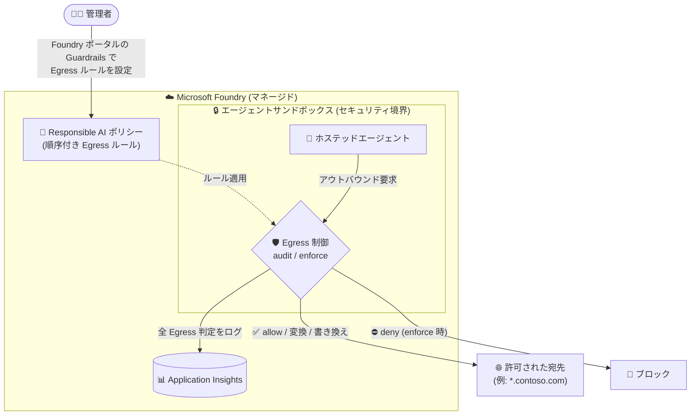

# Microsoft Foundry: ホステッドエージェントのネットワーク Egress 制御 (Public Preview)

**リリース日**: 2026-09-18

**サービス**: Microsoft Foundry

**機能**: Network egress controls for hosted agents (ホステッドエージェントのアウトバウンド通信制御)

**ステータス**: In preview

[このアップデートのインフォグラフィックを見る](https://takech9203.github.io/azure-news-summary/20260918-foundry-hosted-agents-egress-controls.html)

## 概要

Microsoft Foundry において、ホステッドエージェント (hosted agent) が行うアウトバウンド (外向き) 接続をガバナンスする「ネットワーク Egress 制御」がパブリックプレビューとして発表されました。

顧客は宛先ホストにマッチする順序付きルールを作成できます。ルールは FQDN で指定でき、`*.contoso.com` のようなワイルドカードもサポートします。アクションとしては「許可 (allow)」「拒否 (deny)」に加え、「アウトバウンド要求ヘッダーの変換 (transform)」「宛先の書き換え (rewrite)」が利用できます。ルールはエージェントの Responsible AI ポリシーに保持され、トラフィックがランタイムを出る前に Foundry マネージドのエージェントサンドボックス内で強制されるため、基本的な許可リスト運用のために別途ネットワークアプライアンスを用意する必要がありません。

適用モードは 2 種類サポートされます。「audit」モードは、拒否対象となるはずの判定をブロックせずにログのみ記録し、「enforce」モードは拒否対象のトラフィックを実際にブロックします。これにより、実トラフィックを観察してから段階的に強制を有効化する運用が可能です。すべての Egress 判定は監査用に Application Insights へ出力されます。なお、本プレビューは評価目的であり、本番 SLA の対象外です。

**アップデート前の課題**

- ホステッドエージェントのアウトバウンド通信を宛先単位で制御するには、Azure Firewall の FQDN 許可リストや NSG など、プライベートネットワーク (BYO VNet) 構成側での対策が必要だった
- エージェントがどの外部ホストへ接続しているかを、エージェントランタイムのレイヤーで一元的に監査する仕組みがなかった

**アップデート後の改善**

- FQDN (ワイルドカード対応) にマッチする順序付きルールで、allow / deny / ヘッダー変換 / 宛先書き換えをエージェントサンドボックス内で直接強制できるようになった
- 基本的な許可リスト運用であれば、別途のネットワークアプライアンスが不要になった
- audit モードで実トラフィックへの影響を事前に観測でき、すべての Egress 判定が Application Insights に記録されるため、監査・可観測性が向上した

## アーキテクチャ図

Egress ルールは Responsible AI ポリシーに保持され、トラフィックがランタイムを出る前に Foundry マネージドのサンドボックス内 (セキュリティ境界) で評価されます。すべての判定は Application Insights に記録されます。

## サービスアップデートの詳細

### 主要機能

1. **順序付き Egress ルール**
   - 宛先ホストにマッチするルールを順序付きで作成
   - FQDN 指定に対応し、`*.contoso.com` のようなワイルドカードも使用可能

2. **複数のアクション**
   - **allow**: 通信を許可
   - **deny**: 通信を拒否
   - **transform**: アウトバウンド要求ヘッダーを変換
   - **rewrite**: 宛先を書き換え

3. **2 つの適用モード**
   - **audit**: 拒否対象の判定をブロックせずログのみ記録 (影響を事前観測)
   - **enforce**: 拒否対象のトラフィックを実際にブロック

4. **サンドボックス内での強制**
   - ルールは Foundry マネージドのエージェントサンドボックス内で、トラフィックがランタイムを出る前に強制される
   - 基本的な許可リスト運用に別途のネットワークアプライアンスが不要

5. **Application Insights への監査ログ出力**
   - すべての Egress 判定が Application Insights に出力され、監査に利用可能

## 技術仕様

| 項目 | 詳細 |
|------|------|
| 対象 | Microsoft Foundry のホステッドエージェント |
| ルールの形式 | 宛先ホストにマッチする順序付きルール |
| 宛先指定 | FQDN (ワイルドカード `*.contoso.com` 形式に対応) |
| アクション | allow / deny / ヘッダー変換 (transform) / 宛先書き換え (rewrite) |
| 適用モード | audit (ログのみ) / enforce (ブロック) |
| ルールの保持場所 | エージェントの Responsible AI ポリシー |
| 強制ポイント | Foundry マネージドのエージェントサンドボックス内 (ランタイムからの送出前) |
| ログ出力先 | Application Insights (すべての Egress 判定) |
| 設定場所 | Foundry ポータルの Guardrails |
| SLA | プレビューのため本番 SLA 対象外 (評価用途) |

## 設定方法

### Azure Portal (Foundry ポータル)

Foundry ポータルの **Guardrails** 配下で Egress 制御を構成します。

詳細な手順は公式ドキュメント ([Microsoft Foundry ドキュメント](https://learn.microsoft.com/en-us/azure/foundry/)) を参照してください (本アップデート時点でリンク先の専用ドキュメントページは公開準備中の可能性があります)。

## メリット

### ビジネス面

- エージェントによる意図しない外部送信 (データ漏えいリスク) を宛先単位でガバナンスでき、コンプライアンス要件に対応しやすくなる
- 基本的な許可リスト運用に追加のネットワークアプライアンスが不要となり、構成・運用コストを抑えられる
- audit モードにより、業務影響を確認しながら段階的に強制へ移行できる

### 技術面

- ワイルドカード FQDN による柔軟なルール定義が可能
- allow / deny に加えてヘッダー変換・宛先書き換えといった高度なアクションを利用可能
- すべての Egress 判定が Application Insights に記録され、可観測性・監査性が高い
- ルールが Responsible AI ポリシーとしてエージェントに紐づくため、ポリシーとエージェントのライフサイクルを一体で管理できる

## デメリット・制約事項

- パブリックプレビューであり、評価目的の提供。本番 SLA の対象外
- 設定は Foundry ポータルの Guardrails からの構成が案内されており、CLI / API での構成方法は本アップデート時点の公式情報では確認できず
- 高度なネットワーク要件 (レイヤー 3/4 制御、TLS インスペクションなど) には、引き続き BYO VNet + Azure Firewall / NSG などの構成が必要になる場合がある

## ユースケース

### ユースケース 1: 社内ドメインのみへのアウトバウンド許可リスト

**シナリオ**: ホステッドエージェントが社内 API (`*.contoso.com`) のみと通信することを保証し、それ以外の宛先への接続をブロックしたい。

**実装例**: Foundry ポータルの Guardrails で、`*.contoso.com` への allow ルールと、それ以外を deny するルールを順序付きで作成する。

**効果**: エージェントの外部通信を承認済みドメインに限定し、意図しないデータ送信を防止できる。

### ユースケース 2: audit モードによる段階的な適用

**シナリオ**: 既存のエージェントに Egress 制御を導入したいが、業務影響が不明なため、まず実トラフィックを観測したい。

**実装例**: ルールを audit モードで適用し、Application Insights に記録される「拒否されるはずだった判定 (would-deny)」を分析。影響がないことを確認後、enforce モードへ切り替える。

**効果**: サービス断のリスクを抑えつつ、確実に強制モードへ移行できる。

## 料金

本アップデートの公式情報では、Egress 制御機能自体の料金は確認できませんでした。Microsoft Foundry の料金は以下を参照してください。

- [Microsoft Foundry 料金ページ](https://azure.microsoft.com/pricing/details/ai-foundry/)

## 利用可能リージョン

本アップデートの公式情報では、対象リージョンは確認できませんでした。以下のドキュメントを参照してください。

- [Foundry Agent Service の制限・クォータ・リージョン](https://learn.microsoft.com/en-us/azure/foundry/agents/concepts/limits-quotas-regions)

## 関連サービス・機能

- **Application Insights**: すべての Egress 判定のログ出力先。監査・分析に使用
- **Foundry Agent Service のプライベートネットワーク (BYO VNet)**: ホステッドエージェントを顧客 VNet の委任サブネットに接続し、プライベートエンドポイント経由で顧客リソースにアクセスする構成。ネットワーク層での分離が必要な場合に本機能と補完的に使用
- **Azure Firewall / ネットワークセキュリティグループ (NSG)**: BYO VNet 構成における従来の FQDN 許可リスト・アウトバウンド制御手段。ネットワークアプライアンスレベルの制御が必要な場合の選択肢
- **Foundry Guardrails / Responsible AI ポリシー**: Egress ルールの設定場所・保持場所。エージェントの安全性ポリシーと一体で管理

## 参考リンク

- [インフォグラフィック](https://takech9203.github.io/azure-news-summary/20260918-foundry-hosted-agents-egress-controls.html)
- [公式アップデート情報](https://azure.microsoft.com/updates?id=571821)
- [Microsoft Foundry ドキュメント](https://learn.microsoft.com/en-us/azure/foundry/)
- [Foundry Agent Service ネットワーキング詳解 (Microsoft Learn)](https://learn.microsoft.com/en-us/azure/foundry/agents/concepts/agents-networking-deep-dive)
- [Foundry Agent Service のプライベートネットワーク設定 (Microsoft Learn)](https://learn.microsoft.com/en-us/azure/foundry/agents/how-to/virtual-networks)
- [料金ページ](https://azure.microsoft.com/pricing/details/ai-foundry/)

## まとめ

Microsoft Foundry のホステッドエージェントに対し、FQDN ベース (ワイルドカード対応) の順序付きルールでアウトバウンド通信を allow / deny / ヘッダー変換 / 宛先書き換えできる Egress 制御がパブリックプレビューになりました。ルールは Responsible AI ポリシーとしてエージェントサンドボックス内で強制され、追加のネットワークアプライアンスなしで許可リスト運用が可能です。audit モードと Application Insights への全判定ログにより、影響を観測しながら安全に enforce へ移行できます。エージェントのデータ漏えい対策やコンプライアンス対応を検討している場合は、まず audit モードでの評価から始めることを推奨します (プレビューのため本番 SLA 対象外である点に留意)。

---

**タグ**: Microsoft Foundry, AI + Machine Learning, ホステッドエージェント, ネットワークセキュリティ, Egress 制御, Guardrails, Public Preview
