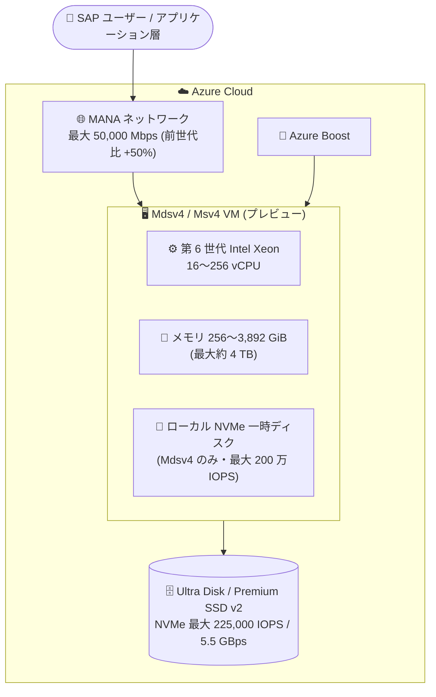

# Azure Virtual Machines: Mdsv4 / Msv4 シリーズ (SAP 向けメモリ最適化 VM) パブリックプレビュー

**リリース日**: 2026-09-18

**サービス**: Azure Virtual Machines

**機能**: Mdsv4 / Msv4 シリーズ仮想マシン (SAP 向け)

**ステータス**: In preview

[このアップデートのインフォグラフィックを見る](https://takech9203.github.io/azure-news-summary/20260918-mdsv4-msv4-sap-vms.html)

## 概要

SAP などのメモリ集約型ワークロード向けに設計されたメモリ最適化 VM シリーズ「Mdsv4」および「Msv4」(Medium Memory) がパブリックプレビューになりました。両シリーズは第 6 世代 Intel® Xeon® Scalable プロセッサ (Granite Rapids) をベースとし、高度なセキュリティ機能と最新の Azure Boost テクノロジーで強化されています。

最大 4 TB の RAM (16〜256 vCPU、256〜3,892 GiB メモリ) を提供し、Ultra Disk および Premium SSD v2 を NVMe インターフェイスで利用することで、リモートディスクストレージに対して最大 225,000 IOPS / 5.5 GBps のスループットを実現します。また、ネットワーク性能は前世代比で 50% 向上しています。

2 つのシリーズの違いはローカル (一時) ストレージの有無です。Mdsv4 はローカル NVMe 一時ディスク付き (最大 2 基、合計最大 8,800 GiB、読み取り最大 2,000,000 IOPS)、Msv4 はローカルディスクなしの構成です。

**アップデート前の課題**

- 従来世代の M シリーズ (Medium Memory) では、リモートディスクストレージの IOPS / スループット性能に上限があり、大規模 SAP ワークロードの I/O 要件がボトルネックになる場合があった
- ネットワーク帯域も前世代の水準にとどまっていた

**アップデート後の改善**

- NVMe インターフェイス経由の Ultra Disk / Premium SSD v2 により、リモートディスクで最大 225,000 IOPS / 5.5 GBps を実現
- ネットワーク性能が前世代比 50% 向上 (最大 50,000 Mbps、MANA インターフェイス対応)
- 第 6 世代 Intel Xeon Scalable プロセッサと Azure Boost による性能・セキュリティの強化

## アーキテクチャ図

SAP ワークロードを Mdsv4 / Msv4 VM 上で実行し、Azure Boost と MANA による高速ネットワーク、NVMe 経由の Ultra Disk / Premium SSD v2 による高性能リモートストレージを利用する構成です。

## サービスアップデートの詳細

### 主要機能

1. **第 6 世代 Intel Xeon Scalable プロセッサ (Granite Rapids)**
   - 16〜256 vCPU、256〜3,892 GiB メモリ (最大約 4 TB) の 8 サイズを提供

2. **NVMe インターフェイスによる高性能リモートストレージ**
   - Ultra Disk / Premium SSD v2 利用時に最大 225,000 IOPS / 5.5 GBps スループット
   - 最大 64 データディスクを接続可能

3. **ネットワーク性能の向上**
   - 前世代比 50% のネットワーク性能向上、最大 50,000 Mbps・8 NIC
   - NetVSC / MANA (Microsoft Azure Network Adapter) インターフェイスに対応

4. **Azure Boost と高度なセキュリティ機能**
   - 最新の Azure Boost テクノロジーとセキュリティ強化を搭載 (公式発表より)

5. **ローカル NVMe 一時ディスク (Mdsv4)**
   - サイズに応じて 550〜4,400 GiB のローカル NVMe ディスクを 1〜2 基搭載
   - 最大でランダム読み取り 2,000,000 IOPS / シーケンシャル読み取り 11.2 GBps

## 技術仕様

### シリーズ共通

| 項目 | 詳細 |
|------|------|
| プロセッサ | 第 6 世代 Intel Xeon Scalable (Granite Rapids) [x86-64] |
| vCPU | 16〜256 |
| メモリ | 256〜3,892 GiB |
| リモートストレージ | 最大 64 ディスク、20,000〜225,000 IOPS、最大 5.5 GBps (Ultra Disk / Premium SSD v2、NVMe) |
| ネットワーク | 最大 8 NIC、4,500〜50,000 Mbps (NetVSC、MANA) |
| ローカルストレージ | Mdsv4: 1〜2 基 (550〜4,400 GiB/基)、Msv4: なし |
| 世代 | Generation 2 VM のみサポート |

### サイズ一覧 (vCPU / メモリ)

| Mdsv4 サイズ | Msv4 サイズ | vCPU | メモリ (GiB) |
|------|------|------|------|
| Standard_M16lds_v4 | Standard_M16ls_v4 | 16 | 256 |
| Standard_M32lds_v4 | Standard_M32ls_v4 | 32 | 512 |
| Standard_M48lds_v4 | Standard_M48ls_v4 | 48 | 768 |
| Standard_M64lds_v4 | Standard_M64ls_v4 | 64 | 1,024 |
| Standard_M96lds_v4 | Standard_M96ls_v4 | 96 | 1,536 |
| Standard_M128lds_v4 | Standard_M128ls_v4 | 128 | 1,944 |
| Standard_M192lds_v4 | Standard_M192ls_v4 | 192 | 3,072 |
| Standard_M256lds_v4 | Standard_M256ls_v4 | 256 | 3,892 |

### 機能サポート状況

| 機能 | Mdsv4 | Msv4 |
|------|------|------|
| Premium Storage / キャッシュ | サポート | サポート |
| Accelerated Networking | サポート | サポート |
| Ephemeral OS Disk | サポート | 非サポート |
| Live Migration | 限定サポート | 限定サポート |
| Write Accelerator | 非サポート | 非サポート |
| Hibernation / Nested Virtualization | 非サポート | 非サポート |
| Generation 1 VM | 非サポート | 非サポート |

## メリット

### ビジネス面

- 最大約 4 TB のメモリにより、大規模な SAP などのメモリ集約型ワークロードをクラウド上で実行可能
- 前世代からの性能向上 (特にストレージ I/O とネットワーク) により、同規模構成での処理能力向上が期待できる

### 技術面

- NVMe インターフェイスによる Ultra Disk / Premium SSD v2 の高スループット (最大 5.5 GBps) で、データベースの I/O ボトルネックを緩和
- MANA 対応によるネットワーク性能の向上 (前世代比 50%)
- Mdsv4 のローカル NVMe ディスクは一時領域・キャッシュ用途で非常に高い IOPS を提供
- ワークロード特性に応じてローカルディスクあり (Mdsv4) / なし (Msv4) を選択可能

## デメリット・制約事項

- パブリックプレビュー段階のため、本番 SAP 環境への適用は GA まで推奨されない
- Write Accelerator は非サポート (従来の M シリーズで利用していた場合は設計の見直しが必要。最大性能を得るには NVMe 経由の Ultra Disk / Premium SSD v2 の利用が前提)
- Generation 2 VM のみサポート (Generation 1 イメージは利用不可)
- Hibernation、Nested Virtualization、Memory Preserving Updates は非サポート
- Mdsv4 のローカル NVMe 一時ディスクは raw NVMe デバイスとして提示されるため、利用前に初期化とフォーマットが必要

## 料金

プレビュー時点の料金は公式ページで確認してください。

- [Virtual Machines の料金](https://azure.microsoft.com/pricing/details/virtual-machines/)
- [料金計算ツール](https://azure.microsoft.com/pricing/calculator/)

## 利用可能リージョン

公式ドキュメントでリージョン別の提供状況を確認してください。

- [リージョン別の利用可能な製品](https://azure.microsoft.com/global-infrastructure/services/?products=virtual-machines)

## 関連サービス・機能

- **Ultra Disk / Premium SSD v2**: NVMe インターフェイス経由で最大 225,000 IOPS / 5.5 GBps を実現するリモートストレージ。本シリーズの性能を引き出す前提となるディスクタイプ
- **Azure Boost**: ストレージ・ネットワーク処理をホスト専用ハードウェアにオフロードする技術。本シリーズに最新版が搭載
- **MANA (Microsoft Azure Network Adapter)**: 次世代ネットワークインターフェイス。Accelerated Networking と組み合わせて高帯域を実現
- **Msv3 / Mdsv3 シリーズ**: 前世代の Medium Memory M シリーズ。移行・比較検討の対象
- **Azure Center for SAP solutions**: Azure 上での SAP ワークロードのデプロイ・管理サービス

## 参考リンク

- [インフォグラフィック](https://takech9203.github.io/azure-news-summary/20260918-mdsv4-msv4-sap-vms.html)
- [公式アップデート情報](https://azure.microsoft.com/updates?id=571530)
- [Mdsv4 シリーズ (Microsoft Learn)](https://learn.microsoft.com/azure/virtual-machines/sizes/memory-optimized/mdsv4-series)
- [Msv4 シリーズ (Microsoft Learn)](https://learn.microsoft.com/azure/virtual-machines/sizes/memory-optimized/msv4-series)
- [VM サイズの概要 (Microsoft Learn)](https://learn.microsoft.com/azure/virtual-machines/sizes/overview)
- [料金ページ](https://azure.microsoft.com/pricing/details/virtual-machines/)

## まとめ

Mdsv4 / Msv4 シリーズは、第 6 世代 Intel Xeon Scalable プロセッサと Azure Boost を基盤に、最大約 4 TB のメモリと NVMe 経由の高性能ストレージ (最大 225,000 IOPS / 5.5 GBps)、前世代比 50% 向上のネットワークを提供する SAP 向けメモリ最適化 VM です。現在パブリックプレビュー段階のため、大規模 SAP 環境を運用中または移行を検討中の組織は、非本番環境での性能検証を開始し、Write Accelerator 非サポートなどの設計上の変更点を確認しておくことを推奨します。

---

**タグ**: Azure Virtual Machines, Compute, SAP, Mdsv4, Msv4, メモリ最適化, Azure Boost, Public Preview
