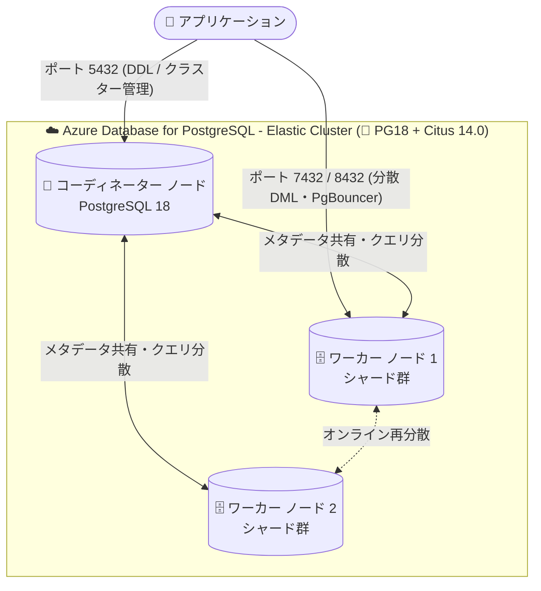

# Azure Database for PostgreSQL: Elastic Clusters の PostgreSQL 18 サポート (GA)

**リリース日**: 2026-09-18

**サービス**: Azure Database for PostgreSQL

**機能**: Elastic Clusters での PostgreSQL 18 (PG18) サポート

**ステータス**: Launched (GA)

[このアップデートのインフォグラフィックを見る](https://takech9203.github.io/azure-news-summary/20260918-postgresql-elastic-clusters-pg18.html)

## 概要

Azure Database for PostgreSQL の Elastic Clusters (エラスティック クラスター) で PostgreSQL 18 のサポートが一般提供 (GA) されました。Elastic Clusters は、オープンソースの Citus 拡張機能をマネージドサービスとして提供する機能で、PostgreSQL の水平シャーディング (行ベース / スキーマベース) による分散スケールアウトを実現します。

今回のアップデートは Citus 14.0 を基盤としており、PostgreSQL 18 のパフォーマンス改善・新しい SQL 機能・開発者向け機能を、テーブル・シャード・ノードにまたがる分散ワークロードで利用できるようになります。新規アプリケーションの構築や既存アプリケーションのモダナイズを、フルマネージドな分散 PostgreSQL 環境で行えます。

**アップデート前の課題**

- Elastic Clusters では PostgreSQL 18 を利用できず、PG18 の最新機能を分散ワークロードで活用できなかった
- PG18 のメリットを享受するには、シングルノードの Flexible Server などスケールアウト構成以外の選択肢を検討する必要があった

**アップデート後の改善**

- Elastic Clusters で PostgreSQL 17 に加えて PostgreSQL 18 を選択可能になった (公式ドキュメントで PG17 / PG18 サポートを明記)
- Citus 14.0 により、PG18 の性能・信頼性・開発者向け機能を分散クラスター構成で利用可能になった

## アーキテクチャ図

Elastic Cluster は複数の Flexible Server ノードが shared-nothing 構成で相互接続された Citus クラスターで、全ノードが PostgreSQL 18 で稼働します。DDL やクラスター全体の操作はコーディネーター (ポート 5432) に接続して実行し、DML は任意のノードで実行できます。

## サービスアップデートの詳細

### 主要機能

1. **PostgreSQL 18 の分散環境での利用**
   - PG18 のパフォーマンス改善、新しい SQL 機能、開発者向け機能を Elastic Clusters の分散ワークロードで利用可能
   - Azure Database for PostgreSQL における PG18 の現行マイナーリリースは 18.6 (新規サーバーはこのマイナーバージョンで作成)

2. **Citus 14.0 ベース**
   - PG18 対応の Citus 14.0 を基盤とし、行ベースシャーディングとスキーマベースシャーディングの 2 つの分散モデルをサポート

3. **フルマネージドな分散 PostgreSQL**
   - 複数の PostgreSQL インスタンス (ノード) を単一リソースとして管理・構成
   - 最大 20 ノードまでスケールアウト可能 (それ以上はサポートに相談)、データ再分散はオンラインで実行されワークロードをブロックしない

## 技術仕様

| 項目 | 詳細 |
|------|------|
| サポート PostgreSQL バージョン | 17 および 18 (今回 PG18 が GA) |
| PG18 現行マイナーリリース | 18.6 |
| 基盤拡張機能 | Citus 14.0 |
| シャーディングモデル | 行ベースシャーディング / スキーマベースシャーディング |
| アーキテクチャ | shared-nothing 構成 (全ノードがメタデータを保持し DML は任意ノードで実行可能) |
| 最大ノード数 | 20 ノード (Portal / CLI / IaC 経由。超過はカスタマーサポートに相談) |
| 読み取りレプリカ | 1 つまでサポート |
| 接続ポート | 5432 (DDL・クラスター管理)、PgBouncer は 6432 (管理) / 8432 (全ノードにロードバランス) |
| ネットワーク | Private Link エンドポイント対応、パブリックアクセス無効化可能 (VNet インジェクションは非サポート) |

## メリット

### ビジネス面

- 最新の PostgreSQL 18 を利用しながら、クラウドスケールの分散ワークロードをフルマネージドで運用できる
- 既存アプリケーションのモダナイズや新規アプリケーション構築でエンジンバージョン起因の制約が減る

### 技術面

- PG18 の性能・信頼性・開発者向けの改善を、シャーディングによる水平スケールアウトと組み合わせて活用できる
- ノード追加とオンライン再分散により、稼働中のワークロードを止めずにスケールアウトできる
- 全ノードがメタデータを保持するため、任意のノードに接続して DML (SELECT / INSERT / UPDATE / DELETE) を実行できる

## デメリット・制約事項

- Elastic Clusters では現在メジャーバージョンアップグレードが非サポートのため、既存クラスターの PG17 から PG18 へのインプレースアップグレードは行えない
- PG18 では一部の PostgreSQL 拡張機能が非サポート (対応拡張機能一覧の確認が必要)。また非同期 I/O の `io_method = io_uring` は構成できない
- Elastic Clusters 共通の制約: ノード数のスケールイン (縮小) 非サポート、クラスターあたり 1 データベースのみ (`CREATE DATABASE` 不可)、Storage Auto Scale・Query Performance Insights・自動インデックスチューニング・サーバーログのダウンロード非サポート
- anon、pg_qs (Query Store)、postgis_topology、TimescaleDB の各拡張機能は非サポート (TimescaleDB は Citus との低レベルな競合のため)

## ユースケース

### ユースケース 1: マルチテナント SaaS のスケールアウト基盤の最新化

**シナリオ**: テナントごとにスキーマを分離するマルチテナント SaaS で、スキーマベースシャーディングにより各テナントのデータを複数ノードに分散する。PG18 GA により、新規クラスターを最新エンジンで構築できる。

**効果**: テナント増加時はノード追加とオンライン再分散で無停止スケールアウトが可能。PG18 の性能・開発者向け機能を分散環境で活用できる。

### ユースケース 2: 大規模データの行ベースシャーディング

**シナリオ**: 単一ノードでは処理しきれないイベントデータや IoT データを、分散列のハッシュに基づく行ベースシャーディングで複数ノードのシャードに分散し、クエリを並列実行する。

**効果**: クエリはデータの所在に応じて単一ノードにルーティングまたは複数ノードで並列化され、PG18 ベースのクラスターで大規模ワークロードに対応できる。

## 料金

Elastic Clusters 固有の料金は今回の調査では公式ページから具体額を確認できませんでした。Azure Database for PostgreSQL は vCore ベースのコンピュート (Burstable / General Purpose / Memory Optimized) とストレージに対する課金で、従量課金・Savings Plan (1 年)・リザーブドインスタンス (1 年 / 3 年) の購入オプションがあります。詳細は料金ページを参照してください。

- [Azure Database for PostgreSQL 料金](https://azure.microsoft.com/pricing/details/postgresql/)

## 利用可能リージョン

Elastic Clusters は Azure Database for PostgreSQL Flexible Server の機能として、Flexible Server と同じリージョンで利用できます。最新のリージョン別提供状況は以下を参照してください。

- [リージョン別の利用可能な製品](https://azure.microsoft.com/explore/global-infrastructure/products-by-region/)

## 関連サービス・機能

- **Azure Database for PostgreSQL Flexible Server**: Elastic Clusters を構成する各ノードの基盤。PG18 (マイナー 18.6) をサポート
- **Citus 拡張機能**: Elastic Clusters の分散機能を提供するオープンソース拡張。今回のアップデートは Citus 14.0 ベース
- **PgBouncer**: 組み込みの接続プーリング。ポート 6432 (管理) / 8432 (全ノードにロードバランス) で利用可能
- **Azure Monitor / Log Analytics**: サーバーログのダウンロードが非サポートのため、メトリックと Log Analytics ワークスペースでクラスターの動作を分析
- **Azure Private Link**: Elastic Clusters への閉域接続を構成可能

## 参考リンク

- [インフォグラフィック](https://takech9203.github.io/azure-news-summary/20260918-postgresql-elastic-clusters-pg18.html)
- [公式アップデート情報](https://azure.microsoft.com/updates?id=571047)
- [Elastic Clusters の概要 (Microsoft Learn)](https://learn.microsoft.com/azure/postgresql/elastic-clusters/concepts-elastic-clusters)
- [Elastic Clusters の制限事項 FAQ (Microsoft Learn)](https://learn.microsoft.com/azure/postgresql/elastic-clusters/concepts-elastic-clusters-limitations)
- [サポートされる PostgreSQL バージョン (Microsoft Learn)](https://learn.microsoft.com/azure/postgresql/configure-maintain/concepts-supported-versions)
- [Learn more (aka.ms/ECPG18)](https://aka.ms/ECPG18)
- [料金ページ](https://azure.microsoft.com/pricing/details/postgresql/)

## まとめ

Elastic Clusters での PostgreSQL 18 サポートが GA となり、最新の PostgreSQL エンジンを Citus 14.0 ベースの分散クラスターで利用できるようになりました。マルチテナント SaaS や大規模データのシャーディングを検討している場合、新規クラスターは PG18 での構築を推奨します。ただし、Elastic Clusters ではメジャーバージョンアップグレードが非サポートのため、既存 PG17 クラスターからの移行は `pg_dump` / `pg_restore` / `pgcopydb` などの論理移行を計画する必要があります。また、PG18 で非サポートの拡張機能や TimescaleDB 非対応などの制約を事前に確認してください。

---

**タグ**: Azure Database for PostgreSQL, PostgreSQL 18, Elastic Clusters, Citus, シャーディング, Databases, GA
