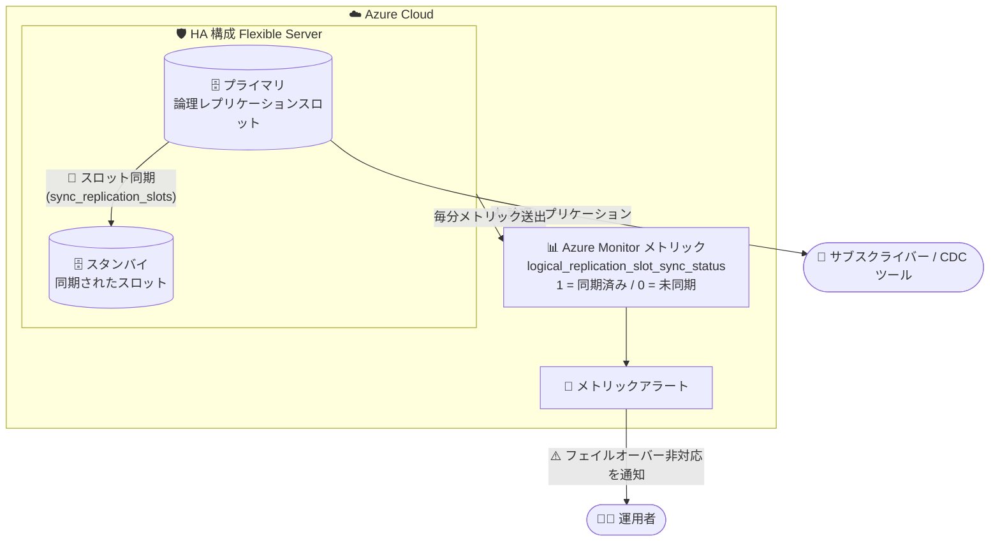

# Azure Database for PostgreSQL Flexible Server: 論理レプリケーションスロット同期ステータスメトリックが一般提供 (GA)

**リリース日**: 2026-09-18

**サービス**: Azure Database for PostgreSQL - Flexible Server

**機能**: Logical replication slot sync status metric (`logical_replication_slot_sync_status`)

**ステータス**: Launched (GA)

[このアップデートのインフォグラフィックを見る](https://takech9203.github.io/azure-news-summary/20260918-postgresql-replication-slot-sync-metric.html)

## 概要

Azure Database for PostgreSQL - Flexible Server で、論理レプリケーションスロットの同期状態を監視できる新しい Azure Monitor メトリック **`logical_replication_slot_sync_status`** が一般提供 (GA) になりました。このメトリックは、高可用性 (HA) 構成のプライマリサーバーとスタンバイサーバーの間で、各論理レプリケーションスロットが同期されているかどうかを示します。

論理レプリケーション (CDC ツールの Debezium やネイティブの Publication/Subscription など) を HA 構成のサーバーで利用する場合、フェイルオーバー後もレプリケーションを継続するには、スタンバイ側にもレプリケーションスロットが同期されている必要があります。しかし、システムビュー (`pg_replication_slots`) はプライマリ側の状態しか表示できず、スタンバイへの同期状態を確認する手段がありませんでした。本メトリックは「フェイルオーバー準備 (failover readiness)」のシグナルとして、この可視性のギャップを埋めるものです。

メトリック値は **1 = プライマリとスタンバイ間でスロットが同期済み**、**0 = スタンバイ上でスロットが未同期** を意味し、0 の場合はフェイルオーバーが論理レプリケーションにとって安全でない可能性を示します。

**アップデート前の課題**

- 論理レプリケーションスロットの管理はプライマリサーバー上で行うが、`pg_replication_slots` などのシステムビューではプライマリの状態しか確認できず、スタンバイにスロットが同期されているかを検証できなかった
- プライマリ上では正常に見えても、実際にはスタンバイにスロットが同期されておらず、フェイルオーバー後に論理レプリケーションが停止するリスクを事前に検知できなかった

**アップデート後の改善**

- Azure Monitor メトリック `logical_replication_slot_sync_status` により、HA プライマリ / スタンバイ間のスロット同期状態をスロット単位 (Logical Replication Slot ディメンション) で可視化できるようになった
- メトリックに対して Azure Monitor アラートを設定でき、計画メンテナンスやフェイルオーバーの前に「フェイルオーバー非対応状態 (値が 0 のまま継続)」を検知できるようになった

## アーキテクチャ図



HA 構成のプライマリからスタンバイへ論理レプリケーションスロットが同期され、その同期状態が新メトリックとして Azure Monitor に送出されます。値が 0 のまま継続する場合はアラートで運用者に通知し、フェイルオーバー前に対処できます。

## サービスアップデートの詳細

### 主要機能

1. **スロット同期状態の可視化**
   - HA プライマリとスタンバイの間で論理レプリケーションスロットが同期されているかを示す (1 = 同期済み、0 = 未同期)
   - `Logical Replication Slot` ディメンションを持ち、スロット単位で分割 (Splitting)・フィルタリングが可能

2. **フェイルオーバー準備 (failover readiness) のシグナル**
   - 値が 0 の場合、現在のプライマリ上では論理レプリケーションが動作していても、フェイルオーバー後には継続できない可能性があることを示す
   - この同期状態は HA ノード間の状態を反映しており、プライマリ側のシステムビューだけでは検証できない情報

3. **Azure Monitor アラートとの連携**
   - メトリックに対してアラートルールを設定可能。値が 0 のまま一定期間継続した場合に通知する構成が推奨されている
   - 計画メンテナンスやフェイルオーバーイベントの前の事前チェックに活用できる

## 技術仕様

| 項目 | 詳細 |
|------|------|
| メトリック表示名 | Logical replication slot sync status |
| メトリック ID | `logical_replication_slot_sync_status` |
| 単位 | Count (1 = 同期済み / 0 = 未同期) |
| ディメンション | Logical Replication Slot (スロット単位) |
| メトリックカテゴリ | 拡張メトリック (Enhanced metrics) - Logical replication |
| 既定の有効化 | 無効 (既定では OFF) |
| 有効化の前提条件 | サーバーパラメーター `metrics.collector_database_activity` を `on` に設定 (動的パラメーター、再起動不要) |
| 送出間隔 / 保持期間 | 1 分間隔 / 最大 93 日 (Flexible Server メトリック共通) |
| ネイティブなスロット同期の前提 | PostgreSQL 17 以降: `sync_replication_slots = on` および `hot_standby_feedback = on` を設定。`failover` オプション付きで作成されたスロットのみが同期対象 |
| PostgreSQL 16 以前 | スロットはフェイルオーバー時に自動保持されないため、`pg_failover_slots` 拡張機能と `hot_standby_feedback = on` の構成が必要 |

## 設定方法

### 前提条件

1. Azure Database for PostgreSQL - Flexible Server で高可用性 (HA) を有効化していること
2. 論理レプリケーションの前提設定 (`wal_level = logical` など) が済んでいること
3. メトリック送出のため、サーバーパラメーター `metrics.collector_database_activity` を `on` に設定すること
4. (PostgreSQL 17 以降でネイティブなスロット同期を使う場合) `sync_replication_slots = on` と `hot_standby_feedback = on` を設定し、スロットを `failover` オプション付きで作成すること

### Azure CLI

```bash
# 拡張メトリックの収集を有効化 (動的パラメーター、再起動不要)
az postgres flexible-server parameter set \
  --resource-group <resource-group> \
  --server-name <server-name> \
  --name metrics.collector_database_activity \
  --value on
```

### Azure Portal

1. 対象の Flexible Server の「サーバーパラメーター」で `metrics.collector_database_activity` を `on` に設定する
2. 「監視」>「メトリック」を開き、メトリックとして **Logical replication slot sync status** を選択する
3. 必要に応じて `Logical Replication Slot` ディメンションで分割し、スロットごとの同期状態を確認する
4. 「アラート」からメトリックアラートルールを作成し、値が 0 のまま継続した場合に通知されるよう構成する

## メリット

### ビジネス面

- フェイルオーバー後に CDC / データ連携パイプラインが停止するリスクを事前に検知でき、ダウンストリームの分析・連携システムの可用性を高められる
- 計画メンテナンスの前にフェイルオーバー準備状態を確認できるため、運用の予見性が向上する

### 技術面

- プライマリのシステムビューでは確認できなかった「スタンバイ側のスロット同期状態」を、標準の Azure Monitor メトリックとして取得できる
- スロット単位のディメンションにより、複数スロット運用時も問題のあるスロットを特定しやすい
- Azure Monitor の標準機能 (アラート、ダッシュボード、Grafana 連携) にそのまま組み込める

## デメリット・制約事項

- 既定では無効のメトリックであり、`metrics.collector_database_activity` を `on` にしないと送出されない
- HA 構成 (プライマリ / スタンバイ) を前提としたメトリックであり、フェイルオーバー時のスロット保持そのものは別途構成が必要 (PostgreSQL 17 以降はネイティブのスロット同期、16 以前は `pg_failover_slots` 拡張機能)
- PostgreSQL 17 以降のスロット同期では、`failover` オプション付きで作成された論理レプリケーションスロットのみが同期対象
- メトリックはあくまで同期状態の可視化であり、未同期の原因調査・是正は運用者が実施する必要がある

## ユースケース

### ユースケース 1: 計画メンテナンス前のフェイルオーバー準備チェック

**シナリオ**: HA 構成の Flexible Server で Debezium などの CDC を運用しており、計画メンテナンス (フェイルオーバーを伴う) の前に、論理レプリケーションがフェイルオーバー後も継続できる状態かを確認したい。

**実装例**:

```bash
# メトリック値を確認 (直近の値が 1 なら同期済み)
az monitor metrics list \
  --resource "/subscriptions/<sub-id>/resourceGroups/<rg>/providers/Microsoft.DBforPostgreSQL/flexibleServers/<server-name>" \
  --metric logical_replication_slot_sync_status \
  --aggregation Minimum \
  --interval PT1M
```

**効果**: 値が 0 のスロットを事前に特定・是正してからメンテナンスを実施でき、フェイルオーバー後のレプリケーション停止を回避できる。

### ユースケース 2: スロット未同期の常時監視アラート

**シナリオ**: フェイルオーバーはいつ発生するか分からないため、スロットが未同期の状態が続いたら即座に通知を受けたい。

**実装例**:

```bash
# 値が 0 のまま継続した場合に通知するメトリックアラートを作成
az monitor metrics alert create \
  --name pg-slot-sync-alert \
  --resource-group <rg> \
  --scopes "/subscriptions/<sub-id>/resourceGroups/<rg>/providers/Microsoft.DBforPostgreSQL/flexibleServers/<server-name>" \
  --condition "min logical_replication_slot_sync_status < 1" \
  --window-size 15m \
  --evaluation-frequency 5m \
  --action <action-group-id>
```

**効果**: フェイルオーバー非対応状態を継続的に検知し、未使用スロットの削除や設定是正などの対処を早期に行える。

## 料金

このメトリック自体の追加料金に関する公式情報は、アップデート情報からは確認できませんでした。Azure Monitor のメトリックアラートなどには Azure Monitor の料金体系が適用されます。詳細は以下の料金ページを参照してください。

- [Azure Database for PostgreSQL の料金](https://azure.microsoft.com/pricing/details/postgresql/flexible-server/)
- [Azure Monitor の料金](https://azure.microsoft.com/pricing/details/monitor/)

## 利用可能リージョン

リージョン固有の提供状況は公式情報から確認できませんでした。最新の提供状況は以下を参照してください。

- [リージョン別の利用可能な製品](https://azure.microsoft.com/explore/global-infrastructure/products-by-region/)

## 関連サービス・機能

- **Azure Monitor**: 本メトリックの基盤。メトリックエクスプローラーでの可視化、ディメンションによる分割・フィルタリング、メトリックアラートの設定が可能。メトリックは 1 分間隔で送出され最大 93 日保持される
- **高可用性 (HA) 構成**: ゾーン冗長 / 同一ゾーンのスタンバイレプリカへ同期レプリケーションを行う構成。本メトリックはこの HA プライマリ / スタンバイ間のスロット同期状態を対象とする
- **論理レプリケーション / 論理デコード**: ネイティブの Publication/Subscription、pglogical 拡張機能、Debezium などの CDC ツールが論理レプリケーションスロットを利用する
- **pg_failover_slots 拡張機能**: PostgreSQL 16 以前でフェイルオーバー時にスロットを保持するための拡張機能。PostgreSQL 17 以降はネイティブのスロット同期 (`sync_replication_slots`) で代替可能
- **HA 正常性状態の監視 (Resource Health)**: HA 対応インスタンスの正常性・フェイルオーバー準備状態を監視する機能。本メトリックと組み合わせることで論理レプリケーション観点の準備状態も確認できる

## 参考リンク

- [インフォグラフィック](https://takech9203.github.io/azure-news-summary/20260918-postgresql-replication-slot-sync-metric.html)
- [公式アップデート情報](https://azure.microsoft.com/updates?id=568414)
- [Microsoft Learn: メトリックとログによる監視 (Flexible Server)](https://learn.microsoft.com/azure/postgresql/monitor/concepts-monitoring)
- [Microsoft Learn: 高可用性 (Logical replication support with HA)](https://learn.microsoft.com/azure/postgresql/high-availability/concepts-high-availability)
- [Microsoft Learn: 論理レプリケーションと論理デコード](https://learn.microsoft.com/azure/postgresql/configure-maintain/concepts-logical)
- [料金ページ](https://azure.microsoft.com/pricing/details/postgresql/flexible-server/)

## まとめ

`logical_replication_slot_sync_status` メトリックの GA により、HA 構成の Azure Database for PostgreSQL - Flexible Server で「フェイルオーバー後も論理レプリケーションが継続できるか」という、これまでシステムビューでは確認できなかった状態を Azure Monitor で可視化・アラート化できるようになりました。HA 構成で CDC やデータ連携に論理レプリケーションを利用しているチームは、`metrics.collector_database_activity` を `on` にして本メトリックを有効化し、値が 0 のまま継続した場合のアラートを設定することを推奨します。あわせて、PostgreSQL 17 以降ではネイティブのスロット同期 (`sync_replication_slots` + `hot_standby_feedback`、`failover` オプション付きスロット)、16 以前では `pg_failover_slots` 拡張機能によるスロット保持の構成も確認してください。

---

**タグ**: Azure Database for PostgreSQL, Flexible Server, Azure Monitor, 論理レプリケーション, 高可用性, フェイルオーバー, メトリック, GA, Databases, Hybrid + multicloud
