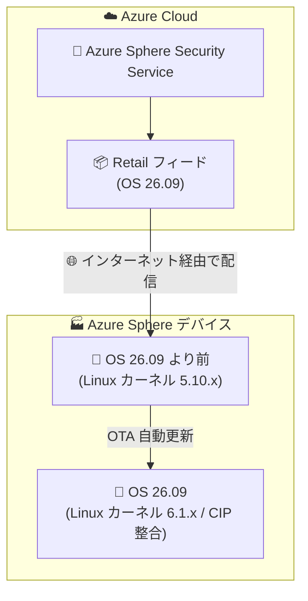

# Azure Sphere: Azure Sphere OS バージョン 26.09 の一般提供開始

**リリース日**: 2026-09-21

**サービス**: Azure Sphere

**機能**: Azure Sphere OS バージョン 26.09 (Retail フィード配信)

**ステータス**: Launched (GA)

[このアップデートのインフォグラフィックを見る](https://takech9203.github.io/azure-news-summary/20260921-azure-sphere-os-26-09.html)

## 概要

Azure Sphere OS バージョン 26.09 が Retail フィードで一般提供開始された。今回のリリースは OS のみの更新であり、SDK の更新は含まれない。インターネットに接続されている Azure Sphere デバイスは、クラウド (Azure Sphere Security Service) から更新された OS を自動的に受信する。

本リリースの主な変更点は Linux カーネルのバージョン移行である。カーネルが 5.10.x 系から 6.1.x 系へ移行し、超長期サポートを提供する Linux CIP (Civil Infrastructure Platform) に整合された。機能面の変更や新機能は含まれていない。

なお、公式アナウンスによると、これは 2031 年の Azure Sphere リタイアメント前の最後のメジャーカーネル更新となる。Azure Sphere は 2031 年 7 月 31 日にサービス終了が予定されており (既報: [Azure Sphere サービスのリタイア](2026-03-20-azure-sphere-retirement.md))、それまでの期間は OS・セキュリティアップデートが継続される。

**アップデート前の状態**

- Azure Sphere OS は Linux カーネル 5.10.x 系をベースとしていた

**アップデート後の改善**

- Linux カーネルが 6.1.x 系へ移行し、超長期サポート向けの Linux CIP Platform に整合された
- リタイアメント (2031 年) までの長期運用を見据えたカーネル基盤が確立された

## アーキテクチャ図

インターネットに接続されたデバイスは、Azure Sphere Security Service の Retail フィードから OS 26.09 を OTA (Over-the-Air) で自動受信し、Linux カーネルが 5.10.x 系から 6.1.x 系へ更新される。

## サービスアップデートの詳細

### 主要な変更点

1. **Linux カーネルの 6.1.x 系への移行**
   - Azure Sphere OS のベースとなる Linux カーネルが 5.10.x 系から 6.1.x 系へ移行した
   - 超長期サポートを提供する Linux CIP (Civil Infrastructure Platform) に整合され、長期的なセキュリティ維持の基盤が強化された
   - 2031 年のリタイアメント前の最後のメジャーカーネル更新と位置づけられている

2. **OS のみの更新 (SDK 更新なし)**
   - 今回のリリースには SDK の更新は含まれない
   - 開発環境側での対応作業は不要

3. **機能変更なし**
   - 新機能や機能面の変更は一切含まれない
   - カーネル基盤の更新に特化したリリースである

### 配信方法

- Retail フィードを通じてクラウドから配信される
- インターネットに接続されているデバイスは、更新された OS を自動的に受信する

## 技術仕様

| 項目 | 詳細 |
|------|------|
| OS バージョン | 26.09 |
| 配信フィード | Retail フィード |
| Linux カーネル | 5.10.x 系 → 6.1.x 系 (Linux CIP Platform に整合) |
| SDK 更新 | なし (OS のみの更新) |
| 機能変更 | なし |
| 配信方式 | クラウド経由の OTA 自動更新 |
| 一般提供時期 | 2026 年 9 月 |

## メリット

### ビジネス面

- リタイアメント (2031 年 7 月 31 日) まで運用を継続するデバイスに対し、超長期サポート (CIP) に整合したカーネル基盤でセキュリティ維持の継続性が高まる
- OS はクラウドから自動配信されるため、フィールドに展開済みのデバイスに対する手動更新作業が不要

### 技術面

- Linux カーネル 6.1.x 系への移行により、より新しいカーネル系列のセキュリティ修正を取り込める基盤となる
- SDK 更新を伴わないため、アプリケーション開発・ビルド環境への影響がない

## デメリット・制約事項

- 新機能の追加はなく、カーネル基盤の更新のみのリリースである
- 公式アナウンスのとおり、本リリースが 2031 年のリタイアメント前の最後のメジャーカーネル更新となるため、以降のメジャーなカーネル系列更新は予定されていない
- Azure Sphere 自体は 2031 年 7 月 31 日にリタイア予定であり、代替プラットフォームへの移行計画は引き続き必要である

## 関連サービス・機能

- **Azure Sphere Security Service**: OS・アプリケーションの OTA 更新配信とデバイス認証を担うクラウドサービス。今回の OS 26.09 も本サービス経由で配信される
- **Azure IoT Hub**: Azure Sphere デバイスの主要なクラウド接続先。OS 更新はアプリケーションのクラウド接続とは独立して行われる

## 参考リンク

- [インフォグラフィック](https://takech9203.github.io/azure-news-summary/20260921-azure-sphere-os-26-09.html)
- [公式アップデート情報](https://azure.microsoft.com/updates?id=572579)
- [Azure Sphere サポート情報 - Microsoft Learn](https://learn.microsoft.com/azure-sphere/resources/support)
- [Azure Sphere ドキュメント - Microsoft Learn](https://learn.microsoft.com/en-us/azure-sphere/)
- [Azure Sphere 料金ページ](https://azure.microsoft.com/pricing/details/azure-sphere/)
- [既報: Azure Sphere サービスのリタイア (2031 年 7 月 31 日)](2026-03-20-azure-sphere-retirement.md)

## まとめ

Azure Sphere OS 26.09 が Retail フィードで一般提供開始された。本リリースは Linux カーネルを 5.10.x 系から 6.1.x 系へ移行し、超長期サポート向けの Linux CIP Platform に整合させることが目的であり、新機能や SDK の更新は含まれない。インターネット接続済みのデバイスはクラウドから自動的に更新を受信するため、運用者側での特別な作業は不要である。

一方で、本リリースは 2031 年の Azure Sphere リタイアメント前の最後のメジャーカーネル更新と明言されている。Azure Sphere を利用中の組織は、リタイア日 (2031 年 7 月 31 日) までは OS・セキュリティアップデートが継続されることを前提としつつ、代替 IoT プラットフォームへの移行計画の策定・実行を並行して進めることを推奨する。

---

**タグ**: #Azure #AzureSphere #IoT #OperatingSystem #LinuxKernel #CIP #OTA #Security
