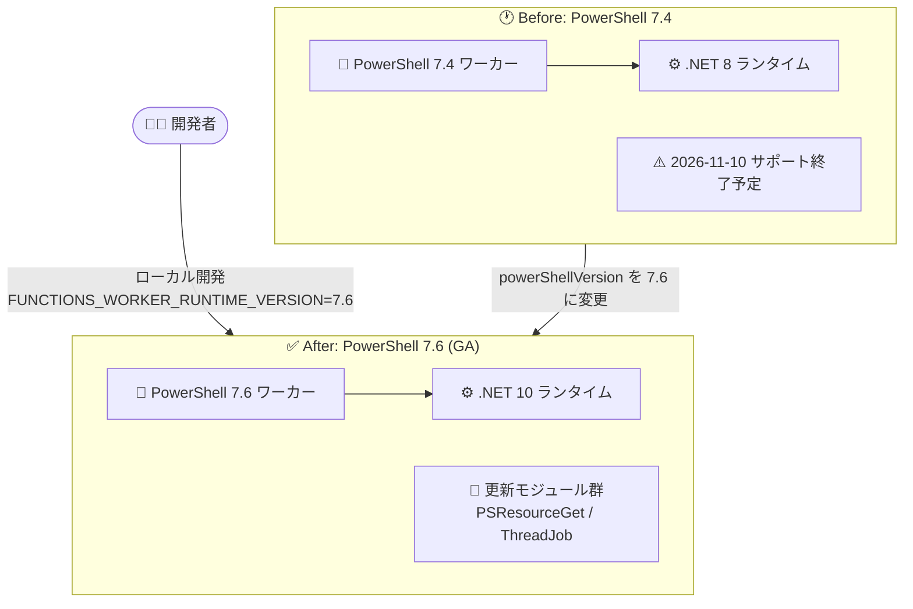

# Azure Functions: PowerShell 7.6 サポートの一般提供開始 (GA)

**リリース日**: 2026-09-21

**サービス**: Azure Functions

**機能**: PowerShell 7.6 サポート

**ステータス**: Launched (GA)

[このアップデートのインフォグラフィックを見る](https://takech9203.github.io/azure-news-summary/20260921-functions-powershell-7-6.html)

## 概要

Azure Functions における PowerShell 7.6 のサポートが一般提供 (GA) となりました。PowerShell 7.6 を使用してローカルで関数アプリを開発し、Azure Functions のプランへデプロイできるようになります。

PowerShell 7.6 は .NET 10 ランタイム上に構築された最新の PowerShell であり、Microsoft.PowerShell.PSResourceGet v1.2.0 や PSReadLine v2.4.5 などの更新されたモジュール、多数のタブ補完・コマンドレットの改善を含みます。既存の PowerShell 7.4 関数アプリは、Azure Portal または Azure PowerShell で `powerShellVersion` 設定を変更することでアップグレードできます。

現行の GA バージョンである PowerShell 7.4 は、Microsoft Learn のサポート表で 2026 年 11 月 10 日にサポート終了 (expected end-of-support) と記載されており、PowerShell を利用する関数アプリは早めの移行計画が推奨されます。

**アップデート前の課題**

- Azure Functions で GA サポートされる PowerShell は 7.4 のみで、そのサポート終了予定日 (2026 年 11 月 10 日) が迫っていた
- PowerShell 7.6 はプレビュー扱いのため、本番ワークロードでの利用が承認されていなかった

**アップデート後の改善**

- PowerShell 7.6 が本番利用可能な GA サポートとなり、サポート切れ前の移行先が確保された
- .NET 10 ベースの最新ランタイムと、更新されたモジュール群 (PSResourceGet v1.2.0、PSReadLine v2.4.5、Microsoft.PowerShell.ThreadJob v2.2.0) を利用可能

## アーキテクチャ図



PowerShell 7.4 (.NET 8 ベース) の関数アプリは、サイト設定 `powerShellVersion` を変更するだけで .NET 10 ベースの PowerShell 7.6 にアップグレードできます。ローカル開発では `local.settings.json` の `FUNCTIONS_WORKER_RUNTIME_VERSION` で 7.6 を指定します。

## サービスアップデートの詳細

### 主要機能

1. **PowerShell 7.6 での開発とデプロイ**
   - PowerShell 7.6 を使用してローカルで関数アプリを開発し、Azure Functions のプランへデプロイ可能

2. **.NET 10 ベースの最新ランタイム**
   - PowerShell 7.6 は .NET 10 ランタイム上に構築されており、Functions ランタイム v4.x で動作

3. **更新されたモジュール群** (PowerShell 7.6 本体の更新)
   - Microsoft.PowerShell.PSResourceGet v1.2.0、PSReadLine v2.4.5、Microsoft.PowerShell.ThreadJob v2.2.0
   - タブ補完の大幅な改善、Web コマンドレットのログ改善、`Get-Command -ExcludeModule` パラメーター追加など

4. **破壊的変更 (PowerShell 7.6 本体)**
   - **ThreadJob** モジュールが **Microsoft.PowerShell.ThreadJob** に置き換え。モジュール修飾名 (`ThreadJob\Start-ThreadJob`) を使用しているスクリプトは修正が必要
   - `Join-Path` の `-ChildPath` パラメーターが `string[]` 型に変更、`WildcardPattern.Escape` の修正など

## 技術仕様

| 項目 | 詳細 |
|------|------|
| 対象サービス | Azure Functions (ランタイム v4.x) |
| 言語バージョン | PowerShell 7.6 |
| ベースランタイム | .NET 10 |
| ローカル開発設定 | `local.settings.json` の `FUNCTIONS_WORKER_RUNTIME_VERSION` に `"7.6"` を指定 |
| Azure 側の設定 | サイト構成の `powerShellVersion` を `7.6` に変更 |
| バージョン指定の注意 | `~7` からの自動アップグレードは行われないため、`7.4` / `7.6` のようにメジャー + マイナーバージョンの明示指定が必要 |
| PowerShell 7.4 のサポート終了予定 | 2026 年 11 月 10 日 (Microsoft Learn 記載の expected end-of-support date) |
| Linux Consumption プランの注意 | PowerShell 7.4 が Linux Consumption プランでサポートされる最後のバージョン。新しいバージョンは追加されない (Flex Consumption プランへの移行を推奨) |

※ プレビュー期間中の Microsoft Learn ドキュメントでは、PowerShell 7.6 は Windows ホスティングプラン (Premium、Dedicated、Consumption) でのサポートと記載されていました。最新のプラン別サポート状況は公式ドキュメントを確認してください。

## 設定方法

### 前提条件

1. 関数アプリが Azure Functions ランタイムの最新バージョン (v4.x) で動作していること
2. アップグレードによる破壊的変更の可能性があるため、事前に[移行ガイド](https://github.com/Azure/azure-functions-powershell-worker/wiki/Upgrading-your-Azure-Function-Apps-to-run-on-PowerShell-7.4)を確認すること

### ローカル開発 (local.settings.json)

```json
{
  "IsEncrypted": false,
  "Values": {
    "AzureWebJobsStorage": "",
    "FUNCTIONS_WORKER_RUNTIME": "powershell",
    "FUNCTIONS_WORKER_RUNTIME_VERSION": "7.6"
  }
}
```

### Azure PowerShell

```powershell
# 関数アプリの PowerShell バージョンを 7.6 に変更
Set-AzResource -ResourceId "/subscriptions/<SUBSCRIPTION_ID>/resourceGroups/<RESOURCE_GROUP>/providers/Microsoft.Web/sites/<FUNCTION_APP>/config/web" `
  -Properties @{ powerShellVersion = '7.6' } -Force -UsePatchSemantics
```

設定変更後、関数アプリは再起動されます。

### Azure Portal

1. Azure Portal で対象の関数アプリを開く
2. **設定** > **構成** を選択し、**全般設定** タブで **PowerShell バージョン** を確認
3. 希望する **PowerShell Core バージョン** (7.6) を選択して **保存**。再起動の警告で **続行** を選択すると、関数アプリが選択したバージョンで再起動する

## メリット

### ビジネス面

- PowerShell 7.4 のサポート終了 (2026 年 11 月 10 日予定) 前に、GA サポートされた移行先へ計画的にアップグレードでき、サポート切れリスクを回避できる
- GA により本番ワークロードでの利用が正式にサポートされる

### 技術面

- .NET 10 ベースの最新ランタイムによる改善を享受できる
- PSResourceGet v1.2.0 などの更新モジュール、タブ補完・コマンドレットの多数の改善が利用可能
- 設定変更 (`powerShellVersion`) のみでアップグレードでき、コード変更は破壊的変更の影響範囲に限定される

## デメリット・制約事項

- PowerShell 7.6 には破壊的変更が含まれる (ThreadJob モジュールの置き換え、`Join-Path -ChildPath` の型変更など)。モジュール修飾名を使用しているスクリプトは事前確認が必要
- `FUNCTIONS_WORKER_RUNTIME_VERSION` は `~7` のような指定からの自動アップグレードが行われないため、`7.6` の明示指定が必要
- Linux Consumption プランには PowerShell 7.4 より新しいバージョンは追加されない。Linux Consumption で稼働中のアプリは Flex Consumption プランへの移行検討が必要
- Managed Dependencies 機能は Flex Consumption プランでは非サポート (カスタムモジュールの同梱で代替)

## ユースケース

### ユースケース 1: 既存 PowerShell 7.4 関数アプリのアップグレード

**シナリオ**: PowerShell 7.4 のサポート終了 (2026 年 11 月 10 日予定) を前に、運用自動化用の関数アプリを PowerShell 7.6 へ移行する。

**実装例**:

```powershell
# 1. ローカルで 7.6 を指定して動作確認 (local.settings.json の FUNCTIONS_WORKER_RUNTIME_VERSION を "7.6" に)
func start

# 2. 問題なければ Azure 側の設定を変更
Set-AzResource -ResourceId "/subscriptions/<SUBSCRIPTION_ID>/resourceGroups/<RESOURCE_GROUP>/providers/Microsoft.Web/sites/<FUNCTION_APP>/config/web" `
  -Properties @{ powerShellVersion = '7.6' } -Force -UsePatchSemantics
```

**効果**: サポート切れ前に最新の GA ランタイムへ移行し、セキュリティ更新とサポートを継続的に受けられる。

## 料金

このアップデート自体による追加料金は発表されていません。料金は Azure Functions のホスティングプランに準じます。

- [Azure Functions の料金ページ](https://azure.microsoft.com/pricing/details/functions/)

## 関連サービス・機能

- **Azure Automation**: PowerShell ベースの運用自動化の代替・補完サービス。イベント駆動の軽量な自動化は Functions、長時間実行ジョブは Automation という使い分けが一般的
- **Durable Functions**: PowerShell 関数の並列実行やオーケストレーションが必要な場合にスケーラビリティを改善
- **Application Insights (Azure Monitor)**: PowerShell 関数のログ・実行状況の監視に使用
- **Flex Consumption プラン**: Linux Consumption プランの後継となるホスティングプラン。Linux で新しい言語バージョンを利用する場合の移行先

## 参考リンク

- [インフォグラフィック](https://takech9203.github.io/azure-news-summary/20260921-functions-powershell-7-6.html)
- [公式アップデート情報](https://azure.microsoft.com/updates?id=572219)
- [アプリを PowerShell 7.6 へ更新する手順 (Microsoft Learn)](https://learn.microsoft.com/en-us/azure/azure-functions/update-language-versions?tabs=azure-portal%2Cwindows&pivots=programming-language-powershell#update-the-language-version)
- [PowerShell 7.6 の新機能 (Microsoft Learn)](https://learn.microsoft.com/en-us/powershell/scripting/whats-new/what-s-new-in-powershell-76?view=powershell-7.6)
- [Azure Functions の PowerShell バージョンとサポート終了日 (Microsoft Learn)](https://learn.microsoft.com/en-us/azure/azure-functions/supported-languages?tabs=isolated-process%2Cv4&pivots=programming-language-powershell#languages-by-runtime-version)
- [Azure Functions PowerShell 開発者ガイド (Microsoft Learn)](https://learn.microsoft.com/en-us/azure/azure-functions/functions-reference-powershell)
- [料金ページ](https://azure.microsoft.com/pricing/details/functions/)

## まとめ

Azure Functions での PowerShell 7.6 サポートが GA となり、本番ワークロードで .NET 10 ベースの最新 PowerShell ランタイムを利用できるようになりました。現行の PowerShell 7.4 は 2026 年 11 月 10 日にサポート終了が予定されているため、PowerShell 関数アプリを運用しているチームは、破壊的変更 (ThreadJob モジュールの置き換えなど) をローカルで検証したうえで、`powerShellVersion` 設定の変更による早期のアップグレードを計画することを推奨します。Linux Consumption プランには 7.6 は提供されないため、該当アプリは Flex Consumption プランへの移行も併せて検討してください。

---

**タグ**: Azure Functions, PowerShell, Compute, Containers, Internet of Things, Security, GA
