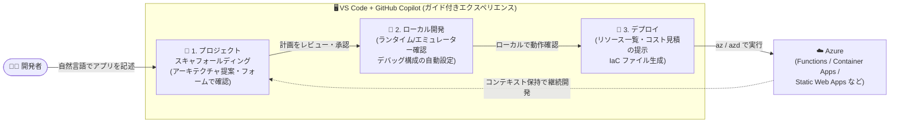

# Visual Studio Code: Azure アプリ構築のためのガイド付き Copilot エクスペリエンス (Public Preview)

**リリース日**: 2026-09-21

**サービス**: Visual Studio Code (Azure Tools 拡張機能 / GitHub Copilot)

**機能**: Guided Copilot Experience for Building Azure Apps

**ステータス**: In preview (Public Preview)

[このアップデートのインフォグラフィックを見る](https://takech9203.github.io/azure-news-summary/20260921-vscode-guided-copilot-azure-apps.html)

## 概要

VS Code 上の GitHub Copilot でクラウドアプリを構築するための新しい方法「ガイド付き Copilot エクスペリエンス」がパブリックプレビューとして発表された。従来の自由形式のチャットセッションではなく、構造化された予測可能なワークフローを通じて、アイデアからデプロイ済みの Azure アプリまでを一貫して導く体験を提供する。

これまで Copilot に「Azure Functions 上に Node.js API を Postgres データベース付きで作って」と依頼した場合、動くプロジェクトが得られることもあれば、そうでないこともあった。アプリはスキャフォールドされてもインフラがスキップされる、デプロイスクリプトが途中で失敗する、数プロンプト後に何を作っていたかを忘れる、といった問題があった。モデル自体は有能だが、チェックポイントもガードレールもない自由形式チャットという「体験の形」が問題だった、と Microsoft は説明している。

今回のガイド付きエクスペリエンスは、既存の自由形式チャットを置き換えるものではなく、「確実に構造化された方法でゼロからデプロイまで到達したい」ときのための、追加のオピニオネイテッドなパスとして提供される。既存の Copilot ワークフローに変更はない。

**アップデート前の課題**

- 自由形式チャットにはチェックポイントやガードレールがなく、「アイデアがある」から「Azure で動いている」までの一貫した道筋がなかった
- アプリのスキャフォールドはされてもインフラ構成が省略される、生成されたデプロイスクリプトが途中で失敗する、といった不確実な結果が起こり得た
- 会話が進むと Copilot がプロジェクトのコンテキストを失うことがあった
- 重要な判断事項がチャットの長文テキストに埋もれ、Copilot が何を必要としているのか読み解く必要があった

**アップデート後の改善**

- 「プロジェクトスキャフォールディング → ローカル開発 → デプロイ」の 3 つの明示的なステージによる構造化ワークフローを提供
- 同じ入力から同じ種類の成果が再現的に得られる決定論的な動作 (Determinism over guesswork)
- アーキテクチャ選択や不足構成、デプロイ先などの重要な判断は、チャットの壁ではなくフォームやピッカーなどの実際の UI で提示される
- デプロイ後も Copilot がプロジェクトのアーキテクチャに関するコンテキストを保持し、後からサービス追加や変更を行う際に前回の続きから再開できる
- 計画からデプロイまでの全工程が VS Code 内で完結する

## アーキテクチャ図

ガイド付きエクスペリエンスは 3 つの明示的なステージで構成され、各ステージにレビュー・承認のチェックポイントがある。デプロイは Azure 全体で使われている信頼性の高いツール (az / azd) を通じて実行され、デプロイ後もプロジェクトコンテキストが保持される。

## サービスアップデートの詳細

### 主要機能

1. **ステージ 1: プロジェクトスキャフォールディング**
   - 自然言語でアプリを記述すると、Copilot がアーキテクチャを提案する
   - 不足している情報 (言語、アプリの種類、Azure サービスなど) は、チャットの往復ではなくシンプルなフォームとピッカーで質問される
   - コードが書かれる前に、開発者が計画をレビューして承認する

2. **ステージ 2: ローカル開発**
   - プロジェクトのスキャフォールド後、Copilot が必要なランタイム、エミュレーター、ツールをチェックし、不足分のインストールを支援する
   - 最初の起動からプロジェクトがローカルで動作する状態になる
   - デバッグ構成が自動的にセットアップされ、Azure に触れる前にテストとイテレーションが可能

3. **ステージ 3: デプロイ**
   - デプロイに使用されるツール、作成されるすべてのリソースのサマリー、コスト見積もりが事前に提示される
   - インフラストラクチャファイル (IaC) が生成され、本番前のテスト・ステージング環境でも一貫性のある再現可能なデプロイ環境を保証する
   - デプロイは Azure 全体で使われている信頼性の高いツール (az および azd) を通じて実行され、失敗時には CLI 出力の壁ではなく、明確な説明と具体的な次のステップが提示される

4. **デプロイ後のコンテキスト保持**
   - アプリの公開後もガイド付きエクスペリエンスは継続し、Copilot がプロジェクトのアーキテクチャに関するコンテキストを保持する
   - 後日サービスを追加したり変更を加えたりする際に、前回の続きから再開できる

## 技術仕様

| 項目 | 詳細 |
|------|------|
| 提供形態 | VS Code の Azure Tools 拡張機能パック + GitHub Copilot |
| ステータス | Public Preview (2026 年 9 月) |
| 対応言語 (初期プレビュー) | JavaScript / TypeScript |
| 対応アプリ種別 | Web アプリ、Azure Functions、Container Apps、Static Web Apps |
| 対応バックエンドサービス | PostgreSQL、Azure Storage、Azure Key Vault、Azure OpenAI |
| デプロイツール | Azure CLI (az)、Azure Developer CLI (azd) |
| ロードマップ | .NET および Python サポートを将来のリリースで予定 |

## 設定方法

### 前提条件

1. Visual Studio Code
2. [Azure Tools 拡張機能パック](https://marketplace.visualstudio.com/items?itemName=ms-vscode.vscode-node-azure-pack) のインストール
3. GitHub Copilot (VS Code 内で利用可能な状態であること)

### 利用開始手順

1. VS Code に Azure Tools 拡張機能パックをインストールする
2. 空のフォルダーを開くと、ガイド付き Copilot エクスペリエンスを試すことができる
3. 作りたいアプリを自然言語で記述し、フォーム・ピッカーで提示される選択肢に沿って計画を承認し、ローカル開発・デプロイへ進む

## メリット

### ビジネス面

- 「最初の試行での成功 (First try success)」を重視した設計により、手動での修正ラウンドを繰り返すことなくプロジェクトのビルド・デプロイが可能で、開発の初速が向上する
- デプロイ前にリソース一覧とコスト見積もりが提示されるため、何が作成され、いくらかかるのかを事前に把握でき、予期しないコストを避けられる
- Azure でのクラウドアプリ開発の学習障壁が下がり、Azure に不慣れな開発者でも構造化された道筋でデプロイまで到達できる

### 技術面

- 決定論的なワークフローにより、同じ入力から同じ種類の成果が再現的に得られる
- IaC ファイルが自動生成されるため、テスト・ステージング・本番で一貫性のある再現可能なデプロイ環境を確保できる
- デバッグ構成が自動設定され、ローカルでの検証を経てから Azure にデプロイするフローが標準化される
- デプロイは az / azd という Azure 標準のツールチェーンを使用するため、既存の運用プラクティスと整合する
- エディター (VS Code) から離れることなく、計画からデプロイまでの全工程を完結できる

## デメリット・制約事項

- パブリックプレビュー段階であり、本番環境での利用は想定されていない
- 初期プレビューは JavaScript / TypeScript プロジェクトのみ対応 (.NET と Python は将来のリリースで対応予定)
- 対応するアプリ種別・バックエンドサービスは現時点で限定的 (Web アプリ / Functions / Container Apps / Static Web Apps、PostgreSQL / Azure Storage / Key Vault / Azure OpenAI)

## ユースケース

### ユースケース 1: アイデアから Azure Functions API を最短でデプロイ

**シナリオ**: 開発者が「PostgreSQL データベース付きの Node.js API を Azure Functions で構築したい」というアイデアを持っている。従来の自由形式チャットでは、インフラ構成の抜けやデプロイスクリプトの失敗が起こり得た。

**実装例**:

1. VS Code で空のフォルダーを開き、ガイド付きエクスペリエンスを開始
2. 「Node.js API on Azure Functions with a Postgres database」と自然言語で記述
3. Copilot が提案するアーキテクチャをフォーム上でレビュー・承認
4. ローカルで実行・デバッグして動作を確認
5. リソースサマリーとコスト見積もりを確認した上で、azd 経由でデプロイ

**効果**: チェックポイント付きの構造化ワークフローにより、インフラ構成の抜け漏れなく、最初の試行でデプロイまで到達できる。

### ユースケース 2: デプロイ済みアプリへの機能追加

**シナリオ**: 以前ガイド付きエクスペリエンスでデプロイしたアプリに、後日 Azure OpenAI を使った機能を追加したい。

**実装例**: 同じプロジェクトを VS Code で開いてガイド付きエクスペリエンスを再開する。Copilot はプロジェクトのアーキテクチャに関するコンテキストを保持しているため、前回の続きからサービス追加を進められる。

**効果**: プロジェクト構成を一から説明し直す必要がなく、継続的な開発・拡張がスムーズに行える。

## 関連サービス・機能

- **GitHub Copilot**: 本エクスペリエンスの基盤となる AI アシスタント。既存の自由形式チャットは変更されず、ガイド付きエクスペリエンスは追加の選択肢として提供される
- **Azure Developer CLI (azd)**: デプロイステージで使用される標準ツール。IaC テンプレートに基づく再現可能なプロビジョニングとデプロイを担う
- **Azure CLI (az)**: azd とともにデプロイの実行に使用される
- **Azure Functions / Azure Container Apps / Azure Static Web Apps**: 初期プレビューで対応するアプリケーションホスティングサービス
- **Azure Database for PostgreSQL / Azure Storage / Azure Key Vault / Azure OpenAI**: 初期プレビューで対応するバックエンドサービス

## 参考リンク

- [インフォグラフィック](https://takech9203.github.io/azure-news-summary/20260921-vscode-guided-copilot-azure-apps.html)
- [公式アップデート情報](https://azure.microsoft.com/updates?id=572214)
- [発表ブログ (Microsoft Tech Community)](https://techcommunity.microsoft.com/blog/AppsonAzureBlog/introducing-a-guided-copilot-experience-for-building-azure-apps-in-vs-code/4557120)
- [Azure Tools 拡張機能パック (VS Code Marketplace)](https://marketplace.visualstudio.com/items?itemName=ms-vscode.vscode-node-azure-pack)
- [フィードバック用 GitHub リポジトリ (vscode-azureresourcegroups)](https://github.com/microsoft/vscode-azureresourcegroups/)

## まとめ

本アップデートは、Azure における AI 支援開発の在り方を「聞いて祈る (ask and hope)」から「明確なチェックポイントと実際の UI を伴う構造化されたコラボレーション」へと転換する、より大きなシフトの第一歩と位置付けられている。Solutions Architect としては、チームの Azure 開発オンボーディングやプロトタイピングの標準フローとして有力な選択肢になり得る。まずは Azure Tools 拡張機能パックをインストールし、空のフォルダーから JavaScript / TypeScript プロジェクトで試用して、フィードバックを GitHub リポジトリに寄せることが推奨される。.NET / Python 対応のロードマップにも注目したい。

---

**タグ**: Visual Studio Code, GitHub Copilot, Azure Developer CLI, Developer Tools, Public Preview, AI-Assisted Development
