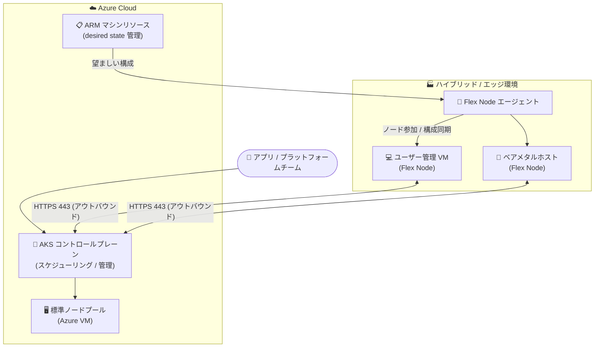

# Azure Kubernetes Service (AKS): Flex Nodes for AKS (Public Preview)

**リリース日**: 2026-09-22

**サービス**: Azure Kubernetes Service (AKS)

**機能**: Flex Nodes for AKS

**ステータス**: In preview (Public Preview)

[このアップデートのインフォグラフィックを見る](https://takech9203.github.io/azure-news-summary/20260922-aks-flex-nodes.html)

## 概要

Flex Nodes for AKS が Public Preview として発表された。Flex Nodes は、ハイブリッド/エッジ環境のユーザー管理インフラストラクチャ (仮想マシンやベアメタルホスト) を、Azure 上の AKS コントロールプレーンに接続されたワーカーノードとして利用できる新しいデプロイオプションである。

従来のようにローカルコントロールプレーンを持つ完全な Kubernetes クラスターをエッジ側にデプロイ・運用するのではなく、ワーカーノードだけをエッジや顧客インフラ上で実行する「接続型 (connected)」環境向けに設計されている。一貫した Kubernetes コントロールプレーンを Azure 側で維持しながら、レイテンシー要件・規制対応・ソブリン要件に応じてコンピュートを統制・保護できる。

Microsoft は、ローカルでの実行は必要だがローカルでの運用は不要なアプリケーション、具体的には AI 推論、データ処理、産業用アプリケーション、コンテンツ配信、ブランチオフィスサービス、レイテンシーに敏感な業務ワークロードなどに最適としている。

**アップデート前の課題**

- エッジやオンプレミスで Kubernetes ワークロードを実行するには、ローカルコントロールプレーンを含む完全なクラスターをデプロイ・運用する必要があり、運用負荷が高かった
- 標準の AKS ノードプールは AKS がプロビジョニング・管理する Azure VM に限定され、クラスターの Azure リージョン外にある既存のコンピュート資産 (ベアメタル含む) を活用できなかった

**アップデート後の改善**

- ユーザー管理の VM やベアメタルホストを、標準ノードプールに移すことなく AKS クラスターのワーカーノードとして追加できるようになった
- コントロールプレーンは Azure 側の AKS が提供するため、ローカル運用なしでデータレジデンシーやレイテンシー要件を満たすワークロード配置が可能になった
- ノードのライフサイクルは AKS の管理操作を通じて行いつつ、基盤マシンの管理権限は利用者側に残せる

## アーキテクチャ図



Azure 上の AKS コントロールプレーンが、標準ノードプール (Azure VM) とエッジ/オンプレミスの Flex Nodes の両方にワークロードをスケジュールする。Flex Node エージェントがホストをクラスターに参加させ、ARM マシンリソースに保存された望ましい状態と構成を同期し続ける。

## サービスアップデートの詳細

### 主要機能

1. **ユーザー管理ホストの AKS ワーカーノード化**
   - 利用者が管理する VM またはベアメタルホスト上で Flex Node エージェントが動作し、マシンの準備、AKS クラスターへの参加、AKS が要求する状態とのノード構成の同期を行う
   - エージェントはホスト上に分離された Kubernetes ノード環境を作成するため、基盤マシンを置き換えることなくノードを更新できる

2. **一貫したコントロールプレーンとスケジューリング**
   - AKS クラスターのコントロールプレーンが、標準ノードプールと接続された Flex Nodes の両方にまたがってワークロードをスケジュール・管理する
   - ノード参加後は、利用者が定義したスケジューリング構成に従って Kubernetes がワークロードを配置する

3. **ARM リソースによる宣言的なノード管理**
   - 各 Flex Node インスタンスの望ましい状態 (希望する Kubernetes バージョンを含む) は ARM マシンリソースに保存され、AKS 管理 API を通じてノードプールのライフサイクル操作を行える

4. **複数の認証オプション**
   - Azure Arc マネージド ID (Arc により非 Azure サーバーにシークレットレス ID を付与)、システム/ユーザー割り当てマネージド ID (Azure 管理下の VM 向け)、サービスプリンシパル (Azure と関係を持たないホスト向け) をサポート
   - エージェントは最小権限の 2 つの ID を使い分ける (Azure との構成取得・状態報告用と、Kubernetes とのノード監視・削除操作用)

5. **オープンソースのエージェント**
   - Flex Node エージェントは GitHub の [AKSFlexNode リポジトリ](https://github.com/Azure/AKSFlexNode)でオープンソースとして公開されている

## 技術仕様

| 項目 | 詳細 |
|------|------|
| 対応ホスト | ユーザー管理の仮想マシンおよびベアメタルホスト |
| 対応アーキテクチャ | amd64 / arm64 |
| ホスト要件 (エージェントリポジトリ記載) | systemd 稼働、root でのインストール、最低 4 vCPU、nspawn と Kubernetes コンポーネント用の十分なメモリ |
| ネットワーク要件 | Flex Node から AKS API サーバーへのアウトバウンド HTTPS (TCP 443)、Flex Node と AKS ノードのプライベート IP 間の双方向到達性、ホストネットワークとノード/Pod CIDR の非重複 |
| オンプレミス接続 | サイト間 VPN や ExpressRoute などによる経路接続が前提 (プライベートクラスターの場合はプライベート API エンドポイントの名前解決・到達性も必要) |
| 認証方式 | Azure Arc マネージド ID / システム・ユーザー割り当てマネージド ID / サービスプリンシパル (エージェント CLI では bootstrap-token モードも提供) |
| 状態管理 | ARM マシンリソースに望ましい状態 (Kubernetes バージョン等) を保存 |
| エージェント | オープンソース (Azure/AKSFlexNode、MIT ライセンス) |

## 設定方法

### 前提条件

1. Azure サブスクリプションと、Linux ノードプールを持つ既存の AKS クラスター (エージェントリポジトリでは Azure CNI 推奨、RBAC 設定権限が必要)
2. ワークステーションに Azure CLI、kubectl、curl、python3 がインストールされていること
3. Flex Node にするマシンが systemd を実行し、root でのインストールが可能で、ワークステーションから SSH で到達できること
4. 上記「技術仕様」のネットワーク要件を満たしていること

### Azure CLI / エージェント CLI

以下はエージェントリポジトリ (Azure/AKSFlexNode) の README に記載された手順の概要である。

```bash
# クラスター接続
az aks get-credentials --resource-group "$RESOURCE_GROUP" --name "$CLUSTER_NAME"

# RBAC 設定と参加用構成の生成 (ワークステーション)
./aks-flex-config setup-node-rbac --resource-group "$RESOURCE_GROUP" \
  --cluster-name "$CLUSTER_NAME" --subscription "$SUBSCRIPTION_ID"
./aks-flex-config generate-node-config ... --bootstrap-token \
  --output ./aks-flex-node-config.json

# エージェントのインストール (Flex Node マシン、root)
curl -fsSL https://raw.githubusercontent.com/Azure/AKSFlexNode/main/scripts/install.sh | bash

# 事前チェックとノード参加
aks-flex-node preflight --config /etc/aks-flex-node/config.json
umask 022
aks-flex-node start --config /etc/aks-flex-node/config.json

# 参加確認
kubectl get nodes -o wide
```

## メリット

### ビジネス面

- データレジデンシー・規制・ソブリン要件を満たしながら、Kubernetes 運用を AKS に集約できる
- エッジ側のローカル Kubernetes クラスター運用 (コントロールプレーンの構築・保守) が不要になり、運用コストを削減できる
- 既存のオンプレミス VM やベアメタルなどの保有資産を AKS のキャパシティとして再活用できる

### 技術面

- クラウドとエッジで一貫した Kubernetes コントロールプレーン・API・スケジューリングを利用できる
- AKS リージョン外のキャパシティをクラスターに追加でき、標準ノードプールと Flex Nodes を同一クラスターで併用できる
- amd64 / arm64 の両アーキテクチャに対応し、ラボ・テスト環境でのアーキテクチャ横断評価にも使える
- エージェントが分離環境でノードを実行するため、基盤マシンを置き換えずにノードを更新できる

## デメリット・制約事項

- Public Preview であり、SLA と限定保証の対象外。サポートはベストエフォートの部分的対応で、本番利用は非推奨 (AKS プレビュー機能ポリシーに準拠)
- ワーカーノードが AKS コントロールプレーンに接続されている「connected」環境が前提であり、切断環境向けの選択肢ではない (ローカルコントロールプレーンが必要な場合は別ソリューションが必要)
- ホスト側のネットワーク設計 (CIDR 非重複、双方向到達性、NSG/ファイアウォール規則、VPN/ExpressRoute 接続) を利用者が満たす必要がある
- エージェントリポジトリは現時点で「alpha software」と明記されており、CSR の手動承認がプレビュー期間の暫定手段となるケースなど、既知の注意点がある
- 標準ノードプールを置き換えるものではなく、一般的なワークロードには引き続き標準ノードプールの利用が推奨される

## ユースケース

### ユースケース 1: AKS リージョン外キャパシティの活用とデータレジデンシー対応

**シナリオ**: AKS クラスターの Azure リージョン外にある自社管理の VM・ベアメタルホストをクラスターに接続し、データレジデンシー要件のある特定ジョブを自社インフラ上でスケジュールする。

**効果**: データを自社インフラに留めたまま、AKS の一貫した管理・スケジューリングを利用できる。

### ユースケース 2: エッジでの AI 推論・産業用ワークロード

**シナリオ**: 工場やブランチオフィスなど、ローカル実行が必要だがローカル運用は避けたい環境で、AI 推論、データ処理、コンテンツ配信、レイテンシーに敏感な業務ワークロードを Flex Nodes 上で実行する。

**効果**: エッジ側の Kubernetes コントロールプレーン運用を排除しつつ、低レイテンシーなローカル実行を実現できる。

### ユースケース 3: ラボ・テスト環境

**シナリオ**: 手元にある VM や物理ホストを AKS ノードとして接続し、amd64 / arm64 の両アーキテクチャでワークロードを評価する。

**効果**: 追加の Azure VM を用意せずに、既存ハードウェアでマルチアーキテクチャ検証ができる。

## 料金

Flex Nodes 固有の料金情報は、現時点で AKS 料金ページには記載されていない (確認日: 2026-09-22)。AKS のクラスター管理料金はティア (Free / Standard / Premium) によって異なる。詳細は料金ページを参照。

- [AKS 料金ページ](https://azure.microsoft.com/pricing/details/kubernetes-service/)

## 関連サービス・機能

- **Azure Arc**: Flex Nodes の認証方式の 1 つとして Azure Arc マネージド ID を利用できる。Arc が非 Azure サーバーに Azure との信頼関係を拡張し、シークレットレス ID を付与する
- **AKS 標準ノードプール**: Flex Nodes は標準ノードプールを置き換えるものではない。同一クラスターで、一般ワークロードは標準ノードプール、異なるホストモデルが必要なワークロードは Flex Nodes という併用が可能
- **Azure ExpressRoute / VPN Gateway**: オンプレミスの Flex Nodes と AKS 間の経路接続 (プライベート到達性) を提供する接続手段として前提となる

## 参考リンク

- [インフォグラフィック](https://takech9203.github.io/azure-news-summary/20260922-aks-flex-nodes.html)
- [公式アップデート情報](https://azure.microsoft.com/updates?id=571919)
- [Microsoft Learn: What are flex nodes for AKS? (preview)](https://learn.microsoft.com/azure/aks/flex-nodes-for-aks-overview)
- [GitHub: Azure/AKSFlexNode (Flex Node エージェント)](https://github.com/Azure/AKSFlexNode)
- [AKS 料金ページ](https://azure.microsoft.com/pricing/details/kubernetes-service/)

## まとめ

Flex Nodes for AKS は、「コントロールプレーンは Azure、ワーカーノードはどこでも」というモデルを AKS にもたらす Public Preview 機能である。エッジ・オンプレミスの既存インフラを AKS クラスターに直接組み込めるため、データレジデンシーやレイテンシー要件を持つ組織にとって、ローカル Kubernetes クラスター運用の代替となり得る。現時点ではプレビュー (エージェントはアルファ版) であり本番利用は非推奨のため、まずはラボ・テスト環境でネットワーク要件と運用モデルを検証し、GA に向けた評価を進めることを推奨する。切断環境やローカルコントロールプレーンが必要なケースには適さない点に留意されたい。

---

**タグ**: Azure Kubernetes Service, AKS, Flex Nodes, Hybrid, Edge, Public Preview, Compute, Containers
