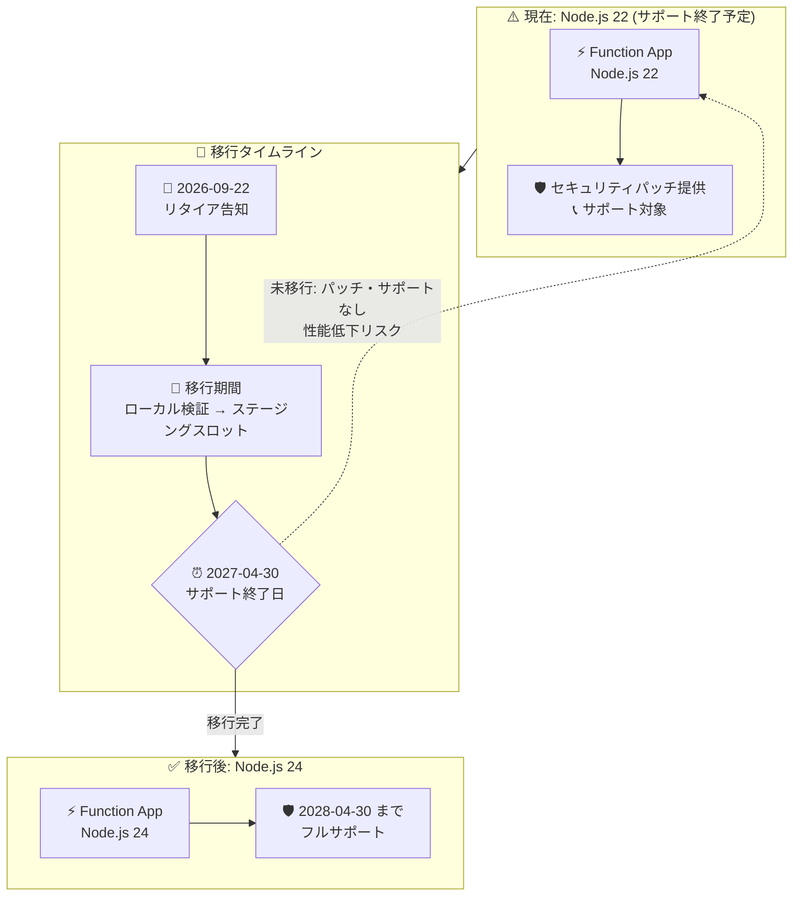

# Azure Functions: Node.js 22 サポート終了 (2027 年 4 月 30 日)

**リリース日**: 2026-09-22

**サービス**: Azure Functions

**機能**: Node.js 22 サポート終了 (Retirement)

**ステータス**: Retirement

[このアップデートのインフォグラフィックを見る](https://takech9203.github.io/azure-news-summary/20260922-functions-nodejs-22-retirement.html)

## 概要

Azure Functions における Node.js 22 のサポートが **2027 年 4 月 30 日** に終了することが発表されました。この日までに **Node.js 24 への移行** が推奨されています。

サポート終了後も Node.js 22 を使用する Function App は動作し続けますが、セキュリティパッチや更新プログラムは提供されなくなり、Node.js 22 に対するカスタマーサポートも終了します。公式アナウンスでは、サポート対象外のランタイムや言語バージョンで Function App を実行し続けると、問題の発生やパフォーマンスの低下につながる可能性があると警告されています。

Azure Functions の言語サポートポリシーでは、言語コミュニティの End-of-Life (EOL) スケジュールまたは基盤 OS のサポート終了日のいずれか早い方に合わせてサポートが終了します。Node.js 22 の終了日 (2027 年 4 月 30 日) はこのポリシーに沿ったものであり、移行先の Node.js 24 は 2028 年 4 月 30 日までサポートされる予定です。

**アップデート前 (現状)**

- Node.js 22 は GA サポート対象であり、セキュリティパッチ・更新・カスタマーサポートが提供されている

**アップデート後 (2027 年 4 月 30 日以降)**

- Node.js 22 の Function App は動作し続けるが、新機能・セキュリティパッチ・パフォーマンス最適化の対象外となる
- Node.js 22 に対するカスタマーサポートが終了する
- 言語サポートポリシーによれば、リタイア済みバージョンを使用するアプリは、場合によってはインスタンス数の割り当てが制限される (スケーリングが 1 インスタンスに制限される) 可能性がある

## アーキテクチャ図



2026 年 9 月の告知から 2027 年 4 月 30 日の期限までに、Node.js 22 の Function App を Node.js 24 へ移行するタイムラインを示しています。期限を過ぎてもアプリは動作しますが、セキュリティパッチとサポートの対象外となります。

## サービスアップデートの詳細

### 主要ポイント

1. **Node.js 22 のサポート終了日は 2027 年 4 月 30 日**
   - 期限後も Function App は停止しないが、セキュリティパッチ・更新・カスタマーサポートは提供されない

2. **推奨移行先は Node.js 24**
   - Azure Functions では Node.js 24 がすでに GA であり、サポート終了予定日は 2028 年 4 月 30 日

3. **段階的なサポート縮退 (Retirement プロセス)**
   - 通知フェーズ: 影響を受ける Function App の所有者へ通知メールが送付される
   - リタイアフェーズ: EOL 後もアプリの作成・デプロイ・実行は可能だが、新機能・セキュリティパッチ・パフォーマンス最適化の対象外。必要に応じてインスタンス割り当てが制限される場合がある

4. **Linux 従量課金 (Consumption) プランに関する注意**
   - Microsoft Learn によると、Node.js 22 は Linux Consumption プランでサポートされる最後の Node.js バージョンであり、Node.js 24 以降は Linux Consumption には追加されない。該当アプリは [Flex Consumption プランへの移行](https://learn.microsoft.com/azure/azure-functions/migration/migrate-plan-consumption-to-flex)が必要

## 技術仕様

| 項目 | 詳細 |
|------|------|
| 対象サービス | Azure Functions (JavaScript / TypeScript の Function App) |
| リタイア対象 | Node.js 22 |
| サポート終了日 | 2027 年 4 月 30 日 |
| 移行先 | Node.js 24 (GA、サポート終了予定日: 2028 年 4 月 30 日) |
| 前提ランタイム | Azure Functions ランタイム v4.x (`FUNCTIONS_EXTENSION_VERSION=~4`) |
| 終了後の挙動 | アプリは動作継続。セキュリティパッチ・更新・カスタマーサポートは終了 |
| バージョン設定 (Windows) | アプリ設定 `WEBSITE_NODE_DEFAULT_VERSION` |
| バージョン設定 (Linux) | サイト設定 `linuxFxVersion` |
| TypeScript | JavaScript へのトランスパイル経由でサポート (同じ Node.js バージョン要件が適用) |

## 設定方法 (Node.js 24 への移行手順)

### 前提条件

1. Function App が Functions ランタイム v4.x で動作していること (`FUNCTIONS_EXTENSION_VERSION` が `~4`)
2. `host.json` の拡張機能バンドルが互換バージョンであること (v4.x バンドル推奨: `"version": "[4.*, 5.0.0)"`)
3. `package.json` の依存パッケージが Node.js 24 に対応していること
4. ローカル開発ツール (Azure Functions Core Tools、SDK、IDE) が Node.js 24 に対応していること
5. ローカルで Node.js 24 を使用して動作検証を完了していること
6. ダウンタイム最小化とロールバックのため、ステージングスロットの利用を推奨 (Flex Consumption プランはスロット未対応のため、非本番アプリで事前検証)

### Azure CLI

```bash
# 利用可能な Node.js バージョンを確認 (Windows)
az functionapp list-runtimes --os "windows" \
  --query "[?runtime == 'node'].{Version:version}" --output table

# Windows: WEBSITE_NODE_DEFAULT_VERSION を更新
az functionapp config appsettings set \
  --name "<FUNCTION_APP_NAME>" \
  --resource-group "<RESOURCE_GROUP_NAME>" \
  --settings "WEBSITE_NODE_DEFAULT_VERSION=~24" \
  --slot "staging"

# 利用可能な Node.js バージョンを確認 (Linux)
az functionapp list-runtimes --os linux \
  --query "[?runtime == 'node'].{Version:version, linuxFxVersion:linux_fx_version}" --output table

# Linux: linuxFxVersion を更新
az functionapp config set \
  --linux-fx-version "NODE|24" \
  --name "<FUNCTION_APP_NAME>" \
  --resource-group "<RESOURCE_GROUP_NAME>" \
  --slot "staging"

# 更新後の確認 (Windows の場合)
az functionapp config appsettings list \
  --name "<FUNCTION_APP_NAME>" \
  --resource-group "<RESOURCE_GROUP_NAME>" \
  --query "[?name=='WEBSITE_NODE_DEFAULT_VERSION'].value" --output tsv
```

ステージングスロットを使用しない場合は `--slot` パラメーターを削除します。バージョン更新後、Function App は再起動します (通常 30〜60 秒程度の停止が発生)。

### Azure Portal

1. Azure Portal で対象の Function App を選択し、サイドメニューの **設定** > **構成** を開く (ステージングスロットがある場合はスロットを選択)
2. **全般設定** タブで **Node.js バージョン** を新しいバージョン (24) に更新
3. **保存** を選択し、再起動の通知で **続行** を選択 (Windows の場合、この操作で `WEBSITE_NODE_DEFAULT_VERSION` アプリ設定が更新される)

注意: Linux の Consumption プランでホストされている Function App は Portal からの更新に対応していないため、Azure CLI を使用します。また、Node.js 24 は Linux Consumption には提供されないため、Flex Consumption プランへの移行が必要です。

## メリット

### ビジネス面

- 期限 (2027 年 4 月 30 日) が約 19 か月前に告知されており、計画的な移行・テスト期間を確保できる
- サポート対象バージョンを維持することで、セキュリティコンプライアンス要件とカスタマーサポートの適格性を維持できる

### 技術面

- Node.js 24 へ移行することで、セキュリティパッチと更新を 2028 年 4 月 30 日まで継続的に受けられる
- 最新の Node.js ランタイムの機能・パフォーマンス改善を利用できる

## デメリット・制約事項

- 期限までに移行しない場合、セキュリティパッチ・更新・カスタマーサポートの対象外となり、脆弱性リスクとパフォーマンス低下の可能性を抱える
- 言語サポートポリシー上、リタイア済みバージョンのアプリはインスタンス割り当て制限 (スケーリングが 1 インスタンスに制限) の対象となる場合がある
- Linux Consumption プランには Node.js 24 が提供されないため、該当アプリは言語バージョン更新に加えて Flex Consumption プランへのプラン移行も必要
- 本番環境を直接更新する場合、再起動時に 30〜60 秒程度のダウンタイムが発生し、処理中のリクエストは中断される
- 依存パッケージや拡張機能バンドルが Node.js 24 に非対応の場合、事前の更新・検証作業が必要

## ユースケース

### ユースケース 1: ステージングスロットを使った安全な移行

**シナリオ**: 本番稼働中の Node.js 22 Function App (Premium プラン、Linux) を、ダウンタイムを最小化しつつ Node.js 24 へ移行する。

**実装例**:

```bash
# 1. ステージングスロットを作成
az functionapp deployment slot create \
  --name "<FUNCTION_APP_NAME>" \
  --resource-group "<RESOURCE_GROUP_NAME>" \
  --slot "staging"

# 2. ステージングスロットの Node.js バージョンを更新
az functionapp config set \
  --linux-fx-version "NODE|24" \
  --name "<FUNCTION_APP_NAME>" \
  --resource-group "<RESOURCE_GROUP_NAME>" \
  --slot "staging"

# 3. 更新済みコードをステージングにデプロイして検証後、スロットをスワップ
az functionapp deployment slot swap \
  --name "<FUNCTION_APP_NAME>" \
  --resource-group "<RESOURCE_GROUP_NAME>" \
  --slot "staging"
```

**効果**: 本番トラフィックへの影響を最小化しながら Node.js 24 で検証でき、問題発生時はスワップバックで即座にロールバックできる。

### ユースケース 2: 移行対象アプリの棚卸し

**シナリオ**: サブスクリプション内で Node.js を使用している Function App を洗い出し、移行計画を立てる。

**実装例**:

```bash
# Node.js ランタイムの Function App を一覧化 (FUNCTIONS_WORKER_RUNTIME で言語を判定)
az functionapp list --query "[].{Name:name, RG:resourceGroup}" --output table

# 各アプリの Node.js バージョンを確認 (Windows の場合)
az functionapp config appsettings list \
  --name "<FUNCTION_APP_NAME>" \
  --resource-group "<RESOURCE_GROUP_NAME>" \
  --query "[?name=='WEBSITE_NODE_DEFAULT_VERSION'].value" --output tsv
```

**効果**: Node.js 22 に依存するアプリを早期に特定し、2027 年 4 月 30 日の期限までの移行ロードマップを策定できる。

## 料金

このアップデートはサポート終了の告知であり、料金への直接的な影響はありません。Azure Functions の料金は以下を参照してください。

- [Azure Functions の料金](https://azure.microsoft.com/pricing/details/functions/)

## 関連サービス・機能

- **Azure Functions ランタイム v4.x**: Node.js 24 を利用するための前提となるランタイムバージョン。v1.x は 2026 年 9 月 14 日にサポート終了済み
- **Azure Functions Flex Consumption プラン**: Linux Consumption プランには Node.js 24 が提供されないため、新しい言語バージョンを利用するにはこのプランへの移行が必要。なお、Linux Consumption プラン自体も 2028 年 9 月 30 日にリタイア予定
- **デプロイメントスロット**: ダウンタイムとロールバックリスクを最小化する言語バージョン更新手段として公式に推奨
- **Azure App Service**: 同じ App Service プラットフォーム上の Node.js アプリも、Node.js の EOL スケジュールに沿ったバージョン管理が必要

## 参考リンク

- [インフォグラフィック](https://takech9203.github.io/azure-news-summary/20260922-functions-nodejs-22-retirement.html)
- [公式アップデート情報](https://azure.microsoft.com/updates?id=572771)
- [Azure Functions ランタイムバージョンの比較 (言語別サポート表)](https://learn.microsoft.com/azure/azure-functions/functions-versions)
- [Azure Functions で言語バージョンを更新する](https://learn.microsoft.com/azure/azure-functions/update-language-versions)
- [Azure Functions 言語スタックのサポートポリシー](https://learn.microsoft.com/azure/azure-functions/language-support-policy)
- [Consumption プランから Flex Consumption プランへの移行](https://learn.microsoft.com/azure/azure-functions/migration/migrate-plan-consumption-to-flex)
- [Node.js リリーススケジュール (GitHub)](https://github.com/nodejs/Release#release-schedule)
- [Azure Functions の料金](https://azure.microsoft.com/pricing/details/functions/)

## まとめ

Azure Functions の Node.js 22 サポートが 2027 年 4 月 30 日に終了します。期限後もアプリは動作しますが、セキュリティパッチ・更新・カスタマーサポートの対象外となるため、Node.js 24 への計画的な移行が必須です。推奨アクションは、(1) Node.js 22 を使用する Function App の棚卸し、(2) 依存パッケージ・拡張機能バンドル・開発ツールの Node.js 24 互換性確認とローカル検証、(3) ステージングスロットを活用した段階的な本番移行、の 3 点です。特に Linux Consumption プランのアプリは Node.js 24 が提供されないため、Flex Consumption プランへのプラン移行も併せて計画してください。

---

**タグ**: Azure Functions, Node.js, Retirement, Compute, Containers, IoT, Security, Compliance
