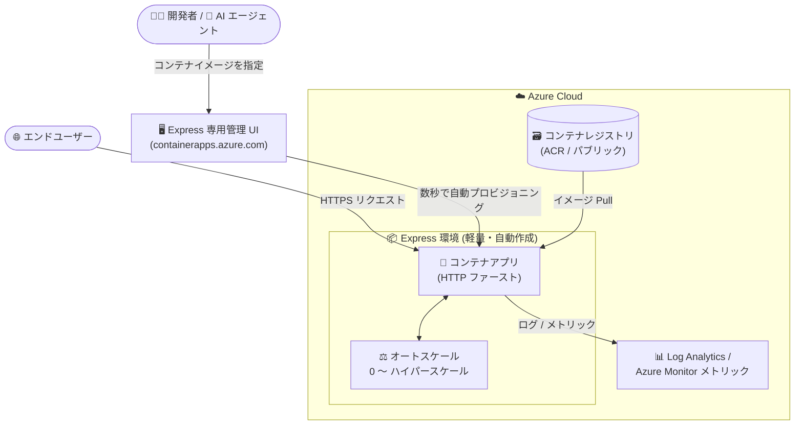

# Azure Container Apps: Azure Container Apps Express の一般提供開始 (GA)

**リリース日**: 2026-09-23

**サービス**: Azure Container Apps

**機能**: Azure Container Apps Express

**ステータス**: Launched (GA)

[このアップデートのインフォグラフィックを見る](https://takech9203.github.io/azure-news-summary/20260923-container-apps-express.html)

## 概要

Azure Container Apps Express が一般提供 (GA) となりました。Express は、インフラストラクチャに関する意思決定を行うことなく、ゼロからハイパースケールまでアプリケーションを起動・スケールできる、Azure 上で最もシンプルかつ高速なアプリケーション実行手段です。Microsoft は Express を「開発者と AI エージェントの両方の利用を想定して設計された初の Azure コンピュートプラットフォーム」と位置づけています。2026 年 5 月のパブリックプレビューを経て、今回 GA に到達しました。

Express は、Azure Container Apps を大規模に運用してきた経験に基づいて設計されています。Web アプリ、API、エージェントを開発する多くの開発者が求めるのは「素早いデプロイ」「自動スケーリング」「複雑なインフラ設定の回避」であり、Express はこれらを提供します。環境は数秒でセットアップされ、あらゆるトラフィック量に対応し、複雑な設定は排除されています。これにより、チームはコードを書いてから本番対応アプリを稼働させるまでを「数時間」ではなく「数分」で完了できます。

Express は、オートスケーリング、秒単位課金、マネージド ID、シークレット管理、コンテナレジストリ統合、リビジョン管理、組み込みの可観測性といった、本番環境レベルの「オピニオネイテッド (opinionated) な既定値」を提供します。開発者はコンテナを持ち込むだけで、残りはすべて Azure Container Apps Express が処理します。

**アップデート前の課題**

- 標準の Azure Container Apps では、アプリのデプロイ前に Container Apps 環境のプロビジョニングを待つ必要があり、スケーリングルール、ネットワーク、リソース割り当てなど多くのインフラ設定の意思決定が求められていた
- Web アプリや API、エージェントバックエンドを「とにかく早く」デプロイしたい開発者や AI エージェントにとって、設定項目の多さが本番稼働までの時間 (Time to Production) のボトルネックになっていた

**アップデート後の改善**

- 環境のプロビジョニングを待たずにコンテナアプリを直接作成可能になり (ポータル利用時は軽量環境を自動作成)、数秒で環境がセットアップされ数分で本番対応アプリが稼働する
- スケーリング、ネットワーク、リソース割り当てなどが本番対応の既定値で自動構成され、ゼロからハイパースケールまでの自動スケーリングとコールドスタート最適化が組み込みで提供される
- 2026 年 5 月のプレビュー開始から約 4 か月で GA となり、本番ワークロードでの利用が正式にサポートされた

## アーキテクチャ図

開発者や AI エージェントはコンテナイメージを指定するだけで、Express が軽量環境を自動プロビジョニングし、本番対応の既定値 (オートスケール、可観測性など) を備えたアプリを数分で公開します。

## サービスアップデートの詳細

### 主要機能

1. **高速な起動 (High-speed launch)**
   - インフラチューニング不要で数分以内にデプロイ可能。スケーリング動作は最初から組み込み済み

2. **HTTP ファーストなワークロードの実行**
   - API、SaaS フロントエンド、AI ゲートウェイ、イベント駆動型 Web バックエンドなどの HTTP ワークロードに対応

3. **自動的な弾力性 (ゼロ → ハイパースケール)**
   - 予測不能なトラフィックパターンを想定した設計で、スケーリングはプラットフォームが自動処理。アイドル時はゼロにスケールダウンし、オンデマンドで復帰するため、使用した分だけの支払いで済む

4. **コールドスタートの最適化**
   - ゼロからのスケール後も迅速にトラフィックを処理できるよう、コールドスタート動作をプラットフォームが自動的に最適化

5. **オピニオネイテッドな既定値と最小限の設定項目**
   - スケーリングルール、ネットワーク、リソース割り当てなどのインフラ設定を本番対応の既定値で自動適用。意思決定項目が少ないため、本番までの時間を短縮

6. **環境管理の簡素化**
   - ポータル利用時はプラットフォームが軽量環境を自動作成 (CLI 利用時は環境の作成が必要)。コンピュートは従量課金 (Consumption) ベースの CPU で実行

7. **専用の管理 UI**
   - Express アプリは Azure Portal とは別の専用 UI (`https://containerapps.azure.com/`) で作成・管理する、合理化された管理体験を提供

## 技術仕様

| 項目 | 詳細 |
|------|------|
| コンピュート | Consumption (従量課金) ベースの CPU。GPU は非対応 |
| イングレス | HTTP イングレス (内部/外部)。HTTP/2、TCP、非セキュア HTTP、追加イングレスポート、ターゲットポート自動検出 (`targetPort: 0`) は非対応 |
| 既定ドメイン | Microsoft マネージドの `azurecontainerapps.io` ドメイン |
| コンテナイメージ | パブリックイメージ、およびユーザー名/パスワードシークレットで認証するプライベートイメージに対応 |
| マネージド ID | ユーザー割り当てマネージド ID に対応 (アプリランタイム、ACR からのイメージ Pull)。システム割り当てマネージド ID は非対応 |
| オートスケール | HTTP トラフィック、CPU、メモリによるスケールに対応。カスタム KEDA スケーラーは非対応 |
| リビジョン | 単一リビジョンモードのローリング更新 (ゼロダウンタイム)。複数リビジョン・トラフィック分割は非対応 |
| シークレット | アプリへの直接追加に対応。Key Vault 参照は非対応 |
| ネットワーク | 内部/外部イングレス、IP 制限 (CIDR)、CORS、仮想ネットワーク経由のエグレス、環境のプライベートエンドポイントに対応 |
| ストレージ | コンテナごとに最大 10 個の `EmptyDir` ボリュームマウント。コンテナ + `EmptyDir` 合計でレプリカあたり 40 GiB まで |
| ヘルスプローブ | HTTP / TCP プローブに対応。Exec ベースのプローブは非対応 |
| 可観測性 | ライブログストリーミング、メトリック (Azure Monitor)、Log Analytics へのログ送信 (環境で有効化)、ブラウザーベースのコンソールアクセスに対応 |
| 課金 | Consumption プランと同じ秒単位の従量課金 |

## 設定方法

Express アプリは、Azure Portal とは別の専用管理 UI (`https://containerapps.azure.com/`) から作成・管理します。作成・管理時には、標準の Azure Portal ではなくこの合理化されたインターフェイスに誘導されます。

- **ポータル (専用 UI) 利用時**: プラットフォームが軽量環境を自動作成するため、環境管理は不要
- **CLI 利用時**: 環境の作成は利用者が実施する必要あり

なお、Express 環境向けの Azure Portal の一部の画面は機能しない旨がドキュメントに記載されています。

## メリット

### ビジネス面

- コード作成から本番対応アプリの稼働までを数時間ではなく数分に短縮し、Time to Market を改善
- ゼロスケール + 秒単位課金により、アイドル時のコストが発生せず、スタートアップや新規プロジェクトのコストリスクを低減
- インフラ運用の負担が減り、チームがアプリケーション開発に集中できる

### 技術面

- 本番対応の既定値 (オートスケール、可観測性、シークレット管理、マネージド ID) が自動適用され、設定ミスのリスクを低減
- ゼロからハイパースケールまでの自動スケーリングにより、予測不能なトラフィックにも対応
- コールドスタートがプラットフォーム側で最適化され、ゼロスケールからの復帰も高速
- AI エージェントによる利用を想定した設計で、エージェントがアプリを自律的にデプロイするワークフローに適合

## デメリット・制約事項

- **イングレス制限**: HTTP のみ対応。HTTP/2、TCP イングレス、非セキュア HTTP、追加イングレスポート、ターゲットポート自動検出は非対応
- **コンピュート制限**: Consumption ベースの CPU のみ。GPU ワークロードは Consumption GPU ワークロードプロファイル (標準環境) を利用する必要がある
- **細かい制御は不可**: コンピュート、ネットワーク、コールドスタート動作の細かい制御が必要な場合は、ワークロードプロファイル環境の標準 Container Apps を使用する
- **ネットワーク機能の制限**: カスタムドメイン (マネージド証明書/持ち込み証明書とも)、クライアント証明書、セッションアフィニティ、組み込みのサービスディスカバリは非対応 (アプリ間通信はパブリック URL 経由)
- **非対応機能**: Dapr、ジョブ、ワークロードプロファイル、システム割り当てマネージド ID、サイドカー/Init コンテナ、Easy Auth、Key Vault シークレット参照、Azure Files ストレージ、複数リビジョン/トラフィック分割、デプロイラベル、ゾーン冗長、OpenTelemetry エージェント、Premium イングレス、ピアツーピア暗号化、メンテナンスウィンドウ、Aspire、ソースコードからのデプロイ (Source-to-cloud) など
- **ポータル制限**: Express 環境向けの Azure Portal の一部の画面は機能しない
- **適合しないワークロード**: TCP サービスやサービスディスカバリを要するマイクロサービスはワークロードプロファイル環境、ジョブ/バッチ処理は Container Apps ジョブ、GPU ワークロードはサーバーレス GPU を利用する

## ユースケース

### ユースケース 1: SaaS アプリケーション / AI アプリのフロントエンド

**シナリオ**: SaaS 製品や AI 搭載インターフェイス・ゲートウェイを、スケーリングインフラを気にせず公開したい。

**効果**: 需要に応じて自動スケールし、インフラ設計なしで本番公開できる。アイドル時はゼロスケールでコストを抑制。

### ユースケース 2: スタートアップ・新規プロジェクトの高速立ち上げ

**シナリオ**: アイデアを数分で本番環境に載せ、プロトタイプを高速に検証しつつ、成長に合わせてそのままスケールさせたい。

**効果**: 検証で作ったアプリをリプラットフォームせずに本番運用へ継続でき、開発速度を維持したままスケールできる。

### ユースケース 3: 社内開発者ツール・Web ダッシュボード

**シナリオ**: 社内外の開発者ツールや、分析・監視・管理用の Web ダッシュボードをゼロコンフィグでデプロイしたい。

**効果**: 環境構築の手間なく即座に利用可能になり、利用がない時間帯はゼロスケールで課金が発生しない。

## 料金

Azure Container Apps Express は、**Consumption プランと同じ秒単位の従量課金 (pay-per-second)** に従います (公式料金ページに明記)。

- **課金モデル**: 秒単位のリソース割り当て (vCPU / メモリ) とリクエスト数に基づく課金。アクティブ時とアイドル時で課金レートが異なる (アイドル時は割引レート)
- **ゼロスケール時**: アプリがゼロにスケールしている間は使用料金が発生しない

| 無料枠 (サブスクリプションごと・月次) | 量 |
|------|------|
| vCPU | 180,000 vCPU 秒 |
| メモリ | 360,000 GiB 秒 |
| リクエスト | 200 万件 |

具体的な単価はリージョン・通貨により異なるため、[Azure 料金計算ツール](https://azure.microsoft.com/pricing/calculator/) および[料金ページ](https://azure.microsoft.com/pricing/details/container-apps/)を参照してください。

## 利用可能リージョン

GA 時点で以下の 43 リージョンで利用可能です (日本では **Japan East / Japan West** の両方で利用可能)。

Australia East, Austria East, Brazil South, Canada Central, Canada East, Central India, Central US, Chile Central, East Asia, East US, East US 2, East US 2 EUAP, France Central, Germany West Central, Indonesia Central, Italy North, **Japan East**, **Japan West**, Jio India Central, Korea Central, Malaysia West, Mexico Central, New Zealand North, North Central US, North Europe, Norway East, Poland Central, South Africa North, South Central US, South India, Southeast Asia, Spain Central, Sweden Central, Switzerland North, Switzerland West, UAE North, UK South, UK West, West Central US, West Europe, West US, West US 2, West US 3

## 関連サービス・機能

- **Azure Container Apps (標準環境 / ワークロードプロファイル)**: Express で非対応の機能 (TCP イングレス、Dapr、サービスディスカバリ、GPU、ゾーン冗長など) が必要な場合の移行先・代替
- **Azure Container Apps ジョブ**: バッチ処理やスケジュール実行が必要なワークロード向けの代替
- **サーバーレス GPU (Consumption GPU ワークロードプロファイル)**: GPU を要する AI/ML ワークロード向けの代替
- **Azure Container Registry (ACR)**: ユーザー割り当てマネージド ID によるプライベートイメージの Pull に対応
- **Azure Monitor / Log Analytics**: メトリック表示と、Express 環境で有効化することによるログ収集・分析

## 参考リンク

- [インフォグラフィック](https://takech9203.github.io/azure-news-summary/20260923-container-apps-express.html)
- [公式アップデート情報](https://azure.microsoft.com/updates?id=559242)
- [Azure Blog (Tech Community): Azure Container Apps Express is now generally available](https://techcommunity.microsoft.com/blog/appsonazureblog/azure-container-apps-express-is-now-generally-available/4559101)
- [Microsoft Learn: Azure Container Apps express overview](https://learn.microsoft.com/azure/container-apps/express-overview)
- [Microsoft Learn: Azure Container Apps ドキュメント](https://learn.microsoft.com/azure/container-apps/)
- [料金ページ](https://azure.microsoft.com/pricing/details/container-apps/)

## まとめ

Azure Container Apps Express の GA により、「コンテナを持ち込むだけ」で数分以内に本番対応の Web アプリ・API・エージェントバックエンドを公開できる選択肢が正式に利用可能になりました。ゼロスケール + 秒単位課金 + コールドスタート最適化の組み合わせは、トラフィックが読めない新規サービスや AI アプリのフロントエンド、社内ツールに特に適しています。一方で、HTTP のみのイングレス、カスタムドメイン非対応、Dapr / ジョブ / GPU 非対応など機能面の制約が明確に定義されているため、Solutions Architect としては「Express で始めて、要件が増えたら標準の Container Apps (ワークロードプロファイル環境) へ」という段階的な採用戦略を検討するとよいでしょう。まずは Japan East / Japan West で専用管理 UI (containerapps.azure.com) からの検証を推奨します。

---

**タグ**: Azure Container Apps, Containers, Express, Serverless, GA, オートスケール, AI エージェント
