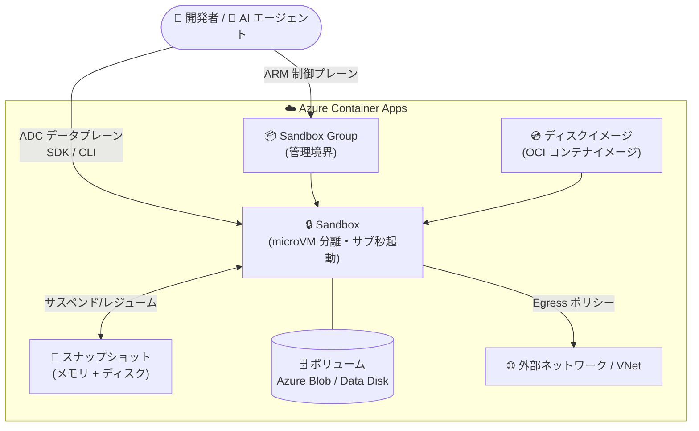

# Azure Container Apps: Sandboxes の一般提供開始 (GA)

**リリース日**: 2026-09-23

**サービス**: Azure Container Apps

**機能**: Azure Container Apps Sandboxes

**ステータス**: Launched (GA)

[このアップデートのインフォグラフィックを見る](https://takech9203.github.io/azure-news-summary/20260923-container-apps-sandboxes.html)

## 概要

Azure Container Apps Sandboxes が一般提供 (GA) となりました。Sandboxes は Azure Container Apps における新しいファーストクラスのリソースタイプ (`Microsoft.App/SandboxGroups`) で、Apps、Jobs、Dynamic sessions と並ぶ第 4 のコンピュートタイプとして、高速・セキュア・エフェメラルなコンピュート環境をサスペンド/レジューム機能付きで提供します。2026 年 6 月のパブリックプレビューを経ての GA です。

各サンドボックスはハードウェア分離された microVM 境界内で動作し、標準の OCI コンテナイメージをサポートし、プリウォームされたプールからサブ秒で起動します。メモリ・ディスク状態・プリロード済みライブラリをスナップショットとして保存できるため、コールドスタートのリロードペナルティなしに同じ実行ポイントからワークロードを再開できます。GitHub Sandbox、Foundry Agent Service のホステッドエージェント、Azure Container Apps Express と同じ Azure 基盤上に構築されています。

エージェント型 AI アプリケーション、マルチテナントプラットフォーム、開発環境、CI/CD システムを構築するチームは、信頼できないコードの安全な実行・セッション間の状態保持・バースト需要への対応のために独自インフラを組み合わせて構築する必要がありましたが、Sandboxes はこれらをマネージドな単一リソースタイプとして解決します。

**アップデート前の課題**

- AI 生成コードなどの信頼できないコードを安全に実行するには、独自のカスタムインフラ (分離基盤) を構築・維持する必要があった
- セッションをまたいだ状態 (メモリ・ディスク・実行コンテキスト) の保持を自前で実装する必要があった
- バースト的な需要に備えてアイドル容量を確保すると、使っていない時間にもコストが発生した
- 既存の Dynamic sessions はエフェメラル (クールダウン後に破棄) であり、永続ストレージやライフサイクルの直接制御ができなかった

**アップデート後の改善**

- ハードウェア分離された microVM 境界により、信頼できないワークロードをマネージド環境で安全に実行可能
- スナップショットによるサスペンド/レジュームで、メモリとディスクを含む完全な状態をサブ秒で復元し、長時間タスクの実行コンテキストを保持
- 停止中は CPU/メモリ課金が発生せず (scale to zero)、ゼロから数千の同時サンドボックスまでオンデマンドでスケール
- SDK/CLI からライフサイクル (作成・サスペンド・レジューム・削除)、ファイル、ポート、Egress ポリシーを直接制御可能

## アーキテクチャ図



サンドボックスグループが管理境界となり、各サンドボックスは OCI ディスクイメージから起動、スナップショットでサスペンド/レジュームし、ボリュームで永続ストレージを利用します。制御は ARM (グループ管理) と ADC データプレーン (サンドボックス操作) の 2 プレーン構成です。

## サービスアップデートの詳細

### 主要機能

1. **サブ秒起動**
   - プリウォームされたプールからプロビジョニングされ、ほぼ瞬時に利用可能

2. **強力な分離**
   - 各サンドボックスはハードウェア分離された microVM 境界内で動作し、信頼できないコードの実行に安全

3. **サスペンド/レジューム (スナップショット)**
   - メモリとディスクを含む完全な状態をスナップショットとして保存し、サブ秒で復元
   - 環境のクローン作成や、構成済み環境のチームでの共有 (ベースライン配布) にも利用可能

4. **Scale to zero / スケールアウト**
   - 停止中は CPU/メモリ課金なし。オンデマンドで数千の同時サンドボックスまでバースト

5. **OCI コンテナイメージサポート**
   - 提供されるパブリックイメージのほか、パブリック/プライベートレジストリの独自イメージをルートファイルシステムとして利用可能

6. **ライフサイクル制御とポリシー**
   - Auto-suspend (アイドルタイムアウトで自動サスペンド)、Suspend Mode (メモリモード: ディスク + メモリの完全スナップショット / ディスクモード: ディスクのみ保持)、Auto-delete (停止後、指定日数で自動削除)

7. **永続ストレージ (ボリューム)**
   - **Azure Blob**: 複数サンドボックスに同時マウント可能。アーティファクト共有向け
   - **Data Disk**: 高パフォーマンス。データベースやビルドキャッシュ向け (同時マウントは 1 サンドボックスのみ)

8. **ネットワーク制御**
   - ドメインベースの許可/拒否ルール、CIDR ベースのネットワークルール、VNet 統合を含む Egress ポリシーとポート管理 (Ingress/Egress)

## 技術仕様

| 項目 | 詳細 |
|------|------|
| リソースタイプ | `Microsoft.App/SandboxGroups` (ARM リソース) |
| 分離方式 | サンドボックスごとのハードウェア分離 microVM 境界 |
| 起動時間 | サブ秒 (プリウォームプール)、レジュームもサブ秒 |
| イメージ | OCI コンテナイメージ (パブリックイメージ / コンテナレジストリイメージ) |
| 制御プレーン | ARM (`management.azure.com`): サンドボックスグループの作成・更新・削除、VNet 接続管理 |
| データプレーン | ADC (`management.azuredevcompute.io`): サンドボックス、ディスクイメージ、スナップショット、ファイル、ボリューム、シークレット、ポート、Egress ポリシーの管理 |
| ライフサイクル状態 | Running / Stopped (停止時に Suspend Mode に応じたスナップショットを保存) |
| SDK | Python SDK (`azure-containerapps-sandbox`) および REST API |
| 必要ロール | Container Apps SandboxGroup Data Owner (ロール定義 ID: `c24cf47c-5077-412d-a19c-45202126392c`) |
| 認証 | Microsoft Entra ID アカウントのみ (個人用 Microsoft アカウントは非サポート) |

### リソースティア

| ティア | CPU | メモリ | ディスク |
|--------|-----|--------|----------|
| XS | 0.25 コア | 0.5 GB | 20 GB |
| S | 0.5 コア | 1 GB | 20 GB |
| M (既定) | 1 コア | 2 GB | 20 GB |
| L | 2 コア | 4 GB | 40 GB |
| XL | 4 コア | 8 GB | 80 GB |

## 設定方法

### 前提条件

1. リソースグループ作成権限のある Azure サブスクリプション
2. サンドボックスを作成・管理するユーザーへの **Container Apps SandboxGroup Data Owner** ロールの割り当て (サブスクリプションまたはリソースグループスコープ)
3. Microsoft Entra ID アカウント (個人用 Microsoft アカウントは非サポート)
4. Python SDK 利用時: Azure CLI、Python 3.10 以降

### Azure CLI (ロール割り当て)

```bash
# サンドボックス管理に必要なロールを割り当てる
az role assignment create \
  --assignee "<USER_EMAIL_OR_OBJECT_ID>" \
  --role "Container Apps SandboxGroup Data Owner" \
  --scope "/subscriptions/<SUBSCRIPTION_ID>/resourceGroups/<RESOURCE_GROUP_NAME>"
```

※ ロール割り当ての反映には 30〜60 秒程度かかる場合があります (403 エラー時は約 1 分待って再試行)。

### Python SDK

```bash
# SDK のインストール
pip install azure-containerapps-sandbox azure-mgmt-resource azure-mgmt-authorization
```

```python
from azure.containerapps.sandbox import SandboxGroupClient, endpoint_for_region

# サンドボックスグループのデータプレーンに接続
client = SandboxGroupClient(
    endpoint_for_region(region), credential,
    subscription_id=subscription_id,
    resource_group=resource_group,
    sandbox_group=sandbox_group,
)

# サンドボックスを作成してコマンドを実行
sandbox = client.begin_create_sandbox(disk="ubuntu").result()
result = sandbox.exec("echo 'Hello from ACA Sandbox.'")
print(result.stdout)
sandbox.delete()
```

### Azure Portal

Sandboxes ポータル (https://aka.ms/aca/sandboxes/portal) からサンドボックスの作成・管理が可能です。

## メリット

### ビジネス面

- 信頼できないコード実行用のカスタムインフラの構築・運用コストを削減
- 停止中は CPU/メモリ課金が発生しないため、バースト型ワークロードでもアイドルコストを支払わずに済む
- GitHub Sandbox や Foundry Agent Service のホステッドエージェントを支える実績ある Azure 基盤をそのまま利用可能

### 技術面

- microVM によるハードウェア分離で、AI 生成コードやマルチテナントの信頼できないワークロードを安全に実行
- メモリを含む完全スナップショットにより、コールドスタートなしで実行コンテキストを保持したまま再開可能
- SDK/CLI によるプログラマブルなライフサイクル制御 (Dynamic sessions では不可能だった直接制御が可能)
- Azure Blob / Data Disk ボリュームによる永続ストレージのマウントに対応
- Egress ポリシー (ドメイン/CIDR ルール) と VNet 統合によるネットワーク制御

## デメリット・制約事項

- サンドボックスへのアクセスは Microsoft Entra ID アカウントのみ (個人用 Microsoft アカウントは非サポート)
- サンドボックスの作成・管理には **Container Apps SandboxGroup Data Owner** ロールの割り当てが必須
- Data Disk ボリュームは同時に 1 つのサンドボックスにしかマウントできない (複数サンドボックスでの共有には Azure Blob を使用)
- リソースティアは XS〜XL の 5 段階で、最大 4 コア / 8 GB メモリ / 80 GB ディスクまで

## ユースケース

### ユースケース 1: AI エージェントのコード実行環境

**シナリオ**: LLM が生成したコードを安全に実行し、タスク間で実行コンテキスト (インストール済みライブラリ、作業ファイル、メモリ状態) を保持したいエージェントワークフロー。

**実装例**:

```python
# エージェント用サンドボックスを作成し、状態を保持しながらタスクを実行
sandbox = client.begin_create_sandbox(disk="ubuntu").result()
sandbox.exec("pip install pandas && python analyze.py")
# タスク間はサスペンドし、次のタスクで同じ状態からレジューム
```

**効果**: 信頼できない AI 生成コードを microVM 分離で安全に実行しつつ、サスペンド/レジュームでコールドスタートなしにコンテキストを維持。アイドル時間の課金も回避できる。

### ユースケース 2: CI/CD のエフェメラルビルド環境

**シナリオ**: ビルド・テストのたびにクリーンな分離環境が必要だが、アイドル時のコストは払いたくない CI/CD パイプライン。

**効果**: ゼロから数千サンドボックスへのバーストスケールでピーク時のジョブを並列処理し、アイドル時は scale to zero でコストゼロ。スナップショットで依存関係プリロード済みの「既知の良い状態」からクローンし、ビルドの立ち上がりを高速化。

### ユースケース 3: セキュアなマルチテナントコンピュート / 開発環境

**シナリオ**: テナントごと・ユーザーごとに分離されたコンピュート環境を提供するプラットフォームや、セッションをまたいで状態を保持するオンデマンド開発環境。

**効果**: テナント/ユーザー単位の強力な分離境界を提供し、Auto-suspend でアイドル環境を自動的にサスペンドしてコストを最適化。再接続時は同じ状態からサブ秒で再開。

## 料金

公式料金ページによると、**Azure Container Apps Sandboxes (および Express) は Consumption プランと同じ秒単位の従量課金**に従います。

- vCPU 秒とメモリ GiB 秒の割り当て量、およびリクエスト数に基づく秒単位課金
- 停止中 (scale to zero) は CPU/メモリ課金なし

無料枠 (サブスクリプションごと・月あたり、Consumption プラン):

| 項目 | 無料枠 |
|------|--------|
| vCPU | 180,000 vCPU 秒 |
| メモリ | 360,000 GiB 秒 |
| リクエスト | 200 万リクエスト |

具体的な単価はリージョン・通貨により異なるため、[料金ページ](https://azure.microsoft.com/pricing/details/container-apps/) および [料金計算ツール](https://azure.microsoft.com/pricing/calculator/?service=container-apps) で確認してください。

## 利用可能リージョン

公式アップデートおよび確認したドキュメントにはリージョン一覧の記載がありませんでした。最新のリージョン提供状況は [リージョン別の利用可能な製品](https://azure.microsoft.com/global-infrastructure/services/?products=container-apps) を参照してください。

## 関連サービス・機能

- **Azure Container Apps Dynamic sessions**: 同じく分離コンピュートを提供するが、セッションプールが割り当て・ライフサイクルを管理するエフェメラルなマネージド実行環境。インフラを抽象化したマネージド実行が必要なら Dynamic sessions、状態永続化を伴うプログラマブルな制御が必要なら Sandboxes を選択
- **Azure Container Apps (Apps / Jobs)**: Apps は長時間稼働のサービス・API 向け (ステートレス)、Jobs は実行完了型のバッチ処理向け。Sandboxes はライフサイクルを利用者が制御するステートフルな分離コンピュートという位置づけ
- **Foundry Agent Service (ホステッドエージェント)**: Sandboxes と同じ Azure 基盤上に構築されており、エージェントワークロードの実行基盤として関連
- **GitHub Sandbox / Azure Container Apps Express**: 同じ基盤テクノロジーを利用するオファリング

## 参考リンク

- [インフォグラフィック](https://takech9203.github.io/azure-news-summary/20260923-container-apps-sandboxes.html)
- [公式アップデート情報](https://azure.microsoft.com/updates?id=561262)
- [GA 発表ブログ (Apps on Azure Blog)](https://techcommunity.microsoft.com/blog/appsonazureblog/azure-container-apps-sandboxes-now-generally-available/4559125)
- [Microsoft Learn: Azure Container Apps Sandboxes overview](https://learn.microsoft.com/azure/container-apps/sandboxes-overview)
- [Sandboxes 開発者ドキュメント (Python SDK クイックスタート)](https://sandboxes.azure.com/docs/sandboxes/quickstart/setup-python-sdk)
- [料金ページ](https://azure.microsoft.com/pricing/details/container-apps/)

## まとめ

Azure Container Apps Sandboxes の GA により、AI エージェントのコード実行・マルチテナントプラットフォーム・開発環境・CI/CD といった「信頼できないコードを安全に、状態を保持しながら、バーストに耐えて実行する」シナリオを、カスタムインフラなしでマネージドに実現できるようになりました。microVM 分離、サブ秒起動、メモリを含むスナップショットによるサスペンド/レジューム、scale to zero が最大の特徴です。

Dynamic sessions を利用中で永続ストレージやライフサイクルの直接制御に課題を感じているチーム、あるいはエージェント型アプリケーションの実行基盤を自前構築しているチームは、Sandboxes への移行・採用を評価することを推奨します。まずは `azure-containerapps-sandbox` Python SDK のクイックスタートで動作を確認し、必要ロール (Container Apps SandboxGroup Data Owner) の割り当て設計と Egress ポリシー/VNet 統合の要件整理から始めるとよいでしょう。

---

**タグ**: Azure Container Apps, Sandboxes, Containers, GA, microVM, AI Agents, Serverless
