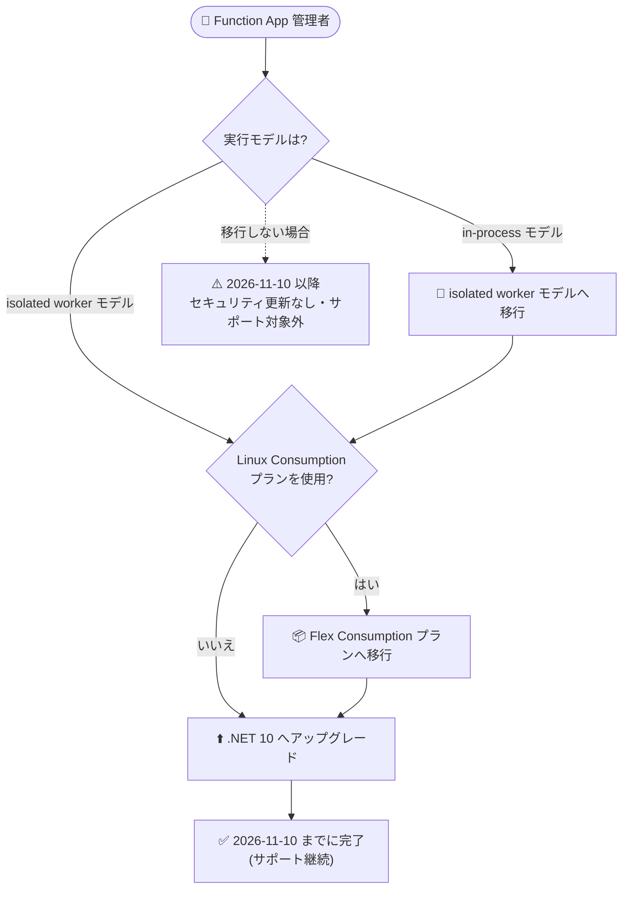

# Azure Functions: .NET 8 / .NET 9 サポート終了 (2026 年 11 月 10 日) — .NET 10 へのアップグレードが必要

**リリース日**: 2026-09-23

**サービス**: Azure Functions

**機能**: .NET 8 および .NET 9 のサポート終了 (Retirement)

**ステータス**: Retirement (サポート終了告知)

[このアップデートのインフォグラフィックを見る](https://takech9203.github.io/azure-news-summary/20260923-functions-dotnet-8-9-retirement.html)

## 概要

Azure Functions における .NET 8 および .NET 9 のサポートが **2026 年 11 月 10 日** に終了することが発表されました。期日までに .NET 10 への移行が推奨されています。サポート終了後も Function App は動作を継続しますが、セキュリティ更新プログラムの提供が停止し、Azure Functions 上での .NET 8 / .NET 9 のサポートが終了します。

公式アナウンスでは、サポート対象外のランタイムや言語バージョンで実行し続けると、セキュリティおよびパフォーマンスの問題につながる可能性があると警告されています。また、Azure Functions の言語サポートポリシーでは、サポート終了後のアプリは新機能・セキュリティパッチ・パフォーマンス最適化の対象外となり、場合によってはインスタンス数の割り当て制限 (スケーリングを 1 インスタンスに制限するなど) が適用される可能性があると明記されています。

なお、同じ 2026 年 11 月 10 日には .NET の **in-process モデル** のサポートも終了します。in-process モデルを使用しているアプリは、.NET 10 へのアップグレードの前に isolated worker モデルへの移行が必要です。

**現在の構成別の推奨アクション**

- **in-process モデルを使用中**: まず isolated worker モデルへ移行し、その後 .NET 10 へアップグレードする
- **isolated worker モデルを使用中**: 直接 .NET 10 へアップグレードする
- **Linux Consumption プランを使用中**: .NET 10 は Linux Consumption プランでは実行できないため、.NET 10 へのアップグレード前に **Flex Consumption プラン** への移行が必要

## アーキテクチャ図



現在の実行モデルとホスティングプランに応じた .NET 10 への移行フロー。in-process モデル利用者は isolated worker モデルへの移行が先に必要で、Linux Consumption プラン利用者は Flex Consumption プランへの移行が必要です。

## サービスアップデートの詳細

### サポート終了の内容

1. **対象**: Azure Functions 上で動作する .NET 8 および .NET 9 のアプリケーション

2. **期日**: 2026 年 11 月 10 日

3. **サポート終了後の影響**
   - Function App は動作を継続する (即座に停止することはない)
   - セキュリティ更新プログラムの提供が停止する
   - 新機能・バグ修正・パフォーマンス最適化の対象外となる
   - 場合によってはインスタンス割り当ての制限 (スケーリングの 1 インスタンスへの制限を含む) が適用される可能性がある
   - サポートを受けるには、サポート対象バージョンへのアップグレードが必要

4. **同日に終了するサポート**
   - .NET の in-process モデルのサポートも 2026 年 11 月 10 日に終了する

### Azure Functions の言語サポートポリシー

Azure Functions の言語サポートは、言語コミュニティのサポート終了日または基盤 OS のサポート終了日のいずれか早い方に合わせて終了します。今回の期日 (2026 年 11 月 10 日) は、.NET 8 (LTS) の公式サポート終了日に対応しています。リタイアメントは「通知フェーズ (メール通知)」→「リタイアメントフェーズ (サポート終了)」の段階的プロセスで実施されます。

## 技術仕様

| 項目 | 詳細 |
|------|------|
| サポート終了日 | 2026 年 11 月 10 日 |
| 対象バージョン | .NET 8、.NET 9 |
| 移行先バージョン | .NET 10 |
| Functions ランタイム | 4.x (isolated worker モデルで .NET 10 / .NET 9 / .NET 8 / .NET Framework 4.8 をサポート) |
| in-process モデル | .NET 8 のみ対応、サポートは 2026 年 11 月 10 日に終了 |
| .NET 10 に必要な Core Tools | バージョン 2.50.0 以降 |
| .NET 10 に必要なプロジェクト SDK | `Azure.Functions.Sdk` 1.0.0 以降 |
| Linux Consumption プランの制約 | .NET 10 アプリは実行不可。Flex Consumption プランへの移行が必要 |

## 設定方法

### 前提条件

1. Functions ランタイム 4.x で動作していること (`FUNCTIONS_EXTENSION_VERSION` が `~4`)
2. isolated worker モデルを使用していること (in-process モデルの場合は先に移行)
3. .NET 10 SDK がローカル開発環境にインストールされていること

### ローカルプロジェクトの更新手順 (isolated worker モデル)

1. プロジェクト SDK を最新の `Azure.Functions.Sdk` に更新し、`Microsoft.Azure.Functions.Worker` の参照を最新バージョンに更新する
2. `.csproj` の `<TargetFramework>` を新バージョン (例: `net10.0`) に更新する
3. 新しい .NET バージョンで必要となるコード変更を行う (.NET Upgrade Assistant の利用も可能)
4. ローカルでリビルドしてテストする

### Azure CLI

```bash
# サポートされる .NET (isolated) のバージョンを確認 (Windows の場合)
az functionapp list-runtimes --os "windows" \
  --query "[?runtime == 'dotnet-isolated'].{Version:version}" --output table

# Windows の Function App の .NET バージョンを更新
az functionapp config set --net-framework-version "v10.0" \
  --name "<FUNCTION_APP_NAME>" --resource-group "<RESOURCE_GROUP_NAME>"

# Linux の場合は linuxFxVersion を更新
az functionapp list-runtimes --os linux \
  --query "[?runtime == 'dotnet-isolated'].{Version:version, linuxFxVersion:linux_fx_version}" --output table
az functionapp config set --linux-fx-version "<LANGUAGE|VERSION>" \
  --name "<FUNCTION_APP_NAME>" --resource-group "<RESOURCE_GROUP_NAME>"

# 更新後の検証
az functionapp show --name "<FUNCTION_APP_NAME>" \
  --resource-group "<RESOURCE_GROUP_NAME>" \
  --query "siteConfig.netFrameworkVersion" --output tsv
```

### Azure Portal

1. Azure Portal で対象の Function App を開き、**Settings** > **Configuration** を選択する (ステージングスロットがある場合は対象スロットを選択)
2. **General settings** タブで **.NET Version** を新しいバージョンに変更する
3. **Save** を選択し、再起動の通知で **Continue** を選択する

**補足**: バージョン更新時にアプリが再起動し、通常 30〜60 秒程度利用不可になります。ダウンタイム最小化とロールバック手段の確保のため、ステージングスロットでの検証・スワップが推奨されています (Flex Consumption プランはスロット未対応のため、非本番アプリでの事前検証やローリング更新戦略を利用)。

## デメリット・制約事項

- 2026 年 11 月 10 日以降、.NET 8 / .NET 9 のアプリはセキュリティ更新・新機能・パフォーマンス最適化の対象外となる (アプリ自体は動作を継続)
- サポート対象外バージョンのままではパフォーマンス低下の可能性があり、サポートを受ける前提としてアップグレードが求められる
- in-process モデルのアプリは、.NET 10 へのアップグレード前に isolated worker モデルへのコード移行が必要 (単なる設定変更では済まない)
- Linux Consumption プランでは .NET 10 を実行できず、Flex Consumption プランへのプラン移行が必要
- .NET のメジャーバージョン間の破壊的変更に対応するため、依存パッケージ (NuGet、バインディング拡張) の互換性確認とコード修正が必要になる場合がある

## 関連サービス・機能

- **isolated worker モデル**: .NET 10 で唯一サポートされる実行モデル。ホストランタイムから独立したプロセスで実行され、依存性注入やミドルウェアなど ASP.NET Core に近い開発体験が得られる。in-process モデルからの移行ガイドが提供されている
- **Flex Consumption プラン**: Linux Consumption プランの後継となるサーバーレスホスティングプラン。Linux 上で .NET 10 を実行する場合に必要
- **デプロイメントスロット**: バージョン更新時のダウンタイム最小化とロールバックに利用できる
- **.NET Upgrade Assistant**: メジャーバージョン間のコード更新を支援するツール

## 参考リンク

- [インフォグラフィック](https://takech9203.github.io/azure-news-summary/20260923-functions-dotnet-8-9-retirement.html)
- [公式アップデート情報](https://azure.microsoft.com/updates?id=572838)
- [Azure Functions 言語サポートポリシー (Microsoft Learn)](https://learn.microsoft.com/azure/azure-functions/language-support-policy)
- [.NET isolated worker モデルガイド (Microsoft Learn)](https://learn.microsoft.com/azure/azure-functions/dotnet-isolated-process-guide)
- [in-process モデルから isolated worker モデルへの移行 (Microsoft Learn)](https://learn.microsoft.com/azure/azure-functions/migrate-dotnet-to-isolated-model)
- [言語バージョンの更新手順 (Microsoft Learn)](https://learn.microsoft.com/azure/azure-functions/update-language-versions)
- [.NET サポートポリシー](https://dotnet.microsoft.com/platform/support/policy/dotnet-core)

## まとめ

Azure Functions における .NET 8 / .NET 9 のサポートが 2026 年 11 月 10 日に終了します。同日には in-process モデルのサポートも終了するため、影響は広範です。サポート終了後もアプリは動き続けますが、セキュリティ更新が提供されなくなり、スケーリング制限が適用される可能性もあるため、本番ワークロードでは事実上アップグレードが必須です。

推奨される次のアクションは以下のとおりです。

1. 対象の Function App を棚卸しし、実行モデル (in-process / isolated worker) とホスティングプランを確認する
2. in-process モデルのアプリは isolated worker モデルへ移行する
3. Linux Consumption プランのアプリは Flex Consumption プランへ移行する
4. すべての .NET 8 / .NET 9 アプリを .NET 10 へアップグレードし、2026 年 11 月 10 日までに完了させる

告知時点 (2026 年 9 月 23 日) から期日まで約 1 か月半しかありません。in-process モデルからの移行はコード変更を伴い、Linux Consumption プランの場合はプラン移行も必要になるため、直ちに移行計画の策定と検証を開始することが推奨されます。

---

**タグ**: Azure Functions, .NET, Retirement, Compute, Containers, IoT, Security, Compliance
