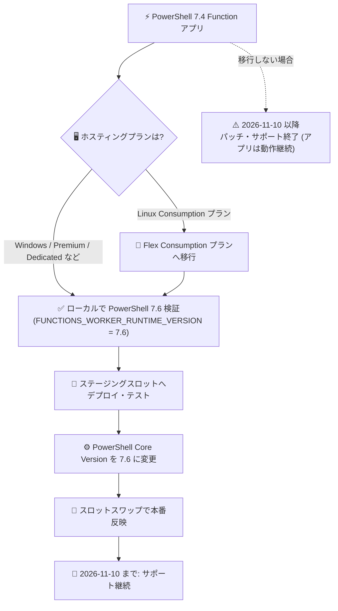

# Azure Functions: PowerShell 7.4 のサポートが 2026 年 11 月 10 日に終了

**リリース日**: 2026-09-23

**サービス**: Azure Functions

**機能**: PowerShell 7.4 サポート終了 (Retirement)

**ステータス**: Retirement (サポート終了告知)

[このアップデートのインフォグラフィックを見る](https://takech9203.github.io/azure-news-summary/20260923-functions-powershell-7-4-retirement.html)

## 概要

Azure Functions における PowerShell 7.4 のサポートが **2026 年 11 月 10 日** に終了することが発表されました。サポート終了後も PowerShell 7.4 で動作する Function アプリは引き続き実行されますが、セキュリティパッチや更新プログラムの提供、および PowerShell 7.4 に対するカスタマーサポートは打ち切られます。Microsoft は期日までに **PowerShell 7.6 への移行** を推奨しています。

サポート対象外のランタイムでアプリを実行し続けると、セキュリティ上の問題やパフォーマンス低下につながる可能性があります。また、Azure Functions / App Service の言語サポートポリシーでは、サポート対象外の言語バージョンで動作するアプリはサポートを受ける前にサポート対象バージョンへのアップグレードが必要とされています。

**サポート終了による影響 (2026 年 11 月 10 日以降)**

- PowerShell 7.4 に対するセキュリティパッチ・更新プログラムの提供が終了する
- PowerShell 7.4 に関するカスタマーサポートが終了する
- サポート対象外ランタイムでの実行は、問題発生やパフォーマンス低下のリスクを伴う

**推奨されるアクション**

- 2026 年 11 月 10 日より前に、Function アプリを PowerShell 7.6 にアップグレードする
- **Linux Consumption プランを利用している場合**: PowerShell 7.4 は Linux Consumption プランでサポートされる最後のバージョンのため、先に **Flex Consumption プランへ移行** してから PowerShell 7.6 にアップグレードする必要がある

## アーキテクチャ図



PowerShell 7.4 から 7.6 への移行フロー。Linux Consumption プラン利用時は Flex Consumption プランへの移行が前提となる点に注意が必要です。

## サービスアップデートの詳細

### 発表内容

1. **PowerShell 7.4 のサポート終了 (2026 年 11 月 10 日)**
   - サポート終了後も Function アプリは動作し続けるが、セキュリティパッチ・更新・カスタマーサポートは提供されない

2. **PowerShell 7.6 への移行推奨**
   - 期日前に PowerShell 7.6 へのアップグレードを完了することが推奨されている
   - 移行時は破壊的変更が発生する可能性があるため、公式の移行ガイドの確認が推奨される

3. **Linux Consumption プラン利用者への注意**
   - PowerShell 7.4 は Linux Consumption プランでサポートされる最後の PowerShell バージョン
   - PowerShell 7.6 へアップグレードする前に、Flex Consumption プランへの移行が必要
   - なお、Linux Consumption プランでのアプリ実行自体も廃止が予定されている

### 言語サポートポリシーとの関係

Azure Functions の言語サポートは各言語コミュニティのサポートタイムラインに準拠しており、コミュニティサポート終了後はプラットフォーム側でもセキュリティパッチや関連サポートを提供できなくなります。サポート対象外の言語バージョンで動作するアプリは、サポートを受ける前にサポート対象バージョンへのアップグレードが求められます。

## 技術仕様

| 項目 | 詳細 |
|------|------|
| サポート終了対象 | PowerShell 7.4 (Azure Functions ランタイム 4.x、.NET 8 ベース) |
| サポート終了日 | 2026 年 11 月 10 日 |
| 移行先バージョン | PowerShell 7.6 (.NET 10 ベース) |
| 終了後の動作 | アプリは動作継続。ただしセキュリティパッチ・更新・カスタマーサポートは提供されない |
| 前提となるランタイム | Azure Functions ランタイム v4.x (`FUNCTIONS_EXTENSION_VERSION` = `~4`) |
| バージョン指定 | `FUNCTIONS_WORKER_RUNTIME_VERSION` はメジャー + マイナーの明示指定が必要 (`7.4` / `7.6`)。`~7` からの自動アップグレードは行われない |
| Linux Consumption プラン | PowerShell 7.4 が最後のサポートバージョン。7.6 へは Flex Consumption プラン移行後にアップグレード |

注: Microsoft Learn の PowerShell 開発者リファレンス (2026 年 5 月更新時点) では、PowerShell 7.6 は「プレビュー、Windows ホスティングプランのみ」と記載されています。一方、2026 年 9 月 21 日更新の言語バージョン更新ガイドでは Linux (Flex Consumption) での 7.6 アップグレード手順が案内されています。最新のサポート状況は公式ドキュメントで確認してください。

## 設定方法

### 前提条件

1. Function アプリが Azure Functions ランタイム v4.x で動作していることを確認する
2. `host.json` の拡張機能バンドルが互換バージョン (4.x 推奨) であることを確認する
3. PowerShell 7.4 から 7.6 への移行に伴う破壊的変更を移行ガイドで確認し、ローカルで動作検証する (`local.settings.json` の `FUNCTIONS_WORKER_RUNTIME_VERSION` を `"7.6"` に設定)
4. ダウンタイム最小化とロールバックのため、ステージングスロットの利用を検討する (Flex Consumption プランはスロット未対応)

### Azure CLI

```bash
# サポートされている PowerShell バージョンを確認 (Windows の場合)
az functionapp list-runtimes --os "windows" \
  --query "[?runtime == 'powershell'].{Version:version}" --output table

# PowerShell バージョンを更新 (ステージングスロット利用時)
az functionapp config set --powershell-version "7.6" \
  --name "<FUNCTION_APP_NAME>" \
  --resource-group "<RESOURCE_GROUP_NAME>" \
  --slot "staging"

# 更新後のバージョンを確認
az functionapp show --name "<FUNCTION_APP_NAME>" \
  --resource-group "<RESOURCE_GROUP_NAME>" \
  --query "siteConfig.powerShellVersion" --output tsv
```

### Azure PowerShell

```powershell
# powerShellVersion 設定を 7.6 に変更
Set-AzResource -ResourceId "/subscriptions/<SUBSCRIPTION_ID>/resourceGroups/<RESOURCE_GROUP>/providers/Microsoft.Web/sites/<FUNCTION_APP>/config/web" `
  -Properties @{ powerShellVersion = '7.6' } -Force -UsePatchSemantics
```

### Azure Portal

1. Azure Portal で対象の Function アプリを開く (ステージングスロット利用時は対象スロットを選択)
2. **設定** > **構成** の **全般設定** タブで **PowerShell Core バージョン** を目的のバージョンに変更する
3. **保存** を選択し、再起動の確認で **続行** を選択する (アプリが再起動する)

再起動中は 30〜60 秒程度アプリが利用できなくなるため、本番環境を直接更新する場合はメンテナンスウィンドウでの実施が推奨されます。

## メリット

### ビジネス面

- サポート対象バージョンへ移行することで、セキュリティパッチとカスタマーサポートを継続して受けられる
- コンプライアンス要件 (サポート対象ランタイムの利用) を維持できる

### 技術面

- 最新の PowerShell 7.6 / .NET 10 ベースのランタイムを利用できる
- ステージングスロットを使った移行により、ダウンタイムを最小化しロールバックも容易に行える

## デメリット・制約事項

- 移行には破壊的変更が含まれる可能性があり、事前のローカル検証と移行ガイドの確認が必要
- Linux Consumption プランでは PowerShell 7.6 を利用できず、先に Flex Consumption プランへの移行が必要 (Flex Consumption ではデプロイスロットが未サポート、Managed Dependencies 機能も未サポートのためモジュールはアプリコンテンツに同梱する必要がある)
- バージョン変更時にアプリが再起動し、処理中のリクエストは中断される
- 移行しない場合、2026 年 11 月 10 日以降はセキュリティパッチ・サポートが受けられなくなる

## 移行タイムライン

| 日付 | イベント |
|------|---------|
| 2026-09-23 | サポート終了の告知 (本アップデート) |
| 2026-11-10 | PowerShell 7.4 のサポート終了。以降、セキュリティパッチ・更新・カスタマーサポートの提供なし (アプリは動作継続) |

## 関連サービス・機能

- **Azure Functions デプロイスロット**: ステージングスロットで新バージョンを検証してからスワップすることで、ダウンタイムとリスクを最小化できる
- **Flex Consumption プラン**: Linux Consumption プラン利用者の移行先。PowerShell 7.6 へのアップグレードの前提となる
- **App Service 言語サポートポリシー**: 本サポート終了の根拠となるポリシー。コミュニティのサポートタイムラインに準拠

## 参考リンク

- [インフォグラフィック](https://takech9203.github.io/azure-news-summary/20260923-functions-powershell-7-4-retirement.html)
- [公式アップデート情報](https://azure.microsoft.com/updates?id=572770)
- [Azure Functions で言語バージョンを更新する (Microsoft Learn)](https://learn.microsoft.com/en-us/azure/azure-functions/update-language-versions?tabs=azure-portal%2Cwindows&pivots=programming-language-powershell)
- [Azure Functions の PowerShell 開発者向けリファレンス (Microsoft Learn)](https://learn.microsoft.com/azure/azure-functions/functions-reference-powershell)
- [言語ランタイムサポートポリシー (Microsoft Learn)](https://learn.microsoft.com/azure/app-service/language-support-policy)
- [Consumption プランから Flex Consumption プランへの移行 (Microsoft Learn)](https://learn.microsoft.com/azure/azure-functions/migration/migrate-plan-consumption-to-flex)

## まとめ

Azure Functions の PowerShell 7.4 サポートは 2026 年 11 月 10 日に終了します。終了後もアプリは動作し続けますが、セキュリティパッチとカスタマーサポートが提供されなくなるため、セキュリティ・コンプライアンスの観点から期日前の PowerShell 7.6 への移行が強く推奨されます。特に Linux Consumption プランを利用している場合は Flex Consumption プランへの移行が前提となり作業量が増えるため、早めの移行計画の策定が重要です。移行時はローカル検証とステージングスロットの活用により、破壊的変更の影響とダウンタイムを最小化してください。

---

**タグ**: Azure Functions, PowerShell, Retirement, Compute, Containers, Internet of Things, Compliance, Security
