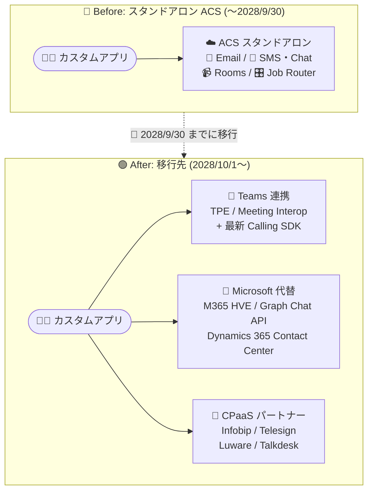

# Azure Communication Services: スタンドアロンサービスの廃止 (2028 年 9 月 30 日)

**リリース日**: 2026-09-24

**サービス**: Azure Communication Services

**機能**: スタンドアロンサービスの廃止 (Retirement)

**ステータス**: Retirement

[このアップデートのインフォグラフィックを見る](https://takech9203.github.io/azure-news-summary/20260924-acs-standalone-services-retirement.html)

## 概要

Microsoft は、Azure Communication Services (ACS) のスタンドアロン提供を **2028 年 9 月 30 日** に廃止すると発表しました。Email、SMS、Chat、Rooms、Job Router など複数の ACS サービスがこの日をもって利用できなくなり、API/SDK 操作はエラーを返すようになります。この決定は、Microsoft Teams・Dynamics 365・Azure といった Microsoft プラットフォームに深く統合されたコミュニケーション体験を優先し、不足分は主要な CPaaS (Communications Platform as a Service) パートナーと連携して補うという Microsoft の戦略転換を反映したものです。

また、Voice/Video Calling SDK や Call Automation などの通話系サービスは廃止ではなく **破壊的変更 (Breaking Change)** の対象となります。これらは 2028 年 9 月 30 日以降も存続しますが、Microsoft Teams 連携シナリオ (Teams Phone Extensibility、Teams Meeting Interoperability、Teams Click-2-Call) で使用する場合のみサポートされ、最新のメジャーバージョン SDK への更新が必要です。Teams と統合しないスタンドアロンの通話実装は、この日以降サポート対象外となり動作しなくなります。

重要なマイルストーンとして、**2026 年 10 月 23 日以降、新規顧客は廃止対象の ACS サービスにサインアップできなくなります**。それ以前に作成された ACS リソースを持つ既存顧客は、移行期間中 (2028 年 9 月 30 日まで) 既存リソースと廃止対象サービスを引き続き利用できます。Solutions Architect としては、影響範囲の棚卸しと移行計画の立案を早期に開始することが求められます。

**アップデート前の状況**

- ACS は Email、SMS、Chat、通話、電話番号管理などをスタンドアロンの CPaaS として提供しており、Teams ライセンスなしでカスタムコミュニケーションアプリを構築できた
- ACS Rooms や UI Library SDK を使った独自のビデオ通話・会議体験の実装が可能だった

**アップデート後の変更**

- 2026 年 10 月 23 日以降、廃止対象サービスへの新規サインアップが停止される
- 2028 年 9 月 30 日以降、廃止対象サービス (Email、SMS、Chat、Rooms、Job Router など) は完全に利用不可となる
- 通話系サービス (Voice/Video Calling SDK、Call Automation など) は Teams 連携シナリオ + 最新 SDK でのみサポート継続となる
- 移行先として Microsoft 製品 (Teams、Dynamics 365、Microsoft Graph、Microsoft 365 HVE/Exchange Online) またはサードパーティ CPaaS パートナー (Infobip、Telesign、Luware、Talkdesk) が案内される

## アーキテクチャ図

スタンドアロン ACS で構築していたコミュニケーション機能は、2028 年 9 月 30 日までに Teams 連携シナリオ、Microsoft の代替サービス、またはサードパーティ CPaaS パートナーへの移行が必要です。通話系 SDK は Teams 連携 + 最新メジャーバージョンへの更新でのみ継続利用できます。

## サービスアップデートの詳細

### 廃止対象サービス (2028 年 9 月 30 日以降、利用不可)

以下の ACS サービスは廃止され、機能しなくなります。

- Email
- SMS
- Advanced Messaging with WhatsApp
- Chat
- Chat for Teams Meeting Interop
- Rooms
- Number Management (Direct Offer)
- Direct Routing
- Job Router
- Web UI Library SDK
- Mobile UI Library SDK

### 破壊的変更の対象サービス (Teams 連携 + 最新 SDK でのみ継続)

以下のサービスは存続しますが、Microsoft Teams と組み合わせて使用する場合のみサポートされ、アプリケーションを最新 SDK に更新する必要があります。

- Voice/Video Calling SDK
- Call Diagnostics
- Call Automation
- Audio Streaming
- Call Recording
- Closed Captions

破壊的変更を含む SDK は新しいメジャーバージョン番号 (例: 3.x.x → 4.x.x) で提供されます。2028 年 9 月 30 日までに最新メジャーバージョンへ更新しない実装、および Teams と統合しないスタンドアロンの通話実装は、この日以降サポートされず動作しなくなります。

### 影響を受けないサービス

- **Microsoft Teams**: Teams Interop、Teams Phone、Teams Phone Extensibility (TPE)
- **Microsoft Foundry**: 音声 (Speech) 機能は Microsoft Foundry 内に統合・強化される

## 廃止スケジュール

| 日付 | イベント |
|------|---------|
| 2026 年 9 月 | 廃止および破壊的変更の発表 |
| 2026 年 10 月 23 日 | 新規顧客による廃止対象サービスへのサインアップ停止 (既存リソースは継続利用可) |
| 2026 年 9 月〜2028 年 9 月 30 日 | 移行期間。既存 SDK は動作・サポート継続 (セキュリティ更新・バグ修正はサポートプランに準拠)。SLA・コンプライアンス認証は維持 |
| 2028 年 9 月 30 日 | 廃止対象サービスの提供終了。スタンドアロン通話実装のサポート終了 |
| 2028 年 9 月 30 日以降 | 廃止・スタンドアロンサービスの関連データおよびテレメトリが廃棄される (事前のエクスポートが必要) |

## 移行推奨事項

公式ガイドで案内されているサービス別の移行先は以下のとおりです。

| サービス | 変更種別 | Microsoft の代替 / サポートされるシナリオ | 必要要件 | サードパーティ代替 |
|---------|---------|----------------------------------------|---------|------------------|
| Email | 廃止 | Microsoft 365 High Volume Email (HVE)、Exchange Online | Microsoft 365 ライセンス | Infobip、Telesign |
| SMS | 廃止 | - | - | Infobip、Telesign |
| Chat (Teams Interop 含む) | 廃止 | Microsoft Graph Chat API | Teams ライセンス | Infobip |
| WhatsApp (Advanced Messaging) | 廃止 | Dynamics 365 Contact Center | Dynamics 365 ライセンス | Infobip、Telesign |
| PSTN (Direct Offer) | 廃止 | Teams Phone Extensibility、Teams Calling Plan、Teams Direct Routing、Operator Connect | Teams + Teams Phone ライセンス | Infobip、Telesign |
| Direct Routing | 廃止 | Teams Phone Extensibility、Teams Direct Routing | Teams + Teams Phone ライセンス | Infobip、Telesign |
| Rooms | 廃止 | Teams Meeting Interoperability、Microsoft Graph API | Teams ライセンス | Infobip、Telesign |
| UI Library (Web/Mobile) | 廃止 | - | - | - |
| Job Router | 廃止 | Dynamics 365 Contact Center | - | Luware、Talkdesk |
| Voice/Video Calling SDK | 破壊的変更 | Teams Meeting Interoperability | SDK 更新 + Teams ライセンス | Infobip、Telesign |
| Call Automation | 破壊的変更 | Teams Phone Extensibility (対象シナリオのみ) | SDK 更新 + Teams/Teams Phone ライセンス、リソースアカウント構成、PSTN 接続 | - |

## Solutions Architect 向け: 推奨アクション

### 1. 影響範囲の棚卸し

ACS を利用しているサブスクリプション・リソースを特定するためのツールが提供されています。

| ツール | アクセス方法 |
|--------|------------|
| Azure Advisor Recommendation | Azure portal > Advisor > Recommendations > Operational Excellence |
| Azure Advisor Workbook (Service Retirement) | Azure portal > Advisor > Service Retirement (CSV エクスポート可) |
| ACS Resource Explorer Agent | GitHub: microsoft/acs-resource-explorer-agent (Copilot でサブスクリプションをスキャン) |
| Azure Cost Management + Billing | Azure portal > Cost Management + Billing (使用状況の確認) |

### 2. 移行計画の立案

- 廃止対象 (Email、SMS、Chat、Rooms 等) と破壊的変更対象 (通話系 SDK) を区別し、それぞれの移行先を選定する
- Teams 連携へ移行する場合、Teams / Teams Phone / Microsoft 365 / Dynamics 365 の追加ライセンスコストが発生し得る点を考慮する
- チャットメッセージ、通話録音、Azure Monitor 上の運用テレメトリなどのデータは、廃止日以降に廃棄されるため、必要に応じて期限前にエクスポートする
- Dynamics 365 で ACS 機能 (SMS、Calling、WhatsApp) を利用している場合は、専用の Dynamics 365 ACS retirement guide を確認する

### 3. 移行期間中のサポートの理解

- 移行期間中 (2026 年 9 月〜2028 年 9 月 30 日)、既存 SDK は動作し、サポートプランに応じた break-fix サポート・セキュリティ更新・バグ修正が提供される
- 新機能開発は行われず、既存機能の維持と重要なセキュリティ・安定性の更新に注力される
- SLA・稼働率保証、コンプライアンス認証 (HIPAA、SOC2、GDPR 等) は移行期間中も維持される
- ACS Identity は廃止後もサポート対象サービス (例: Teams Meeting Interop) との組み合わせで引き続き利用可能

## 影響・制約事項

- 2026 年 10 月 23 日以降、新規顧客は廃止対象サービスにサインアップできない
- 2028 年 9 月 30 日以降、廃止対象サービスに依存する API/SDK 操作はエラーを返す
- Teams と統合しないスタンドアロンの通話実装 (human-to-human、application-to-human) はサポート対象外となる
- 移行先サービスの利用により、追加のサービスコストやライセンスコスト (Microsoft 365 ライセンス、従量課金など) が発生する可能性がある
- SMS と UI Library には Microsoft の直接的な代替が提示されておらず、サードパーティ CPaaS への移行検討が必要

## 関連サービス・機能

- **Microsoft Teams (Teams Phone Extensibility / Meeting Interoperability)**: 通話系サービスの主要な移行先。破壊的変更後の Calling SDK はこれらとの組み合わせでのみサポートされる
- **Microsoft Graph API**: ACS Chat および Rooms の移行先。ACS ID から Microsoft Entra ユーザーへのマッピングを含む移行ガイドが提供されている
- **Dynamics 365 Contact Center**: WhatsApp (Advanced Messaging) および Job Router の移行先
- **Microsoft 365 High Volume Email (HVE) / Exchange Online**: ACS Email の移行先
- **Azure Advisor**: 廃止対象リソースの特定とトラッキングに利用
- **Microsoft Marketplace (Infobip / Telesign / Luware / Talkdesk)**: サードパーティ CPaaS 代替ソリューション

## 参考リンク

- [インフォグラフィック](https://takech9203.github.io/azure-news-summary/20260924-acs-standalone-services-retirement.html)
- [公式アップデート情報](https://azure.microsoft.com/updates?id=557117)
- [ACS Retirement and Breaking Changes Guide (公式 FAQ)](https://learn.microsoft.com/azure/communication-services/acs-retirement-and-breaking-changes-guide)
- [Azure Communication Services ドキュメント](https://learn.microsoft.com/azure/communication-services/)
- [ACS Chat to Microsoft Graph chat 移行ガイド](https://learn.microsoft.com/azure/communication-services/acs-chat-to-graph-chat-migration-guide)
- [ACS Resource Explorer Agent (GitHub)](https://github.com/microsoft/acs-resource-explorer-agent)

## まとめ

Azure Communication Services のスタンドアロン提供は 2028 年 9 月 30 日に終了します。Email、SMS、Chat、Rooms、Job Router、UI Library などは完全廃止となり、Voice/Video Calling SDK や Call Automation などの通話系サービスは Teams 連携 + 最新 SDK でのみ存続します。2026 年 10 月 23 日には新規サインアップが停止されるため、猶予は約 2 年です。まず Azure Advisor や ACS Resource Explorer Agent で影響を受けるリソースを棚卸しし、サービスごとの移行先 (Teams、Microsoft Graph、Dynamics 365、Microsoft 365 HVE、またはサードパーティ CPaaS) を選定して、ライセンスコストとデータエクスポートを織り込んだ移行計画を早期に策定することを強く推奨します。

---

**タグ**: Azure Communication Services, Retirement, Mobile, Web, Teams, CPaaS, Migration
