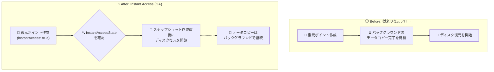

# Azure Virtual Machines: VM 復元ポイントの Instant Access が一般提供 (GA)

**リリース日**: 2026-09-24

**サービス**: Azure Virtual Machines / Azure Disk Storage

**機能**: Instant Access for VM restore points

**ステータス**: Launched (GA)

[このアップデートのインフォグラフィックを見る](https://takech9203.github.io/azure-news-summary/20260924-vm-restore-points-instant-access.html)

## 概要

VM 復元ポイント (VM restore points) の Instant Access が一般提供 (GA) になりました。対象は、Premium SSD v2 または Ultra Disk をデータディスクとして持つ仮想マシンの、アプリケーション整合性 (application-consistent) 復元ポイントです。Instant Access を有効にすると、スナップショットが作成された直後からディスクの復元を開始でき、バックグラウンドのデータレプリケーションの完了を待つ必要がなくなります。これにより、VM をオンラインに戻す際の RTO (目標復旧時間) を短縮できます。

GA では新たに、復元ポイントレベルの読み取り専用プロパティ `instantAccessState` が導入されました。プレビュー期間中は、各ディスク復元ポイントの `snapshotAccessState` を個別に確認し、復元ポイント全体が利用可能かどうかを利用者側で判断する必要がありました。GA 以降は復元ポイントレベルの 1 つのプロパティを読むだけで、復元・コピー・ダウンロードの可否を一度に判断できるため、リカバリ自動化からディスク単位のポーリングロジックを排除できます。

なお、この機能は 2026 年 6 月にプレビューが開始され、2026 年 9 月に GA となりました。

**アップデート前の課題**

- 復元ポイント作成後、ソースディスクからスナップショットへのバックグラウンドデータコピーが完全に終わるまでディスク復元を開始できず、RTO が長くなっていた
- (プレビュー時) 復元ポイント全体の利用可否を判断するには、ディスクごとの `snapshotAccessState` を個別に確認・集約する必要があり、リカバリ自動化のロジックが複雑だった

**アップデート後の改善**

- スナップショット作成直後からディスク復元を開始でき、バックグラウンドコピーの完了 (フルハイドレーション) を待たずに VM を復旧できるため、RTO を大幅に短縮できる
- 復元ポイントレベルの `instantAccessState` プロパティ 1 つで復元・コピー・ダウンロードの可否を判断でき、ディスク単位のポーリングが不要になった

## アーキテクチャ図

従来はスナップショットへのバックグラウンドデータコピーの完了を待ってから復元を開始する必要がありましたが、Instant Access ではスナップショット作成直後に復元を開始でき、GA で追加された `instantAccessState` により復元可否の判断も 1 ステップで行えます。

## サービスアップデートの詳細

### 主要機能

1. **スナップショット作成直後の復元開始**
   - 復元ポイントコレクションで `instantAccess` を `true` に設定すると、コレクション内のすべての復元ポイントで Instant Access が有効になる
   - バックグラウンドのデータコピー (ハイドレーション) の完了を待たずにディスク復元を開始でき、RTO を短縮できる

2. **`instantAccessState` プロパティの導入 (GA の新機能)**
   - 復元ポイントレベルの読み取り専用プロパティで、配下のすべてのディスク復元ポイントの状態を集約して表す
   - 復元・クロスリージョンコピー・オフラインダウンロードの可否を 1 つの値で判断でき、リカバリ自動化がシンプルになる

3. **Instant Access の有効期間の制御**
   - 復元ポイントごとに `instantAccessDurationMinutes` を設定し、Instant Access を維持する時間を制御できる (60〜300 分、既定は 300 分)

### `instantAccessState` の値

| 値 | 意味 |
|------|------|
| `Pending` | 復元・コピー・オフラインダウンロードのいずれにも使用不可 (いずれかのディスク復元ポイントが `Pending` の場合) |
| `Available` | 復元・クロスリージョンコピー・オフラインダウンロードに使用可能 (通常は `instantAccessDurationMinutes` の期限切れ後) |
| `InstantAccess` | 高速ディスク復元は可能だが、コピー・ダウンロードは不可 |
| `AvailableWithInstantAccess` | 高速ディスク復元に加え、コピー・ダウンロードも可能 |

## 技術仕様

| 項目 | 詳細 |
|------|------|
| 対象復元ポイント | アプリケーション整合性 (application-consistent) 復元ポイントのみ |
| 対象ディスク | Premium SSD v2 または Ultra Disk を**データディスク**として持つ VM |
| `instantAccess` | 復元ポイント**コレクション**に設定するブール値。`true` でコレクション内の全復元ポイントに適用。既定は `false` |
| `instantAccessDurationMinutes` | 各**復元ポイント**に設定。有効範囲 60〜300 分、既定 300 分 (5 時間) |
| `snapshotAccessState` | 個々のディスク復元ポイントの状態を示す読み取り専用プロパティ |
| `instantAccessState` | 復元ポイント全体の状態を集約した読み取り専用プロパティ (GA で追加) |
| API バージョン | 2025-04-01 以降 |
| 操作手段 | REST API、Azure SDK、Azure CLI、ARM テンプレート (Azure Portal は現時点で未対応) |

## 設定方法

### 前提条件

1. 対象 VM のデータディスクが Premium SSD v2 または Ultra Disk であること (マネージドディスクのみサポート)
2. アプリケーション整合性モードで復元ポイントを作成すること (クラッシュ整合性は非対応)
3. API バージョン 2025-04-01 以降を使用すること

### 設定手順の概要

1. 復元ポイントコレクションで `instantAccess` を `true` に設定する (コレクション内のすべての復元ポイントで Instant Access が有効になる)
2. 必要に応じて復元ポイントに `instantAccessDurationMinutes` (60〜300 分) を設定し、Instant Access の有効時間を制御する
3. 復元を実行する前に、復元ポイントの `instantAccessState` を読み取り、その値に基づいて復元・コピー・ダウンロードの可否を判断する (ディスクごとの状態集約は不要)

REST API / SDK / CLI / ARM テンプレートでの具体的な構文は [公式ドキュメント](https://learn.microsoft.com/azure/virtual-machines/virtual-machines-create-restore-points#instant-access) を参照してください。

## メリット

### ビジネス面

- 障害・オペレーションミスからの復旧時間 (RTO) を短縮でき、業務停止時間の最小化につながる
- 復元操作の課金がディスクのプロビジョニングサイズに基づく 1 回限りの料金であり、コストの予測可能性が高い

### 技術面

- スナップショット作成直後から復元を開始でき、バックグラウンドコピーの完了待ちが不要
- `instantAccessState` により復元可否の判断が 1 プロパティで完結し、DR 自動化スクリプトからディスク単位のポーリング処理を削減できる
- 復元ポイントは増分方式のため、2 回目以降は変更分のみが保存されストレージ効率が高い

## デメリット・制約事項

- Premium SSD v2 / Ultra Disk を**データディスク**に持つ VM のアプリケーション整合性復元ポイントのみが対象
- クラッシュ整合性 (crash-consistent) 復元ポイントは非対応
- サブスクリプションあたり・リージョンあたりの同時 Instant Access 復元ポイント作成は最大 50 件
- 現時点では Azure Portal からは操作できない (REST API / SDK / CLI / ARM テンプレートのみ)
- `instantAccessState` が `InstantAccess` の間は高速復元のみ可能で、コピー・ダウンロードはできない
- 復元ポイント全般の制限として、VM あたり最大 500 復元ポイント、同一 VM への同時作成不可、アプリケーション整合性の作成はターゲット VM あたり 1 時間に 3 回まで、などの制限がある

## ユースケース

### ユースケース 1: DR 自動化における RTO 短縮

**シナリオ**: Premium SSD v2 をデータディスクに持つデータベースサーバー VM に対し、定期的にアプリケーション整合性復元ポイントを作成している。障害発生時にはできるだけ早く VM を復旧したい。

**実装の考え方**:

1. 復元ポイントコレクションで `instantAccess: true` を設定して定期的に復元ポイントを作成
2. 障害発生時、リカバリ自動化スクリプトが復元ポイントの `instantAccessState` を確認
3. `InstantAccess` または `AvailableWithInstantAccess` であれば、バックグラウンドコピーの完了を待たずに即座にディスク復元 → VM 再作成を実行

**効果**: スナップショットのハイドレーション完了を待つ時間が復旧プロセスから排除され、RTO を短縮できる。また、状態確認がディスク単位から復元ポイント単位になり、自動化ロジックが簡素化される。

## 料金

Instant Access スナップショットは使用量ベースの課金モデルで、2 種類の料金が発生します。

| 項目 | 課金内容 |
|------|------|
| スナップショットストレージ料金 | Instant Access スナップショットがアクティブな間に使用した**追加ストレージ分のみ**課金。作成直後はソースディスクとデータを共有するためストレージコストは発生せず、ソースディスクのデータが変更・削除されるにつれて元データを保持する分だけ使用量が増加する (変更がなければ追加料金なし) |
| 復元操作料金 | Instant Access スナップショットからディスクを復元するたびに、復元時点のディスクの**プロビジョニングサイズ**に基づく 1 回限りの料金が発生 |

詳細は [Managed Disks の料金ページ](https://azure.microsoft.com/pricing/details/managed-disks/) を参照してください。

## 利用可能リージョン

すべてのパブリックリージョンで利用可能です。

## 関連サービス・機能

- **Azure Disk Storage (Premium SSD v2 / Ultra Disk)**: Instant Access の対象となるデータディスク種別。高パフォーマンスワークロード向けディスク
- **Instant Access Snapshots (マネージドディスク)**: 本機能の基盤となるディスクスナップショット機能。VM 復元ポイントがこれを利用して即時復元を実現
- **Azure Backup**: VM のバックアップを包括的に管理するサービス。復元ポイントはより軽量・粒度の細かいバックアップ手段として補完関係にある
- **復元ポイントのクロスリージョンコピー (プレビュー)**: `instantAccessState` が `Available` / `AvailableWithInstantAccess` の場合にコピー可能

## 参考リンク

- [インフォグラフィック](https://takech9203.github.io/azure-news-summary/20260924-vm-restore-points-instant-access.html)
- [公式アップデート情報](https://azure.microsoft.com/updates?id=572573)
- [Microsoft Learn: VM 復元ポイントの使用 (Instant Access)](https://learn.microsoft.com/azure/virtual-machines/virtual-machines-create-restore-points#instant-access)
- [Microsoft Learn: Instant Access Snapshots](https://learn.microsoft.com/azure/virtual-machines/disks-instant-access-snapshots)
- [Microsoft Learn: VM 復元ポイントのサポートマトリックス](https://learn.microsoft.com/azure/virtual-machines/concepts-restore-points)
- [料金ページ (Managed Disks)](https://azure.microsoft.com/pricing/details/managed-disks/)

## まとめ

Premium SSD v2 / Ultra Disk をデータディスクに持つ VM のアプリケーション整合性復元ポイントで、スナップショット作成直後からのディスク復元が可能になり、GA で追加された `instantAccessState` により復元可否の判断も 1 プロパティで完結するようになりました。バックアップ/DR 設計の観点では、ハイドレーション待ちが復旧プロセスから排除されることで RTO を直接短縮でき、リカバリ自動化の状態管理も大幅に簡素化されます。Premium SSD v2 / Ultra Disk を利用する高パフォーマンスワークロードの DR 手順を持つチームは、復元ポイントコレクションでの `instantAccess` 有効化と、自動化スクリプトの `instantAccessState` ベースへの移行を検討することを推奨します。なお、Portal 非対応・同時作成 50 件/サブスクリプション/リージョンなどの制約に留意してください。

---

**タグ**: Azure Virtual Machines, Azure Disk Storage, Restore Points, Instant Access, Premium SSD v2, Ultra Disk, Backup, Disaster Recovery, GA
