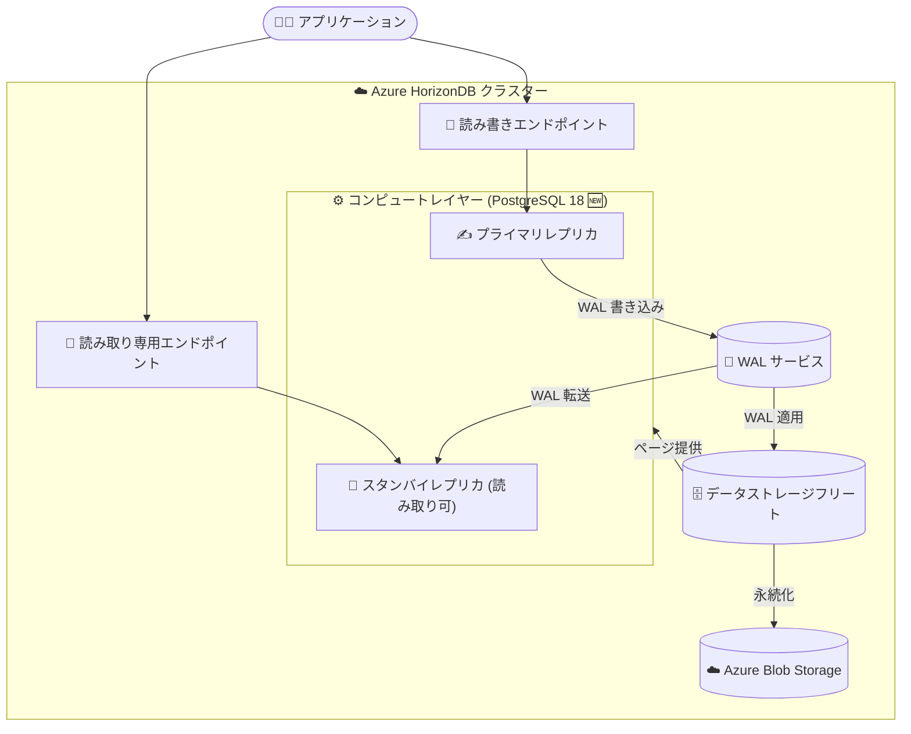

# Azure HorizonDB: PostgreSQL 18 サポート (Public Preview)

**リリース日**: 2026-09-25

**サービス**: Azure HorizonDB

**機能**: PostgreSQL 18 サポート

**ステータス**: In preview

[このアップデートのインフォグラフィックを見る](https://takech9203.github.io/azure-news-summary/20260925-horizondb-postgresql-18.html)

## 概要

Azure HorizonDB が PostgreSQL 18 のサポートを開始しました (Public Preview)。Azure HorizonDB は、フルマネージドで PostgreSQL 互換のクラウドネイティブなデータベースサービスであり、スケーラブルで高パフォーマンスなワークロード向けに設計されています。コンピュートとストレージを分離したアーキテクチャと「database-as-a-log」設計を採用し、ミッションクリティカルなワークロードに対して予測可能なパフォーマンス、エンタープライズグレードのセキュリティ、高可用性、シームレスなスケーラビリティを提供します。

今回のアップデートにより、2025 年 9 月 25 日に PostgreSQL Global Development Group からリリースされた PostgreSQL 18 を、Azure HorizonDB 上で利用できるようになりました。PostgreSQL 18 は、非同期 I/O (AIO) サブシステムによるストレージ読み取り性能の大幅な向上 (最大 3 倍)、B-tree インデックスのスキップスキャン、`uuidv7()` 関数、仮想生成列、OAuth 2.0 認証など、パフォーマンスと開発者体験の両面で大きな進化を遂げたメジャーバージョンです。

Azure HorizonDB 自体は 2026 年 6 月にプレビューとして提供が開始されたサービスであり、今回 PostgreSQL 18 サポートがプレビュー機能として追加されました。

**アップデート前の課題**

- Azure HorizonDB 上では PostgreSQL 18 が選択できず、非同期 I/O (AIO) やスキップスキャン、`uuidv7()`、仮想生成列、OAuth 2.0 認証といった PostgreSQL 18 の新機能を HorizonDB のクラウドネイティブアーキテクチャ上で利用できなかった

**アップデート後の改善**

- Azure HorizonDB で PostgreSQL 18 が利用可能になり (Public Preview)、PostgreSQL 18 の新機能をフルマネージド環境で利用できるようになった
- PostgreSQL 18 の性能改善 (非同期 I/O、スキップスキャンなど) と、HorizonDB のコンピュート・ストレージ分離アーキテクチャによるスケーラビリティを組み合わせられるようになった

## アーキテクチャ図



Azure HorizonDB はコンピュート (PostgreSQL エンジン) とストレージを完全に分離し、コンピュートからは WAL のみをストレージレイヤーに書き込む「database-as-a-log」設計を採用しています。今回のアップデートで、このコンピュートレイヤー上で PostgreSQL 18 エンジンを利用できるようになりました。

## サービスアップデートの詳細

### 主要機能

1. **PostgreSQL 18 エンジンのサポート (Public Preview)**
   - Azure HorizonDB クラスターで PostgreSQL 18 を利用可能
   - PostgreSQL 互換性が維持されるため、既存の PostgreSQL アプリケーションを移行可能

2. **PostgreSQL 18 の主な新機能 (PostgreSQL 公式リリースより)**
   - **非同期 I/O (AIO)**: 新しい I/O サブシステムにより、シーケンシャルスキャン・ビットマップヒープスキャン・VACUUM でストレージ読み取り性能が最大 3 倍向上
   - **スキップスキャン**: マルチカラム B-tree インデックスで、先頭列に等値条件がないクエリも高速化
   - **`uuidv7()` 関数**: タイムスタンプ順の UUID を生成し、インデックス性能を改善
   - **仮想生成列**: 値を保存せずクエリ時に計算する生成列 (生成列のデフォルト動作に)
   - **OAuth 2.0 認証**: SSO 連携が容易になる新しい認証方式 (`md5` パスワード認証は非推奨化)
   - **アップグレード改善**: プランナ統計情報がメジャーバージョンアップグレード後も保持され、`pg_upgrade` の並列チェック (`--jobs`) や `--swap` フラグが追加
   - **可観測性の強化**: `EXPLAIN ANALYZE` がデフォルトでバッファアクセス数を表示

## 技術仕様

| 項目 | 詳細 |
|------|------|
| サービス | Azure HorizonDB (フルマネージド、PostgreSQL 互換、クラウドネイティブ) |
| 対応エンジン | PostgreSQL 18 (Public Preview) |
| アーキテクチャ | コンピュート・ストレージ分離 + database-as-a-log 設計 |
| クラスター構成 | 1 つの書き込み可能プライマリ + 読み取り可能なスタンバイレプリカ (フェールオーバー候補) |
| エンドポイント | 読み書きエンドポイント (プライマリ向け) / 読み取り専用エンドポイント (全レプリカに負荷分散) |
| コンピュート | ステートレス。コア当たり 8 GB メモリ、ローカル NVMe SSD キャッシュ搭載 |
| ストレージ | WAL 専用フリートとデータ専用フリートの 2 系統。Azure Blob Storage で永続化。既定でゾーン冗長。データ増加に応じて自動スケール |
| 高可用性 | ゾーン回復性のあるストレージ共有により高速フェールオーバー (ゾーン回復性には 2 レプリカ以上が必要) |
| AI 機能 | ベクトル埋め込みのネイティブサポート (pgvector、DiskANN)、Azure AI Foundry Tools との統合 |
| バックアップ | Blob スナップショットベース。現在の保持期間は 7 日固定 |

## メリット

### ビジネス面

- PostgreSQL 18 の性能向上 (読み取り最大 3 倍など) をフルマネージド環境で享受でき、インフラ運用コストを抑えながら最新エンジンを活用できる
- OLTP、AI アプリケーション (RAG、セマンティック検索)、大規模読み取りスケールアウトなど、ミッションクリティカルなワークロードに最新の PostgreSQL を適用できる

### 技術面

- 非同期 I/O やスキップスキャンなどの PostgreSQL 18 の性能改善と、HorizonDB のコンピュート・ストレージ独立スケーリングを組み合わせられる
- `uuidv7()` や仮想生成列、`RETURNING` 句での `OLD`/`NEW` アクセスなど、開発者向け新機能を利用できる
- WAL 送信・アーカイブ、チェックポイント、バックアップなどの処理がストレージレイヤーにオフロードされるため、コンピュートリソースをアプリケーションのビジネスロジックに集中できる

## デメリット・制約事項

- Azure HorizonDB 自体および PostgreSQL 18 サポートはプレビュー段階であり、本番利用向けの SLA は提供されない (プレビューは非本番・テスト用途向け)
- サービス全体として以下の機能が未提供 (公式ドキュメントの制限事項より):
  - バックアップ保持期間の変更 (現在は 7 日固定、1〜35 日の設定機能を開発中)
  - リージョン間リードレプリカ (DR 用のクロスリージョンレプリケーション)
  - カスタマーマネージドキー (CMK) による暗号化 (現在はサービスマネージドキーのみ)
  - メンテナンスウィンドウのカスタマイズ (現在はシステム管理のウィンドウで実施)
  - 組み込み接続プーリング (PgBouncer) — 外部プーラーで代替可能
  - 長期保持 (LTR) バックアップ
  - インデックスチューニング
  - 仮想ネットワークインジェクション (現在は Private Link のみサポート)

## ユースケース

### ユースケース 1: 時系列順の主キーによる高スループット OLTP

**シナリオ**: e コマースや SaaS バックエンドなどの高スループットなトランザクション処理で、ランダム UUID (`uuidv4`) によるインデックス断片化が課題となっている。

**実装例**:

```sql
-- PostgreSQL 18 の uuidv7() でタイムスタンプ順の UUID を主キーに使用
CREATE TABLE orders (
    id uuid PRIMARY KEY DEFAULT uuidv7(),
    customer_id uuid NOT NULL,
    created_at timestamptz DEFAULT now()
);
```

**効果**: タイムスタンプ順に生成される UUID によりインデックスの局所性が向上し、書き込み・読み取り性能が改善される。HorizonDB のリードレプリカによる読み取りスケールアウトと組み合わせられる。

### ユースケース 2: 大量データの分析的読み取りの高速化

**シナリオ**: 大規模テーブルへのシーケンシャルスキャンやビットマップヒープスキャンが多いワークロードで、読み取りレイテンシを削減したい。

**効果**: PostgreSQL 18 の非同期 I/O (AIO) により複数の I/O リクエストを並行発行でき、ストレージ読み取りで最大 3 倍の性能向上が見込める。HorizonDB のローカル NVMe SSD キャッシュがホットページへのアクセスをさらに高速化する。

## 料金

Azure HorizonDB の課金は以下の要素で構成されます (公式ドキュメントより):

| 項目 | 課金単位 |
|------|---------|
| プロビジョニングされたコンピュート | コア時間 |
| 使用したデータベースストレージ | GB/月 |
| 短期保持期間のバックアップストレージ | 使用量 |

具体的な料金は公式ページを参照してください: [Azure HorizonDB 製品ページ](https://azure.microsoft.com/products/horizondb)

## 利用可能リージョン

Azure HorizonDB (プレビュー) は現在、以下のリージョンで利用可能です (公式ドキュメントより。リージョンは順次拡大予定):

| 地域 | リージョン |
|------|-----------|
| 南北アメリカ | Canada Central, Central US, East US, West US 2, West US 3 |
| ヨーロッパ | Germany West Central, Sweden Central |
| アジア太平洋 | Australia East, Korea Central |

## 関連サービス・機能

- **Azure Database for PostgreSQL Flexible Server**: Azure の既存のマネージド PostgreSQL サービス。HorizonDB はこれに対し、コンピュート・ストレージ分離アーキテクチャを採用したクラウドネイティブでスケーラブルな選択肢として位置づけられる
- **Azure Blob Storage**: HorizonDB のデータ永続化と WAL アーカイブの基盤。ゾーン冗長ストレージにデータを保存し、バックアップは Blob スナップショットとして実装される
- **Azure AI Foundry Tools**: HorizonDB とネイティブ統合し、ベクトル検索 (pgvector、DiskANN) と組み合わせて RAG やセマンティック検索などの AI アプリケーションを構築できる
- **Microsoft Fabric (OneLake)**: トランザクションデータを OneLake にミラーリングし、分析データと統合するハイブリッドアプリケーションを構成できる

## 参考リンク

- [インフォグラフィック](https://takech9203.github.io/azure-news-summary/20260925-horizondb-postgresql-18.html)
- [公式アップデート情報](https://azure.microsoft.com/updates?id=573048)
- [Microsoft Learn: Azure HorizonDB ドキュメント](https://learn.microsoft.com/azure/horizondb/)
- [Microsoft Learn: What is Azure HorizonDB?](https://learn.microsoft.com/azure/horizondb/overview)
- [Microsoft Learn: Azure HorizonDB リリースノート](https://learn.microsoft.com/azure/horizondb/release-notes/release-notes)
- [PostgreSQL 18 リリース発表 (PostgreSQL 公式)](https://www.postgresql.org/about/news/postgresql-18-released-3142/)
- [料金ページ (Azure HorizonDB 製品ページ)](https://azure.microsoft.com/products/horizondb)

## まとめ

Azure HorizonDB が PostgreSQL 18 をサポートしました (Public Preview)。非同期 I/O による最大 3 倍の読み取り性能向上、スキップスキャン、`uuidv7()`、OAuth 2.0 認証といった PostgreSQL 18 の新機能を、コンピュート・ストレージ分離型のクラウドネイティブなフルマネージド環境で利用できるようになります。サービス自体がまだプレビュー段階であり、CMK や VNet インジェクション、クロスリージョン DR などエンタープライズ要件に関わる機能が未提供である点には注意が必要です。PostgreSQL の次世代マネージドサービスの選択肢として、非本番環境での評価・検証を始めることを推奨します。

---

**タグ**: Azure HorizonDB, PostgreSQL 18, Databases, In preview, PostgreSQL, クラウドネイティブ
