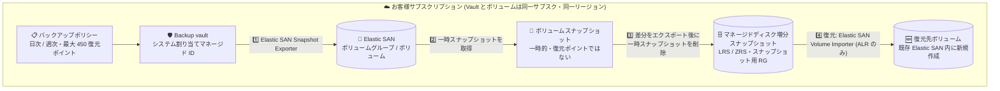

# Azure Backup: Azure Elastic SAN ボリュームのオペレーショナルバックアップが一般提供 (GA)

**リリース日**: 2026-09-28

**サービス**: Azure Backup / Azure Elastic SAN

**機能**: Azure Elastic SAN volume operational backup

**ステータス**: Launched (GA)

[このアップデートのインフォグラフィックを見る](https://takech9203.github.io/azure-news-summary/20260928-backup-elastic-san.html)

## 概要

Azure Backup による Azure Elastic SAN ボリュームの**オペレーショナルバックアップ**が一般提供 (GA) になりました。Backup vault のバックアップポリシーでスケジュールと保持期間を定義すると、Azure Backup が Elastic SAN ボリュームを**マネージドディスク増分スナップショット**としてエクスポートし、そのライフサイクル (作成・期限切れ削除) をポリシーに従って自動管理します。誤削除、ランサムウェア、アプリケーション更新による論理破損からの復旧を、スクリプトを書かずに実現できます。

このアップデートで最も重要な点は、**サポートされるのはオペレーショナル層 (operational tier) のみで、コンテナー層 (vault tier) のバックアップはサポートされない**ことです。復元ポイントであるマネージドディスク増分スナップショットは Microsoft 管理の Vault 内ではなく、**お客様自身のサブスクリプション** (既定では Elastic SAN ボリュームと同じリソースグループ、または指定したスナップショット用リソースグループ) に作成されます。その結果、Vault 層で利用できるセキュリティ機能 — 不変性 (immutability)、論理削除 (soft delete)、多要素承認 (MUA)、カスタマー管理キー (CMK) — はいずれも適用できません。オフサイトの長期保管 (vaulted backup) も現時点では非対応です。アナウンスは「ランサムウェア攻撃からの保護」を謳っていますが、保護のレベルは「Elastic SAN ボリュームのライフサイクルから独立したスナップショットを自動で世代管理できる」ところまでであり、Vault 層バックアップと同等のテナント侵害耐性はない点を設計時に織り込む必要があります。

なお本機能は 2024 年 7 月にプライベートプレビュー、2025 年 5 月にパブリックプレビューが開始され、2026 年 9 月に GA となりました。プレビュー時点では特定リージョンのみでしたが、GA では Elastic SAN が利用可能なすべての Azure パブリックリージョンで利用できます。

**アップデート前の課題**

- Elastic SAN ボリュームの保護は、Azure portal / PowerShell / Azure CLI でボリュームスナップショットを**手動作成**するか、自前でスクリプト化する必要があり、スケジュールや保持期間をポリシーとして宣言する仕組みがなかった
- Elastic SAN のボリュームスナップショットはソースボリュームを削除すると一緒に削除されるため、ドキュメントでも「durable backup ではない」と明示されており、独立して保持するには**マネージドディスクスナップショットへのエクスポートを手動で実行**する必要があった
- ボリュームスナップショットは 1 ボリュームあたり最大 200 個という上限があり、削除は 1 個ずつしか実行できないため、世代管理の運用負荷が高かった
- バックアップジョブの成否や復元ポイントの一覧を集中管理・監視する仕組みがなかった

**アップデート後の改善**

- Backup vault のバックアップポリシー (日次 / 週次、既定の保持期間 7 日、最大 450 復元ポイント) でスケジュールと保持を宣言的に定義でき、増分スナップショットのライフサイクルを Azure Backup が自動管理する
- 復元ポイントは Elastic SAN のライフサイクルから独立したマネージドディスク増分スナップショットとして保持されるため、ソースボリュームを削除してもバックアップデータが残る
- 復元は Elastic SAN の import API 経由で「既存 Elastic SAN 内の新規ボリューム」として自動実行され、**別サブスクリプションへの復元にも対応**する
- Azure portal の Resiliency center からバックアップ構成・ジョブ監視・復元を一元的に実行でき、Azure CLI (`az dataprotection`, dataprotection 拡張 1.12.0 以降) による自動化にも対応する

## アーキテクチャ図



Backup vault はマネージド ID を使って Elastic SAN ボリュームの一時スナップショットを取得し、差分をマネージドディスク増分スナップショットにエクスポートしてから一時スナップショットを削除します。復元ポイント (増分スナップショット) はお客様サブスクリプション内のスナップショット用リソースグループに置かれ、復元時はそこから既存 Elastic SAN 内の**新しいボリューム**として書き戻されます (上書きは不可)。

## サービスアップデートの詳細

### 主要機能

1. **ポリシーベースのオペレーショナルバックアップ**
   - Backup vault で「Elastic SAN volumes」をデータソース種別としたバックアップポリシーを作成し、スケジュール (日次 / 週次) と保持ルールを定義する
   - 既定のバックアップ頻度は日次 (24 時間間隔)、既定の保持期間は 7 日。保持ルール全体を通じて任意時点で最大 450 復元ポイントを保持できる
   - サポートされるバックアップ層はオペレーショナル層のみ

2. **マネージドディスク増分スナップショットへのエクスポート**
   - Azure Backup は Elastic SAN ボリュームの一時スナップショットを取得し、変更分をマネージドディスク増分スナップショットとして抽出したうえで、一時スナップショットを削除する
   - この一時的な Elastic SAN ボリュームスナップショットは復元ポイントではない
   - 生成された増分スナップショットは Elastic SAN のライフサイクルから独立し、Azure Backup がポリシーに従ってライフサイクルを管理する

3. **スナップショットの冗長性 (LRS / ZRS)**
   - ZRS をサポートするリージョンで**新規に作成したバックアップインスタンス**、かつ対象ボリュームからマネージドディスク増分スナップショットがまだエクスポートされていない場合は、既定で ZRS に格納される
   - 既存のバックアップインスタンス、および ZRS 非対応リージョンでは LRS に格納される (アナウンス本文は LRS と記載)

4. **ボリューム単位のバックアップインスタンス**
   - Azure portal ではボリュームグループでフィルタしてボリュームを選択し、複数ボリュームを 1 回のリクエストでまとめて追加できる
   - Azure Backup は選択したボリュームごとに個別のバックアップインスタンス (ボリューム + ポリシーのペア) を作成する
   - 同一ボリュームを複数のバックアップインスタンスで重複保護することはできない

5. **スナップショット格納先リソースグループの選択**
   - 既定では Elastic SAN ボリュームと同じリソースグループに復元ポイントスナップショットを格納する
   - 別のリソースグループを指定することも可能だが、Elastic SAN ボリュームとスナップショット用リソースグループは**同一サブスクリプション**である必要がある (マネージドディスク増分スナップショットの制約)

6. **復元 (ALR / クロスサブスクリプション対応)**
   - Azure Backup が増分スナップショットを読み取り、Elastic SAN の import API を使って既存 Elastic SAN インスタンス内に新しいボリュームとして復元する
   - 復元先はターゲットのサブスクリプション / リソースグループ / Elastic SAN インスタンス / ボリュームグループを選択でき、**別サブスクリプションへの復元もサポート**
   - Azure portal から増分スナップショットを使って直接マネージドディスクを作成することも可能

7. **Resiliency center と Azure CLI による運用**
   - Azure portal の **Resiliency** から保護の構成 (Configure protection)、保護ポリシー管理、復元 (Recover)、ジョブ監視を実施
   - Azure CLI は `az dataprotection` コマンド群 (`--datasource-type AzureElasticSAN`) を使用。dataprotection 拡張 1.12.0 以降が必要
   - バックアップの停止時は、バックアップデータを無期限またはポリシーどおりに保持できる。バックアップインスタンスを削除するとバックアップデータもすべて削除される

## 技術仕様

| 項目 | 詳細 |
|------|------|
| バックアップ層 | オペレーショナル層のみ (Vault 層は非対応) |
| 復元ポイントの実体 | マネージドディスク増分スナップショット (お客様サブスクリプション内) |
| スナップショットの冗長性 | ZRS (対応リージョンの新規バックアップインスタンス) または LRS |
| バックアップ頻度 | 日次 / 週次 (時間単位は非対応) |
| 既定の保持期間 | 7 日 |
| 最大復元ポイント数 | 450 (保持ルール全体の合計) |
| 対応ボリュームサイズ | 16 TB 以下 |
| バックアップ単位 | Elastic SAN ボリューム単位 (1 ボリューム = 1 バックアップインスタンス) |
| 復元の種別 | ALR (別の場所への復元) のみ。OLR は非対応 |
| 復元先 | 既存 Elastic SAN インスタンス / ボリュームグループ内の**新規**ボリューム (上書き不可) |
| クロスサブスクリプション復元 | 対応 |
| Vault とデータソースの配置 | Backup vault とバックアップ対象ボリュームは同一サブスクリプション・同一リージョン |
| オンデマンドバックアップ上限 | 1 バックアップインスタンスあたり 1 日 10 回 |
| 復元上限 | 1 バックアップインスタンスあたり 1 日 10 回 |
| 必要なロール (バックアップ) | Elastic SAN Snapshot Exporter / Disk Snapshot Contributor (スナップショット用 RG) |
| 必要なロール (復元) | Reader (スナップショット用 RG) / Elastic SAN Volume Importer |
| CLI 要件 | Azure CLI + dataprotection 拡張 1.12.0 以降、`--datasource-type AzureElasticSAN` |

## 設定方法

### 前提条件

1. 既存の Elastic SAN ボリューム (サイズ 16 TB 以下)、またはサポートリージョンで新規作成したボリューム
2. Elastic SAN ボリュームと**同一サブスクリプション・同一リージョン**の Backup vault
3. データソース種別「Elastic SAN volumes」のバックアップポリシー
4. Backup vault のシステム割り当てマネージド ID に必要なロールを付与 (バックアップ: Elastic SAN Snapshot Exporter + Disk Snapshot Contributor、復元: Reader + Elastic SAN Volume Importer)。ロール付与を portal から実行するには **Role-Based Access Control Administrator** 権限が必要
5. Azure CLI を使う場合は dataprotection 拡張 1.12.0 以降
6. スナップショット用リソースグループに **Delete Lock** が設定されていないこと (設定されているとスナップショットの削除ができない)

### Azure CLI

```bash
# dataprotection 拡張のインストール / 更新
az extension add --name dataprotection --upgrade

# 変数の設定
sub="<subscription_id>"
rg="<resource_group>"
vault="<backup_vault_name>"
policyName="<esan_policy_name>"
location="<region>"
esanName="<elastic_san_name>"
vgName="<volume_group_name>"
volume="<volume_name>"

vgId="/subscriptions/$sub/resourceGroups/$rg/providers/Microsoft.ElasticSan/elasticSans/$esanName/volumeGroups/$vgName"

# 1. 既定のポリシーテンプレートを生成してポリシーを作成
az dataprotection backup-policy get-default-policy-template \
    --datasource-type AzureElasticSAN \
    > esan_policy.json

az dataprotection backup-policy create \
    --resource-group $rg \
    --vault-name $vault \
    --name $policyName \
    --policy esan_policy.json

policyId=$(az dataprotection backup-policy show \
    --resource-group $rg --vault-name $vault --name $policyName \
    --query id --output tsv)

# 2. バックアップ構成 (対象ボリュームの指定) を作成
az dataprotection backup-instance initialize-backupconfig \
    --datasource-type AzureElasticSAN \
    --resource-selectors $volume \
    > esan_backup_config.json

# 3. バックアップインスタンスを初期化 (データソースはボリュームグループ)
az dataprotection backup-instance initialize \
    --datasource-type AzureElasticSAN \
    --datasource-location $location \
    --datasource-id $vgId \
    --policy-id $policyId \
    --friendly-name esan-bi \
    --backup-configuration @esan_backup_config.json \
    > esan_backup_instance.json

# 4. Backup vault のマネージド ID に必要なロールを付与
az dataprotection backup-instance update-msi-permissions \
    --datasource-type AzureElasticSAN \
    --operation Backup \
    --permissions-scope Resource \
    --resource-group $rg \
    --vault-name $vault \
    --backup-instance @esan_backup_instance.json \
    --yes

# 5. バックアップ準備状況を検証
az dataprotection backup-instance validate-for-backup \
    --resource-group $rg \
    --vault-name $vault \
    --backup-instance @esan_backup_instance.json

# 6. 保護を有効化
az dataprotection backup-instance create \
    --resource-group $rg \
    --vault-name $vault \
    --backup-instance @esan_backup_instance.json
```

復元は以下のコマンドで実行します。

```bash
restoreVol="<restored_volume_name>"
snapshotRgId="/subscriptions/$sub/resourceGroups/$rg"

# バックアップインスタンスと復元ポイントを解決
biName=$(az dataprotection backup-instance list \
    --resource-group $rg --vault-name $vault \
    --query "[?contains(properties.friendlyName, 'esan-bi')].name | [0]" --output tsv)

rpId=$(az dataprotection recovery-point list \
    --resource-group $rg --vault-name $vault --backup-instance-name $biName \
    --query "[0].name" --output tsv)

# 復元構成を作成 (復元先ボリューム名を指定)
az dataprotection backup-instance initialize-restoreconfig \
    --datasource-type AzureElasticSAN \
    --resource-identifiers $volume \
    --resource-name-overrides "{\"$volume\":\"$restoreVol\"}" \
    > esan_restore_config.json

# 復元リクエストを初期化 (ソースはオペレーショナル層)
az dataprotection backup-instance restore initialize-for-item-recovery \
    --datasource-type AzureElasticSAN \
    --source-datastore OperationalStore \
    --restore-location $location \
    --recovery-point-id $rpId \
    --target-resource-id $vgId \
    --restore-configuration @esan_restore_config.json \
    > esan_restore_request.json

# 復元用のロールを付与し、検証して復元を実行
az dataprotection backup-instance update-msi-permissions \
    --datasource-type AzureElasticSAN --operation Restore \
    --permissions-scope Resource --resource-group $rg --vault-name $vault \
    --restore-request-object @esan_restore_request.json \
    --snapshot-resource-group-id $snapshotRgId --yes

az dataprotection backup-instance validate-for-restore \
    --resource-group $rg --vault-name $vault \
    --backup-instance-name $biName \
    --restore-request-object @esan_restore_request.json

az dataprotection backup-instance restore trigger \
    --resource-group $rg --vault-name $vault \
    --backup-instance-name $biName \
    --restore-request-object @esan_restore_request.json
```

### Azure Portal

**バックアップポリシーの作成**

1. Azure portal で **Resiliency** > **Protection policies** を開く
2. **+ Create Policy** > **Create Backup Policy** を選択
3. **Basics** タブでポリシー名を入力し、データソース種別に **Elastic SAN volumes** を選択
4. **Schedule + retention** タブでバックアップスケジュール (Daily が既定、Weekly も選択可) を設定
5. **Retention settings** で既定の保持ルール (7 日) を編集、または保持ルールを追加
6. **Review + create** > **Create**

**バックアップの構成**

1. **Resiliency** > **+ Configure protection** を選択
2. **Resource managed by** = Azure、**Datasource type** = Elastic SAN volumes、**Solution** = Azure Backup を選択して **Continue**
3. **Vault** で Backup vault を選択 (Vault はシステム割り当てマネージド ID でスナップショットを作成・管理)
4. **Backup policy** タブで作成済みポリシーを選択
5. **Datasources** タブで **Add** から Elastic SAN インスタンスを選択 (Vault と同一サブスクリプション・同一リージョンのインスタンスのみ表示)
6. **Add backup instance** で **Volume group** でフィルタし、対象ボリュームを選択。必要ならスナップショット格納先リソースグループを変更する
7. バックアップ準備状況の検証でロール不足が出た場合は **Assign missing roles** で付与し、**Revalidate**
8. **Review + configure** > **Configure Backup**

**復元**

1. **Resiliency** > **Recover** を開き、**Datasource type** = Elastic SAN volumes、保護対象アイテムを選択
2. **Restore point** タブで復元ポイントを選択
3. **Restore parameters** タブで復元先のサブスクリプション / リソースグループ / Elastic SAN インスタンス / ボリュームグループ、および新しいボリューム名を指定
4. **Validate** で権限を検証 (不足時は **Assign missing roles**)
5. **Review + restore** > **Restore**

## メリット

### ビジネス面

- Azure Backup の保護インスタンス料金が発生せず、課金はマネージドディスク増分スナップショットのストレージ料金のみ。増分スナップショットは前回からの差分に対して課金されるため、ミッションクリティカルなブロックストレージの保護コストを抑えやすい
- 誤削除、ランサムウェア、アプリケーション更新による論理破損からの復旧手段を、独自スクリプトの開発・保守なしに整備できる
- Resiliency center でバックアップ構成・ジョブ・復元を一元的に可視化でき、保護状況のレポーティングが容易になる
- Elastic SAN が利用可能なすべての Azure パブリックリージョンで利用でき、リージョン制約を理由にした設計分岐が不要

### 技術面

- スケジュールと保持を宣言的なポリシーとして管理でき、最大 450 復元ポイントの世代管理を Azure Backup に任せられる (手動スナップショットの 1 ボリューム 200 個上限・1 件ずつ削除という運用制約から脱却)
- 復元ポイントが Elastic SAN のライフサイクルから独立するため、ソースボリューム削除後もデータが残る
- ZRS 対応リージョンの新規バックアップインスタンスでは既定で ZRS に格納され、単一ゾーン障害に対する耐性が得られる
- 別サブスクリプションへの復元に対応しており、本番データを非本番サブスクリプションに書き戻す検証フローを構成できる
- `az dataprotection` による完全な CLI 対応で、IaC / CI/CD パイプラインへ組み込める
- マネージドディスク増分スナップショットから Azure portal で直接マネージドディスクを作成でき、Elastic SAN 以外への取り出し経路もある

## デメリット・制約事項

- **オペレーショナル層のみのサポート。復元ポイント (マネージドディスク増分スナップショット) はお客様自身のサブスクリプション内に格納される。** そのため Vault 層バックアップで利用できる**不変性 (immutability)、論理削除 (soft delete)、多要素承認 (MUA)、カスタマー管理キー (CMK) はいずれも利用できない**。テナントが侵害された場合や、スナップショット用リソースグループへの書き込み権限を持つ悪意ある管理者に対しては、バックアップデータそのものが削除・改変されるリスクが残る。アナウンスの「ランサムウェア保護」は、ソースボリュームと独立した世代を自動管理できるレベルの保護と理解し、テナント侵害を想定するなら別手段 (例: 増分スナップショットからマネージドディスクを作成して Vault 層で保護されるワークロードに取り込む、など) を併用した多層防御を設計すること
- **長期のオフサイト保管 (vaulted backup) は非対応**。長期保持やコンプライアンス目的の Vault 層保管はできない
- **時間単位 (hourly) のバックアップは非対応**。日次 / 週次のみで、既定のバックアップ頻度は 24 時間。RPO は最短でも 1 日単位となる
- **OLR (元の場所への復元) は非対応で ALR のみ**。復元は必ず新しいボリュームとして作成され、既存ボリュームの上書きはできない。同名ボリュームが存在すると復元は失敗する。また Elastic SAN のボリューム名は一度割り当てると変更できないため、本番ボリュームへの切り戻しはアプリ側の接続先 (iSCSI) 変更を伴う運用手順として設計する必要がある
- ボリュームサイズは **16 TB 以下**に限定される
- Backup vault とバックアップ対象ボリュームは同一サブスクリプション・同一リージョンである必要があり、中央の Vault で複数サブスクリプションを横断保護する構成は取れない (復元先は別サブスクリプション可)
- Elastic SAN ボリュームとスナップショット用リソースグループも同一サブスクリプションでなければならない (マネージドディスク増分スナップショットの制約により、サブスクリプション外への増分スナップショット作成は不可)
- 同一ボリュームを複数のバックアップインスタンスで重複保護できない
- スナップショット用リソースグループに **Delete Lock** が設定されていると、ポリシーによるスナップショット削除ができず機能が正常に動作しない
- リージョン / サブスクリプションあたりのディスクスナップショット総数に Azure のサブスクリプション制限が適用されるため、多数のボリューム × 多世代を保持する設計ではクォータを事前に確認する必要がある
- オンデマンドバックアップ・復元はいずれも 1 バックアップインスタンスあたり 1 日 10 回が上限
- バックアップインスタンスを削除するとバックアップデータもすべて削除される
- ロールは **Elastic SAN Snapshot Exporter / Disk Snapshot Contributor / Reader / Elastic SAN Volume Importer** を使う必要があり、**Owner など他のロールはサポートされず権限エラーの原因になる**。ロール割り当ては反映に数分かかる
- アプリケーション整合性について: Elastic SAN のドキュメントでは、実行中の VM に対して取得したボリュームスナップショットは crash-consistent にとどまる可能性があり、複数ボリュームにまたがる整合性を得るには freeze / flush (Windows の VSS、Linux の fsfreeze) によるアプリ側の協調が必要と記載されている。Azure Backup for Elastic SAN のドキュメントにアプリケーション整合性の取得に関する記述はないため、データベースなどの整合性要件があるワークロードでは別途検証が必要

## ユースケース

### ユースケース 1: iSCSI 接続ワークロードの日次バックアップと誤削除からの復旧

**シナリオ**: Azure VM / Azure VMware Solution / AKS から iSCSI で Elastic SAN ボリュームを利用しているワークロードに対し、日次のオペレーショナルバックアップを構成する。ボリュームの誤削除やアプリケーション更新による論理破損が起きた際に、任意の復元ポイントから新しいボリュームを作成して切り替える。

**実装例**:

```bash
# 日次スケジュール・保持 30 日のポリシーを作成し、ボリュームグループ配下の対象ボリュームを保護
az dataprotection backup-policy get-default-policy-template \
    --datasource-type AzureElasticSAN > esan_policy.json
# esan_policy.json のスケジュール / 保持ルールを要件に合わせて編集 (日次 or 週次、最大 450 復元ポイント)
az dataprotection backup-policy create \
    --resource-group $rg --vault-name $vault --name daily-30d --policy esan_policy.json

# 障害発生時: 復元ポイントから新規ボリュームとして復元 (ALR)
az dataprotection backup-instance restore trigger \
    --resource-group $rg --vault-name $vault \
    --backup-instance-name $biName \
    --restore-request-object @esan_restore_request.json
```

**効果**: 手動スナップショットとエクスポートスクリプトの運用を廃止し、最大 450 世代の復元ポイントをポリシーで自動管理できる。復元後は新ボリュームへ iSCSI 接続先を切り替えることで復旧する。

### ユースケース 2: 本番ボリュームのコピーを別サブスクリプションに復元して検証環境を構築

**シナリオ**: 本番 Elastic SAN ボリュームの復元ポイントを、非本番サブスクリプションの Elastic SAN インスタンスに新規ボリュームとして復元し、パッチ検証やデータ分析、リストア訓練に利用する。ALR とクロスサブスクリプション復元の組み合わせで実現できる。

**実装例**:

```bash
# 復元先を非本番サブスクリプションのボリュームグループに向ける
targetVgId="/subscriptions/<nonprod_sub>/resourceGroups/<nonprod_rg>/providers/Microsoft.ElasticSan/elasticSans/<nonprod_esan>/volumeGroups/<nonprod_vg>"

az dataprotection backup-instance restore initialize-for-item-recovery \
    --datasource-type AzureElasticSAN \
    --source-datastore OperationalStore \
    --restore-location $location \
    --recovery-point-id $rpId \
    --target-resource-id $targetVgId \
    --restore-configuration @esan_restore_config.json \
    > esan_restore_request.json
```

**効果**: 本番ボリュームに触れずに同一時点のデータを非本番環境へ払い出せる。復元は既存ボリュームを上書きしないため、本番データへの影響なしにリストア手順の訓練 (1 バックアップインスタンスあたり 1 日 10 回まで) を実施できる。

## 料金

Azure Elastic SAN ボリュームのオペレーショナルバックアップでは、**Azure Backup の保護インスタンス料金 (protected instance fee) は発生しません**。課金されるのは、オペレーショナル層に格納される**マネージドディスク増分スナップショットのストレージ料金のみ**で、通常のマネージドディスク料金体系が適用されます。増分スナップショットは前回スナップショットからの差分に対して課金されます (例: 128 GB のディスクで 10 GB が使用済みの場合、初回スナップショットは 10 GB 分の課金)。

なお、Azure Backup が作成する Elastic SAN ボリュームスナップショットは一時的なもので、差分のエクスポート後に削除されます。Elastic SAN のボリュームスナップショット自体には個別の課金はありませんが、保持されている間は Elastic SAN の容量を消費します。

以下は参考として、マネージドディスク増分スナップショットの格納先となる Standard HDD マネージドディスクスナップショットの料金です (Azure Retail Prices API、東日本リージョン、2026-09-28 時点)。

| 項目 | 料金 |
|------|------|
| Azure Backup 保護インスタンス料金 | なし (発生しない) |
| Standard HDD マネージドディスク スナップショット (LRS) | 0.05 USD / GB / 月 |
| Standard HDD マネージドディスク スナップショット (ZRS) | 0.05 USD / GB / 月 |
| Elastic SAN ボリュームスナップショット (一時的) | 個別課金なし (保持中は Elastic SAN の容量を消費) |

実際に適用される単価はリージョン・通貨・スナップショットの格納先ストレージ種別により異なります。正確な金額は Azure 料金計算ツールおよび下記の料金ページで確認してください。

## 利用可能リージョン

Elastic SAN がサポートされる**すべての Azure パブリックリージョン**で利用できます。プレビュー時点では特定リージョンに限定されていましたが、GA によりリージョン制約が解消されました。

## 関連サービス・機能

- **Azure Elastic SAN**: バックアップ対象そのもの。Elastic SAN > ボリュームグループ > ボリュームという階層構造を持ち、バックアップインスタンスはボリューム単位で作成される。復元先も既存 Elastic SAN インスタンスのボリュームグループ内となる
- **Backup vault**: バックアップポリシーとバックアップインスタンスを保持する制御プレーン。システム割り当てマネージド ID でスナップショットの作成・管理・インポートを実行する。Elastic SAN ボリュームと同一サブスクリプション・同一リージョンに配置する必要がある
- **Azure Managed Disks (増分スナップショット)**: 復元ポイントの実体。マネージドディスク増分スナップショットとしてお客様サブスクリプション内に格納され、課金もマネージドディスクスナップショットの料金体系に従う。ここからマネージドディスクを直接作成することもできる
- **Resiliency center (Azure portal)**: 保護の構成、保護ポリシーの管理、復元、バックアップジョブ / 復元ジョブの監視を行う入口
- **Azure Kubernetes Service / Azure VMware Solution / Azure Virtual Machines**: Elastic SAN ボリュームを iSCSI で消費するコンピュート。これらのワークロードのブロックストレージがバックアップ対象になる
- **Azure RBAC**: Elastic SAN Snapshot Exporter、Disk Snapshot Contributor、Elastic SAN Volume Importer、Reader の各ロールを Backup vault のマネージド ID に付与する必要がある。Owner などの他ロールはサポートされない
- **Azure Resource Manager のリソースロック**: スナップショット用リソースグループの Delete Lock はポリシーによるスナップショット削除を妨げるため、設定状況を確認・調整する必要がある

## 参考リンク

- [インフォグラフィック](https://takech9203.github.io/azure-news-summary/20260928-backup-elastic-san.html)
- [公式アップデート情報](https://azure.microsoft.com/updates?id=494438)
- [About Azure Elastic SAN volume operational backup](https://learn.microsoft.com/en-us/azure/backup/azure-elastic-san-backup-overview)
- [Support matrix for Azure Elastic SAN volume operational backup](https://learn.microsoft.com/en-us/azure/backup/azure-elastic-san-backup-support-matrix)
- [Quickstart: Create an operational backup policy for Azure Elastic SAN volume](https://learn.microsoft.com/en-us/azure/backup/azure-elastic-san-backup-quickstart)
- [Configure operational backup for Azure Elastic SAN volume](https://learn.microsoft.com/en-us/azure/backup/azure-elastic-san-backup-configure)
- [Restore Azure Elastic SAN volume backup](https://learn.microsoft.com/en-us/azure/backup/azure-elastic-san-backup-restore)
- [Manage Azure Elastic SAN volume backups](https://learn.microsoft.com/en-us/azure/backup/azure-elastic-san-backup-manage)
- [What's new in the Azure Backup service](https://learn.microsoft.com/en-us/azure/backup/whats-new#operational-backup-support-for-azure-elastic-san-volume-is-now-generally-available)
- [Backup Azure Elastic SAN volumes (ボリュームスナップショット / エクスポート)](https://learn.microsoft.com/en-us/azure/storage/elastic-san/elastic-san-snapshots)
- [Azure Backup の料金](https://azure.microsoft.com/pricing/details/backup/)
- [Azure Managed Disks の料金](https://azure.microsoft.com/pricing/details/managed-disks/)

## まとめ

Azure Elastic SAN ボリュームのオペレーショナルバックアップが GA し、Elastic SAN が利用可能なすべての Azure パブリックリージョンで、ポリシーベースの世代管理 (日次 / 週次、最大 450 復元ポイント、16 TB 以下のボリューム) が使えるようになりました。これまで手動のボリュームスナップショット取得とマネージドディスクスナップショットへのエクスポートをスクリプトで組んでいた運用は、Backup vault のポリシーに置き換えられます。Azure Backup の保護インスタンス料金が発生せず、課金が増分スナップショットのストレージのみという点もコスト面で扱いやすいポイントです。

一方で Solutions Architect として押さえるべき最大の論点は、**これがオペレーショナル層のみのバックアップであり、復元ポイントはお客様サブスクリプション内のマネージドディスク増分スナップショットとして存在する**という点です。不変性・論理削除・MUA・CMK は適用できず、Vault 層の長期オフサイト保管も非対応です。テナント侵害や特権アカウント乗っ取りを脅威モデルに含める場合、この機能単体でランサムウェア対策が完結したとは言えません。

推奨される次のアクション:

1. 保護対象の Elastic SAN ボリュームを棚卸しし、16 TB 以下という制約と、日次 / 週次という RPO でビジネス要件を満たせるかを確認する
2. スナップショット用リソースグループを本体と分離して設計し、そこへの書き込み・削除権限を最小化する (Delete Lock はポリシー動作を妨げるため使用不可であることに注意)
3. 復元が ALR のみ・上書き不可であることを前提に、復旧手順 (新ボリューム作成後の iSCSI 接続先切り替え) をランブックとして整備し、クロスサブスクリプション復元を使ったリストア訓練を組み込む
4. Vault 層相当の保護が必要な要件については、別手段との併用による多層防御を検討する
5. 多数のボリューム × 多世代を保持する場合、リージョン / サブスクリプションあたりのディスクスナップショット数のクォータを事前に確認する

---

**タグ**: Azure Backup, Azure Elastic SAN, オペレーショナルバックアップ, マネージドディスク増分スナップショット, Backup vault, Resiliency center, ランサムウェア対策, ストレージ, GA, データ保護
