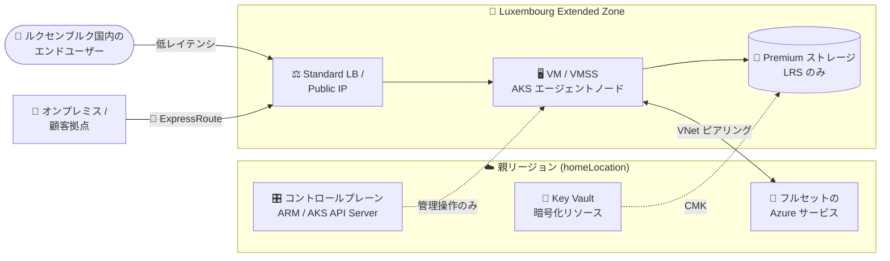

# Azure Extended Zones: Luxembourg Extended Zone の一般提供開始

**リリース日**: 2026-09-28

**サービス**: Azure Extended Zones

**機能**: Luxembourg Azure Extended Zone

**ステータス**: Launched (GA)

[このアップデートのインフォグラフィックを見る](https://takech9203.github.io/azure-news-summary/20260928-extended-zones-luxembourg.html)

## 概要

Microsoft は 2026 年 9 月、**Luxembourg (ルクセンブルク) の Azure Extended Zone** の一般提供 (GA) を発表した。Azure Extended Zones は、メトロエリア・産業集積地・特定の法的管轄区域に配置される「小規模フットプリントの Azure 拡張」であり、低レイテンシ要件とデータレジデンシー要件を持つワークロードを対象としている。

アーキテクチャ上の最大の特徴は、**コントロールプレーンは親リージョン (parent region / `homeLocation`) に残り、データプレーンのみが Extended Zone サイトに配置される**点である。これにより Azure のフットプリントを小さく保ちながら、Azure Portal・ARM・Azure CLI・Azure Policy といった通常の Azure 管理体験をそのまま利用できる。リソースの指定方法も通常のリージョンデプロイとほぼ同じで、`location` に親リージョンを、`extendedLocation` (CLI では `--edge-zone`) に Extended Zone 名を指定する形になる。

Solutions Architect にとって本アップデートが重要なのは、**ルクセンブルクという管轄区域内にデータを留めたまま Azure のサービス群を利用できる選択肢が初めて公式に増えた**という点である。ルクセンブルクは金融セクター (CSSF 規制下のファンド管理、プライベートバンキング) の集積地であり、「EU 内」ではなく「ルクセンブルク国内」というレベルでのデータ所在地要件が現実的に発生する領域である。同時に、メディア編集や制作ワークフローのようなレイテンシ敏感なリモートデスクトップ系ワークロードも対象シナリオとして公式ドキュメントに挙げられている。

ただし Extended Zone は **Azure サービスのサブセットのみ** を提供する。リージョンと同等のサービスパリティは存在しないため、アーキテクチャ設計時には「Extended Zone に置くもの / 親リージョンに置くもの」の切り分けが必須となる。

**アップデート前の課題**

- ルクセンブルク国内へのデータ所在地要件を持つワークロードは、Azure 上では West Europe や France Central といった「EU 内の親リージョン」に配置するしかなく、国単位のデータレジデンシー要件を Azure ネイティブに満たせなかった (Extended Zones の FAQ が示すとおり、Extended Zone がない場合、顧客データは関連するリージョン / ジオグラフィ内に保存・処理される)
- ルクセンブルク周辺のエンドユーザーに対して極めて低いレイテンシを求める場合、既存の Azure リージョンとの物理距離がそのままレイテンシ下限となり、オンプレミス / ローカルデータセンターでの自前運用に頼る必要があった
- 自前運用に倒すと、Azure の管理面 (Portal、ARM、Azure Policy、Azure Backup、予約インスタンス) の恩恵を受けられず、運用モデルが分断していた

**アップデート後の改善**

- ルクセンブルクの Extended Zone にデータプレーンを配置することで、**顧客データを Extended Zone のロケーション内で保存・処理**できるようになった (FAQ: "Customer data is stored and processed in the extended zone location")
- VM / VM Scale Sets / AKS (public / private クラスターとも GA) / Premium ストレージ / VNet / Standard Load Balancer / ExpressRoute / Private Link などを、ルクセンブルク内のロケーションを対象にデプロイ可能になった
- コントロールプレーンは親リージョンに残るため、**既存の Azure 運用ツールチェーン (Portal / ARM テンプレート / Terraform / Azure CLI / Azure Policy) をそのまま流用**できる。親リージョンで作成した NSG や UDR も Extended Zone のリソースに適用できる
- 課金体験は通常の Azure と一貫しており、EA 割引・Azure Consumption Discount・予約インスタンス・Savings Plan がいずれも適用対象となる

## アーキテクチャ図



管理操作 (プロビジョニング、AKS API Server、Key Vault の暗号化リソース) は親リージョンで処理され、実際のワークロードと顧客データは Luxembourg Extended Zone 内のデータプレーンに留まる。エンドユーザーおよびオンプレミス拠点からは Extended Zone のエンドポイントに直接接続することで、親リージョンまでのラウンドトリップを回避できる。

## サービスアップデートの詳細

### 主要機能

1. **データレジデンシー境界としての Extended Zone**
   - Extended Zone にデプロイしたリソースの顧客データは、Extended Zone のロケーションで保存・処理される
   - 公式 FAQ では「Extended Zone は同一国・地域、あるいは異なる国・地域の親リージョンに関連付けられる場合がある」「親リージョンが同一国・地域にある Extended Zone では、顧客データは関連ジオグラフィ内に留まる」と説明されている。ルクセンブルクの親リージョンが具体的にどのリージョンかは公開ドキュメントには記載がないため、設計時に必ず後述の CLI で `homeLocation` を確認すること

2. **低レイテンシ / スループット集中型ワークロードの実行**
   - 公式ドキュメントが挙げる代表シナリオはメディア編集ソフトウェアのようなリモート実行型・レイテンシ敏感アプリケーション
   - Extended Zone は Microsoft グローバルネットワークの一部として、親リージョンとの間に高帯域かつセキュアな接続性を持つ

3. **コントロールプレーン / データプレーン分離モデル**
   - 「コントロールプレーンはリージョンに残り、データプレーンが Extended Zone サイトにデプロイされる」というモデルにより、小さなフットプリントで Azure サービスを提供する
   - AKS では、クラスターのコントロールプレーンが最寄りの Azure リージョンに作成され、エージェントノードとノードプールが Extended Zone に配置される

4. **利用可能な Azure サービス (サブセット)**
   - Compute: Azure Virtual Machines (汎用 A / B / D / E / F シリーズ、GPU は NVadsA10 v5 シリーズ)、VM Scale Sets、AKS (public / private クラスターとも GA)、Azure Virtual Desktop (Extended Zones ではプレビュー)
   - Networking: Virtual Network、VNet ピアリング、Standard Load Balancer、Standard Public IP、ExpressRoute、Private Link、DDoS Protection (Standard)、Azure Firewall
   - Storage: Managed Disks (Premium SSD / Standard SSD)、Premium ページ Blob、Premium ブロック Blob、Premium Files、Data Lake Storage Gen2 (階層 / フラット名前空間)、SFTP、NFS
   - BCDR: Azure Backup、Azure Site Recovery (Extended Zone → 親リージョン、Extended Zones ではプレビュー)
   - Arc 対応 PaaS: Azure Container Apps、Azure SQL Managed Instance (いずれも Extended Zones ではプレビュー)
   - その他: Azure Key Vault (暗号化リソースは親リージョンに置き、Extended Zone を対象にする)、Azure Policy、予約インスタンス、Savings Plan
   - サードパーティ: Aviatrix (Cloud Native Security Fabric)、Check Point / Fortinet (Firewall)、HPE Aruba Networking (EdgeConnect SD-WAN)

## 技術仕様

| 項目 | 詳細 |
|------|------|
| リソースプロバイダー | `Microsoft.EdgeZones` (サブスクリプションへの登録が必要) |
| Extended Zone の指定方法 | ARM / Bicep: `extendedLocation: { name: "<extended-zone-name>", type: "EdgeZone" }` / Azure CLI: `--edge-zone` |
| `location` パラメーター | Extended Zone の**親リージョン**を指定する (Extended Zone 名ではない) |
| 親リージョンの確認方法 | `az edge-zones extended-zone list` の `homeLocation` プロパティ。ほかに `displayName`、`regionalDisplayName`、`geography`、`geographyGroup`、`latitude`、`longitude`、`registrationState` が取得できる |
| アクセス方式 | サブスクリプション単位の明示的な登録 + 承認。サブスクリプション所有者アカウントかつ課金可能 (billable) アカウントが必須 |
| 登録ステート | `NotRegistered` → `PendingRegister` → `Registered` (承認後)。`Registered` になるまで利用不可 |
| Azure CLI 要件 | `edgezones` 拡張 (Azure CLI 2.57.0 以降)。VM デプロイ自体は CLI 2.26 以降 |
| Azure PowerShell 要件 | `Az.EdgeZones` モジュール 0.1.0 以降 |
| ストレージ アカウント | Performance は **Premium のみ**、冗長性は **LRS のみ** |
| AKS ノード上限 | ノードプールあたり最大 100 ノード (オートスケールも 100 ノードまで)。全 Extended Zone 共通 |
| AKS 前提バージョン | Kubernetes 1.24 以降 |
| Public IP | 親リージョンと同じアドレス空間を使用するが、Extended Zone 内のリソースに割り当てられた場合は Extended Zone としてタグ付けされる |
| NSG / UDR | 親リージョンで作成した NSG および UDR を利用可能 |
| Marketplace | Extended Zone は通常の Azure と同じ Marketplace を共有する |

## 設定方法

### 前提条件

1. 課金可能 (billable) な Azure サブスクリプションと、サブスクリプション所有者権限を持つアカウント
2. `Microsoft.EdgeZones` リソースプロバイダーの登録 (既定では有効化されていない)
3. Azure CLI 2.57.0 以降 + `edgezones` 拡張、または Azure PowerShell の `Az.EdgeZones` 0.1.0 以降
4. 対象 Extended Zone への登録申請と Microsoft による承認 (`registrationState` が `Registered` になること)

### Azure CLI

```bash
# 1. 対象サブスクリプションを選択
az account set --subscription '<subscription-id>'

# 2. Microsoft.EdgeZones リソースプロバイダーを登録
az provider register --namespace 'Microsoft.EdgeZones'

# 3. 登録ステートが Registered になるまで確認
#    PendingRegister のままでは Extended Zone の show/list/register/unregister が失敗する
az provider show --namespace 'Microsoft.EdgeZones'

# 4. サブスクリプションで利用可能な Extended Zone の一覧を取得
#    ここで Luxembourg の正式な Extended Zone 名と親リージョン (homeLocation) を確認する
az edge-zones extended-zone list

# 5. Extended Zone への登録を申請 (<luxembourg-zone-name> は手順 4 で確認した名前)
az edge-zones extended-zone register --extended-zone-name '<luxembourg-zone-name>'

# 6. 承認されると registrationState が Registered になる
az edge-zones extended-zone show --extended-zone-name '<luxembourg-zone-name>'
```

承認後、VM のデプロイは `location` に親リージョン、`--edge-zone` に Extended Zone 名を指定する。

```bash
# 親リージョンにリソースグループを作成
az group create --name 'myResourceGroup' --location '<parent-region>'

# Extended Zone に VM をデプロイ
az vm create \
  --resource-group myResourceGroup \
  --name myVMName \
  --image Win2022Datacenter \
  --size Standard_DS4_v2 \
  --edge-zone '<luxembourg-zone-name>' \
  --location '<parent-region>'
```

AKS クラスターも同様に `--edge-zone` で指定する。

```bash
# public クラスター
az aks create \
  --resource-group $RG_NAME \
  --name $CLUSTER_NAME \
  --edge-zone $EXTENDED_ZONE_NAME \
  --location $LOCATION \
  --generate-ssh-keys

# private クラスター (どちらも Extended Zones で GA)
az aks create \
  --resource-group $RG_NAME \
  --name $CLUSTER_NAME \
  --edge-zone $EXTENDED_ZONE_NAME \
  --location $LOCATION \
  --enable-private-cluster \
  --generate-ssh-keys
```

### Azure Portal

ストレージ アカウント作成を例にすると、**[基本] タブの [リージョン]** で対象 Extended Zone の親リージョン (`homeLocation`) を選択し、**[Azure Extended Zone にデプロイする]** を選択する。続いて [Azure Extended Zones] の下から該当の Extended Zone を選び、[選択] をクリックする。選択したリージョンにペアリングされた Extended Zone が存在しない場合、Extended Zone のロケーションは選択できない。

Extended Zone にストレージ アカウントを作成する場合、**[パフォーマンス] は Premium のみ**、**[冗長性] は LRS のみ**が選択可能である。

VM についても、Extended Zones 専用の VM 作成ポータル体験からデプロイする。

## メリット

### ビジネス面

- ルクセンブルクという管轄区域を意識したデータ所在地要件に対し、Azure ネイティブな回答を提示できる。オンプレミス / ローカルホスティングという選択肢に対する説得力のある代替案になる
- 課金体験が通常の Azure と一貫しており、既存の EA 割引・Azure Consumption Discount がリージョンに依存せず適用される。予約インスタンスと Savings Plan も購入可能なため、定常ワークロードのコスト最適化手段が維持される
- Extended Zone 内のリソースを Azure Portal と既存の Azure ツールから管理できるため、ローカルデータセンター運用に比べて運用組織を分ける必要がない

### 技術面

- コントロールプレーン / データプレーン分離により、IaC (ARM / Bicep / Terraform) の資産をほぼそのまま再利用できる。差分は `extendedLocation` / `--edge-zone` の指定だけに閉じる
- 親リージョンで作成した NSG と UDR を Extended Zone のリソースに適用できるため、既存のネットワークガバナンスを継承できる
- ExpressRoute と Private Link が利用可能なため、オンプレミス拠点との専用線接続とプライベート接続を Extended Zone に対して構成できる
- AKS が public / private クラスターとも GA のため、コンテナワークロードを本番前提で Extended Zone に配置できる
- Azure Backup および Azure Site Recovery (Extended Zone → 親リージョン、プレビュー) により、エッジ側ワークロードのバックアップ / DR を Azure の仕組みで統合できる

## デメリット・制約事項

- **サービスパリティがない**: サイズ、ハードウェア、想定ユースケースの制約から、Extended Zone では Azure サービスのサブセットのみが提供される。フルセットの Azure サービスは親リージョンで利用する前提となる
- **アクセスに申請と承認が必要**: 既定では利用できない。`Microsoft.EdgeZones` の登録に加えて Extended Zone 単位の登録申請が必要で、`registrationState` が `Registered` になるまで利用できない。サブスクリプション所有者権限と課金可能アカウントも必須のため、リードタイムを見積もりに織り込む必要がある
- **ストレージの選択肢が狭い**: ストレージ アカウントは Premium パフォーマンス + LRS のみ。ZRS / GRS / GZRS といったリージョン内・リージョン間冗長は選択できず、Extended Zone 単体では冗長性が LRS レベルに制限される。耐障害性は親リージョンへのバックアップ / レプリケーション設計で補う必要がある
- **VM SKU が限定的**: 汎用の A / B / D / E / F シリーズと GPU の NVadsA10 v5 シリーズのみ。メモリ最適化上位 SKU や HPC 系 SKU、最新世代の GPU SKU は前提にできない
- **AKS のスケール上限**: ノードプールあたり最大 100 ノード。大規模クラスターを前提とした設計はできない
- **一部サービスは Extended Zones ではプレビュー**: Azure Virtual Desktop、Azure Site Recovery、Azure Container Apps、Azure SQL Managed Instance は、Azure リージョンでは GA だが Extended Zones ではプレビュー扱い。本番適用の可否は個別に判断が必要
- **親リージョン依存**: コントロールプレーンが親リージョンにあるため、親リージョン側のコントロールプレーン障害はプロビジョニングや管理操作に影響し得る。また Public IP は親リージョンと同じアドレス空間を使用する
- **親リージョンが公開情報として明示されていない**: ルクセンブルクの Extended Zone がどの親リージョンに紐づくかは公開ドキュメントに記載がない。`az edge-zones extended-zone list` の `homeLocation` で必ず確認し、データレジデンシー評価に反映すること (FAQ は親リージョンが異なる国・地域になる場合があると明記している)
- **詳細な料金体系が公開されていない**: FAQ では課金体験が Azure 全体と一貫すると説明されつつ、プロトコルと料金の詳細については営業担当への問い合わせを案内している

## ユースケース

### ユースケース 1: ルクセンブルク国内データレジデンシーを要する規制ワークロード

**シナリオ**: ルクセンブルクで事業を行う金融・公共セクターの組織が、顧客データをルクセンブルク内のロケーションで保存・処理する必要がある。従来は West Europe などの EU 内リージョンに配置するか、ローカルデータセンターで自前運用するしかなかった。

**実装例**:

```bash
# Extended Zone の親リージョン (homeLocation) とゾーン名を確認
az edge-zones extended-zone list \
  --query "[].{name:name, home:properties.homeLocation, geo:properties.geography, state:properties.registrationState}" \
  -o table

# Extended Zone に Premium / LRS のストレージ アカウントを作成
# (Extended Zone では Premium + LRS のみが選択可能)
az storage account create \
  --name '<storage-account-name>' \
  --resource-group myResourceGroup \
  --location '<parent-region>' \
  --edge-zone '<luxembourg-zone-name>' \
  --sku Premium_LRS \
  --kind BlockBlobStorage
```

**効果**: アプリケーションのデータプレーンと顧客データを Extended Zone のロケーションに閉じ込めつつ、管理は親リージョンの Azure コントロールプレーン経由で行える。Azure Policy を Extended Zone に対して適用できるため、データ所在地に関するガードレールもコードで表現できる。

### ユースケース 2: レイテンシ敏感なリモートワークステーション / メディア制作

**シナリオ**: メディア編集ソフトウェアのように、ユーザー操作に対する応答遅延が生産性を直接左右するワークロードをクラウド化したい。GPU を必要とするが、既存リージョンまでの往復レイテンシが許容できない。

**実装例**:

```bash
# Extended Zone に GPU VM (NVadsA10 v5 シリーズ) をデプロイ
az vm create \
  --resource-group myResourceGroup \
  --name myGpuWorkstation \
  --image Win2022Datacenter \
  --size Standard_NV6ads_A10_v5 \
  --edge-zone '<luxembourg-zone-name>' \
  --location '<parent-region>'
```

**効果**: ワークロードをエンドユーザーの近傍で実行することで、レイテンシ敏感かつスループット集中型のアプリケーションを実用的な応答性で提供できる。Azure Virtual Desktop も Extended Zones で利用可能 (プレビュー) なため、デスクトップ配信基盤としての統合も視野に入る。

### ユースケース 3: エッジに置いたワークロードの親リージョンへの DR

**シナリオ**: Extended Zone のストレージ冗長性が LRS のみであることを踏まえ、Extended Zone のワークロードに対して Extended Zone 外での保護を用意したい。

**実装例**:

```bash
# Extended Zone の VM を Azure Backup で保護
az backup protection enable-for-vm \
  --resource-group myResourceGroup \
  --vault-name myRecoveryVault \
  --vm myVMName \
  --policy-name DefaultPolicy
```

**効果**: Azure Backup、および Azure Site Recovery の「Extended Zone → 親リージョン」レプリケーション (Extended Zones ではプレビュー) を組み合わせることで、LRS 制約下でも Extended Zone 障害時のリカバリパスを設計できる。

## 料金

Extended Zones 固有の料金表は公式に公開されていない。FAQ では「Azure Extended Zones の課金体験は Azure のそれと一貫している」と説明されており、プロトコルと料金の詳細については営業担当者への問い合わせが案内されている。

確認できた事実は以下のとおり。

| 項目 | 内容 |
|------|------|
| 課金体験 | Azure 全体と一貫 |
| EA / Azure Credit Offer / Azure Consumption Discount | 適用対象 (リージョン非依存、Azure 全体の利用に対して適用) |
| 予約インスタンス | サポート (Extended Zones では推奨フロー経由で購入) |
| Savings Plan | サポート |
| 詳細料金 | 非公開。営業担当者に問い合わせが必要 |

なお、Extended Zone では Premium ストレージのみが選択可能であるため、Standard ストレージを前提としたコスト試算はそのまま流用できない点に注意が必要である。

## 利用可能リージョン

Luxembourg Extended Zone が 2026 年 9 月に GA となった。Extended Zone の一覧は公開ドキュメントには掲載されておらず、サブスクリプションで利用可能な Extended Zone とその親リージョンは以下で確認する。

```bash
az edge-zones extended-zone list
```

```powershell
Get-AzEdgeZonesExtendedZone
```

各 Extended Zone サイトは Azure リージョン (親リージョン) に関連付けられており、`homeLocation` プロパティでその値を確認できる。データレジデンシー評価では、親リージョンが同一国・地域にあるかどうかが判断材料になるため、必ず実際の値を確認すること。

## 関連サービス・機能

- **Azure Kubernetes Service (AKS)**: Extended Zones で public / private クラスターとも GA。コントロールプレーンは最寄りの Azure リージョン、エージェントノードとノードプールは Extended Zone に配置される。ノードプールあたり最大 100 ノード
- **Azure Virtual Desktop**: Extended Zones で利用可能 (プレビュー)。低レイテンシのリモートデスクトップ / ワークステーション配信に利用できる
- **Azure ExpressRoute / Private Link**: オンプレミス拠点および他 Azure リソースから Extended Zone へのプライベート接続を構成できる
- **Azure Key Vault**: 暗号化リソースを親リージョンに置き、Extended Zone のディスクを顧客管理キー (CMK) で暗号化する構成に対応
- **Azure Policy**: Extended Zone を対象としたカスタムポリシーを作成でき、データ所在地などのガバナンスをコードで強制できる
- **Azure Backup / Azure Site Recovery**: Extended Zone のワークロードのバックアップと、Extended Zone から親リージョンへのレプリケーション (ASR は Extended Zones ではプレビュー) に対応
- **Azure Arc 対応 PaaS (Container Apps / SQL Managed Instance)**: Extended Zones でプレビュー提供。PaaS 的な開発体験をエッジ側に持ち込む選択肢
- **Azure Firewall / DDoS Protection (Standard) / Standard Load Balancer**: Extended Zone 内のネットワーク境界とトラフィック分散を構成する
- **サードパーティ NVA**: Aviatrix、Check Point、Fortinet、HPE Aruba Networking が Extended Zones でサポートされ、既存のセキュリティ / SD-WAN 設計を持ち込める

## 参考リンク

- [インフォグラフィック](https://takech9203.github.io/azure-news-summary/20260928-extended-zones-luxembourg.html)
- [公式アップデート情報](https://azure.microsoft.com/updates?id=572968)
- [Microsoft Learn: What is Azure Extended Zones?](https://learn.microsoft.com/en-us/azure/extended-zones/overview)
- [Microsoft Learn: Azure Extended Zones FAQ](https://learn.microsoft.com/en-us/azure/extended-zones/faq)
- [Microsoft Learn: Request access to an Azure extended zone](https://learn.microsoft.com/en-us/azure/extended-zones/request-access)
- [Microsoft Learn: Deploy a VM in an Extended Zone (Azure CLI)](https://learn.microsoft.com/en-us/azure/extended-zones/deploy-vm-cli)
- [Microsoft Learn: Deploy a storage account in an Extended Zone](https://learn.microsoft.com/en-us/azure/extended-zones/create-storage-account)
- [Microsoft Learn: AKS for Extended Zones](https://learn.microsoft.com/en-us/azure/aks/extended-zones)
- [料金ページ](https://azure.microsoft.com/pricing)

## まとめ

Luxembourg Azure Extended Zone の GA は、単なるロケーション追加ではなく、**「EU 内」より粒度の細かい国単位のデータレジデンシー要件を Azure ネイティブに満たす選択肢**が増えたという意味を持つ。ルクセンブルクの金融セクターのように管轄区域単位のデータ所在地要件が発生する領域、およびメディア制作のようなレイテンシ敏感ワークロードを担当する Solutions Architect にとっては、オンプレミス / ローカルホスティングとの比較検討テーブルに載せるべき新しい選択肢となる。

一方で、Extended Zone は Azure サービスのサブセットしか提供しない点、ストレージが Premium + LRS のみに制限される点、AKS のノード上限が 100 である点、一部サービスが Extended Zones ではプレビュー扱いである点は、リージョンと同じ前提で設計すると必ず破綻するポイントである。「Extended Zone に置くべきデータプレーン」と「親リージョンに置くコントロールプレーン / フルセットサービス」の境界を明示的に設計することが前提となる。

推奨される次のアクション:

1. `az provider register --namespace 'Microsoft.EdgeZones'` を実行し、`az edge-zones extended-zone list` で Luxembourg Extended Zone の正式名称と `homeLocation` (親リージョン) を確認する。親リージョンがどの国・地域にあるかはデータレジデンシー評価の前提になる
2. 対象ワークロードで必要な Azure サービスを洗い出し、Extended Zones のサービスカタログと突き合わせて「Extended Zone / 親リージョン」の配置設計を行う。プレビュー扱いのサービスに依存していないかを確認する
3. アクセスには登録申請と承認が必要なため、PoC 計画にリードタイムを織り込み、早めに登録申請を出す
4. ストレージが Premium + LRS 固定であることを踏まえ、Azure Backup / Azure Site Recovery (親リージョン宛て) を含む可用性・DR 設計を並行して検討する
5. 詳細な料金体系は非公開のため、ビジネスケース作成時は Microsoft 営業担当に見積もりを依頼する

---

**タグ**: Azure Extended Zones, Luxembourg, データレジデンシー, データ主権, 低レイテンシ, エッジコンピューティング, Regions & Datacenters, GA, AKS, Microsoft.EdgeZones
