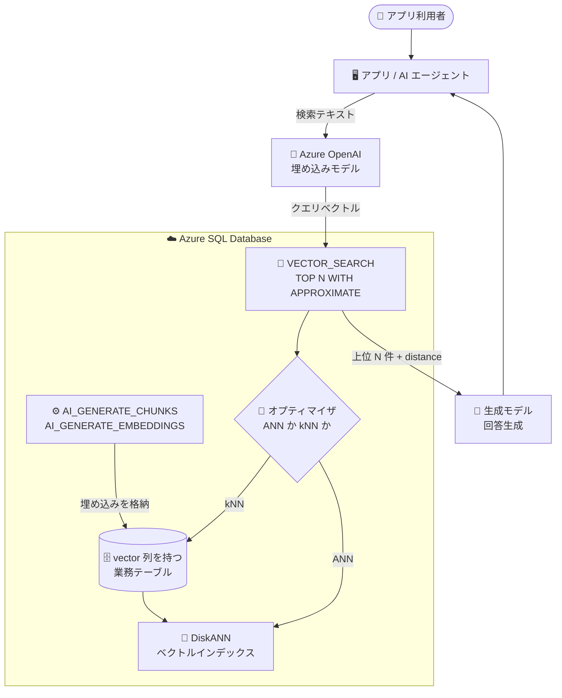

# Azure SQL Database: ベクトル検索とベクトルインデックスが一般提供 (GA)

**リリース日**: 2026-09-28

**サービス**: Azure SQL Database

**機能**: ベクトル検索 (VECTOR_SEARCH) とベクトルインデックス (CREATE VECTOR INDEX)

**ステータス**: Launched (GA)  <!-- Launched (GA) / In preview / In development -->

[このアップデートのインフォグラフィックを見る](https://takech9203.github.io/azure-news-summary/20260928-sql-database-vector-search-ga.html)

## 概要

Azure SQL Database において、**ベクトル検索とベクトルインデックスが一般提供 (GA)** となりました。`CREATE VECTOR INDEX` および `VECTOR_SEARCH` という 2 つの T-SQL 機能を使うことで、セマンティック検索、RAG (Retrieval-Augmented Generation)、レコメンデーション、画像検索といった AI シナリオ向けの**近似最近傍探索 (ANN: Approximate Nearest Neighbor)** をデータベース内で直接実行できます。

ベクトルインデックスは Microsoft Research 発の **DiskANN** アルゴニズムをベースにしたグラフ構造で実装されており、SSD と少量のメモリを効率的に使うことで、インメモリインデックスより大規模なベクトルデータを高い QPS と低レイテンシで扱えます。さらに、ベクトル検索をリレーショナルクエリや `WHERE` 句のフィルタリングと組み合わせて、1 本の T-SQL で表現できる点が Azure SQL Database 固有の強みです。

Azure Updates のアナウンスでは、この GA によって「**専用のベクトルデータベースを別途用意せずに**、企業データ上で AI アプリケーションを構築でき、アプリケーションアーキテクチャを簡素化しながら Azure SQL Database の信頼性・セキュリティ・ガバナンス機能をそのまま活用できる」と位置づけられています。

> **注意**: 2026-09-28 時点で Microsoft Learn の `CREATE VECTOR INDEX` / `VECTOR_SEARCH` の各リファレンスページには、依然として Azure SQL Database 向けの記載として「The feature is in preview」という表記が残っています (ページ最終更新: `VECTOR_SEARCH` は 2026-08-24、`CREATE VECTOR INDEX` は 2026-09-22)。ドキュメント側の反映が GA アナウンスに追随していない状態と考えられるため、本番採用前には最新のドキュメント記載とリージョン提供状況を必ず再確認してください。

**アップデート前の課題**

- ベクトルインデックスがない状態では、`VECTOR_DISTANCE` による **kNN (完全一致最近傍探索)** しか選択肢がなく、クエリベクトルとテーブル内の全ベクトルとの距離を計算するフルスキャンが発生していた。ドキュメントでは検索対象を **5 万ベクトル以下**に絞れるケースでの利用が推奨されており、大規模データセットではスケールしなかった。
- 旧バージョン (バージョン 3 未満) のベクトルインデックスには実運用上の重い制約があった。
  - **読み取り専用**: ベクトルインデックスを作成したテーブルでは INSERT / UPDATE / DELETE / MERGE が一切できず、DML を許可するには `ALLOW_STALE_VECTOR_INDEX` データベーススコープ構成を有効にして「古い検索結果を許容する」しかなかった。
  - **ポストフィルタリングのみ**: `WHERE` 句の述語はベクトル検索で近傍が返された**後**に適用されるため、条件を満たす行が実際には存在しても結果が期待より少なくなる (あるいは 0 件になる) ことがあった。
  - **手動の TOP_N チューニング**: 上記のポストフィルタリングを補償するため、`VECTOR_SEARCH` の `TOP_N` を必要数より大幅に大きく指定するという勘に頼った調整が必要だった。
- ANN 検索を行うために、別立てのベクトルデータベース / 検索サービスを用意し、リレーショナルデータとベクトルの同期を自前で運用する構成が必要になりがちだった。

**アップデート後の改善**

- `CREATE VECTOR INDEX` で DiskANN ベースの ANN インデックスを作成し、`SELECT TOP (N) WITH APPROXIMATE` + `VECTOR_SEARCH` で大規模データセットに対する近似検索を実行できる。
- **完全な DML サポート**: 最新バージョンのベクトルインデックスではテーブルが読み取り専用にならず、INSERT / UPDATE / DELETE / MERGE を実行でき、インデックスは自動的にリアルタイムで保守される。新規挿入した埋め込みはインデックス再構築なしに検索対象となる。
- **反復フィルタリング (Iterative filtering)**: `WHERE` 句の述語がベクトル検索の**プロセス中**に適用されるため、条件を満たす行が存在する限り期待した件数が返る。`TOP (N)` の手動調整が不要になった。
- **オプティマイザ駆動**: クエリオプティマイザがクエリ特性に応じて DiskANN インデックスシークと kNN スキャンを自動的に選択する。明示的に ANN を強制したい場合は `FORCE_ANN_ONLY` テーブルヒントを使用する。
- **量子化の統合**: ベクトル量子化技術が組み込まれ、ストレージ効率とクエリ性能が向上した (ユーザーからは透過的)。
- ベクトルとリレーショナルデータを同一データベースに同居させられるため、専用ベクトルストアとの同期運用が不要になる。

## アーキテクチャ図



業務データは `AI_GENERATE_CHUNKS` / `AI_GENERATE_EMBEDDINGS` で分割・ベクトル化して `vector` 列に格納し、その列に作成した DiskANN インデックスが ANN 検索を支えます。検索時はクエリオプティマイザが ANN (ベクトルインデックスシーク) と kNN (スキャン) のどちらを使うかを自動判断し、`distance` 付きの上位 N 件が RAG のコンテキストとして生成モデルに渡されます。

## サービスアップデートの詳細

### 主要機能

1. **CREATE VECTOR INDEX (DiskANN ベースの ANN インデックス)**
   - `vector` 型の列に対して近似最近傍探索用インデックスを作成する DDL。
   - `WITH (METRIC = { 'cosine' | 'dot' | 'euclidean' }, TYPE = 'DiskANN', MAXDOP = n)` を指定可能。`TYPE` は現時点で `DiskANN` のみで、既定値でもある。
   - 対象はベーステーブルのみ。ビューやローカル/グローバル一時テーブルは非対応。
   - `ON { filegroup_name | "default" }` でファイルグループを指定できる。

2. **VECTOR_SEARCH 関数 + SELECT TOP (N) WITH APPROXIMATE**
   - `TABLE` / `COLUMN` / `SIMILAR_TO` / `METRIC` を指定して近似検索を行うテーブル値関数。
   - 戻り値は対象テーブルの全列 + 距離を表す `distance` 列。`ORDER BY distance` (昇順) が必須で、`distance` 以外の列を `ORDER BY` に含めるとエラー (Msg 42271)、`ORDER BY` を省略するとエラー (Msg 42248) になる。
   - 指定した `METRIC` と同一メトリック・同一列の ANN インデックスが存在する場合のみ ANN インデックスが使われる。互換インデックスがない場合は警告が出て kNN にフォールバックする。
   - `TOP_N` パラメーターは非推奨 (旧バージョンインデックスの後方互換用)。最新バージョンのインデックスに対して `TOP_N` を使うと Msg 42274 が発生する。

3. **反復フィルタリングとオプティマイザ連携**
   - `WHERE` 句の述語が検索プロセス中に評価されるため、必要な件数が揃うまで (あるいは探索空間を尽くすまで) 検索が継続される。
   - フィルタ列に通常の B-tree 非クラスター化インデックスを併設すると、ベクトルインデックスと組み合わせた複合戦略になり、述語の選択性が高いケースで大きく性能が改善する。
   - `FORCE_ANN_ONLY` テーブルヒントでオプティマイザの判断を上書きして ANN 強制が可能 (ベクトルインデックスと `TOP (N) WITH APPROXIMATE` の両方が必須)。

4. **完全な DML サポートと自動メンテナンス**
   - INSERT / UPDATE / DELETE / MERGE がそのまま使え、コミット後に検索結果へ反映される。インデックスの削除・再構築は不要。
   - バックグラウンドでインデックス保守が走るため、`sys.dm_db_vector_indexes` 動的管理ビューで健全性と保守タスクの状況を監視する。

5. **リレーショナルクエリとの統合**
   - `INNER JOIN`、`WHERE` 述語、`ORDER BY distance` は直接併用できる。
   - `GROUP BY`、集計関数、ウィンドウ関数、`UNION` などの集合演算、`DISTINCT`、複数列 `ORDER BY`、`CROSS APPLY` は、ベクトル検索を内側のサブクエリに置く「サブクエリパターン」で対応する。

6. **旧バージョンインデックスからの移行パス**
   - 旧データ構造のベクトルインデックスは当面サポートされるが、将来のバージョンで廃止予定 (deprecation notice)。
   - `sys.vector_indexes` の `build_parameters` から `$.Version` を取得してバージョンを判定し、`3` 未満なら移行推奨。
   - インプレースアップグレードは不可。`DROP INDEX` → `CREATE VECTOR INDEX` で再作成する (再作成までの間、対象テーブルの近似ベクトル検索は停止するためメンテナンスウィンドウでの実施が推奨)。

## 技術仕様

| 項目 | 詳細 |
|------|------|
| データ型 | `VECTOR(<dimensions>)`。既定の基底型は `float32` (各要素 4 バイト単精度浮動小数点) |
| 次元数 | 最小 1、**最大 1998** 次元 |
| インデックス種別 | DiskANN (グラフベース ANN)。`TYPE = 'DiskANN'` のみサポートかつ既定値 |
| 距離メトリック | `cosine` / `euclidean` / `dot` (負の内積) |
| 近似検索構文 | `SELECT TOP (N) WITH APPROXIMATE ... FROM VECTOR_SEARCH(...) ORDER BY distance` (昇順のみ) |
| 完全一致検索 | `VECTOR_DISTANCE` による kNN。インデックス不要。目安として検索対象が 5 万ベクトル以下のケースで推奨 |
| インデックス作成の最小行数 | 非 NULL のベクトル値を持つ行が **100 行以上**。未満の場合は Msg 42266 でエラー |
| テーブル要件 | **int 列のクラスター化主キーインデックス**が必要。ベーステーブルのみ (ビュー・一時テーブル不可) |
| DML | 最新バージョン (version 3) のインデックスでは INSERT / UPDATE / DELETE / MERGE をサポート、自動リアルタイム保守 |
| 必要な権限 | 対象テーブルに対する `ALTER` 権限 |
| 並列度制御 | `MAXDOP` (0 = サーバー/DB/ワークロードグループ設定、1 = 並列化抑止、>1 = 上限指定) |
| メタデータ / 監視 | `sys.vector_indexes`、`sys.indexes`、`sys.dm_db_vector_indexes` |
| テーブルヒント | `FORCE_ANN_ONLY` (ANN 戦略の強制) |
| 互換性レベル | `vector` 型はすべてのデータベース互換性レベルで利用可能 |
| 半精度 (float16) | `VECTOR(<dimensions>, float16)` は現時点でプレビュー。`PREVIEW_FEATURES` データベーススコープ構成が必要 |
| ドライバー対応 | TDS 7.4 以上。`Microsoft.Data.SqlClient` 6.1.0 以降 (`SqlVector` 型)、Microsoft JDBC Driver 13.1.0 Preview 以降 (`microsoft.sql.Types.VECTOR`)。未対応クライアントでは `varchar(max)` の JSON 配列として透過的に扱える |

## 設定方法

### 前提条件

1. Azure SQL Database (または SQL database in Microsoft Fabric) を、ベクトル検索が提供されているリージョンで利用すること (「利用可能リージョン」を参照)。
2. ベクトルを格納するテーブルに **int 列のクラスター化主キーインデックス**があること。
3. ベクトル列が `vector` データ型で定義されていること (最大 1998 次元)。
4. インデックス作成前に、非 NULL のベクトル値を持つ行が **100 行以上**投入されていること。
5. インデックスを作成するユーザーが対象テーブルの `ALTER` 権限を持つこと。
6. (データベース内で埋め込みを生成する場合) `AI_GENERATE_EMBEDDINGS` の利用に外部 REST エンドポイント呼び出しが必要。**Azure SQL Database では `external rest endpoint enabled` は既定で有効**。加えてデータベースマスターキー、Azure OpenAI 向けのデータベーススコープ資格情報、`EMBEDDINGS` 型の外部モデル (`CREATE EXTERNAL MODEL`) を用意する。
7. SQL Server 2025 では `PREVIEW_FEATURES` データベーススコープ構成の有効化が必要だが、**Azure SQL Database と Fabric SQL database では不要**。

### T-SQL

```sql
-- 1. ベクトル列を持つテーブル (int 列の主キーが必須)
CREATE TABLE dbo.product_embeddings
(
    product_id INT PRIMARY KEY,
    category   NVARCHAR(50),
    approved   BIT,
    embedding  VECTOR(1536)   -- text-embedding-ada-002 / 3-small は 1,536 次元
);
GO

-- 2. 100 行以上の埋め込みを投入してから DiskANN ベクトルインデックスを作成
CREATE VECTOR INDEX idx_product_embedding
    ON dbo.product_embeddings (embedding)
    WITH (METRIC = 'cosine', TYPE = 'DISKANN');
GO

-- 3. 反復フィルタリングで使うフィルタ列には通常の非クラスター化インデックスを併設
CREATE NONCLUSTERED INDEX idx_product_category
    ON dbo.product_embeddings (category);
GO

-- 4. 近似最近傍探索 (TOP (N) WITH APPROXIMATE + ORDER BY distance 昇順が必須)
DECLARE @qv VECTOR(1536) =
    AI_GENERATE_EMBEDDINGS(N'wireless headphones' USE MODEL EmbeddingModel);

SELECT TOP (10) WITH APPROXIMATE
    e.product_id,
    e.category,
    vs.distance
FROM VECTOR_SEARCH(
        TABLE      = dbo.product_embeddings AS e,
        COLUMN     = embedding,
        SIMILAR_TO = @qv,
        METRIC     = 'cosine'
    ) AS vs
WHERE e.approved = 1
  AND e.category = 'Electronics'   -- 反復フィルタリングで検索中に適用される
ORDER BY vs.distance;
```

インデックスのバージョン確認 (`3` が最新) は次のクエリで行います。

```sql
SELECT i.name AS index_name,
       t.name AS table_name,
       JSON_VALUE(v.build_parameters, '$.Version') AS index_version
FROM sys.vector_indexes AS v
    INNER JOIN sys.indexes AS i
        ON v.object_id = i.object_id AND v.index_id = i.index_id
    INNER JOIN sys.tables AS t
        ON v.object_id = t.object_id
ORDER BY t.name, i.name;
```

## メリット

### ビジネス面

- 専用のベクトルデータベースを追加調達せずに AI 検索機能を実装でき、アーキテクチャとライセンス/運用コストを簡素化できる。
- 既存の Azure SQL Database の信頼性・セキュリティ・ガバナンス (認証、監査、バックアップ、地理冗長など) をそのまま AI 検索データに適用できる。
- リレーショナルデータとベクトルが同居するため、データ同期パイプラインの構築・監視が不要になり、AI アプリケーションの市場投入までの時間を短縮できる。

### 技術面

- DiskANN により、SSD と少量メモリで大規模ベクトルデータに対して高 QPS・低レイテンシの検索が可能。kNN フルスキャンに伴う CPU 消費を大幅に削減できる。
- 反復フィルタリングにより、`WHERE` 句との組み合わせでも期待件数が返り、`TOP (N)` のオーバーサンプリングという職人芸的チューニングが不要になった。
- 完全な DML サポートにより、データが継続的に更新されるトランザクショナルワークロードでもベクトル検索が成立する。
- オプティマイザが ANN / kNN を自動選択するため、データ量や述語の選択性が変化しても妥当な実行プランが選ばれる。必要なら `FORCE_ANN_ONLY` で明示制御できる。
- ベクトル検索結果を `INNER JOIN` やサブクエリパターン経由で集計・ウィンドウ関数・集合演算と組み合わせられ、1 つのクエリ言語で検索と分析を完結できる。

## デメリット・制約事項

- **次元数の上限は 1998**。これを超える埋め込みモデルの出力はそのまま格納できない (`dimensions` パラメーターによる次元削減などの検討が必要)。
- **int 列のクラスター化主キーインデックスが必須**。GUID 主キーや複合主キーの既存テーブルはスキーマ変更が必要になる。
- **最小 100 行**の非 NULL ベクトルが必要。小規模な開発・検証では、インデックスなしの `VECTOR_SEARCH` (ブルートフォーススキャン) を使う。
- **パーティション分割に非対応**。ベクトルインデックスはパーティション化できない。
- **`TRUNCATE TABLE` 不可**。全データ削除にはインデックス削除 → TRUNCATE → 100 行以上の再投入 → インデックス再作成という手順が必要。
- **DacPac / BACPAC でのデプロイ不可**。インポート処理はデータ投入前にスキーマオブジェクト (ベクトルインデックス含む) を作成するため 100 行要件を満たせず失敗する。回避策はエクスポート前にインデックスを削除し、インポート後に再作成すること。
- **サブスクライバーへのレプリケーション対象外**。
- `VECTOR_SEARCH` は**ビューの本体では使用できない**。`ORDER BY` は `distance` の昇順のみで、`DESC` は非サポート。`CROSS APPLY` / `OUTER APPLY` は同一 `FROM` 句で `TOP (N) WITH APPROXIMATE` と併用できない (サブクエリ内に閉じ込める必要がある)。
- **近似検索であるため recall は 1 未満になり得る**。「インデックス」という語の意味がリレーショナルインデックスとは異なり、結果は近似値である点を設計時に明示的に扱う必要がある。
- **重複ベクトルの多いデータセットは不向き**。重複が結果を占有して関連性の高い近傍を押し出し、品質低下とリソースの無駄につながる。事前の重複排除が推奨される。
- **大規模な埋め込み差し替え時はインデックス再作成が推奨**。埋め込みモデルを変更して全件再生成したような場合、クエリは有効な結果を返し続けるが recall とランキング品質が劣化する可能性がある。
- `vector` 型自体の制約: `DEFAULT` / `CHECK` / `PRIMARY KEY` / `FOREIGN KEY` などの列制約は `NULL` / `NOT NULL` を除き非対応、比較・算術演算子は使用不可、メモリ最適化テーブルでは使用不可、B-tree / columnstore インデックスのキー列にはできない (付加列は可)、Always Encrypted 非対応、`sql_variant` 非対応、`sp_describe_first_result_set` が型を正しく返さない。
- **旧バージョンインデックスの廃止予定**。将来のバージョンで廃止されるため、`$.Version` が 3 未満のインデックスは計画的な移行 (DROP / CREATE) が必要。
- **リージョン提供が限定的**。ロールアウト中で、リージョンやインデックスバージョンにより可用性と挙動が異なる可能性がある。

## ユースケース

### ユースケース 1: 企業データ上の RAG (メタデータフィルタ付きセマンティック検索)

**シナリオ**: 社内ドキュメントやナレッジ記事を Azure SQL Database に格納し、ユーザーの自然言語質問に対して「公開済み」「特定カテゴリ」といった業務条件を満たす範囲でセマンティックに関連するチャンクを取得し、生成モデルのコンテキストとして渡す。従来は別立てのベクトルストアとリレーショナル DB の二重管理か、ポストフィルタリングによる結果不足に悩まされていた。

**実装例**:

```sql
-- 埋め込みモデルを外部モデルとして登録 (Azure OpenAI)
CREATE EXTERNAL MODEL MyAzureOpenAIModel
WITH (
      LOCATION   = 'https://<your-endpoint>.cognitiveservices.azure.com/openai/deployments/text-embedding-ada-002/embeddings?api-version=2023-05-15',
      API_FORMAT = 'Azure OpenAI',
      MODEL_TYPE = EMBEDDINGS,
      MODEL      = 'text-embedding-ada-002',
      CREDENTIAL = [https://<your-endpoint>.cognitiveservices.azure.com/]
);
GO

-- 長文をチャンク分割し、埋め込みを生成して vector 列に格納
INSERT INTO dbo.text_embeddings (chunked_text, vector_embeddings)
SELECT c.chunk,
       AI_GENERATE_EMBEDDINGS(c.chunk USE MODEL MyAzureOpenAIModel)
FROM dbo.textchunk AS t
CROSS APPLY AI_GENERATE_CHUNKS (
    SOURCE     = t.text_to_chunk,
    CHUNK_TYPE = FIXED,
    CHUNK_SIZE = 100
) AS c;
GO

-- ベクトルインデックスを作成 (100 行以上投入後)
CREATE VECTOR INDEX idx_text_embeddings
    ON dbo.text_embeddings (vector_embeddings)
    WITH (METRIC = 'cosine', TYPE = 'DISKANN');
GO

-- 業務条件付きの近似セマンティック検索 (反復フィルタリング)
DECLARE @qv VECTOR(1536) =
    AI_GENERATE_EMBEDDINGS(N'machine learning algorithms' USE MODEL MyAzureOpenAIModel);

SELECT TOP (5) WITH APPROXIMATE
    t.embeddings_id,
    t.chunked_text,
    r.distance
FROM VECTOR_SEARCH(
        TABLE      = dbo.text_embeddings AS t,
        COLUMN     = vector_embeddings,
        SIMILAR_TO = @qv,
        METRIC     = 'cosine'
    ) AS r
ORDER BY r.distance;
```

**効果**: 埋め込み生成・格納・検索がすべて T-SQL に収まり、ベクトルストアとの同期処理が不要になる。反復フィルタリングにより、業務条件を満たす行が存在する限り指定件数が返るため、`TOP (N)` のオーバーサンプリング調整が不要になる。

### ユースケース 2: 更新頻度の高いレコメンデーション / 商品検索

**シナリオ**: EC サイトの商品カタログのように、商品の追加・更新・削除が日常的に発生するデータに対して類似商品検索を提供する。旧バージョンのベクトルインデックスではテーブルが読み取り専用になってしまい、`ALLOW_STALE_VECTOR_INDEX` で古い結果を許容するか、インデックスの削除・再作成を運用に組み込む必要があった。

**実装例**:

```sql
-- 新商品の埋め込みを挿入 → インデックス再構築なしで即座に検索対象になる
INSERT INTO dbo.product_embeddings (product_id, category, approved, embedding)
VALUES (
    99999,
    N'Electronics',
    1,
    AI_GENERATE_EMBEDDINGS(N'noise cancelling over-ear headphones' USE MODEL MyAzureOpenAIModel)
);

-- 商品情報の更新 (ベクトル列の更新もインデックスへ自動反映)
DECLARE @new_embedding VECTOR(1536) =
    AI_GENERATE_EMBEDDINGS(N'updated product description' USE MODEL MyAzureOpenAIModel);

UPDATE dbo.product_embeddings
SET embedding = @new_embedding
WHERE product_id = 50000;

-- ベクトルインデックスの保守状況を監視
SELECT * FROM sys.dm_db_vector_indexes;
```

**効果**: DML とベクトル検索を同一テーブルで共存させられるため、カタログ更新のたびにインデックスを作り直すバッチ運用が不要になる。コミット後の変更は後続のベクトル検索クエリに反映される。ただし、埋め込みモデル変更などでほぼ全件を差し替える場合は、ロード後にインデックスを再作成して分布に最適化することが推奨される。

## 料金

Azure SQL Database の料金は、購入モデル (vCore モデル / DTU モデル) とサービスレベル (General Purpose / Business Critical / Hyperscale) に基づき、**コンピューティング**と**ストレージ**が課金対象となります。vCore モデルのサーバーレスコンピューティング階層は使用した vCore を秒単位で課金し、プロビジョニング済み階層は固定のコンピューティングリソースに対して課金されます。ストレージは General Purpose が 5 GB〜4 TB のプロビジョニング、Hyperscale が 10 GB〜100 TB の実割り当てベースです。

**ベクトル検索・ベクトルインデックスに固有の課金項目は、Azure SQL Database の料金ページ上では確認できませんでした** (2026-09-28 時点)。したがってコスト影響は、既存の Azure SQL Database の課金軸を通じて次の形で現れると考えられます。

| 課金軸 | ベクトル検索利用時に影響する要素 |
|--------|----------------------------------|
| ストレージ | `vector` 列は各要素を単精度 (4 バイト) で格納するため、1,536 次元の埋め込みは 1 行あたり約 6 KB のベースサイズになる。加えて DiskANN インデックスの領域が必要 |
| コンピューティング | インデックス構築は並列実行され `MAXDOP` で制御する。DML 反映のためのバックグラウンド保守タスクも動作する |
| 外部サービス | `AI_GENERATE_EMBEDDINGS` は Azure OpenAI などの外部埋め込みエンドポイントを呼び出すため、そのトークン課金が別途発生する |

正確な単価は購入モデル・サービスレベル・リージョンに依存するため、必ず公式の料金ページで確認してください。

## 利用可能リージョン

Microsoft Learn の「Feature availability by region - Azure SQL Database」(ページ最終更新: 2026-09-17) では、ベクトル検索の提供リージョンは次のとおり記載されています。

| 地域 | 提供リージョン |
|------|----------------|
| Americas | 現時点では提供なし (Not currently available) |
| Asia Pacific | 現時点では提供なし (Not currently available) |
| Europe, Middle East, Africa | North Europe、UK South |

ドキュメントには「この機能は Azure SQL Database と SQL database in Microsoft Fabric にデプロイ展開中であり、ロールアウト中はリージョンおよびインデックスバージョンによって可用性と挙動が異なる可能性がある。機能や構文が利用できない場合、デプロイ完了に伴って自動的に利用可能になる」と明記されています。**GA アナウンス直後であり、リージョン一覧は今後更新される可能性が高いため、採用検討時は必ず最新のリージョン提供状況ページを確認してください。**

## 関連サービス・機能

- **Azure OpenAI (Azure AI Foundry Models)**: 埋め込み生成の主要な連携先。`CREATE EXTERNAL MODEL` で `API_FORMAT = 'Azure OpenAI'`、`MODEL_TYPE = EMBEDDINGS` として登録し、`AI_GENERATE_EMBEDDINGS` から呼び出す。API キーまたはマネージド ID による認証をサポート。
- **AI_GENERATE_EMBEDDINGS / AI_GENERATE_CHUNKS / CREATE EXTERNAL MODEL**: データベース内で埋め込み生成とチャンク分割を完結させる T-SQL 機能。外部モデルは Azure OpenAI に加えて OpenAI、Ollama のエンドポイントにも対応。
- **VECTOR_DISTANCE**: 2 つのベクトル間の距離を返すスカラー関数。インデックスを使わない完全一致 (kNN) 検索に使用し、ベクトル数が少ない場合 (目安 5 万以下) に適する。
- **Azure AI Search**: Azure SQL Database と組み合わせた RAG パターンの実装に利用できる。Azure OpenAI の「Azure OpenAI on your data」と連携し、SQL Database のデータに対するチャット・分析を実現する。
- **SQL MCP Server / Data API builder**: AI エージェントに対してスキーマを直接露出せず、定義済みツール経由でガバナンスされたデータアクセスを提供する。REST / GraphQL と同一構成でルールを共有できる。
- **LangChain (`langchain-sqlserver`)**: Azure SQL Database をベクトルストアとして使う RAG チャットボットの構築に利用できる Python パッケージ。
- **Semantic Kernel (`Microsoft.SemanticKernel.Connectors.SqlServer`)**: エージェント構築時に Azure SQL Database をコネクタとして利用できる。
- **SQL Server 2025 / Azure SQL Managed Instance / SQL database in Microsoft Fabric**: `vector` 型や `VECTOR_DISTANCE` は共通して利用できる。ただし**最新バージョンのベクトルインデックスは Azure SQL Database と Fabric SQL database のみ**で提供されており、SQL Server 2025 では `PREVIEW_FEATURES` の有効化が必要なプレビュー機能。SQL Managed Instance は「SQL Server 2025」または「Always-up-to-date」更新ポリシーの構成でベクトル機能が利用できる。
- **監視系オブジェクト**: `sys.vector_indexes` (インデックスのビルドパラメーターとバージョン)、`sys.dm_db_vector_indexes` (インデックス健全性と保守タスク状況)。

## 参考リンク

- [インフォグラフィック](https://takech9203.github.io/azure-news-summary/20260928-sql-database-vector-search-ga.html)
- [公式アップデート情報](https://azure.microsoft.com/updates?id=571800)
- [Vector search and vector indexes in the SQL Database Engine (Microsoft Learn)](https://learn.microsoft.com/sql/sql-server/ai/vectors?view=azuresqldb-current)
- [CREATE VECTOR INDEX (Transact-SQL)](https://learn.microsoft.com/sql/t-sql/statements/create-vector-index-transact-sql?view=azuresqldb-current)
- [VECTOR_SEARCH (Transact-SQL)](https://learn.microsoft.com/sql/t-sql/functions/vector-search-transact-sql?view=azuresqldb-current)
- [vector データ型 (Transact-SQL)](https://learn.microsoft.com/sql/t-sql/data-types/vector-data-type?view=azuresqldb-current)
- [AI_GENERATE_EMBEDDINGS (Transact-SQL)](https://learn.microsoft.com/sql/t-sql/functions/ai-generate-embeddings-transact-sql?view=azuresqldb-current)
- [Intelligent applications and AI - Azure SQL Database](https://learn.microsoft.com/azure/azure-sql/database/ai-artificial-intelligence-intelligent-applications?view=azuresql)
- [Feature availability by region - Azure SQL Database](https://learn.microsoft.com/azure/azure-sql/database/region-availability?view=azuresql#vector-search)
- [Azure SQL Database Vector Search Samples (GitHub)](https://github.com/Azure-Samples/azure-sql-db-vector-search)
- [料金ページ (Azure SQL Database - 単一データベース)](https://azure.microsoft.com/pricing/details/azure-sql-database/single/)

## まとめ

ベクトル検索とベクトルインデックスの GA は、Azure SQL Database を「業務データベース」から「AI 検索も担うデータプラットフォーム」へと位置づけ直す重要なアップデートです。とくに、最新バージョンのインデックスがもたらした**完全な DML サポート**と**反復フィルタリング**は、プレビュー段階で本番採用を阻んでいた 2 大要因 (テーブルが読み取り専用になる、フィルタ条件付き検索で結果が欠落する) を解消しており、トランザクショナルなワークロードにベクトル検索を組み込む現実的な選択肢になりました。専用ベクトルデータベースとの二重管理を避けたい構成では、まず Azure SQL Database 内での実装を検討する価値があります。

Solutions Architect として推奨される次のアクションは以下です。

1. **リージョン確認**: 現時点のドキュメント記載では North Europe と UK South のみ。対象システムのリージョンで利用可能かを最新のリージョン提供状況ページで確認する。あわせて、Microsoft Learn のリファレンスには GA アナウンス後も preview 表記が残っているため、ドキュメント更新状況も追跡する。
2. **スキーマ適合性の評価**: 「int 列のクラスター化主キー」「1998 次元以内」「100 行以上」「パーティション非対応」という要件に既存テーブルが適合するかを棚卸しする。埋め込みモデルの出力次元が 1998 を超える場合は `dimensions` パラメーターでの次元削減を検討する。
3. **既存ベクトルインデックスの移行計画**: プレビュー時代にインデックスを作成している場合、`sys.vector_indexes` の `$.Version` を確認し、3 未満なら DROP / CREATE による移行をメンテナンスウィンドウに計画する。あわせて `TOP_N` パラメーターを使っているクエリを `SELECT TOP (N) WITH APPROXIMATE` 構文へ書き換える。
4. **運用設計**: DacPac / BACPAC でのデプロイや `TRUNCATE TABLE` が使えない点は CI/CD パイプラインと運用手順に直接影響するため、インデックスの削除・再作成ステップを明示的に組み込む。`sys.dm_db_vector_indexes` によるインデックス保守の監視も運用設計に含める。
5. **recall とコストの検証**: ANN は近似であるため、代表的なクエリセットで kNN (`VECTOR_DISTANCE`) の結果と比較して recall を測定し、精度要件を満たすか検証する。あわせてストレージ増加とインデックス構築・保守のコンピューティング消費を実測する。

---

**タグ**: Azure SQL Database, ベクトル検索, ベクトルインデックス, DiskANN, ANN, VECTOR_SEARCH, CREATE VECTOR INDEX, RAG, 埋め込み, Azure OpenAI, セマンティック検索, Databases, GA
