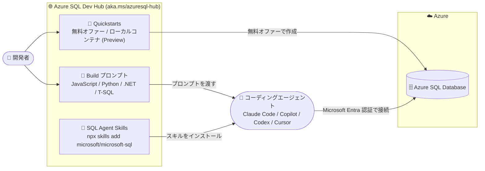

# Azure SQL Database: Azure SQL Dev Hub (Public Preview)

**リリース日**: 2026-09-28

**サービス**: Azure SQL Database

**機能**: Azure SQL Dev Hub

**ステータス**: In preview

[このアップデートのインフォグラフィックを見る](https://takech9203.github.io/azure-news-summary/20260928-sql-dev-hub-preview.html)

## 概要

Microsoft は **Azure SQL Dev Hub** を Public Preview として公開しました。Azure SQL を使ったアプリケーション開発の「中央の出発点 (central starting point)」となるサイトで、開発者が直接コードを書く場合と、AI エージェントに開発させる場合の両方をカバーします。公式アナウンスでは、.NET / Python / Node.js / Java から Azure SQL に接続するためのガイダンス、スキーマとクエリを扱うためのリソース、実行可能なサンプル、トラブルシューティングのガイダンス、そして **SQL agent skills** が一箇所に集約されると説明されています。

実体は `https://aka.ms/azuresql-hub` (リダイレクト先: `https://microsoft.github.io/azure-sql-dev-hub/`) で公開されている GitHub Pages サイトで、ソースは MIT ライセンスの OSS リポジトリ [microsoft/azure-sql-dev-hub](https://github.com/microsoft/azure-sql-dev-hub) として公開されています。**Azure Portal 内のブレードでも learn.microsoft.com のドキュメントセットでもありません**。サイトのキャッチコピーは "Azure SQL, built for AI workloads" / "Bring the idea. Build with Azure SQL." であり、Claude Code / GitHub Copilot / Codex / Cursor といったコーディングエージェントで Azure SQL アプリを作ることを主眼に構成されています。

サイトの構成は、(1) 開発用データベースを用意する **Quickstarts** (クラウドの無料オファー / ローカルコンテナ (Preview) / コーディングエージェント経由)、(2) シナリオ別のコピー&ペースト可能なプロンプト集 **Build**、(3) エージェントに Azure SQL の作法を教える **Skills**、(4) **Videos**、(5) AI ワークロード向け機能紹介、(6) FAQ (Before you build) の 6 セクションです。加えて、サイト全体が機械可読向けに設計されており、各ページに `.md` 版が存在し、`llms.txt` / `llms-full.txt` でサイト全体をエージェントに読み込ませられます。

**注意すべき点**: これはランタイム機能ではなく、あくまで**オンボーディング / 開発者体験向けの導線とガイダンスコンテンツ**です。Azure SQL Database のエンジンや SLA、課金に影響する変更は含まれていません。

**アップデート前の課題**

- Azure SQL への接続・クエリ方法は Microsoft Learn の [Connect and Query リファレンスガイド](https://learn.microsoft.com/azure/azure-sql/database/connect-query-content-reference-guide) に言語別クイックスタート (SSMS / Portal / VS Code / .NET / Go / Java / Node.js / PHP / Python / Ruby) とドライバー・ORM の一覧としてまとめられていたが、「データベースを用意する」→「接続する」→「アプリを作り切る」という一連の流れを 1 ページで完結させる導線ではなく、ドライバーのダウンロードページや個別クイックスタートに分散していた
- AI コーディングエージェントに Azure SQL 固有の作法 (Microsoft Entra 認証の書き方、`VECTOR` 型へのベクトル投入方法、Azure Functions SQL トリガーの前提条件、行レベルセキュリティの実装パターンなど) を教える公式の配布物への入口が、開発者向けトップページとして明示されていなかった
- 動作するアプリまで到達できる「検証済みプロンプト」の公式セットが、開発者が最初に見る場所に用意されていなかった

**アップデート後の改善**

- `aka.ms/azuresql-hub` という単一の短縮 URL が Azure SQL アプリ開発の入口になり、「無料データベース作成 → `SELECT 1` で接続確認 → ビルドプロンプトを実行」という 3 ステップの導線が提示された
- `npx skills add microsoft/microsoft-sql` の 1 コマンドで、Claude Code / GitHub Copilot / Codex / Cursor に Azure SQL のエージェントスキルを導入できる導線が明示された
- JavaScript / Python / .NET / T-SQL を対象とした 6 本のビルドプロンプト (タスク管理アプリ、Entra 認証付き API、ベクトル検索による RAG、サーバーレス API、イベント駆動関数、マルチテナント + 行レベルセキュリティ) が、検証ルール付きで公開された
- `llms.txt` / ページごとの `.md` ツインにより、エージェント自身がサイト内容を機械可読な形で参照できるようになった

## アーキテクチャ図



Dev Hub 自体は Azure リソースではなく、開発者とコーディングエージェントを Azure SQL Database に到達させるための導線 (Quickstarts / Build プロンプト / Agent Skills) を束ねたコンテンツサイトです。

## サービスアップデートの詳細

### 主要機能

1. **Quickstarts — 開発用データベースを用意する 3 つのパス**
   - **Cloud, free tier**: Azure Portal で無料オファーの Azure SQL Database を作成し、ファイアウォールに自分の IP を追加して Microsoft Entra でサインイン、`SELECT 1 AS connected;` で疎通を確認する
   - **Local container (Preview)**: Azure SQL Database コンテナでクラウドと同一エンジンをローカル/オフラインで動かす。プレビュー登録が必要 (`aka.ms/sqldbcontainerpreview-signup`)。Azure への移行時は接続文字列の変更のみで済むとされている
   - **With your coding agent**: エージェントスキルをインストールし、自然言語で依頼する。ただしデータベースのプロビジョニング自体は現時点では利用者の作業 ("Provisioning is still your step today")

2. **Build — シナリオ別のビルドプロンプト (6 本)**
   - `javascript-app` (JavaScript): サンプルデータ入りのタスク表示 Web アプリ
   - `python-api` (Python): パスワードを使わず Microsoft Entra で Azure SQL に接続する CRUD API
   - `rag-app` (Python / AI): Azure SQL のベクトル検索で意味検索を行う RAG の検索レイヤー
   - `serverless-api` (.NET): Azure Functions 経由でタスクを読み書きするサーバーレス API (ローカルでビルド・テスト)
   - `event-driven-app` (.NET): タスクの変更に反応する Functions を追加し、INSERT / UPDATE / DELETE をログ出力
   - `multi-tenant` (JavaScript): 行レベルセキュリティを追加し、テナント間でデータが読めないことをテスト
   - 各プロンプトは末尾に検証ルール (validation rules) を持ち、「動くアプリ」で終わる形に設計されている

3. **Skills — Microsoft SQL Agent Skills**
   - 配布元は別リポジトリ [microsoft/microsoft-sql](https://github.com/microsoft/microsoft-sql) (`aka.ms/azuresql-skills`)。[Agent Plugins 1.0](https://agent-plugins.org/specification) 準拠のポータブルパッケージとして公開
   - 5 つのプラグインを提供: `microsoft-sql` (Azure SQL アプリ開発・運用の全般)、`microsoft-azuresqldb-container` (ローカルコンテナと CI)、`microsoft-sql-vscode` (VS Code / MSSQL 拡張向け)、`microsoft-sql-migration` (SQL Server → Azure の評価・移行・検証)、`microsoft-sql-fdh` (Fabric Database Hub の読み取り専用インベントリ・性能・セキュリティ姿勢)
   - `microsoft-sql` の内容はドライバー/接続プーリング/リトライ/Entra 認証、EF Core・Prisma・SQLAlchemy・データベースプロジェクト、T-SQL の正しさ・JSON・安全な UPSERT・SQL インジェクション対策・行レベルセキュリティ、Azure Functions・Data API Builder・GitHub Actions、ベクトル・埋め込み・LangChain・LlamaIndex・RAG、Query Store・実行計画・ブロッキング・デッドロック・Extended Events、バルクロード・SqlPackage・リストアなど

4. **エージェント向けの機械可読レイヤー**
   - すべてのページに同一パスの `.md` 版が存在する (例: `/for-agents.md`)
   - サイト全体を 1 ファイルにまとめた `/llms-full.txt` と、要約インデックスの `/llms.txt` を提供
   - `llms.txt` の "Key facts" には、ドライバー別の Entra 認証の書き方、ベクトル投入時に `NVARCHAR(MAX)` を経由しないとエラー 529 になる点、Functions SQL トリガーが Change Tracking と互換性レベル 130 以上を要求する点、無料オファーの自動一時停止に伴うエラー 40613 のリトライなど、実装上のハマりどころが列挙されている

5. **AI ワークロード向け機能のハイライト**
   - ネイティブ `VECTOR` 型、`VECTOR_DISTANCE` による類似検索、`AI_GENERATE_EMBEDDINGS`、`CREATE EXTERNAL MODEL`、ネイティブ JSON、RegEx、行レベルセキュリティといった Azure SQL Database の AI 関連機能を紹介するセクション

## 技術仕様

| 項目 | 詳細 |
|------|------|
| エントリポイント | `https://aka.ms/azuresql-hub` → `https://microsoft.github.io/azure-sql-dev-hub/` |
| ホスティング形態 | GitHub Pages (Jekyll)。Azure Portal のブレードではない |
| ソースリポジトリ | [microsoft/azure-sql-dev-hub](https://github.com/microsoft/azure-sql-dev-hub) (MIT License) |
| エージェントスキル配布元 | [microsoft/microsoft-sql](https://github.com/microsoft/microsoft-sql) (`aka.ms/azuresql-skills`) |
| スキルの仕様 | Agent Plugins 1.0 / Agent Skills spec 準拠 |
| 対応エージェントホスト | GitHub Copilot、Claude Code、Codex、Cursor、Grok Build |
| 提供プラグイン数 | 5 (`microsoft-sql`、`microsoft-azuresqldb-container`、`microsoft-sql-vscode`、`microsoft-sql-migration`、`microsoft-sql-fdh`) |
| ビルドプロンプト | 6 シナリオ (JavaScript × 2、Python × 2、.NET × 2、T-SQL は埋め込み生成/ベクトルクエリで併用) |
| 機械可読形式 | 全ページの `.md` ツイン、`/llms.txt`、`/llms-full.txt` |
| 想定ターゲット | クラウド上の Azure SQL Database。認証は Microsoft Entra 前提 (コードや設定にパスワードを置かない方針) |
| ステータス | Public Preview (2026 年 9 月) |

## 設定方法

### 前提条件

1. リソース作成権限を持つ Azure サブスクリプションと Azure アカウント (無料オファーのデータベースを作成する場合)
2. クライアント IP を Azure SQL 論理サーバーのファイアウォールに追加できること、および Microsoft Entra でサインインできること
3. エージェント経由で進める場合: Claude Code / GitHub Copilot (VS Code) / Codex / Cursor のいずれか、および Node.js (`npx` 実行のため) または `gh` CLI
4. ローカルコンテナパスを使う場合: `aka.ms/sqldbcontainerpreview-signup` からのプレビュー登録と Docker 実行環境

### エージェントスキルのインストール

```bash
# 汎用 (Claude Code / Codex / Cursor / VS Code + GitHub Copilot)
npx skills add microsoft/microsoft-sql

# GitHub CLI 経由 (エージェントを指定)
gh skill install microsoft/microsoft-sql --all --agent claude-code
```

```bash
# Claude Code のプラグインマーケットプレース経由
claude plugin marketplace add microsoft/microsoft-sql
claude plugin install microsoft-sql@microsoft-sql
```

> `microsoft-sql` と `microsoft-sql-vscode` は内容が重複するため、通常はどちらか一方のみをインストールします (VS Code の MSSQL 拡張を使う場合は後者。拡張機能側のエージェントツールと重複する Data API Builder 系スキルが除かれています)。`microsoft-azuresqldb-container` の機能は `microsoft-sql` に包含されているため、この 2 つの同時インストールも非推奨です。

### Azure Portal (無料オファーのデータベース作成)

1. Azure Portal の Azure SQL ハブ (`aka.ms/azuresqlhub`) を開く
2. **Create a database** ペインで **Start free** を選択する
3. **Create SQL Database** 画面に "Free offer applied!" バナーが表示されることを確認する
4. **Basics** タブでサブスクリプション / リソースグループ / データベース名 / 論理サーバーを設定する (既定値のままでも可)
5. 右側の **Cost summary** カードで **Estimated Cost/Month** が 0 になっていることを確認し、**Review + create** → **Create** を選択する
6. 作成後、任意の SQL エディターから `SELECT 1 AS connected;` を実行して疎通を確認する

## メリット

### ビジネス面

- 新規メンバーや Azure SQL 未経験の開発チームのオンボーディング時間を短縮できる。「どのドキュメントから読むべきか」の判断コストが単一 URL に集約される
- 無料オファー (データベースあたり月 100,000 vCore 秒、データ 32 GB、バックアップ 32 GB、サブスクリプションあたり最大 10 データベース) と組み合わせることで、PoC や技術評価を追加コストなしで開始できる
- AI コーディングエージェントを既に社内標準として導入している組織では、公式スキルを配布するだけで Azure SQL のベストプラクティス (Entra 認証、SQL インジェクション対策、安全なマイグレーション) をエージェントの出力に反映させやすくなる

### 技術面

- エージェントスキルが Azure SQL 固有の実装上のハマりどころ (エラー 529 のベクトル投入、Change Tracking と互換性レベル 130、`SESSION_CONTEXT` ベースの行レベルセキュリティ、エラー 40613 のリトライ) を知識として持つため、生成コードの初回成功率が上がることが期待できる
- ローカルコンテナ (Preview) → クラウドの Azure SQL Database で同一エンジンを使えるため、接続文字列のみの差分でローカル開発から本番デプロイまで一貫させられる
- ビルドプロンプトに検証ルールが含まれており、エージェントの生成結果を「動くアプリかどうか」で判定できる
- サイトが機械可読 (`llms.txt` / `.md` ツイン) なため、社内エージェントのコンテキストソースとして直接取り込める
- OSS (MIT) で公開されているため、社内向けにフォークしてプロンプトやスキルをカスタマイズできる

## デメリット・制約事項

- **Public Preview** であり、内容・URL 構成・スキルのパッケージングは変更される可能性がある。プレビューであるため本番運用の依存先としての保証はない
- **Azure リソースでもサポート対象サービスでもない**。GitHub Pages 上のコンテンツサイトであり、Azure サポートチケットの対象となる機能ではない。Azure Portal 内に統合されたブレードは提供されていない
- 公式アナウンスでは .NET / Python / Node.js / Java のガイダンスが挙げられているが、現時点のサイトのビルドプロンプトは JavaScript / Python / .NET / T-SQL が対象で、**Java 向けのビルドプロンプトは確認できない**。Java の接続手順は従来の Microsoft Learn の [Connect and Query ガイド](https://learn.microsoft.com/azure/azure-sql/database/connect-query-content-reference-guide) を参照する必要がある
- 対象は **クラウドの Azure SQL Database** に限られる。Azure SQL Managed Instance や SQL Server on Azure VM は Dev Hub のプロンプトの対象外 (移行シナリオは別プラグイン `microsoft-sql-migration` が担当)
- データベースのプロビジョニングはエージェントに委譲されておらず、利用者の手作業が残る
- ローカルコンテナは別途 Preview 登録が必要で、レジストリアクセスの付与を待つ必要がある
- 無料オファー側の制約も引き継ぐ: 自動一時停止オプション有効時は最大 4 vCore / 32 GB、PITR は 7 日、長期バックアップ保持なし、エラスティックプールやフェールオーバーグループ非対応、リージョンはサブスクリプション内の無料データベースで共通かつ変更不可
- トラブルシューティング情報はサイト上では限定的 (エラー 40613 と FAQ 中心) で、本格的な運用トラブルシューティングは Microsoft Learn を参照する必要がある

## ユースケース

### ユースケース 1: AI エージェントを使った Azure SQL アプリの PoC 立ち上げ

**シナリオ**: 新規プロダクトのデータストアとして Azure SQL Database を評価したい。まずは動くプロトタイプを最短で作り、Entra 認証やマルチテナント分離が要件を満たせるかを確認したい。

**実装例**:

```bash
# 1. エージェントにスキルを導入
npx skills add microsoft/microsoft-sql

# 2. 無料オファーの Azure SQL Database を Portal で作成し、疎通を確認
#    (aka.ms/azuresqlhub → Create a database → Start free)
#    SELECT 1 AS connected;

# 3. Dev Hub の multi-tenant プロンプトをエージェントに渡す
#    https://microsoft.github.io/azure-sql-dev-hub/build/multi-tenant.md
```

**効果**: 行レベルセキュリティ (フィルター述語 + ブロック述語 + `sp_set_session_context`) を使ったテナント分離の実装と、「他テナントのデータが読めないこと」の検証までを、公式の検証ルール付きプロンプトで実施できる。無料オファーの範囲内で完結するため追加コストが発生しない。

### ユースケース 2: Azure SQL 上での RAG 検索レイヤーの評価

**シナリオ**: 既存の業務データを Azure SQL Database に持っており、別のベクトルデータベースを追加導入せずにベクトル検索で RAG を実現できるか検証したい。

**実装例**:

```bash
# Dev Hub の rag-app プロンプト (Python / AI) をエージェントに渡す
# https://microsoft.github.io/azure-sql-dev-hub/build/rag-app.md
```

**効果**: ネイティブ `VECTOR` 型と `VECTOR_DISTANCE` による類似検索、`AI_GENERATE_EMBEDDINGS` / `CREATE EXTERNAL MODEL` を使った埋め込み生成を、サンプルテキストと任意の埋め込みモデルで検証できる。スキル側がベクトル投入時の `NVARCHAR(MAX)` キャスト (エラー 529 回避) といった実装上の注意点を把握しているため、試行回数を減らせる。

### ユースケース 3: 開発チームへのガイドライン配布

**シナリオ**: 複数チームが Azure SQL を使っているが、接続方式 (接続文字列にパスワードを埋め込む/埋め込まない) やマイグレーション手順がチームごとにばらついている。

**実装例**:

```bash
# VS Code + MSSQL 拡張を標準とするチームには VS Code 向けプラグインを配布
gh skill install microsoft/microsoft-sql --all --agent github-copilot
```

**効果**: Microsoft Entra 認証を前提とし「コードや設定にパスワードを置かない」方針、安全な UPSERT、SQL インジェクション対策、データベースプロジェクトによるマイグレーションといったガイダンスが、エージェント経由で開発時に自動的に適用される。OSS のため社内ルールを追加したフォーク配布も可能。

## 関連サービス・機能

- **Azure SQL Database**: Dev Hub のすべてのビルドプロンプトのターゲット。無料オファー (月 100,000 vCore 秒 / 32 GB、最大 10 データベース) が Quickstarts の起点になっている
- **Azure SQL Database コンテナ (Preview)**: クラウドと同一エンジンをローカルで動かすためのコンテナ。Dev Hub の "Local container" パスおよび `microsoft-azuresqldb-container` プラグインが対応。別サイト `https://microsoft.github.io/azure-sql-database-container/` でローカル用プロンプトを提供
- **MSSQL extension for Visual Studio Code**: `microsoft-sql-vscode` プラグインが MSSQL 拡張向けに最適化されており、拡張機能が提供するエージェントツールと重複する Data API Builder 系スキルを除外している
- **Data API Builder**: `microsoft-sql` プラグインのガイダンス対象。Azure SQL のテーブルから API を自動生成する用途で組み合わせられる
- **Azure Functions**: `serverless-api` / `event-driven-app` プロンプトで使用。SQL トリガー (Change Tracking 必須) と出力バインディング (`MERGE` による UPSERT、主キーと互換性レベル 130 以上が必要) を利用
- **Microsoft Entra ID**: Dev Hub の全プロンプトで接続認証の前提。ドライバー別に `azure-active-directory-default` (`mssql` / Node.js)、`Authentication=Active Directory Default` (`Microsoft.Data.SqlClient` / .NET)、`azure-identity` によるトークン取得 (`mssql-python`) を使い分ける
- **Microsoft Fabric Database Hub**: `microsoft-sql-fdh` プラグインが読み取り専用のインベントリ・性能・セキュリティ姿勢の調査に対応
- **Azure Database Migration (SQL Server → Azure)**: `microsoft-sql-migration` プラグインが評価・計画・移行・検証のワークフローをカバー

## 参考リンク

- [インフォグラフィック](https://takech9203.github.io/azure-news-summary/20260928-sql-dev-hub-preview.html)
- [公式アップデート情報](https://azure.microsoft.com/updates?id=572998)
- [Azure SQL Dev Hub (aka.ms/azuresql-hub)](https://microsoft.github.io/azure-sql-dev-hub/)
- [Microsoft SQL Agent Skills (aka.ms/azuresql-skills)](https://github.com/microsoft/microsoft-sql)
- [azure-sql-dev-hub リポジトリ](https://github.com/microsoft/azure-sql-dev-hub)
- [Microsoft Learn: Connect and Query - Azure SQL Database & SQL Managed Instance](https://learn.microsoft.com/azure/azure-sql/database/connect-query-content-reference-guide)
- [Microsoft Learn: Azure SQL Database 無料オファー](https://learn.microsoft.com/azure/azure-sql/database/free-offer)
- [Azure SQL Database コンテナ (Preview) ドキュメント](https://microsoft.github.io/azure-sql-database-container/)

## まとめ

Azure SQL Dev Hub は、Azure SQL Database 上でのアプリケーション開発の入口を `aka.ms/azuresql-hub` の 1 箇所に集約した、Public Preview のオンボーディング用コンテンツサイトです。エンジンやサービスの機能追加ではないため、既存ワークロードへの影響やコスト影響はありませんが、「AI コーディングエージェント向けの公式スキルを Microsoft 自身が Agent Plugins 1.0 準拠パッケージとして配布し始めた」という点は Solutions Architect として押さえておく価値があります。

推奨アクション:

1. Azure SQL を新規採用するプロジェクトのキックオフ資料に `aka.ms/azuresql-hub` を追加し、無料オファーでの評価環境立ち上げ手順として参照させる
2. 社内でコーディングエージェントを標準化している場合は `microsoft-sql` (または VS Code 中心なら `microsoft-sql-vscode`) の評価を行い、生成コードが Entra 認証や SQL インジェクション対策の社内基準を満たすか検証する。プラグインは重複インストールを避ける
3. ローカル開発の標準化を検討している場合は Azure SQL Database コンテナの Preview 登録 (`aka.ms/sqldbcontainerpreview-signup`) を進める
4. Java での Azure SQL 開発が主体のチームには、Dev Hub に Java 向けビルドプロンプトが未整備であることを伝え、従来の Microsoft Learn の Connect and Query ガイドを併用させる

---

**タグ**: Azure SQL Database, 開発者体験, AI エージェント, Agent Skills, Public Preview, Databases, Data API Builder, Azure Functions, Microsoft Entra ID
