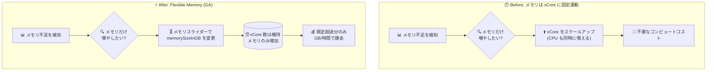

# Azure SQL Managed Instance: 2026 年 9 月下旬のアップデート (Flexible Memory の Business Critical GA / トランザクションログスループット向上)

**リリース日**: 2026-09-28

**サービス**: Azure SQL Managed Instance

**機能**: Flexible Memory (柔軟なメモリ構成) / トランザクションログ書き込みスループット上限の引き上げ

**ステータス**: Launched (GA)

[このアップデートのインフォグラフィックを見る](https://takech9203.github.io/azure-news-summary/20260928-sql-managed-instance-late-september-updates.html)

## 概要

2026 年 9 月下旬、Azure SQL Managed Instance に 2 つの機能強化が一般提供 (GA) として追加されました。いずれも「必要なリソースだけを個別に増やせるようにする」という方向性の改善で、2026 年 9 月 28 日から利用可能です。

1 つ目は **Flexible Memory** です。従来 SQL Managed Instance のメモリ量は vCore 数に固定比例していたため、メモリだけを増やしたい場合でも vCore をスケールアップするしかありませんでした。Flexible Memory では vCore 数を変えずにメモリ量だけを変更でき、メモリ / vCore 比を選択できます。Next-gen General Purpose では 2026 年 5 月 (ローカル冗長) に GA、2026 年 8 月にゾーン冗長がパブリックプレビューとなっていましたが、今回 **Business Critical (ローカル冗長・ゾーン冗長の両方) で GA** になりました。対象ハードウェアは Premium-series です。

2 つ目は **Business Critical のトランザクションログ書き込みスループット上限の引き上げ**です。書き込み集中型ワークロードでは、CPU やストレージの上限に達する前にログ書き込みスループットが先にボトルネックになるケースがありました。今回 vCore あたりのログスループットが 16 MB/s に引き上げられ、Standard-series では 10 vCore、Premium-series / memory optimized Premium-series では 12 vCore で、それぞれサービスティアの上限値に到達できるようになりました。

**アップデート前の課題**

- メモリ量が vCore 数に固定的に紐づいており (Standard-series 5.1 GB/vCore、Premium-series 7 GB/vCore、memory optimized Premium-series 13.6 GB/vCore)、メモリだけを増やしたい場合も vCore を追加する必要があった (Learn のリソース制限ドキュメントにも "Add more vCores to get more memory" と明記されていた)
- CPU 要件は現構成で足りているメモリ集中型ワークロードでも、メモリ確保のために不要な vCore を購入せざるを得ず、コンピュートのオーバープロビジョニングとコスト増につながっていた
- Business Critical のログ書き込みスループットは Standard-series で 4.5 MiB/s per vCore・最大 96 MiB/s、Premium-series / memory optimized Premium-series で 12 MiB/s per vCore・最大 192 MiB/s だったため、上限に到達するには大きな vCore 構成が必要だった (Premium-series で 192 MiB/s に到達するには 16 vCore が必要)

**アップデート後の改善**

- vCore 数を変更せずにメモリ量だけを調整できる「メモリスライダー」を Azure Portal / PowerShell / SDK / API から利用でき、メモリ / vCore 比を段階的に選択できる (Premium-series では 7、8、10、12 GB/vCore など)
- 既定メモリ (最小メモリ / vCore 比で計算される量) を超えた分だけが GB / 時間の従量課金となるため、未使用キャパシティに対する支払いが発生しない
- Business Critical の vCore あたりログスループットが 16 MB/s に向上し、Standard-series は 10 vCore で最大 160 MB/s、Premium-series / memory optimized Premium-series は 12 vCore で最大 192 MB/s に到達できるため、ログスループットのためだけに vCore を増やす必要がなくなった

## アーキテクチャ図



従来はメモリを増やすために vCore ごとスケールアップする必要があり CPU 分のコストも増えていましたが、Flexible Memory では vCore 数を維持したままメモリ量だけを変更でき、既定メモリを超えた差分のみが課金対象になります。

## サービスアップデートの詳細

### 主要機能

今回のロールアップに含まれる機能強化は以下の 2 件です。

#### 1. Flexible Memory が Business Critical で GA

- vCore 数を変更せずに SQL Managed Instance に割り当てるメモリ量を変更できる機能。メモリ / vCore 比を選択する「メモリスライダー」として提供される
- 対象は **Premium-series ハードウェア**。Business Critical では **ローカル冗長・ゾーン冗長の両方**の構成で 2026 年 9 月 28 日から GA
- メモリ / vCore 比は任意値ではなく、あらかじめ定義された「クリックストップ」から選択する。Premium-series では 7、8、10、12 GB/vCore などが選択可能
  - 例: 10 vCore のインスタンスでは 70 GB / 80 GB / 100 GB / 120 GB から選択できる
  - 例: 4 vCore では 28 / 32 / 40 / 48 GB、16 vCore では 112 / 128 / 160 / 192 GB
  - vCore 数が大きくなると選択できる比率が絞られる (48 vCore は 7 / 8 / 10、56 vCore は 7 / 8、64 vCore 以上は 7 のみ)
- **新規インスタンスと既存インスタンスの両方**で利用でき、ワークロード要件の変化に応じて後から構成を変更できる
- Next-gen General Purpose での提供状況は次のとおり (同一機能のティア別ロールアウト)
  - 2026 年 5 月 6 日: Next-gen General Purpose ローカル冗長で GA
  - 2026 年 8 月 17 日: Next-gen General Purpose ゾーン冗長でパブリックプレビュー
  - 2026 年 9 月 28 日: Business Critical (ローカル冗長・ゾーン冗長) で GA

#### 2. Business Critical のトランザクションログ書き込みスループット上限の引き上げ

- 書き込み集中型ワークロード向けに、Business Critical のトランザクションログスループット上限を引き上げ
- **Standard-series ハードウェア**
  - 最大ログスループットが 96 MB/s → **160 MB/s** に向上
  - vCore あたりのログスループットが 4.5 MB/s → **16 MB/s** に向上
  - **10 vCore** で最大スループットに到達
- **Premium-series / memory optimized Premium-series ハードウェア**
  - vCore あたりのログスループットが 12 MB/s → **16 MB/s** に向上
  - **12 vCore** で最大 **192 MB/s** に到達
- 高スループット OLTP、バルクデータ操作、バッチ処理など、トランザクションログ活動量が大きいワークロードのパフォーマンス改善が期待できる
- ログスループットの上限到達に必要な vCore 数が減るため、ログスループットがボトルネックのワークロードでは実際の CPU 要件に合わせた構成を選べるようになる

## 技術仕様

### Flexible Memory: Premium-series の メモリ / vCore 比 (クリックストップ)

| vCores | 選択可能な比率 (GB/vCore) | 合計メモリの選択肢 (GB) |
|--------|--------------------------|------------------------|
| 4 | 7, 8, 10, 12 | 28, 32, 40, 48 |
| 6 | 7, 8, 10, 12 | 42, 48, 60, 72 |
| 8 | 7, 8, 10, 12 | 56, 64, 80, 96 |
| 10 | 7, 8, 10, 12 | 70, 80, 100, 120 |
| 12 | 7, 8, 10, 12 | 84, 96, 120, 144 |
| 16 | 7, 8, 10, 12 | 112, 128, 160, 192 |
| 20 | 7, 8, 10, 12 | 140, 160, 200, 240 |
| 24 | 7, 8, 10, 12 | 168, 192, 240, 288 |
| 32 | 7, 8, 10, 12 | 224, 256, 320, 384 |
| 40 | 7, 8, 10, 12 | 280, 320, 400, 480 |
| 48 | 7, 8, 10 | 336, 384, 480 |
| 56 | 7, 8 | 392, 448 |
| 64 | 7 | 448 |
| 80 | 7 | 560 |
| 96 | 5.83 | 560 |
| 128 | 4.38 | 560 |

### ハードウェア別のメモリ / vCore

| ハードウェアティア | メモリ / vCore (GB) |
|-------------------|---------------------|
| Standard-series | 5.1 |
| Premium-series | 7 〜 12 |
| Premium-series (memory optimized) | 最大 13.6 |

### Business Critical のログ書き込みスループット (アップデート後)

| ハードウェア | vCore あたりログスループット | 最大ログスループット | 上限到達に必要な vCore |
|-------------|------------------------------|---------------------|----------------------|
| Standard-series | 16 MB/s | 160 MB/s | 10 |
| Premium-series | 16 MB/s | 192 MB/s | 12 |
| Memory optimized Premium-series | 16 MB/s | 192 MB/s | 12 |

### Flexible Memory の操作特性

| 項目 | 詳細 |
|------|------|
| 変更操作の性質 | 完全なオンライン操作。最後に短時間のフェールオーバーが発生する |
| 所要時間 | 指定した構成で新しいコンピュートを割り当てるプロセスを経るため、約 60 分 (高速化された管理操作を利用) |
| 対応インターフェース | Azure Portal (メモリスライダー) / PowerShell / SDK / REST API |
| API 最小バージョン | 2024-08-01 |
| API プロパティ | `memorySizeInGB` |
| 対応ハードウェア | Premium-series (メモリスライダーは Premium-series のみ) |
| 対応ティア | Next-gen General Purpose、Business Critical |
| 対象インスタンス | 新規・既存の両方 |

## 設定方法

### 前提条件

1. Premium-series ハードウェアで構成された SQL Managed Instance であること (メモリスライダーは Premium-series のみで利用可能)
2. サービスティアが Next-gen General Purpose または Business Critical であること
3. REST API / SDK を利用する場合は API バージョン 2024-08-01 以降を使用すること
4. 自動フェールオーバーグループを構成している場合は、後述のガイダンスに従うこと

### REST API / ARM

```json
{
  "properties": {
    "memorySizeInGB": 96
  }
}
```

### Azure Portal

Azure Portal のインスタンス構成ブレードで「メモリスライダー」を操作し、選択可能なメモリ / vCore 比 (クリックストップ) から目的のメモリ量を選択します。vCore 数の変更と同様の操作感で適用できます。

### 自動フェールオーバーグループ利用時のガイダンス

メモリ変更時のガイダンスは vCore 変更時と同じです。

1. **セカンダリを先にアップグレードする**
2. **プライマリとセカンダリの構成を一致させる**

## メリット

### ビジネス面

- メモリ集中型ワークロードのために不要な vCore を購入する必要がなくなり、コンピュートコストのオーバープロビジョニングを回避できる
- 追加メモリは既定メモリを超えた分のみが GB / 時間で課金されるため、コストの予測と最適化が容易になる
- ログスループット上限への到達に必要な vCore 数が減るため、書き込み集中型ワークロードでも小さいコンピュート構成で必要な性能を得られる

### 技術面

- CPU とメモリを独立した次元としてサイジングできるため、ワークロードの実際のリソースプロファイルに合わせた構成が可能になる
- 分析処理、キャッシュ、大きなバッファプールを必要とするワークロードで、vCore を増やさずにメモリヘッドルームを確保できる
- メモリ変更は完全なオンライン操作であり、既存インスタンスに対しても適用できるため、ワークロードの変化に追随できる
- 高スループット OLTP、バルクデータ操作、バッチ処理などでトランザクションログがボトルネックになっていた場合、構成変更なしでスループット上限が引き上がる

## デメリット・制約事項

- メモリスライダーは **Premium-series ハードウェアのみ**で利用可能。Standard-series (Gen5) では利用できない
- メモリ量は任意の値ではなく、あらかじめ定義された比率 (クリックストップ) からの選択に限られる
- vCore 数が大きい構成では選択できる比率が減る (48 vCore は 7 / 8 / 10、56 vCore は 7 / 8、64 vCore 以上は 7 のみ。96 vCore では 5.83、128 vCore では 4.38 となり、合計メモリは 560 GB で上限)
- メモリ変更はオンライン操作だが、**完了時に短時間のフェールオーバーが発生**し、操作全体には約 60 分を要する
- 自動フェールオーバーグループを構成している場合、セカンダリを先に更新し、プライマリとセカンダリの構成を一致させる必要がある
- Next-gen General Purpose のゾーン冗長構成における Flexible Memory は、2026 年 8 月時点でパブリックプレビュー段階 (GA は Business Critical のローカル冗長・ゾーン冗長と Next-gen General Purpose のローカル冗長)
- 追加メモリは従量課金されるため、メモリ / vCore 比を上げるとコンピュートコストは増加する

## ユースケース

### ユースケース 1: CPU は足りているがメモリが不足しているメモリ集中型ワークロード

**シナリオ**: 既存構成で CPU 要件は満たしているが、バッファプールを拡大したいメモリ集中型アプリケーション。従来はメモリを増やすために vCore 数も増やす必要があった。

**実装例**:

```json
{
  "properties": {
    "memorySizeInGB": 120
  }
}
```

10 vCore (既定 70 GB) のインスタンスで、メモリのみを 120 GB (12 GB/vCore) に変更する例。

**効果**: vCore 数を維持したままメモリを増やせるため、CPU 分の追加コストを発生させずにバッファプールを拡大できる。課金対象は既定 70 GB を超えた 50 GB 分のみ。

### ユースケース 2: 書き込み集中型 OLTP ワークロードのログスループット確保

**シナリオ**: 高スループット OLTP やバッチ処理で、CPU 使用率には余裕があるがトランザクションログ書き込みが上限に張り付いている Business Critical インスタンス。

**効果**: Premium-series では 12 vCore で最大 192 MB/s に到達できるため (従来は 12 MB/s per vCore で 16 vCore 相当が必要)、ログスループットのためだけに vCore を増やす必要がなくなり、CPU 要件に合わせた構成を選択できる。Standard-series では 10 vCore で 160 MB/s に到達できる。

## 料金

Flexible Memory は **使用量ベースの課金モデル**を採用しており、既定の割り当てを超えて実際に消費したメモリ分のみが課金されます。

- **既定メモリ (Default memory)**: 最小メモリ / vCore 比に基づいて計算される
- **課金対象メモリ (Billable memory)**: 構成したメモリ量 − 既定メモリ量
- **課金単位**: GB / 時間

計算例 (Premium-series、4 vCore、40 GB 構成の場合):

| 項目 | 値 |
|------|-----|
| vCores | 4 |
| 構成メモリ | 40 GB |
| 既定メモリ (4 × 7 GB) | 28 GB |
| 課金対象メモリ | 12 GB |
| 課金単位 | GB / 時間 |
| 課金対象 | 追加メモリ 12 GB 分 |

Business Critical のトランザクションログスループット向上については、追加課金に関する記述はありません。

なお、ゾーン冗長 Business Critical 構成では Azure Reservations が標準のコンピュート課金とゾーン冗長コンピュートアドオンの両方に適用でき (vCore および vCore ZR の予約タイプを購入)、1 年または 3 年のコミットメントで割引価格が適用されます。ストレージと SQL ライセンスは別課金で、適格な SQL Server ライセンスを保有している場合は Azure Hybrid Benefit を利用できます。

具体的な単価は料金ページで確認してください。

## 利用可能リージョン

Flexible Memory は Premium-series ハードウェアで利用可能です。memory optimized Premium-series ハードウェアおよび 16 TB ストレージ対応 Premium-series ハードウェアのリージョン別提供状況については、Microsoft Learn の[リージョン可用性ドキュメント](https://learn.microsoft.com/en-us/azure/azure-sql/managed-instance/region-availability?view=azuresql#regional-supports-for-memory-optimized-premium-series-hardware-and-for-premium-series-hardware-with-16-tb-storage)を参照してください。

## 関連サービス・機能

- **自動フェールオーバーグループ**: メモリ構成変更時はセカンダリを先に更新し、プライマリとセカンダリの構成を一致させる必要がある
- **Azure Reservations**: ゾーン冗長 Business Critical では、標準コンピュート課金とゾーン冗長コンピュートアドオンの両方に予約割引を適用できる
- **Azure Hybrid Benefit**: 適格な SQL Server ライセンス保有者は SQL Server ライセンスコストを削減できる
- **Next-gen General Purpose サービスティア**: Flexible Memory が先行して提供されているティア (ローカル冗長は 2026 年 5 月に GA)
- **In-Memory OLTP (Business Critical)**: 利用可能な In-Memory OLTP 領域は vCore 数とハードウェア構成に依存する

## 参考リンク

- [インフォグラフィック](https://takech9203.github.io/azure-news-summary/20260928-sql-managed-instance-late-september-updates.html)
- [公式アップデート情報](https://azure.microsoft.com/updates?id=571632)
- [Unlocking More Power with Flexible Memory in Azure SQL Managed Instance (Azure SQL Blog)](https://techcommunity.microsoft.com/blog/azuresqlblog/unlocking-more-power-with-flexible-memory-in-azure-sql-managed-instance/4425054)
- [More performance and flexibility for Azure SQL Managed Instance Business Critical (Azure SQL Blog)](https://techcommunity.microsoft.com/blog/azuresqlblog/more-performance-and-flexibility-for-azure-sql-managed-instance-business-critica/4559057)
- [Microsoft Learn: Azure SQL Managed Instance のリソース制限](https://learn.microsoft.com/en-us/azure/azure-sql/managed-instance/resource-limits?view=azuresql)
- [料金ページ: Azure SQL Managed Instance](https://azure.microsoft.com/en-us/pricing/details/azure-sql-managed-instance/single/)

## まとめ

2026 年 9 月下旬の Azure SQL Managed Instance アップデートは、Flexible Memory の Business Critical GA と、Business Critical のトランザクションログ書き込みスループット上限引き上げの 2 件です。いずれも「1 つのリソースを増やすために別のリソースも増やす」という制約を解消するもので、CPU・メモリ・ログスループットを独立した次元としてサイジングできるようになります。

Solutions Architect としては、まず既存の Business Critical インスタンスについて、(1) メモリ確保のために vCore をオーバープロビジョニングしていないか、(2) トランザクションログスループットが上限に張り付いていないか、を確認することが推奨されます。メモリ不足が主因で vCore を増やしていたインスタンスは、Premium-series であれば Flexible Memory による構成見直しでコンピュートコストを削減できる可能性があります。ログスループットがボトルネックだったインスタンスは、今回の上限引き上げにより、より小さい vCore 構成へのダウンサイジングを検討できます。

ただしメモリ変更は約 60 分を要し、完了時に短時間のフェールオーバーが発生するため、メンテナンスウィンドウでの実施計画と、フェールオーバーグループ利用時のセカンダリ先行更新の手順を事前に整理しておく必要があります。

---

**タグ**: Azure SQL Managed Instance, Databases, Flexible Memory, Business Critical, Transaction Log Throughput, Premium-series, GA, Cost Optimization, Performance
