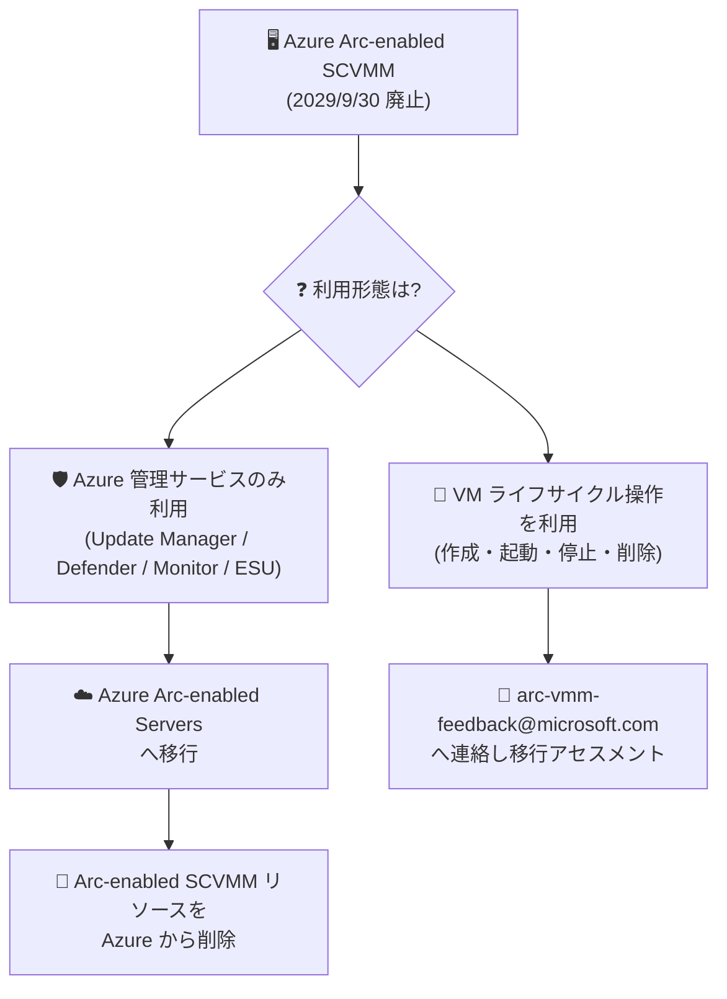

# Azure Arc-enabled System Center Virtual Machine Manager: 2029 年 9 月 30 日に廃止

**リリース日**: 2026-09-29

**サービス**: Azure Arc-enabled System Center Virtual Machine Manager (SCVMM)

**機能**: サービス廃止 (Retirement)

**ステータス**: Retirement

[このアップデートのインフォグラフィックを見る](https://takech9203.github.io/azure-news-summary/20260929-arc-scvmm-retirement.html)

## 概要

Microsoft は、Azure Arc-enabled System Center Virtual Machine Manager (SCVMM) を **2029 年 9 月 30 日に廃止**することを発表しました。Azure Arc-enabled SCVMM は、SCVMM で管理されるオンプレミス VM 環境を Azure に接続し、Azure ポータルからの VM ライフサイクル操作 (作成・起動・停止・削除など)、Azure RBAC によるセルフサービス VM 管理、Arc エージェントの大規模インストール、Azure のセキュリティ・ガバナンス・監視・更新管理サービスの利用を可能にするサービスです。

今回の廃止は Azure Arc 製品ポートフォリオの再編の一環であり、**新規オンボーディングは 2026 年 10 月までに停止**されます。既存顧客 (Azure Arc-enabled SCVMM のアクティブなデプロイを持つ Azure サブスクリプション) は、2029 年 9 月の廃止まで現行のすべての機能を引き続き利用できますが、新機能の追加は行われません。

推奨される移行先は利用形態によって異なります。Azure 管理サービス (Azure Update Manager、Defender for Cloud、Azure Monitor、Azure Policy、ESU/従量課金ライセンスなど) のみを利用している場合は **Azure Arc-enabled Servers** への移行が推奨されます。Azure からの VM ライフサイクル操作を利用している場合は、Microsoft (arc-vmm-feedback@microsoft.com) に連絡して移行アセスメントを開始することが案内されています。

**廃止による影響**

- 2026 年 10 月以降、新規顧客は Azure Arc-enabled SCVMM をデプロイできなくなる
- 廃止までの期間、Azure Arc-enabled SCVMM への新機能追加は行われない
- 2029 年 9 月 30 日以降、Azure からの SCVMM VM ライフサイクル管理・インベントリ表示は利用不可となる

**既存顧客への猶予**

- 既存デプロイは 2029 年 9 月まで現行機能をすべて利用可能 (サポート継続)
- VM にインストール済みの Azure Arc エージェント自体は動作を継続する (Azure CLI コマンドで Arc-enabled Servers マシンへの切り替えが必要)
- オンプレミスの System Center Virtual Machine Manager 製品自体は廃止対象外 (System Center のライフサイクルポリシーに従い継続利用可能)

## アーキテクチャ図

Azure Arc-enabled SCVMM の利用形態に応じた移行パスです。管理サービスのみの利用なら Azure Arc-enabled Servers へ移行し、VM ライフサイクル操作を利用している場合は Microsoft への連絡による個別アセスメントが推奨されます。

## サービスアップデートの詳細

### 廃止スケジュール

| 時期 | イベント |
|------|---------|
| 2026 年 9 月 | 廃止の発表 (新規デプロイの計画を避けることを推奨) |
| 2026 年 10 月 | 新規顧客のオンボーディング停止 (既存顧客のオンボーディング体験は維持) |
| 2026 年 10 月まで | Arc-enabled Servers への切り替え用 Azure CLI コマンドがドキュメントで公開予定 |
| 2029 年 9 月 30 日 | Azure Arc-enabled SCVMM の廃止 |

### 移行パスの選択

| 現在の利用形態 | 推奨される移行パス |
|---------------|------------------|
| Azure 管理サービスのみ利用 (Update Manager、Defender for Cloud、Azure Monitor、Azure Policy、Guest Configuration、ESU / 従量課金の SQL・Windows Server ライセンス) で、Azure ベースの VM ライフサイクル管理は不要 | Azure Arc-enabled Servers |
| Azure からの VM ライフサイクル操作のみ利用 (作成、起動、停止、再起動、リサイズ、削除、セルフサービス VM プロビジョニング) | arc-vmm-feedback@microsoft.com へ連絡 |
| VM ライフサイクル操作と Azure 管理サービスの両方を利用 | arc-vmm-feedback@microsoft.com へ連絡 |

Azure Arc-enabled Servers はゲスト OS レベルの管理を提供するサービスであり、仮想化レイヤーの VM ライフサイクル操作 (CRUD) は提供しません。VM ライフサイクル操作が必要な場合、インフラ・接続性・VM 管理要件が組織ごとに異なるため単一の代替ソリューションは提示されておらず、Microsoft が接続シナリオ・非接続シナリオ両方の移行オプションを個別に案内するとしています。

### Azure Arc-enabled Servers への移行手順 (概要)

1. Azure サービス (パッチ適用、監視、セキュリティなど) にオンボード済み、または Azure ベースのライセンス (ESU、従量課金ライセンス) に登録済みの VM を特定する
2. Azure CLI コマンドをマシン単位、リソースグループ単位、またはサブスクリプション単位で実行する (**CLI コマンドは 2026 年 10 月までにドキュメントで公開予定**)
3. マシンと Azure Arc 間の接続性を検証する
4. ポリシー、監視、更新、セキュリティ、ライセンス課金、コンプライアンス機能の動作を確認する
5. 将来的に追加マシンを大規模に Arc オンボードする計画を策定する
6. Azure Arc-enabled SCVMM リソースを Azure から適切に削除 (デボード) する

## 技術仕様

| 項目 | 詳細 |
|------|------|
| 廃止対象 | Azure Arc-enabled System Center Virtual Machine Manager |
| 廃止日 | 2029 年 9 月 30 日 |
| 新規オンボーディング停止 | 2026 年 10 月 |
| 廃止対象外 | オンプレミスの System Center Virtual Machine Manager 製品 (System Center のライフサイクル・サポートポリシーに従う) |
| 現行のサポート対象 SCVMM バージョン | VMM 2025、2022、2019 (管理サーバーあたり最大 15,000 VM) |
| 主な移行先 | Azure Arc-enabled Servers (ゲスト OS 管理・ライセンス調達用途) |
| VM ライフサイクル管理の代替 | 個別アセスメント (arc-vmm-feedback@microsoft.com へ連絡) |
| 問い合わせ先 | arc-vmm-feedback@microsoft.com |

## デメリット・制約事項

- Azure Arc-enabled Servers は仮想化レイヤーの VM ライフサイクル操作 (作成・削除・リサイズなど) を提供しないため、Azure ポータルからの SCVMM VM のプロビジョニングやセルフサービス操作の直接的な代替にはならない
- 廃止までの期間、Azure Arc-enabled SCVMM への新機能追加は行われない
- Arc-enabled Servers への切り替え用 Azure CLI コマンドは 2026 年 10 月までの公開予定であり、現時点では未提供
- 移行完了後は、残存する Azure Arc-enabled SCVMM リソース (Arc resource bridge など) の Azure からの削除作業が別途必要

## 関連サービス・機能

- **Azure Arc-enabled Servers**: 推奨される移行先。仮想化プラットフォームに依存しないゲスト OS レベルの管理 (Azure Policy、Update Manager、Monitor、Defender for Cloud、ESU など) を提供
- **Azure Arc resource bridge**: Arc-enabled SCVMM で SCVMM 管理サーバーを Azure に接続していた仮想アプライアンス。移行後はデボード対象
- **Azure Local**: 新規のクラウドネイティブな VM 管理ニーズに対して Arc-enabled Servers と併せて評価が推奨されるプラットフォーム
- **Azure Arc-enabled VMware vSphere**: SCVMM 管理下の VMware vCenter VM を Arc オンボードする場合の選択肢 (従来から Arc-enabled SCVMM の対象外)
- **Azure Update Manager / Microsoft Defender for Cloud / Azure Monitor**: Arc-enabled SCVMM 経由で利用していた管理サービス。Arc-enabled Servers への切り替え後も継続利用可能

## 参考リンク

- [インフォグラフィック](https://takech9203.github.io/azure-news-summary/20260929-arc-scvmm-retirement.html)
- [公式アップデート情報](https://azure.microsoft.com/updates?id=570283)
- [移行ガイダンス (Transition guidance)](https://learn.microsoft.com/en-us/azure/azure-arc/system-center-virtual-machine-manager/transition-guidance)
- [Azure Arc-enabled SCVMM 概要](https://learn.microsoft.com/en-us/azure/azure-arc/system-center-virtual-machine-manager/overview)
- [Azure Arc-enabled Servers 概要](https://learn.microsoft.com/en-us/azure/azure-arc/servers/overview)
- [SCVMM 環境の Azure Arc からの削除手順](https://learn.microsoft.com/en-us/azure/azure-arc/system-center-virtual-machine-manager/remove-scvmm-from-azure-arc)

## まとめ

Azure Arc-enabled SCVMM は 2029 年 9 月 30 日に廃止され、新規オンボーディングは 2026 年 10 月に停止されます。既存環境は廃止まで現行機能を利用できますが、新機能は追加されないため、早期の移行計画が推奨されます。Solutions Architect としては、まず自組織の利用形態を棚卸しし、Azure 管理サービスのみの利用であれば Azure Arc-enabled Servers への切り替え (CLI コマンドは 2026 年 10 月までに公開予定) を、Azure からの VM ライフサイクル操作を利用している場合は arc-vmm-feedback@microsoft.com への連絡による移行アセスメントを早期に開始すべきです。なお、オンプレミスの SCVMM 製品自体は廃止対象外であり、System Center のライフサイクルポリシーに従って継続利用できます。

---

**タグ**: Azure Arc, SCVMM, System Center, Retirement, Hybrid, Azure Arc-enabled Servers
