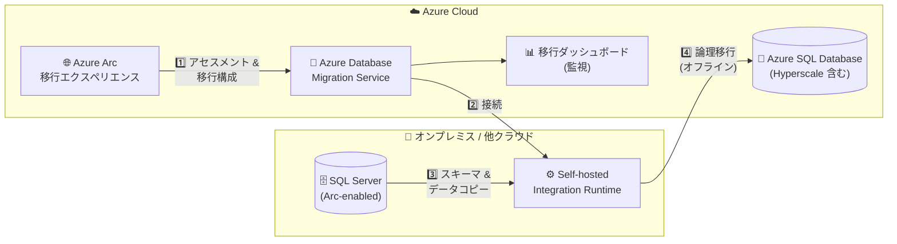

# Azure SQL Database: Azure Arc から Azure SQL Database (Hyperscale 含む) への直接移行

**リリース日**: 2026-09-29

**サービス**: Azure SQL Database / Azure Arc-enabled SQL Server

**機能**: Azure Arc のデータベース移行エクスペリエンスから Azure SQL Database (Hyperscale 含む) へ直接移行

**ステータス**: In preview

[このアップデートのインフォグラフィックを見る](https://takech9203.github.io/azure-news-summary/20260929-arc-sql-migration-to-azure-sql-database.html)

## 概要

Azure Arc のデータベース移行エクスペリエンスにおいて、移行ターゲットとして Azure SQL Database (Hyperscale サービスレベルを含む) を直接選択できるようになりました (Public Preview)。このワークフローでは、Azure Database Migration Service (DMS) と Self-hosted Integration Runtime (SHIR) のセットアップがガイド付きのポータル操作に組み込まれており、SQL Server 資産のアセスメント、ターゲット選択、移行の構成、進行状況の監視までを Azure Arc の画面から離れることなく実行できます。

これまで、アセスメントから移行までのパスでは Arc の外に出て、別のサービスを学習し、ランタイムを構成し、複数のツールを行き来する必要があり、この追加の手間がモダナイゼーションプロジェクトを遅らせていました。今回のリリースにより、Arc が「移行可能」と判定したデータベースを、アセスメントを実施したその場ですぐに移行アクションに移せるようになります。

他の Azure SQL 移行先ですでに使われているものと同じ移行ダッシュボード、監視エクスペリエンス、ガイド付きワークフローが利用できるため、Hyperscale を選択する場合でも新しい移行手法を学ぶ必要はありません。ランタイムのセットアップはガイド付きで、ポータル内の手順に従って 1 回だけ完了させれば済みます。

**アップデート前の課題**

- アセスメントから移行に進むには Azure Arc の外に出て、別のサービス (DMS) を個別に学習・構成する必要があった
- SHIR の構成やツール間の移動など追加の作業が発生し、モダナイゼーションプロジェクトの進行が遅くなっていた

**アップデート後の改善**

- Azure Arc の移行エクスペリエンス内で Azure SQL Database (Hyperscale 含む) をターゲットとして直接選択可能になった
- DMS と SHIR のセットアップがガイド付きワークフローに統合され、アセスメント・ターゲット選択・移行構成・監視を Arc 内で完結できるようになった
- 他の Azure SQL 移行先と共通の移行ダッシュボードと監視エクスペリエンスをそのまま利用できる

## アーキテクチャ図

Azure Arc のポータル画面から移行を構成すると、DMS が SHIR 経由でソース SQL Server に接続し、スキーマとデータをターゲットの Azure SQL Database へ論理移行 (オフライン) でコピーします。

## サービスアップデートの詳細

### 主要機能

1. **Azure SQL Database (Hyperscale 含む) をターゲットとして直接選択**
   - Azure Arc のデータベース移行エクスペリエンスから、Azure SQL Database をターゲットとして選択し、既存ターゲットの利用または新規作成が可能

2. **ガイド付きの DMS / SHIR セットアップ**
   - 既存の DMS インスタンスの選択、または「Auto create new DMS」による自動作成に対応
   - SHIR のダウンロード・インストール・登録手順がポータル内でガイドされ、セットアップは 1 回のみで完了

3. **4 ステージのガイド付きワークフロー**
   - 「ソースインスタンスのアセスメント」→「ターゲット選択」→「データ移行」→「移行の監視」を Database migration ペインで一貫して実施

4. **スキーマ移行とデータ移行の選択**
   - 「Migrate data」(既存スキーマへのデータ移行)、「Migrate schema」(オブジェクトのみ作成)、または両方を選択可能
   - ターゲットに一致するスキーマが検出された場合はスキーマ移行が自動的に無効化される
   - テーブル単位で移行対象を選択可能

5. **Microsoft Copilot 支援**
   - 移行エクスペリエンスに Copilot が組み込まれ、アセスメントに関する質問、ターゲット比較、移行の開始・監視、トラブルシューティングを支援

## 技術仕様

| 項目 | 詳細 |
|------|------|
| 移行方式 | 論理移行 (DMS + SHIR 経由でスキーマとデータをコピー)。Azure Blob Storage へのバックアップステージングは不要 |
| 移行モード | オフラインのみ (オンライン移行は現時点で未対応。移行開始後のソース変更はキャプチャされない) |
| ソース | Azure Arc-enabled SQL Server (SQL Server 2017 〜 2025 のドキュメント対象バージョン)。オンライン状態のデータベースのみ移行可能 |
| ターゲット | Azure SQL Database (Hyperscale サービスレベルを含む) |
| SHIR バージョン | スキーマ移行には SHIR 5.37 以降が必要 |
| SHIR の制約 | Azure Data Factory で作成済みの既存 SHIR は DMS の移行には使用不可 |
| データ移動基盤 | DMS は Azure Data Factory パイプラインを使用するため、Azure Data Factory の制限が適用される |

## 設定方法

### 前提条件

1. アクティブな Azure サブスクリプション
2. Azure Arc-enabled SQL Server インスタンスと、最新バージョンの Azure extension for SQL Server
3. ターゲットの Azure SQL Database (事前作成。ソースワークロードに十分なサービスレベルを選択)
4. サブスクリプションで **Microsoft.DataMigration** リソースプロバイダーを登録済みであること
5. SHIR からソース SQL Server とターゲット Azure SQL Database への両方向のネットワーク接続
6. 必要なアクセス許可:
   - Azure 側: ターゲット Azure SQL Database への **Contributor** ロール、ターゲットを含むリソースグループへの **Reader** ロール、DMS を新規作成する場合はサブスクリプションの **Owner** または **Contributor** ロール
   - ソース SQL Server ログイン: ソースデータベースの **db_datareader** ロール + **VIEW ANY DEFINITION** サーバー権限 (スキーマ移行時は **db_owner** ロール)
   - ターゲットログイン: ターゲットデータベースの **db_owner** ロール

### Azure Portal

1. Azure Portal で対象の SQL Server インスタンス (Arc-enabled) に移動し、**Migration** > **Database migration** を選択
2. **Assess source instance** で **View report** を選択し、アセスメントが最新でなければ **Run assessment** を実行。**Azure SQL Database** タイルでアセスメント詳細 (準備状況、ブロッキング問題、警告、推奨ターゲット構成) を確認
3. **Create or select target** から既存の Azure SQL Database を選択、または新規作成 (サブスクリプション、リソースグループ、論理サーバー、データベース、認証情報を指定)
4. **Migrate data** を選択し、移行方法として **Migration using DMS (preview)** を選択して Migration wizard を開く
5. ウィザードに従い、(1) SHIR のセットアップ (既存 DMS の選択または自動作成、認証キーでランタイム登録、Online 状態を確認)、(2) ソース / ターゲットへの接続と検証、(3) ソース / ターゲットデータベースのマッピング、(4) 移行対象テーブルとスキーマ/データ移行オプションの選択を実施
6. **Review + create** > **Create** で移行を開始
7. **Monitor migrations** で移行とテーブルごとのステータスを監視し、**Succeeded** になったらスキーマ・データ・アプリケーション接続を検証

## メリット

### ビジネス面

- アセスメントから移行までを単一のポータル体験で完結でき、モダナイゼーションプロジェクトのリードタイムを短縮できる
- Hyperscale を含む PaaS への移行で、フルマネージドなデータベース基盤による運用負荷軽減が期待できる
- Copilot 支援により、移行判断やトラブルシューティングのハードルが下がる

### 技術面

- 他の Azure SQL 移行先と共通の移行ダッシュボード・監視・ガイド付きワークフローを利用でき、新しい移行手法の学習が不要
- DMS / SHIR のセットアップがガイド化され、ランタイム構成は 1 回で完了
- Azure Blob Storage へのバックアップステージングが不要な論理移行方式
- アセスメントで互換性の問題を事前に特定し、適切なサービスレベルと構成を選択できる

## デメリット・制約事項

- 現在 Public Preview であり、本番利用前に十分な検証が必要
- オンライン移行は未対応。オフライン移行のため、移行開始からカットオーバー完了までアプリケーションのダウンタイムが発生する (許容可否をテストで確認することが推奨されている)
- オンライン状態のデータベースのみ移行可能 (他の状態のデータベースは選択不可)
- ターゲットテーブルが空でない場合、そのテーブルを選択すると既存のターゲットデータが置き換えられる
- Azure Data Factory で作成した既存の SHIR は流用できず、DMS 用に別途登録が必要
- DMS は Azure Data Factory パイプラインを使用するため、Azure Data Factory の制限が適用される
- 移行速度はターゲットのサービスレベルと SHIR ホストのリソースに依存する

## ユースケース

### ユースケース 1: オンプレミス SQL Server 資産の Hyperscale への段階的モダナイゼーション

**シナリオ**: Azure Arc で管理しているオンプレミスの SQL Server 群について、アセスメントで「移行可能」と判定された大規模データベースを Azure SQL Database Hyperscale へ移行し、ストレージのスケーラビリティと PaaS の運用性を獲得する。

**実装例**: Azure Portal の Arc-enabled SQL Server インスタンスで **Database migration** ペインを開き、アセスメント → Hyperscale ターゲットの選択 → DMS/SHIR のガイド付きセットアップ → テーブル選択 → 移行実行・監視を一貫して実施する。

**効果**: 複数ツールの行き来や個別の DMS 学習が不要になり、アセスメント結果からそのまま移行アクションに進めるため、モダナイゼーションの計画から実行までの期間を短縮できる。

### ユースケース 2: スキーマとデータの分離移行

**シナリオ**: 事前にターゲット側でスキーマを整備してからデータのみを移行したい、あるいはスキーマのみ先行して作成したい。

**実装例**: Migration wizard のテーブル選択ステップで「Migrate schema」のみを選択してオブジェクトを先行作成し、検証後に「Migrate data」でデータを移行する。ポータルがターゲット上の既存スキーマを自動検出するため、重複するスキーマ移行は無効化される。

**効果**: スキーマ検証とデータ移行を分離でき、移行の失敗リスクとダウンタイム中の作業を最小化できる。

## 料金

Azure Arc の移行エクスペリエンス自体に関する追加料金の記載は確認できませんでした。移行に使用する Azure Database Migration Service の料金ページでは、以下の体系が公開されています (詳細は料金ページを参照)。

| 項目 | 料金 |
|------|------|
| DMS Standard 層 (オフライン移行、1/2/4 vCore) | 無料 |
| DMS Premium 層 (4 vCore、オンライン/オフライン) | 時間単位の課金 (サービス作成から 183 日間は無料) |
| ターゲット Azure SQL Database (Hyperscale 等) | 選択したサービスレベルに応じて別途課金 |

- [Azure Database Migration Service の料金](https://azure.microsoft.com/pricing/details/database-migration/)
- [Azure SQL Database の料金](https://azure.microsoft.com/pricing/details/azure-sql-database/)

## 関連サービス・機能

- **Azure Arc-enabled SQL Server**: 移行のソースとなる、Azure Arc で管理された SQL Server インスタンス。Azure extension for SQL Server がアセスメントと移行機能を提供する
- **Azure Database Migration Service (DMS)**: 実際のスキーマ・データ移行を実行するサービス。Azure Data Factory パイプラインをデータ移動に使用する
- **Self-hosted Integration Runtime (SHIR)**: DMS がソース SQL Server に接続しデータを Azure SQL Database へ移動するためのランタイム。ソースとターゲット双方へのネットワーク接続が必要
- **Azure SQL Database Hyperscale**: 大規模ワークロード向けにストレージとコンピュートを独立してスケールできるサービスレベル。今回のアップデートで Arc からの直接移行ターゲットとして選択可能になった
- **Microsoft Copilot**: 移行エクスペリエンスに組み込まれ、アセスメントの質問、ターゲット比較、移行の開始・監視、トラブルシューティングを支援

## 参考リンク

- [インフォグラフィック](https://takech9203.github.io/azure-news-summary/20260929-arc-sql-migration-to-azure-sql-database.html)
- [公式アップデート情報](https://azure.microsoft.com/updates?id=571795)
- [Migration to Azure SQL Database (Preview) - SQL Server migration in Azure Arc](https://learn.microsoft.com/sql/sql-server/azure-arc/migrate-to-azure-sql-database)
- [Prepare for migration to Azure SQL Database - SQL Server migration in Azure Arc](https://learn.microsoft.com/sql/sql-server/azure-arc/migration-sql-database-prepare)
- [Azure Database Migration Service の料金](https://azure.microsoft.com/pricing/details/database-migration/)

## まとめ

Azure Arc のデータベース移行エクスペリエンスから、Azure SQL Database (Hyperscale 含む) への移行を直接実行できるようになりました (Public Preview)。DMS と SHIR のセットアップがガイド付きワークフローに統合され、アセスメントから移行・監視までを Arc 内で完結できるため、SQL Server 資産のモダナイゼーションを大幅に効率化できます。一方で、現時点ではオフライン移行のみの対応であり、移行開始からカットオーバーまでダウンタイムが発生する点に注意が必要です。Arc-enabled SQL Server を運用中で PaaS 移行を検討している場合は、アセスメントの実行とテスト移行によるダウンタイム評価から着手することを推奨します。

---

**タグ**: Azure SQL Database, Azure Arc, Hyperscale, Azure Database Migration Service, Self-hosted Integration Runtime, Migration, Databases, Public Preview
