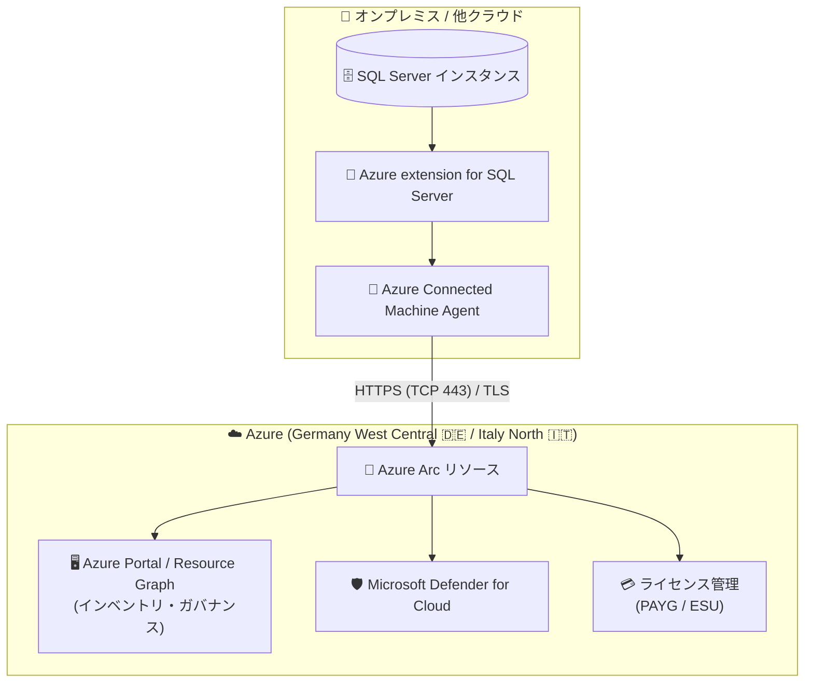

# Azure Arc-enabled SQL Server: Germany West Central / Italy North リージョンで一般提供開始

**リリース日**: 2026-09-29

**サービス**: Azure Arc-enabled SQL Server (SQL Server enabled by Azure Arc)

**機能**: Germany West Central および Italy North リージョンでの一般提供 (リージョン拡大)

**ステータス**: Launched (GA)

[このアップデートのインフォグラフィックを見る](https://takech9203.github.io/azure-news-summary/20260929-arc-sql-server-germany-italy-regions.html)

## 概要

Azure Arc-enabled SQL Server が、新たに **Germany West Central (ドイツ西中部)** と **Italy North (イタリア北部)** の 2 リージョンで一般提供 (GA) となりました。本レポートは、同一サービスの関連する 2 件のリージョン拡大アナウンス (Germany West Central / Italy North) をまとめたものです。

Azure Arc-enabled SQL Server は、Azure 外部 (オンプレミスのデータセンター、エッジ拠点、他のパブリッククラウドやホスティングプロバイダー) でホストされている SQL Server インスタンスに Azure のサービスを拡張する機能です。SQL Server インスタンスを Azure Arc に接続することで、Azure ベースのインベントリ管理、ガバナンス、セキュリティ (Microsoft Defender for Cloud)、ベストプラクティス評価、移行評価、ライセンス管理 (従量課金や ESU サブスクリプション) といった機能を単一のコントロールポイントである Azure から利用できます。

今回のリージョン拡大により、ドイツおよびイタリアのリージョンに Arc リソースを配置できるようになり、両国のデータレジデンシー要件を持つ組織でも Arc-enabled SQL Server の管理機能を利用しやすくなります。

**アップデート前の課題**

- Germany West Central / Italy North は Arc-enabled SQL Server のサポートリージョンに含まれておらず、ドイツ・イタリア国内リージョンに Arc リソース (メタデータ) を配置できなかった
- データレジデンシーやコンプライアンス上、国内リージョンでの管理を求める組織は、他の欧州リージョン (West Europe、North Europe など) を選択する必要があった

**アップデート後の改善**

- Germany West Central と Italy North で Arc-enabled SQL Server が一般提供され、両リージョンに Arc リソースを配置してオンボーディングできるようになった
- ドイツ・イタリア国内のリージョンを使用しつつ、インベントリ、ガバナンス、セキュリティ、評価、ライセンス管理などの Azure ベースの管理機能を利用可能になった

## アーキテクチャ図

オンプレミス等の SQL Server は Azure Connected Machine Agent と Azure extension for SQL Server を通じて、アウトバウンドの HTTPS (TCP 443) のみで Azure Arc に接続されます。今回のアップデートで、この Arc リソースを Germany West Central と Italy North に配置できるようになりました。

## サービスアップデートの詳細

### 主要機能

1. **単一コントロールポイントからの大規模インベントリ管理**
   - Azure Portal で SQL Server の名前、バージョン、エディション、コア数、ホスト OS などの詳細を確認可能
   - Azure Resource Graph Explorer で全 SQL Server インスタンスを横断クエリ (例: 「SQL Server 2014 のインスタンス数は?」「Linux で稼働するインスタンスは?」)
   - バックアップ未実施や暗号化されていないデータベースの横断的な把握

2. **ベストプラクティス評価 (Best practices assessment)**
   - Microsoft サポートの実績に基づくベストプラクティスと構成を比較し、パフォーマンス・セキュリティ改善の具体的な推奨事項をレポート

3. **セキュリティ機能**
   - **Microsoft Defender for Cloud**: 脆弱性評価と脅威保護 (SQL Advanced Threat Protection ベースのアラート)
   - **Microsoft Entra 認証**: SQL Server 2022 以降で、MFA / SSO を含むモダンな ID 管理を SQL Server に適用可能

4. **ライセンス・課金管理**
   - **従量課金 (Pay-as-you-go)**: ライセンス購入の代わりに Azure 経由の従量課金モデルを選択可能 (SQL Server 2012〜2022 の全バージョンに対応)
   - **拡張セキュリティ更新プログラム (ESU)**: サポート終了後の SQL Server を最大 3 年間保護するサブスクリプションに対応

5. **移行評価 (Migration assessment)**
   - クラウド移行の準備状況分析、リスクと軽減策の特定、最適な Azure SQL 構成 (SKU サイズ) の推奨を自動生成 (既定で週 1 回実行)

6. **Microsoft Purview 連携**
   - アクセスポリシーなどのデータガバナンス機能との統合

## 技術仕様

| 項目 | 詳細 |
|------|------|
| 対応 SQL Server バージョン | SQL Server 2014 (12.x) 以降 (64 ビット版のみ) |
| 対応 OS (Windows) | Windows 10 / 11、Windows Server 2016 以降 |
| 対応 OS (Linux) | Ubuntu 20.04 (x64)、RHEL 8 (x64)、SLES 15 (x64) |
| .NET Framework | Windows では .NET Framework 4.7.2 以降が必要 |
| 接続方式 | Azure Connected Machine Agent + Azure extension for SQL Server によるアウトバウンド HTTPS (TCP 443、TLS)。HTTPS プロキシ、ExpressRoute、Private Link 経由の通信に対応 |
| 推奨システム要件 | 2 コア以上、512 MB 以上の空きメモリ |
| リージョン割り当て | Arc-enabled Server と Arc-enabled SQL Server インスタンスには同一リージョンを割り当てる必要がある |
| 拡張機能のサポート | 直近 1 年以内にリリースされた Azure extension for SQL Server バージョンのみサポート |

**主な非サポート構成 (抜粋):**

- Windows Server 2016 より前の Windows Server
- コンテナー内で稼働する SQL Server
- SQL Server 2012 以前のバージョン
- Azure Virtual Machines 上の SQL Server (Arc ではなく SQL Server on Azure VM の管理機能を使用)

## メリット

### ビジネス面

- ドイツ・イタリアのデータレジデンシー / コンプライアンス要件に合わせて、国内リージョンで Arc リソースを管理できる
- 従量課金 (PAYG) モデルにより、需要が変動する SQL Server のライセンスコストを最適化できる
- ESU サブスクリプションにより、サポート終了後の SQL Server を保護しながら移行を計画できる

### 技術面

- オンプレミス・マルチクラウドに散在する SQL Server を Azure から単一のコントロールポイントで一元管理
- アウトバウンド HTTPS (443) のみで接続でき、インバウンドポートの開放が不要
- ベストプラクティス評価・移行評価により、構成改善と Azure SQL への移行判断を支援

## デメリット・制約事項

- 一部機能 (Microsoft Defender for Cloud、ベストプラクティス評価など) は Azure Monitoring Agent (AMA) 拡張機能のインストールと Log Analytics ワークスペースへの接続が必要
- 機能の可用性は OS により異なる (ベストプラクティス評価、移行評価、詳細インベントリ、Defender for Cloud などは Windows のみ)
- Linux の PAYG 課金には制限があり、パッシブインスタンス検出などが利用できず全インスタンスがアクティブとして課金される
- ベストプラクティス評価、ESU、自動更新などの一部機能はライセンス種別 (Software Assurance / サブスクリプション / PAYG) が前提
- Arc データ処理サービスのエンドポイント (`<region>.arcdataservices.com`) への Private Link 接続は非サポート

## ユースケース

### ユースケース 1: ドイツ国内データセンターの SQL Server 資産の一元管理

**シナリオ**: ドイツ国内のデータセンターで多数の SQL Server を運用しており、コンプライアンス上、管理メタデータもドイツ国内リージョンに保持したい。

**効果**: Germany West Central に Arc リソースを配置して SQL Server をオンボーディングすることで、国内リージョン要件を満たしつつ、Azure Resource Graph によるインベントリの横断クエリ、Defender for Cloud によるセキュリティ監視、ベストプラクティス評価を利用できる。

### ユースケース 2: イタリア国内の SQL Server の Azure SQL 移行準備

**シナリオ**: Italy North を利用するイタリア国内の組織が、老朽化した SQL Server の Azure SQL への移行を計画している。

**効果**: Arc-enabled SQL Server の移行評価により、クラウド移行準備状況の分析、リスクの特定、最適な Azure SQL 構成 (SKU) の推奨を自動で取得できる。サポート終了バージョンには ESU サブスクリプションを適用し、移行完了まで保護を継続できる。

## 料金

Azure Arc への接続 (SQL Server inventory) 自体はすべてのライセンス種別で利用できますが、ベストプラクティス評価や ESU など一部機能は Software Assurance 付きライセンス、SQL Server サブスクリプション、または従量課金 (PAYG) サブスクリプションが必要です。詳細な料金は公式ページを参照してください。

- [Azure Arc の料金](https://azure.microsoft.com/pricing/details/azure-arc/)
- [ライセンスと課金の管理 (Microsoft Learn)](https://learn.microsoft.com/sql/sql-server/azure-arc/manage-license-billing)

## 利用可能リージョン

今回のアップデートで **Germany West Central** と **Italy North** が追加されました。既存のサポートリージョンには以下が含まれます (Microsoft Learn ドキュメントより)。

- **南北アメリカ**: Brazil South、Canada Central、Canada East、Central US、East US、East US 2、North Central US、South Central US、US Government Virginia、West Central US、West US、West US 2、West US 3
- **アジア太平洋**: Australia East、Central India、Japan East、Korea Central、Southeast Asia
- **欧州・中東・アフリカ**: France Central、North Europe、Norway East、South Africa North、Sweden Central、Switzerland North、UAE North、UK South、UK West、West Europe

最新のリージョン一覧は [公式ドキュメント](https://learn.microsoft.com/sql/sql-server/azure-arc/overview#supported-azure-regions) を参照してください。

## 関連サービス・機能

- **Azure Arc-enabled Servers**: SQL Server ホストの接続基盤。Azure Connected Machine Agent により Arc へ接続し、Run Command による T-SQL スクリプトの大規模実行にも対応
- **Microsoft Defender for Cloud**: Arc 経由で SQL Server の脆弱性評価・脅威保護を提供
- **Microsoft Entra ID**: SQL Server 2022 以降で Entra 認証 (MFA / SSO) を利用可能
- **Microsoft Purview**: データガバナンス (アクセスポリシー、データ分類) との統合
- **Azure Monitor / Log Analytics**: 評価・監視データの収集基盤 (AMA 拡張機能経由)
- **Azure SQL Managed Instance**: 移行評価・データベース移行 (Managed Instance link、LRS) の移行先

## 参考リンク

- [インフォグラフィック](https://takech9203.github.io/azure-news-summary/20260929-arc-sql-server-germany-italy-regions.html)
- [公式アップデート情報: Germany West Central](https://azure.microsoft.com/updates?id=570696)
- [公式アップデート情報: Italy North](https://azure.microsoft.com/updates?id=570763)
- [Microsoft Learn: SQL Server enabled by Azure Arc の概要](https://learn.microsoft.com/sql/sql-server/azure-arc/overview)
- [Azure Arc の料金](https://azure.microsoft.com/pricing/details/azure-arc/)

## まとめ

Azure Arc-enabled SQL Server の Germany West Central / Italy North への拡大は、機能追加ではなくリージョン拡大のアップデートですが、ドイツ・イタリアのデータレジデンシー要件を持つ組織にとっては、国内リージョンでハイブリッド SQL Server 資産を一元管理できるようになる重要な発表です。両国リージョンを利用している、または欧州の他リージョンで代替していた組織は、Arc リソースの配置先として新リージョンの利用を検討するとよいでしょう。オンボーディングの際は、Arc-enabled Server と Arc-enabled SQL Server インスタンスに同一リージョンを割り当てる要件に注意してください。

---

**タグ**: Azure Arc, SQL Server, Hybrid, リージョン拡大, Germany West Central, Italy North, GA
