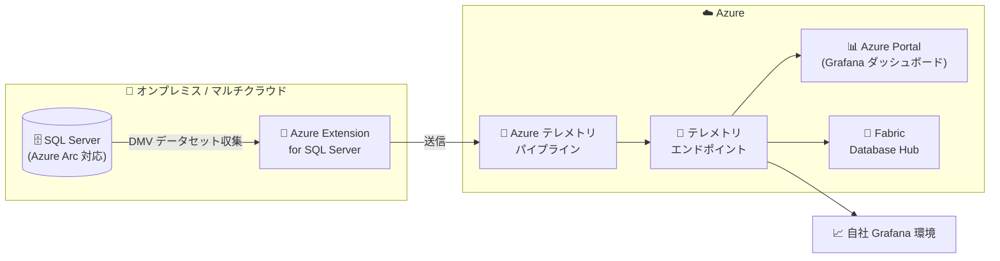

# Azure Arc: Arc-enabled SQL Server のパフォーマンス監視 (Public Preview 拡張)

**リリース日**: 2026-09-29

**サービス**: Azure Arc (SQL Server enabled by Azure Arc)

**機能**: Performance monitoring for Azure Arc–enabled SQL Server (テレメトリエンドポイント / Grafana ダッシュボード / Fabric Database Hub 統合)

**ステータス**: In preview

[このアップデートのインフォグラフィックを見る](https://takech9203.github.io/azure-news-summary/20260929-arc-sql-server-performance-monitoring.html)

## 概要

SQL Server enabled by Azure Arc のパフォーマンス監視 (Public Preview) が拡張され、パフォーマンスデータの探索・可視化の方法がより柔軟になりました。Microsoft が管理する監視データを **テレメトリエンドポイント** 経由で直接クエリできるようになり、Azure Portal の組み込み監視エクスペリエンスは **Grafana ダッシュボード** を採用しました。これにより、監視パイプラインを自前でデプロイ・管理することなく、すぐに使えるビューが提供されます。

さらに、同じテレメトリエンドポイントに自社の Grafana 環境を接続し、運用ニーズに合わせたカスタムダッシュボードを構築することも可能です。**Fabric Database Hub** との統合により、このテレメトリを Azure データベース資産全体 (estate レベル) の統一された監視エクスペリエンスに取り込めます。データベースをインスタンス単位で個別に監視する必要がなくなり、資産全体の健全性とパフォーマンスを一元的に把握できます。

パフォーマンスメトリックは、対象の Arc-enabled SQL Server インスタンス上の動的管理ビュー (DMV) データセットから自動的に収集され、Azure テレメトリパイプラインに送信されてほぼリアルタイムに処理されます。

**アップデート前の課題**

- Microsoft 管理の監視データは Azure Portal のパフォーマンスダッシュボードでの閲覧が中心で、外部ツールから直接クエリする手段がなかった
- 独自の可視化を行うには、監視パイプライン (データ収集・保存・可視化基盤) を自前でデプロイ・管理する必要があった
- ハイブリッド環境のデータベースをインスタンス単位で個別に監視する必要があり、資産全体を横断する統一ビューがなかった

**アップデート後の改善**

- テレメトリエンドポイント経由で Microsoft 管理の監視データを直接クエリ可能になった
- Azure Portal の組み込みエクスペリエンスが Grafana ダッシュボードとなり、パイプライン管理不要ですぐに使えるビューを提供
- 自社の Grafana 環境を同じテレメトリエンドポイントに接続し、カスタムダッシュボードを構築可能
- Fabric Database Hub 統合により、Azure データベース資産全体の estate レベル監視が可能

## アーキテクチャ図



Arc-enabled SQL Server の DMV から収集されたパフォーマンスデータは Azure テレメトリパイプラインで処理され、テレメトリエンドポイントを介して Azure Portal の Grafana ダッシュボード、自社 Grafana 環境、Fabric Database Hub から利用できます。

## サービスアップデートの詳細

### 主要機能

1. **テレメトリエンドポイントによる直接クエリ**
   - Microsoft が管理する監視データを、テレメトリエンドポイント経由で直接クエリ可能
   - 自前の監視データ保存基盤を構築せずに、収集済みデータへアクセスできる

2. **Azure Portal 組み込みの Grafana ダッシュボード**
   - Azure Portal のパフォーマンス監視エクスペリエンスが Grafana ダッシュボードを採用
   - 監視パイプラインのデプロイ・管理なしで、すぐに使えるビューを提供

3. **自社 Grafana 環境の接続**
   - 同じテレメトリエンドポイントに自社の Grafana を接続可能
   - 運用ニーズに合わせたカスタムダッシュボードを構築できる

4. **Fabric Database Hub との統合**
   - テレメトリを Fabric Database Hub に取り込み、estate レベルの統一監視を実現
   - Azure データベース資産全体の健全性・パフォーマンスを一元的に可視化

### 収集されるデータセット (DMV ベース)

Azure Portal が Arc-enabled SQL Server から収集する主な監視データセットは以下のとおりです (個人データや顧客コンテンツは収集されません)。

| データセット | 内容 | 収集頻度 |
|------|------|------|
| SqlServerActiveSessions | 実行中・ブロック・オープントランザクションを持つセッション | 30 秒 |
| SqlServerCPUUtilization | CPU 使用率の推移 | 10 秒 |
| SqlServerDatabaseProperties | データベースオプション・メタデータ | 5 分 |
| SqlServerDatabaseStorageUtilization | ストレージ使用量・永続バージョンストア | 1 分 |
| SqlServerMemoryUtilization | メモリクラークとメモリ消費 | 10 秒 |
| SqlServerPerformanceCountersCommon | 一般的なパフォーマンスカウンター (Batch Requests/sec、Page life expectancy など) | 1 分 |
| SqlServerPerformanceCountersDetailed | 詳細パフォーマンスカウンター (Log Growths、Version Store Size など) | 1 分 |
| SqlServerStorageIO | IOPS・スループット・レイテンシ統計 | 10 秒 |
| SqlServerWaitStats | 待機の種類と待機統計 (現時点ではダッシュボードでの可視化非対応) | 10 秒 |

## 技術仕様

| 項目 | 詳細 |
|------|------|
| データソース | 動的管理ビュー (DMV) データセット |
| 処理方式 | Azure テレメトリパイプラインによるほぼリアルタイム処理 |
| 可視化 | Azure Portal (Grafana ダッシュボード)、自社 Grafana、Fabric Database Hub |
| データアクセス | テレメトリエンドポイント経由の直接クエリ |
| 必要な RBAC アクション | `Microsoft.AzureArcData/sqlServerInstances/getTelemetry/` (組み込みロール: Azure Hybrid Database Administrator - Read Only Service Role) |

## 設定方法

### 前提条件

1. Azure Extension for SQL Server (`WindowsAgent.SqlServer`) のバージョンが v1.1.2504.99 以降であること
2. Arc-enabled SQL Server が Windows OS 上で稼働していること (Windows Server 2012 R2 以前は非対応)
3. SQL Server のエディションが Standard または Enterprise であること
4. SQL Server のバージョンが 2016 SP1 以降であること
5. サーバーから `*.<region>.arcdataservices.com` への接続性があること
6. ライセンスタイプが Software Assurance または従量課金 (pay-as-you-go) であること
7. `Microsoft.AzureArcData/sqlServerInstances/getTelemetry/` アクションを含む Azure ロールを保持していること

### Azure CLI

```bash
# 監視データ収集の有効化
az resource update \
  --ids "/subscriptions/<sub_id>/resourceGroups/<resource_group>/providers/Microsoft.AzureArcData/SqlServerInstances/<resource_name>" \
  --set 'properties.monitoring.enabled=true' \
  --api-version 2023-09-01-preview

# 監視データ収集の無効化
az resource update \
  --ids "/subscriptions/<sub_id>/resourceGroups/<resource_group>/providers/Microsoft.AzureArcData/SqlServerInstances/<resource_name>" \
  --set 'properties.monitoring.enabled=false' \
  --api-version 2023-09-01-preview
```

### Azure Portal

1. Arc-enabled SQL Server インスタンスのリソースページで **Performance Dashboard (preview)** を選択
2. **Performance Dashboard** ペイン上部の **Configure** を選択
3. **Configure monitoring settings** ペインで、トグルにより監視データ収集をオン/オフ
4. **Apply settings** を選択

前提条件をすべて満たしていれば、監視は自動的に行われます。メトリックの表示は、対象インスタンスで **Monitoring** > **Performance Dashboard** を選択します。

## メリット

### ビジネス面

- 監視基盤 (収集・保存・可視化パイプライン) の構築・運用コストを削減できる
- ハイブリッド/マルチクラウドに分散する SQL Server 資産を一元的に把握でき、運用の属人化を軽減
- プレビュー期間中は監視機能を無料で利用可能

### 技術面

- Microsoft 管理のテレメトリデータをエンドポイント経由で直接クエリでき、既存の Grafana 資産を活かせる
- Azure Portal でパイプライン管理不要の Grafana ダッシュボードをすぐに利用可能
- Fabric Database Hub との統合により、インスタンス単位ではなく estate レベルでの監視が可能
- DMV ベースのメトリックが最短 10 秒間隔で自動収集され、ほぼリアルタイムに処理される

## デメリット・制約事項

- パブリックプレビュー機能であり、Microsoft Azure プレビューの追加利用規約が適用される
- フェールオーバークラスターインスタンス (FCI) は現時点で非対応
- Windows OS 上の SQL Server のみ対応 (Windows Server 2012 R2 以前は非対応)
- SQL Server 2016 SP1 以降かつ Standard / Enterprise エディションが対象
- ライセンスタイプが Software Assurance または従量課金であることが必要
- 待機統計 (Wait statistics) は収集されるが、現時点ではパフォーマンスダッシュボードで可視化できない
- GA 後の料金は未定

## ユースケース

### ユースケース 1: 既存 Grafana 環境によるカスタム監視

**シナリオ**: オンプレミスの SQL Server 群を Azure Arc で管理しており、社内標準の可視化ツールとして Grafana を運用しているチームが、SQL Server のパフォーマンスも同じ Grafana で監視したい。

**実装**: 自社の Grafana 環境をテレメトリエンドポイントに接続し、CPU 使用率・ストレージ I/O・メモリ使用量などのデータセットを使って運用ニーズに合わせたダッシュボードを構築する。

**効果**: 監視データの収集・保存基盤を自前で構築せずに、既存の Grafana 運用に SQL Server パフォーマンス監視を統合できる。

### ユースケース 2: Fabric Database Hub による estate レベル監視

**シナリオ**: Azure とオンプレミスにデータベースが分散しており、インスタンスを 1 台ずつ確認する運用から脱却したい。

**実装**: Arc-enabled SQL Server のテレメトリを Fabric Database Hub に統合し、Azure データベース資産全体の健全性・パフォーマンスを一元的なビューで確認する。

**効果**: インスタンス単位の個別監視が不要になり、資産全体を横断した状況把握と優先順位付けが可能になる。

## 料金

プレビュー期間中、監視機能は **無料** で利用できます。GA 後の料金は未定 (to be determined) です。

| 項目 | 料金 |
|------|------|
| パフォーマンス監視 (プレビュー期間中) | 無料 |
| GA 後 | 未定 |

## 関連サービス・機能

- **Azure Arc-enabled servers**: Arc-enabled SQL Server の基盤。サーバーを Azure に接続し、Azure Extension for SQL Server を通じて監視データを収集する
- **Grafana**: Azure Portal 組み込みダッシュボードの基盤であり、自社環境からもテレメトリエンドポイントに接続して利用可能
- **Microsoft Fabric (Database Hub)**: テレメトリを取り込み、データベース資産全体の estate レベル監視を提供
- **Azure RBAC**: テレメトリ取得には `getTelemetry` アクションを含むロール (Azure Hybrid Database Administrator - Read Only Service Role など) が必要

## 参考リンク

- [インフォグラフィック](https://takech9203.github.io/azure-news-summary/20260929-arc-sql-server-performance-monitoring.html)
- [公式アップデート情報](https://azure.microsoft.com/updates?id=571904)
- [Microsoft Learn: Monitor SQL Server enabled by Azure Arc](https://learn.microsoft.com/sql/sql-server/azure-arc/sql-monitoring)
- [Azure Arc-enabled servers のネットワーク要件](https://learn.microsoft.com/azure/azure-arc/servers/network-requirements)

## まとめ

Arc-enabled SQL Server のパフォーマンス監視プレビューが拡張され、テレメトリエンドポイントによる直接クエリ、Azure Portal 組み込みの Grafana ダッシュボード、自社 Grafana 接続、Fabric Database Hub 統合が利用可能になりました。ハイブリッド環境の SQL Server を運用する Solutions Architect にとって、監視パイプラインを自前で構築せずに estate レベルの統一監視を実現できる重要なアップデートです。プレビュー期間中は無料のため、前提条件 (拡張機能バージョン v1.1.2504.99 以降、SQL Server 2016 SP1 以降の Standard/Enterprise、Windows OS など) を確認のうえ、検証環境での評価を推奨します。

---

**タグ**: Azure Arc, SQL Server, Hybrid + multicloud, Monitoring, Grafana, Microsoft Fabric, Public Preview
