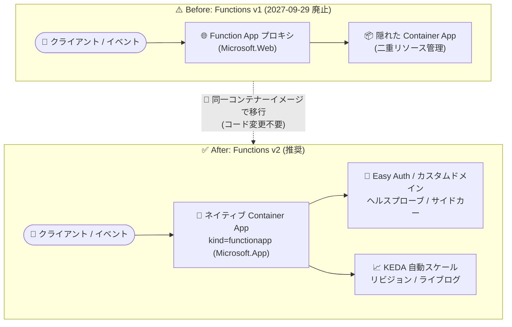

# Azure Container Apps: Azure Functions v1 ホスティングモデルの廃止 (Retirement)

**リリース日**: 2026-09-29

**サービス**: Azure Container Apps / Azure Functions

**機能**: Azure Functions v1 ホスティングモデル on Azure Container Apps の廃止

**ステータス**: Retirement (廃止日: 2027-09-29)

[このアップデートのインフォグラフィックを見る](https://takech9203.github.io/azure-news-summary/20260929-functions-v1-container-apps-retirement.html)

## 概要

Azure Container Apps 上の Azure Functions v1 ホスティングモデルが **2027 年 9 月 29 日に廃止** されることが発表されました。廃止日以降、Azure Container Apps 上の既存の Functions v1 アプリは動作を停止し、HTTP リクエストやイベント駆動トリガーを処理しなくなります。

Functions v1 は、Function App リソース (`Microsoft.Web` リソースプロバイダー) と裏側の隠れた Container App をペアで管理するレガシーなプロキシモデルです。後継の Functions v2 は、`kind=functionapp` を指定した単一のネイティブ Container App リソース (`Microsoft.App`) としてデプロイするモデルで、Container Apps のネイティブ機能をフル活用できます。

なお、この廃止は Azure Container Apps 上の **ホスティングモデル** が対象であり、関数コードで使用する Azure Functions の **プログラミングモデルのバージョンには影響しません**。標準的な移行では既存のコンテナーイメージをそのまま再利用でき、関数コードの変更は不要です。

**アップデート前の課題 (v1 モデルの制限)**

- プロキシ用 Function App と隠れた Container App の 2 リソースを管理する必要があり、運用が複雑だった
- Easy Auth、ヘルスプローブ、カスタムドメイン、マネージド証明書、サイドカー、Container Apps シークレット、マルチリビジョンのトラフィック分割などのネイティブ機能が利用できなかった
- コンテナーへの直接アクセスやリアルタイムのコンソール出力がなく、トラブルシューティングは Log Analytics / Application Insights 経由に限られた
- .NET isolated と Dapr の組み合わせでビルド時・実行時に競合が発生するケースがあった

**アップデート後の対応 (v2 モデルへの移行)**

- `kind=functionapp` の単一ネイティブリソースとなり、管理がシンプルになる
- Easy Auth、ヘルスプローブ、カスタムドメイン、シークレット、サイドカー、リビジョン管理、詳細なスケール設定など Container Apps の全機能が利用可能になる
- ライブログストリーミングや診断など、直接的なトラブルシューティングが可能になる
- 今後のロードマップ機能 (関数一覧、キー管理、呼び出し数の表示など) は v2 のみに提供予定

## アーキテクチャ図



v1 のプロキシ + 隠れた Container App という二重構造から、v2 では `kind=functionapp` の単一ネイティブリソースに移行します。既存のコンテナーイメージを再利用でき、標準的な移行では関数コードの変更は不要です。

## サービスアップデートの詳細

### 廃止のポイント

1. **廃止日: 2027 年 9 月 29 日**
   - この日以降、Azure Container Apps 上の Functions v1 アプリは実行を停止し、リクエストおよびイベント駆動トリガーを処理しなくなる

2. **影響範囲はホスティングモデルのみ**
   - Azure Container Apps 上のホスティングモデル (v1) が対象。関数コードのプログラミングモデルのバージョンには影響しない

3. **移行先は Functions v2 (ネイティブモデル)**
   - `kind=functionapp` で構成されたネイティブ Azure Container App を使用する。既存のコンテナーイメージは再利用可能

4. **移行アシスタントの提供**
   - Microsoft から「Azure Functions on Azure Container Apps v1 migration assistant」(Azure-Samples の GitHub リポジトリ) が提供されている

5. **`kind=functionapp` なしの直接イメージデプロイは非サポート**
   - `kind=functionapp` を指定せず Functions イメージを手動実行する構成はサポート対象外。自動スケールルールが構成されず、今後の v2 プラットフォーム機能も提供されない

### v1 と v2 のモデル比較

| 項目 | v1 (レガシー) | v2 (推奨) |
|------|--------------|-----------|
| リソースモデル | プロキシ Function App + 隠れた Container App | 単一ネイティブ Container App (`kind=functionapp`) |
| ネイティブ機能 (リビジョン、シークレット、ヘルスプローブ、カスタムドメイン、サイドカー) | 非サポート | サポート |
| スケール制御 (クールダウン、ポーリング間隔) | 限定的 | Container Apps の全スケールオプション |
| ログ・トラブルシューティング | 間接的 (ライブコンソールなし) | 直接的 (ライブログ・診断あり) |
| Dapr 統合 | .NET isolated の一部シナリオで問題あり | 標準パターンでサポート |
| 認証 (Easy Auth) | 利用不可 | 利用可能 |
| 証明書・カスタムドメイン | 利用不可 | 利用可能 |
| メトリクス・アラート | 基本のみ | ネイティブのフル機能 |
| 今後のロードマップ (関数一覧、キー、呼び出し数) | 提供予定なし | 提供予定 |
| 運用の複雑さ | 2 リソース管理 | 単一リソース |
| 新規デプロイでの推奨 | 非推奨 | 推奨 |

## 技術仕様

| 項目 | 詳細 |
|------|------|
| 廃止対象 | Azure Container Apps 上の Azure Functions v1 ホスティングモデル |
| 廃止日 | 2027 年 9 月 29 日 |
| 廃止後の動作 | v1 アプリは動作を停止し、リクエスト・イベント駆動トリガーを処理しない |
| 移行先 | Functions v2: `kind=functionapp` のネイティブ Container App (`Microsoft.App`) |
| コンテナーイメージ | 既存イメージを再利用可能 |
| 関数コード | 標準的な移行では変更不要 |
| スケーリング (v2) | KEDA によるイベント駆動の自動スケール (ゼロスケール対応、最大 1,000 インスタンス) |
| 移行支援ツール | Azure Functions on Azure Container Apps v1 migration assistant (GitHub / Azure-Samples) |

## 設定方法 (移行手順)

### 前提条件

1. Azure サブスクリプションとリソース作成権限
2. 最新の Azure CLI と拡張機能 (`az extension add --name containerapp`、必要に応じて `az extension add --name functionapp`)
3. v1 デプロイで使用中のコンテナーイメージへのアクセス
4. 環境変数、シークレット、ストレージバインディング、ネットワーク設定のインベントリ

### 移行手順の概要

1. **準備**: 現在のデプロイが Functions v1 であることを確認し、環境変数・シークレット・接続文字列・カスタムバインディングなどの構成 (ID、ネットワーク、スケーリング含む) をすべて記録する。環境のクォータ (CPU、メモリ、最大インスタンス数) も確認する
2. **v2 アプリ作成**: Container Apps 環境を作成 (または再利用) し、同一イメージで `kind=functionapp` の v2 アプリをデプロイして構成を再適用する
3. **検証**: HTTP トリガーの呼び出し、各トリガータイプ (Event Hubs、Service Bus、タイマーなど) のテスト、Application Insights / Log Analytics の確認、負荷時のスケール動作確認を行う
4. **DNS / カスタムドメイン更新** (必要な場合): 新しい v2 ホスト名へのマッピングと TLS 証明書の再バインド
5. **本番切り替え**: トラフィックを移行し、レイテンシ・エラー・呼び出し数を監視する
6. **クリーンアップ**: v1 側にトラフィックが残っていないことを確認したうえで、旧 v1 Functions アプリと関連リソースを廃止する

### Azure CLI

```bash
# v2 (kind=functionapp) の Container App を同一イメージで作成
az containerapp create \
  --name my-func-v2 \
  --resource-group <RESOURCE_GROUP_NAME> \
  --environment <ENVIRONMENT_NAME> \
  --image myregistry.azurecr.io/<IMAGE_NAME>:<TAG_NAME> \
  --kind functionapp \
  --ingress external --target-port <TARGET_PORT>
```

### Azure Portal

Azure Portal では、Container App の作成時に「Optimize for Azure Functions」オプションを選択することで、Functions 向けに構成されたネイティブ Container App を作成できます。

## メリット (v2 移行による)

### ビジネス面

- 単一リソース管理による運用負荷・管理コストの削減
- Azure Functions の今後のロードマップ (関数一覧、キー管理、呼び出し数表示など) に沿った構成となり、将来にわたるサポートを確保できる
- Easy Auth やマネージド証明書により、セキュリティ対応の実装工数を削減できる

### 技術面

- ヘルスプローブによる回復性の向上
- マルチリビジョンデプロイとトラフィック分割による安全なリリース
- ライブログストリーミングと診断による迅速なトラブルシューティング
- ポーリング間隔やクールダウンなど詳細なスケールルール設定が可能
- シークレットのネイティブ保存とサイドカーコンテナーのマウントに対応

## デメリット・制約事項

- **移行期限は 2027 年 9 月 29 日**。期限までに移行しない場合、v1 アプリは動作を停止し、リクエストやイベント駆動トリガーを処理しなくなる
- 移行時にはシークレット、ID、ネットワーク、スケーリングなどの構成を v2 アプリへ手動で再適用する必要がある
- カスタムドメイン利用時は、新しい v2 ホスト名への DNS 更新と証明書の再バインドが必要
- `kind=functionapp` を指定しない Functions イメージの直接デプロイはサポート対象外
- Microsoft は、廃止日より十分前に移行と本番環境での検証を完了することを推奨している

## 料金

Azure Container Apps 上の Azure Functions (v2) は、Azure Container Apps と同じ料金モデルに従います。環境で選択するプランに基づいて課金されます。

| 項目 | 内容 |
|------|------|
| Consumption プラン | アプリ実行中に使用したリソース (vCPU、メモリ、リクエスト) に対して課金されるサーバーレスオプション |
| Dedicated プラン | ワークロードプロファイルごとに割り当てられたインスタンスに対して課金 |
| Functions プログラミングモデルの利用 | Container Apps 内での利用に追加料金なし |

詳細は [Azure Container Apps の料金ページ](https://azure.microsoft.com/pricing/details/container-apps/) を参照してください。

## 関連サービス・機能

- **Azure Functions**: 廃止対象は Container Apps 上のホスティングモデルのみ。Flex Consumption、Premium、Dedicated などの他のホスティングプランは本廃止の対象外
- **KEDA (Kubernetes Event-driven Autoscaling)**: v2 モデルではトリガー構成から KEDA スケールルールが自動生成され、ゼロスケールから最大 1,000 インスタンスまで自動スケールする
- **Dapr**: v2 モデルでは標準パターンで Dapr 統合をサポート (v1 では .NET isolated との組み合わせで問題があった)
- **Application Insights / Log Analytics**: 移行後の検証でテレメトリとログの確認に使用する
- **Azure API Management**: Functions のエンドポイント保護や API ゲートウェイシナリオで組み合わせて使用

## 参考リンク

- [インフォグラフィック](https://takech9203.github.io/azure-news-summary/20260929-functions-v1-container-apps-retirement.html)
- [公式アップデート情報](https://azure.microsoft.com/updates?id=570800)
- [移行ガイド: Migrate to Azure Functions v2 on Azure Container Apps](https://learn.microsoft.com/azure/container-apps/migrate-functions)
- [Azure Functions on Azure Container Apps overview](https://learn.microsoft.com/azure/container-apps/functions-overview)
- [自動スケーリング付き Functions アプリの作成](https://learn.microsoft.com/azure/container-apps/functions-usage)
- [v1 migration assistant (GitHub)](https://github.com/Azure-Samples/functions-on-container-apps-v1-migration-assistant)
- [料金ページ](https://azure.microsoft.com/pricing/details/container-apps/)

## まとめ

Azure Container Apps 上の Azure Functions v1 ホスティングモデルは 2027 年 9 月 29 日に廃止され、それ以降 v1 アプリは動作を停止します。対象はホスティングモデルのみで関数のプログラミングモデルには影響せず、既存のコンテナーイメージを再利用して `kind=functionapp` の v2 ネイティブモデルへコード変更なしで移行できます。v2 は Easy Auth、ヘルスプローブ、カスタムドメイン、リビジョン管理などのネイティブ機能が利用でき、運用面でも単一リソース管理に簡素化されます。Azure 環境を棚卸しして影響を受ける v1 アプリを特定し、移行アシスタントや移行ガイドを活用して、廃止日より十分前に移行と本番検証を完了することを推奨します。

---

**タグ**: Azure Container Apps, Azure Functions, Retirement, Containers, Migration, KEDA
