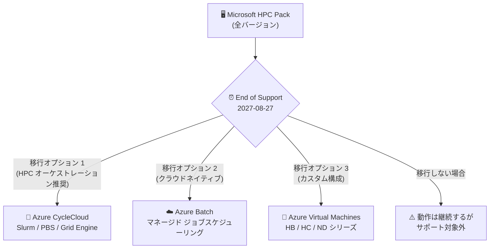

# Microsoft HPC Pack: 全バージョンのリタイアメント (サポート終了: 2027 年 8 月 27 日)

**リリース日**: 2026-09-29

**サービス**: Microsoft HPC Pack

**機能**: 全バージョンのリタイアメント

**ステータス**: Retirement

[このアップデートのインフォグラフィックを見る](https://takech9203.github.io/azure-news-summary/20260929-hpc-pack-retirement.html)

## 概要

Microsoft は、Microsoft HPC Pack の全バージョンをリタイア (廃止) することを発表しました。サポート終了 (End of Support) は **2027 年 8 月 27 日** です。HPC Pack は本発表をもって 1 年間のリタイアメント期間に入り、この期間中 Microsoft は限定的な「リタイアメント専用サポート」のみを提供します。

HPC Pack は、オンプレミスの Windows / Linux コンピュートノード、ワークステーション、Azure 上のオンデマンドコンピュートリソースを組み合わせた HPC クラスターの構築・管理とジョブスケジューリングを提供する Microsoft のソリューションで、オンプレミス・ハイブリッド・IaaS の 3 つのクラスターモードをサポートしてきました。HPC Pack 2019 が最終バージョンであり、後継となる新しい HPC Pack バージョンは提供されません。

サポート終了日以降、HPC Pack は更新プログラム、修正、テクニカルサポートを一切受けられなくなります。既存のデプロイメントは動作し続けますが、サポート対象外となります。Microsoft は移行先として、マネージドな並列・HPC スケジューリングのための **Azure Batch**、または他の適切な Azure サービスの検討を推奨しています。Microsoft Learn の移行ガイドでは、**Azure CycleCloud** (HPC オーケストレーション向け推奨)、**Azure Batch** (クラウドネイティブなジョブスケジューリング向け)、**Azure Virtual Machines** (カスタム HPC クラスター向け) の 3 つの選択肢が示されています。ただし、いずれの代替サービスも機能の 1 対 1 の互換性 (フィーチャーパリティ) は保証されません。

**アップデート前の課題**

- HPC Pack はオンプレミス・ハイブリッド・IaaS の HPC クラスター管理に広く利用されてきたが、最終バージョンである HPC Pack 2019 のライフサイクル終了が近づいていた
- HPC Pack を利用中の組織は、今後のサポート方針と移行先が不明確だった

**アップデート後の改善 (明確化された点)**

- リタイアメントのタイムライン (End of Support: 2027 年 8 月 27 日) が正式に確定した
- リタイアメント期間中のサポート範囲 (対象/対象外) が明確に定義された
- 公式の移行先の選択肢 (Azure CycleCloud、Azure Batch、Azure Virtual Machines) と移行ガイドが提示された

## アーキテクチャ図

HPC Pack のサポート終了 (2027 年 8 月 27 日) までに、公式に推奨されている 3 つの Azure ベースの移行先のいずれかへワークロードを移行する必要があります。移行しない場合、クラスターは動作し続けますがサポート対象外となります。

## サービスアップデートの詳細

### リタイアメント期間中のサポート範囲 (End of Support まで)

**サポート対象 (In scope):**

1. **セキュリティ / CVE 対応**
   - セキュリティ / CVE (共通脆弱性識別子) への対応と、必要なセキュリティ更新プログラムの提供

2. **既存ドキュメントに基づくガイダンス**
   - 既存のドキュメントおよび検証済み構成に基づくガイダンスの提供

3. **サポート対象コンポーネントの支援**
   - サポート対象コンポーネントとドキュメント化された機能に関する支援

4. **長期サポートオプションの個別評価**
   - 利用可能な場合、長期サポートオプションをケースバイケースで評価

**サポート対象外 (Out of scope):**

- セキュリティ以外のバグ修正や製品改善
- 新機能、カスタムコード、設計変更
- 新しい OS、ハードウェア、依存関係、アーキテクチャ、統合の検証
- 新規の製品調査やドキュメント作成
- 移行の計画、実行、コンサルティング
- サポート対象外の構成
- (移行ガイドより) パフォーマンス・信頼性・スケーラビリティの改善、顧客固有のホットフィックス、既存ドキュメントを超えるトラブルシューティング、新規顧客のオンボーディングとプリセールスサポート

### End of Support (2027 年 8 月 27 日) 以降

- 更新プログラム、修正、テクニカルサポートは一切提供されない
- 既存のデプロイメントは動作し続けるが、サポート対象外となる
- ドキュメントの更新も制限または中止される

## 技術仕様

| 項目 | 詳細 |
|------|------|
| 対象製品 | Microsoft HPC Pack の全バージョン (HPC Pack 2019、2016、2012 R2 / 2012 など) |
| リタイアメント期間開始 | 2026 年 9 月 (発表時点から約 1 年間) |
| End of Support (サポート終了日) | 2027 年 8 月 27 日 |
| 期間中のサポート | 限定的なリタイアメント専用サポート (セキュリティ / CVE 対応が中心) |
| サポート終了後の動作 | 既存デプロイメントは動作継続するがサポート対象外 |
| 直接のアップグレードパス | なし (HPC Pack の新バージョンは提供されない) |
| サポート延長の申請 | HPC Pack 2019 extension of support questionnaire (フォーム) 経由で製品チームに相談可能 |

## 推奨される移行先

### オプション 1: Azure CycleCloud (HPC オーケストレーション向け推奨)

**シナリオ**: 使い慣れたスケジューラーで Azure 上に HPC クラスターをデプロイ・管理したい場合。

- Slurm、PBS、Grid Engine などのスケジューラーをサポート
- クラスターのプロビジョニングとスケーリングを自動化
- ハイブリッド HPC シナリオに対応
- Azure Marketplace から「Azure CycleCloud Workspace for Slurm」をデプロイ可能

### オプション 2: Azure Batch (クラウドネイティブなジョブスケジューリング向け)

**シナリオ**: インフラを管理せずに大規模な並列・バッチワークロードを実行したい場合。

- フルマネージドサービス
- コンピュートプールの自動スケーリング
- コンテナーおよび HPC ワークロードとの統合
- HPC Pack から Azure Batch へのバースト機能も従来から提供されている

### オプション 3: Azure Virtual Machines (カスタム HPC クラスター向け)

**シナリオ**: Azure IaaS 上で HPC 環境を再構築・モダナイズしたい場合。

- HPC 最適化 VM サイズ (HB、HC、ND シリーズ) をデプロイ
- カスタムスケジューラーやオープンソースツールを利用可能
- 高性能なストレージ・ネットワークと統合

**注意**: いずれの代替サービスも HPC Pack との 1 対 1 の機能互換性は保証されません。移行計画時には、スケジューラー構成、ワークロードの種類、ストレージ依存関係、ネットワーク要件を確認して最適なオプションを選択する必要があります。

## 影響と必要なアクション

### 影響を受ける対象

- HPC Pack 2019 を使用したオンプレミスまたはハイブリッドクラスターを運用している組織
- HPC Pack のジョブスケジューリング、クラスターマネージャー、デプロイツールを使用している組織
- 本番環境や研究用途のワークロードを HPC Pack に依存している組織

### 移行しない場合のリスク

- セキュリティおよびコンプライアンスリスクの増大
- 新しい OS や統合との互換性問題
- 問題発生時のトラブルシューティング・解決手段の制限

### 推奨アクション

1. 現在の HPC Pack クラスターのインベントリを作成する
2. 重要なワークロードと依存関係を特定する
3. 移行オプション (CycleCloud / Batch / VM) を評価する
4. 2027 年 8 月 27 日より前に移行計画を立てて実行を開始する
5. 移行計画については Microsoft アカウントチームまたは Cloud Solution Architect に相談する (リタイアメント期間中のサポートには移行支援は含まれない)
6. 移行に関する課題やニーズは、公式フォーム (ESU Extend Request) を通じて共有する

## 関連サービス・機能

- **Azure CycleCloud**: Azure 上で Slurm、PBS、Grid Engine などのスケジューラーを使った HPC クラスターのオーケストレーションを提供。HPC オーケストレーション向けの推奨移行先
- **Azure Batch**: クラウドネイティブなフルマネージドの並列・バッチジョブスケジューリングサービス。インフラ管理不要の推奨移行先
- **Azure Virtual Machines (HB / HC / ND シリーズ)**: HPC 最適化 VM サイズ。カスタム HPC クラスターの再構築に利用
- **Azure HPC アーキテクチャリソース**: Azure でのバッチ・HPC ワークロードの技術リソース (Azure Architecture Center)

## 参考リンク

- [インフォグラフィック](https://takech9203.github.io/azure-news-summary/20260929-hpc-pack-retirement.html)
- [公式アップデート情報](https://azure.microsoft.com/updates?id=570046)
- [Migrate HPC Pack 2019 (公式移行ガイド)](https://learn.microsoft.com/en-us/powershell/high-performance-computing/hpc-pack-2019-retirement-migration-guide)
- [Microsoft HPC Pack 2019 概要](https://learn.microsoft.com/en-us/powershell/high-performance-computing/overview)
- [Azure CycleCloud Workspace for Slurm のデプロイ](https://learn.microsoft.com/en-us/azure/cyclecloud/qs-deploy-ccws)
- [Azure Batch 技術概要](https://learn.microsoft.com/en-us/azure/batch/batch-technical-overview)

## まとめ

Microsoft HPC Pack の全バージョンが 2027 年 8 月 27 日にサポート終了となり、後継バージョンは提供されません。リタイアメント期間中のサポートはセキュリティ / CVE 対応など限定的な範囲にとどまり、移行支援は含まれないため、HPC Pack を利用中の組織は今すぐワークロードの棚卸しと移行評価を開始すべきです。移行先としては Azure CycleCloud (スケジューラーベースの HPC オーケストレーション)、Azure Batch (マネージドなジョブスケジューリング)、Azure Virtual Machines (カスタム HPC クラスター) が公式に推奨されていますが、機能の 1 対 1 互換は保証されないため、スケジューラー構成やワークロード特性を踏まえた早期の移行計画が重要です。

---

**タグ**: HPC Pack, Retirement, Azure Batch, Azure CycleCloud, Azure Virtual Machines, HPC, サポート終了
