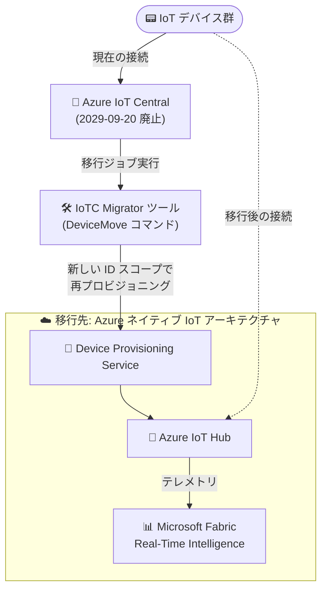

# Azure IoT Central: サービス廃止 (2029 年 9 月 20 日)

**リリース日**: 2026-09-29

**サービス**: Azure IoT Central

**機能**: サービス廃止 (Retirement) の発表

**ステータス**: Retirement

[このアップデートのインフォグラフィックを見る](https://takech9203.github.io/azure-news-summary/20260929-iot-central-retirement.html)

## 概要

Microsoft は、IoT アプリケーションプラットフォーム (aPaaS) である Azure IoT Central を **2029 年 9 月 20 日に廃止 (retire)** することを発表しました。廃止日までは引き続き IoT Central を利用できますが、Microsoft は早期に移行計画を開始することを推奨しています。Azure IoT の進化に伴い、Microsoft は今後の投資を他の領域に集中させるとしています。

Azure IoT Central は、デバイスの接続・監視・管理を Web UI で完結できるフルマネージドの IoT アプリケーションプラットフォームとして提供されてきました。Microsoft Learn の移行ガイダンスでは、移行先として **Azure IoT Hub + Device Provisioning Service (DPS)** を中核とし、分析・ダッシュボードを **Microsoft Fabric Real-Time Intelligence** で置き換える「Azure ネイティブ IoT プラットフォームサービスアーキテクチャ」が提示されています。デバイス移行を自動化する **IoTC Migrator** ツールや、Fabric の分析環境を短時間で構築できるソリューションアクセラレータも提供されています。

**廃止による影響**

- 2029 年 9 月 20 日以降、Azure IoT Central は利用できなくなる
- IoT Central 上のデバイス接続、デバイステンプレート、ダッシュボード、ルール、データエクスポートなどの機能を代替アーキテクチャへ移し替える必要がある
- 移行完了までは IoT Central のデバイス単位の課金が継続する (アプリケーションからデバイスを削除するまで課金対象)

**推奨される対応**

- 早期に移行計画 (アセスメントとインベントリ作成) を開始する
- IoT Hub + DPS + Microsoft Fabric による移行先アーキテクチャを非本番環境で先行構築し、並行稼働させながら段階的 (ウェーブ単位) にデバイスを移行する
- 移行完了後に IoT Central アプリケーションからデバイスを削除し、最終的にアプリケーションを削除して課金を停止する

## アーキテクチャ図

IoTC Migrator ツールが IoT Central 上のデバイスに DeviceMove コマンドを送信し、デバイスは移行先 DPS の ID スコープで再プロビジョニングして IoT Hub へ接続します。テレメトリの分析・可視化は Microsoft Fabric Real-Time Intelligence が担います。

## サービスアップデートの詳細

### 廃止の要点

1. **廃止日: 2029 年 9 月 20 日**
   - 廃止日までは IoT Central を継続利用可能。ただし Microsoft は早期の移行計画開始を推奨

2. **推奨移行先: Azure ネイティブ IoT プラットフォームサービスアーキテクチャ**
   - 接続・プロビジョニング: Azure IoT Hub + Device Provisioning Service (DPS)
   - デバイス状態・リモート操作: デバイスツイン + ダイレクトメソッド
   - 分析・ダッシュボード: Microsoft Fabric Real-Time Intelligence (Eventstream、Eventhouse/KQL、Real-Time Dashboards、Power BI)

3. **デバイス移行の 3 つのパス** (シンプルな順)
   - デバイスが `DeviceMove` コマンドを実装している場合: **IoTC Migrator ツール**で DPS ベースの再プロビジョニングを段階的に実行
   - `DeviceMove` を実装していない場合: 移行先 DPS の **ID スコープを指すファームウェア更新**を配信
   - ファームウェアで ID スコープを変更できない場合 (ハードコード等): **Microsoft サポートに連絡**し、バックエンドでの ID スコープスワップをケースバイケースで検討

4. **Fabric ソリューションアクセラレータ**
   - [Azure IoT Solution Accelerator Workload for Microsoft Fabric Real-Time Intelligence](https://github.com/Azure-Samples/azure-iot-accelerator-workload-for-fabric-rti) により、IoT Hub テレメトリに対する Eventstream 取り込み、Eventhouse/KQL データベース、Real-Time Dashboards をエンドツーエンドでデプロイ可能

### 機能対応表 (Capability Parity)

Microsoft Learn の移行プレイブックでは、IoT Central の各機能に対する Azure ネイティブの移行先が次のように示されています。

| IoT Central の機能 | Azure ネイティブの移行先 |
|------|------|
| デバイス ID / レジストリ | IoT Hub の ID 管理 + DPS 登録グループ |
| デバイステンプレート・モデル | IoT Plug and Play (DTDL) + アプリケーションメタデータ |
| クラウドプロパティ | ツインの desired プロパティ + タグ + アプリメタデータ |
| コマンド | ダイレクトメソッド / desired プロパティ |
| ジョブ / 一括操作 | IoT Hub ジョブ |
| ルール・自動化 | メッセージルーティング + Event Grid + Functions / Logic Apps、または Fabric Activator |
| データエクスポート | IoT Hub ルート + Fabric Eventstream |
| ダッシュボード・分析 | Microsoft Fabric Real-Time Intelligence (Eventstream、Eventhouse/KQL、Real-Time Dashboards、Power BI) |
| デバイス管理 UX | カスタムポータル / 社内運用ツール |
| 監視・アラート | Azure Monitor + Event Grid + Log Analytics、または Fabric Activator |
| デバイス更新 | Device Update for IoT Hub (該当する場合) |

## 技術仕様

| 項目 | 詳細 |
|------|------|
| 廃止日 | 2029 年 9 月 20 日 |
| 廃止までの利用 | 継続利用可能 (ただし早期の移行計画開始を推奨) |
| 推奨移行先 (制御プレーン) | Azure IoT Hub + Device Provisioning Service (DPS) |
| 推奨移行先 (分析) | Microsoft Fabric Real-Time Intelligence |
| デバイス移行ツール | IoTC Migrator (要 Node.js / npm、Microsoft Entra アプリ登録) |
| 移行ツールの前提 | デバイスが `migration` コンポーネント (`dtmi:azureiot:DeviceMigration;1`) の `DeviceMove` コマンドを実装、移行先 IoT Hub が DPS にリンク済み |
| 移行ツールの制限 | 未割り当て (unassigned) デバイスはデバイスグループに追加できないため移行ツールでは移行不可 |
| 既存データの持ち出し | 継続的データエクスポート (Azure Data Lake、Event Hubs、Webhook など)、デバイステンプレートは UI / REST API、ユーザーは REST API でエクスポート |

## 移行手順 (推奨フェーズ)

Microsoft Learn の移行プレイブックでは、次の 6 フェーズによる段階的な移行が推奨されています。

| フェーズ | ゴール |
|------|------|
| 1. アセスメントと計画 | 現行ソリューション (テンプレート、デバイス、グループ、ジョブ、エクスポート、ダッシュボード、ロール) のインベントリ化と要件定義 |
| 2. 移行先プラットフォームの構築 | IoT Hub、DPS、Fabric アクセラレータを非本番環境にデプロイ |
| 3. プロトタイプとテスト | パイロット環境でアーキテクチャを検証 (モデル・プロパティ・コマンドのマッピング検証、負荷テスト) |
| 4. ウェーブ単位のデバイス移行 | 管理可能なバッチでデバイスを段階移行し、各ウェーブ後に検証 |
| 5. 機能の置き換え | ダッシュボード、ルール、運用ツールを本格稼働 |
| 6. 検証・廃止・クリーンアップ | 本番ワークロードの移行完了を確認し、IoT Central のデバイス削除とアプリケーション削除を実施 |

**移行中のポイント:**

- 移行期間中は IoT Central を稼働させたまま並行運用し、問題発生時にロールバックできるようにする
- IoT Central の継続的データエクスポートと IoT Hub のテレメトリを同じデータレイクに格納し、新旧のデータを並べて検証する
- 移行後もデバイスは IoT Central アプリケーションから自動削除されず課金が継続するため、検証完了後に明示的に削除する

## デメリット・制約事項

- 2029 年 9 月 20 日以降は IoT Central を利用できなくなるため、期限までに移行を完了する必要がある
- IoT Central のフルマネージドなアプリケーション体験 (組み込み UI、ダッシュボード、ルール) は、移行先では IoT Hub / DPS / Fabric / カスタムツールの組み合わせで再構築が必要となり、構築・運用の責任範囲が広がる
- IoTC Migrator ツールは未割り当てデバイスを移行できない
- デバイスファームウェアが `DeviceMove` コマンド未実装かつ DPS ID スコープを変更できない場合は、Microsoft サポートへの個別相談が必要
- Microsoft サポートによる ID スコープスワップを利用した場合、ロールバックには変更の取り消しが必要で、全デバイスが IoT Central に再プロビジョニングされる

## 料金

IoT Central の Standard プラン (Standard 0 / 1 / 2) はデバイス単位の課金で、最初の 2 デバイスは無料です。移行後もデバイスを IoT Central アプリケーションから削除するまではプロビジョニング済みデバイスとして課金が継続する点に注意してください。移行先の IoT Hub、DPS、Microsoft Fabric はそれぞれ個別の料金体系となります。

- [Azure IoT Central の料金](https://azure.microsoft.com/pricing/details/iot-central/)
- [Azure IoT Hub の料金](https://azure.microsoft.com/pricing/details/iot-hub/)

## 関連サービス・機能

- **Azure IoT Hub**: 推奨移行先の中核。デバイスとの安全な双方向通信、デバイスツイン、ダイレクトメソッド、メッセージルーティングを提供
- **Azure IoT Hub Device Provisioning Service (DPS)**: スケーラブルで安全なデバイスオンボーディング。移行時の再プロビジョニングにも使用
- **Microsoft Fabric Real-Time Intelligence**: IoT Central の組み込み分析・ダッシュボードの移行先。Eventstream、Eventhouse/KQL、Real-Time Dashboards、Fabric Activator (ノーコードアラート)、Power BI を提供
- **IoT Plug and Play (DTDL)**: IoT Central のデバイステンプレートの移行先となるデバイスモデル定義
- **Device Update for IoT Hub**: デバイス更新が移行スコープに含まれる場合のライフサイクル管理
- **Azure Monitor / Event Grid / Log Analytics**: 移行先アーキテクチャでの監視・アラート

## 参考リンク

- [インフォグラフィック](https://takech9203.github.io/azure-news-summary/20260929-iot-central-retirement.html)
- [公式アップデート情報](https://azure.microsoft.com/updates?id=569914)
- [Migrate from IoT Central to Native Azure IoT architecture (Microsoft Learn)](https://learn.microsoft.com/azure/iot-central/core/howto-migrate-to-azure-native-iot)
- [Migrate devices from Azure IoT Central to Azure IoT Hub (Microsoft Learn)](https://learn.microsoft.com/azure/iot-central/core/howto-migrate-to-iot-hub)
- [IoTC Migrator ツール (GitHub)](https://github.com/Azure/iotc-migrator)
- [Azure IoT Solution Accelerator Workload for Microsoft Fabric Real-Time Intelligence (GitHub)](https://github.com/Azure-Samples/azure-iot-accelerator-workload-for-fabric-rti)
- [Azure IoT Central の料金ページ](https://azure.microsoft.com/pricing/details/iot-central/)

## まとめ

Azure IoT Central の 2029 年 9 月 20 日廃止が正式に発表されました。廃止まで約 3 年の猶予がありますが、デバイスフリートの再プロビジョニング、デバイスモデルの DTDL への変換、ダッシュボード・ルール・運用ツールの再構築を伴う大規模な移行となるため、Microsoft が推奨するとおり早期の移行計画開始が重要です。まずは現行 IoT Central アプリケーションのインベントリ作成と、IoT Hub + DPS + Microsoft Fabric による移行先アーキテクチャの非本番環境での検証から着手し、IoTC Migrator ツールや Fabric ソリューションアクセラレータを活用してウェーブ単位の段階的な移行を進めることを推奨します。

---

**タグ**: Azure IoT Central, Internet of Things, Retirement, Azure IoT Hub, Device Provisioning Service, Microsoft Fabric, 移行
