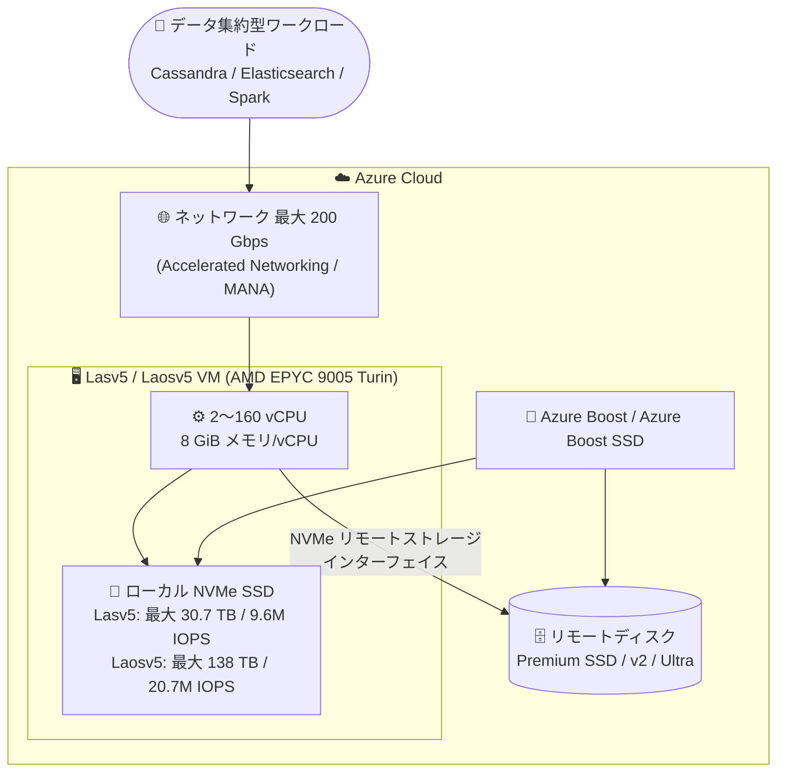

# Azure Virtual Machines: ストレージ最適化 Lasv5 / Laosv5 VM シリーズが一般提供開始 (GA)

**リリース日**: 2026-09-29

**サービス**: Azure Virtual Machines

**機能**: Storage optimized Lasv5 and Laosv5 Azure VM series

**ステータス**: Launched (GA)

[このアップデートのインフォグラフィックを見る](https://takech9203.github.io/azure-news-summary/20260929-lasv5-laosv5-vm-series.html)

## 概要

第 5 世代 AMD EPYC™ プロセッサ (Turin、EPYC 9005、最大ブースト 4.5 GHz) を搭載したストレージ最適化 VM シリーズ「Lasv5」および「Laosv5」が一般提供 (GA) となりました。両シリーズは 2〜160 vCPU のサイズを提供し、vCPU あたり 8 GiB のメモリを搭載します。ローカル NVMe 一時ディスク容量は Lasv5 が vCPU あたり 240 GB (最大 30.7 TB、9.6M 読み取り IOPS)、Laosv5 が vCPU あたり 720 GB (最大 138 TB、20.7M 読み取り IOPS) です。

両シリーズとも最大 200 Gbps のネットワーク帯域をサポートし、前世代比で平均 CPU 性能が最大 35% 向上しています。Azure Boost と Azure Boost SSD を基盤とし、ローカル NVMe SSD のディスク暗号化が既定で有効化されるほか、Premium Storage キャッシュに対応した NVMe リモートストレージインターフェイスを備え、リモートストレージ性能が大幅に改善されています。

Cassandra、MongoDB、Elasticsearch、Spark、Redis などの分散データベース・ビッグデータ分析・データウェアハウスといった、vCPU あたり大容量のローカルストレージと高速なデータ転送を必要とするスケールアウト型ワークロードに最適です。

**アップデート前の課題**

- 前世代 Lasv4 では最大ローカルストレージ容量と vCPU サイズ (最大 96 vCPU 相当) に制約があった
- 前世代 Laosv4 は最大ローカルストレージ容量・読み取り IOPS が小さく、大規模サイズ (48/64/96/128/160 vCPU) が提供されていなかった

**アップデート後の改善**

- Lasv5: Lasv4 比で最大ローカルストレージ容量 33% 増、vCPU あたり一時ディスクランダム読み取り IOPS 9% 増、128 / 160 vCPU サイズを新規追加
- Laosv5: Laosv4 比で最大ローカルストレージ容量 500% 増、最大読み取り IOPS 619% 増、48 / 64 / 96 / 128 / 160 vCPU サイズを新規追加
- 両シリーズで平均 CPU 性能が最大 35% 向上、最大 200 Gbps のネットワーク帯域、ローカル NVMe SSD 暗号化の既定有効化

## アーキテクチャ図



Azure Boost がローカル NVMe SSD とリモートディスクの I/O をオフロードし、大容量ローカルストレージと高帯域ネットワークをデータ集約型ワークロードに提供する構成です。

## サービスアップデートの詳細

### 主要機能

1. **第 5 世代 AMD EPYC (Turin) プロセッサ搭載**
   - AMD EPYC 9005 プロセッサ (x86-64)、最大ブースト周波数 4.5 GHz
   - 前世代比で平均 CPU 性能が最大 35% 向上

2. **大容量・高性能なローカル NVMe ストレージ**
   - Lasv5: vCPU あたり 240 GB、最大 30.7 TB (3.84 TB x 8)、最大 9.6M ランダム読み取り IOPS
   - Laosv5: vCPU あたり 720 GB、最大 138 TB (15.36 TB x 9)、最大 20.7M ランダム読み取り IOPS

3. **Azure Boost / Azure Boost SSD 対応**
   - ストレージ・ネットワーク処理を専用ハードウェアにオフロード
   - ローカル NVMe SSD のディスク暗号化を既定で有効化

4. **NVMe リモートストレージインターフェイス**
   - Premium Storage キャッシュをサポートし、リモートストレージ性能を大幅に改善
   - 最大サイズで 400,000 IOPS / 12,000 MBps (Ultra Disk / Premium SSD v2、非キャッシュ)

5. **高帯域ネットワーク**
   - 最大 200,000 Mbps (200 Gbps) のネットワーク帯域 (160 vCPU サイズ)
   - Accelerated Networking と MANA (Microsoft Azure Network Adapter) をサポート

## 技術仕様

### シリーズ共通仕様

| 項目 | Lasv5 | Laosv5 |
|------|-------|--------|
| プロセッサ | AMD EPYC 9005 (Turin) [x86-64] | AMD EPYC 9005 (Turin) [x86-64] |
| vCPU | 2〜160 | 2〜160 |
| メモリ | 16〜1,280 GiB (8 GiB/vCPU) | 16〜1,040 GiB (8 GiB/vCPU) |
| ローカル NVMe (vCPU あたり) | 240 GB | 720 GB |
| 最大ローカルストレージ | 30.7 TB (3.84 TB x 8) | 138 TB (15.36 TB x 9) |
| 最大ローカル読み取り IOPS | 9,600,000 | 20,700,000 |
| リモートストレージ | 最大 64 ディスク、400,000 IOPS / 12,000 MBps | 最大 64 ディスク、400,000 IOPS / 12,000 MBps |
| 対応リモートディスク | Standard SSD/HDD、Premium SSD、Premium SSD v2、Ultra Disk (リージョンによる) | 同左 |
| 最大ネットワーク帯域 | 200,000 Mbps (15 NIC) | 200,000 Mbps (15 NIC) |
| アクセラレータ | なし | なし |

### 代表的なサイズ (Lasv5)

| サイズ | vCPU | メモリ (GiB) | 一時ディスク | ランダム読み取り IOPS |
|--------|------|-------------|-------------|---------------------|
| Standard_L2as_v5 | 2 | 16 | 480 GB x 1 | 150,000 |
| Standard_L8as_v5 | 8 | 64 | 1,920 GB x 1 | 600,000 |
| Standard_L32as_v5 | 32 | 256 | 3,840 GB x 2 | 2,400,000 |
| Standard_L64as_v5 | 64 | 512 | 3,840 GB x 4 | 4,800,000 |
| Standard_L128as_v5 | 128 | 1,024 | 3,840 GB x 8 | 9,600,000 |
| Standard_L160ias_v5 | 160 | 1,280 | 3,840 GB x 8 | 9,600,000 |

### 代表的なサイズ (Laosv5)

| サイズ | vCPU | メモリ (GiB) | 一時ディスク | ランダム読み取り IOPS |
|--------|------|-------------|-------------|---------------------|
| Standard_L2aos_v5 | 2 | 16 | 1,440 GB x 1 | 215,625 |
| Standard_L8aos_v5 | 8 | 64 | 5,760 GB x 1 | 862,500 |
| Standard_L32aos_v5 | 32 | 256 | 11,520 GB x 2 | 3,450,000 |
| Standard_L64aos_v5 | 64 | 512 | 15,360 GB x 3 | 6,900,000 |
| Standard_L128aos_v5 | 128 | 1,024 | 15,360 GB x 6 | 13,800,000 |
| Standard_L160iaos_v5 | 160 | 1,040 | 15,360 GB x 9 | 20,700,000 |

### 機能サポート (両シリーズ共通)

| 機能 | サポート状況 |
|------|-------------|
| Premium Storage / Premium Storage キャッシュ | サポート |
| Live Migration | 非サポート |
| Memory Preserving Updates | サポート |
| 第 2 世代 (Gen2) VM | サポート (Gen1 は非サポート) |
| Accelerated Networking | サポート |
| Ephemeral OS Disk | サポート |
| 入れ子になった仮想化 | サポート |

## 設定方法

### 前提条件

1. NVMe をサポートする OS イメージを使用すること (非対応イメージではエラーになる。主要な OS イメージは NVMe をサポート済み)
2. 利用するリージョンで Lasv5 / Laosv5 の vCPU クォータが確保されていること

### Azure CLI

```bash
# Lasv5 VM の作成例 (Standard_L8as_v5)
az vm create \
  --resource-group myResourceGroup \
  --name myLasv5VM \
  --image Ubuntu2404 \
  --size Standard_L8as_v5 \
  --accelerated-networking true \
  --admin-username azureuser \
  --generate-ssh-keys

# リージョンで利用可能なサイズの確認
az vm list-sizes --location eastus --output table | grep -i "L.*aos_v5\|L.*as_v5"
```

## メリット

### ビジネス面

- 前世代比で CPU 性能が最大 35% 向上し、同一ワークロードをより少ない VM 数・コストで処理できる可能性がある
- Laosv5 の最大 138 TB という高密度ローカルストレージにより、ストレージ集約型クラスターのノード数を削減できる
- Spot VM も提供されており、耐障害性のある分散ワークロードでは大幅なコスト削減が可能

### 技術面

- 直接マップされたローカル NVMe による高スループット・低レイテンシ I/O (最大 20.7M 読み取り IOPS)
- Azure Boost SSD とローカル NVMe SSD 暗号化 (既定で有効) によるセキュリティと性能の両立
- NVMe リモートストレージインターフェイス + Premium Storage キャッシュによるリモートディスク性能の向上
- 最大 200 Gbps のネットワーク帯域と MANA によるノード間データ移動の高速化

## デメリット・制約事項

- ローカル NVMe ディスクは一時 (temp) ディスクであり、VM の割り当て解除等でデータが失われるため、永続化にはレプリケーションやリモートディスクとの併用が必要
- NVMe 対応 OS イメージが必須 (非対応イメージではデプロイ時にエラー)
- Live Migration は非サポート (Memory Preserving Updates はサポート)
- 第 1 世代 (Gen1) VM は非サポート
- Lsv3 / Lasv3 と異なり SCSI ローカル一時ディスクは存在せず、NVMe ローカルディスクのみ
- 一時ディスクの書き込み性能は公称値がクリーンな状態を前提としており、定常状態では公称値を下回る

## ユースケース

### ユースケース 1: NoSQL データベースクラスター (Cassandra / MongoDB)

**シナリオ**: 高い読み取り IOPS と大容量ローカルストレージを必要とする分散 NoSQL データベースを運用する。レプリケーションによりノード障害時のデータ保全を担保しつつ、ローカル NVMe の低レイテンシを活用する。

**効果**: 最大 20.7M 読み取り IOPS (Laosv5) により読み取りレイテンシを最小化。Laosv4 比で 6 倍超のストレージ密度によりノード数と運用コストを削減。

### ユースケース 2: ビッグデータ分析 / 分散ファイルシステム (Spark / Elasticsearch)

**シナリオ**: 大量の中間データをローカルディスクに書き出す分析基盤や、シャードを大量に保持する検索クラスターを構築する。

**効果**: vCPU あたり 720 GB (Laosv5) の高密度ストレージと最大 200 Gbps のネットワーク帯域により、シャッフル処理やシャード再配置を高速化。

### ユースケース 3: ストレージキャッシュ層 (Redis 等)

**シナリオ**: リモートストレージやデータベースの前段にローカル NVMe を活用した大容量キャッシュ層を配置する。

**効果**: 直接マップされたローカル NVMe の低レイテンシ I/O により、キャッシュヒット時の応答時間を短縮。

## 料金

Azure Retail Prices API で確認できた従量課金 (Linux、時間単価、USD) の例:

| サイズ | リージョン | 時間単価 (USD) | 月額目安 (730 時間) |
|--------|-----------|----------------|---------------------|
| Standard_L8as_v5 (8 vCPU / 64 GiB) | West US 2 / West US 3 | $0.814 | 約 $594 |
| Standard_L8as_v5 (8 vCPU / 64 GiB) | North Europe / West Europe | $1.164 | 約 $850 |
| Standard_L8aos_v5 (8 vCPU / 64 GiB) | East US | $1.219 | 約 $890 |
| Standard_L16aos_v5 (16 vCPU / 128 GiB) | East US | $2.438 | 約 $1,780 |
| Standard_L8aos_v5 Spot | East US | $0.2438 | 約 $178 |

リモートディスク (Managed Disks) は VM とは別に課金されます。最新の料金は公式料金ページおよび料金計算ツールで確認してください。

- [Linux VM 料金ページ](https://azure.microsoft.com/pricing/details/virtual-machines/linux/)
- [料金計算ツール](https://azure.microsoft.com/pricing/calculator/)

## 利用可能リージョン

Azure Retail Prices API で料金が確認できたリージョン (2026-09-29 時点、一例):

- **Lasv5**: West US 2、West US 3、South Central US、North Europe、West Europe
- **Laosv5**: East US、East US 2、South Central US、West US 3、North Europe、UK South

最新のリージョン展開状況は [リージョン別提供製品ページ](https://azure.microsoft.com/global-infrastructure/services/) で確認してください。

## 関連サービス・機能

- **Azure Boost**: ストレージ・ネットワーク処理をホストから専用ハードウェアへオフロードするインフラ基盤。本シリーズの高い I/O 性能の基盤
- **Azure Managed Disks (Premium SSD / Premium SSD v2 / Ultra Disk)**: 永続データ用のリモートストレージ。NVMe インターフェイスと Premium Storage キャッシュで高速アクセスが可能
- **Accelerated Networking / MANA**: 最大 200 Gbps のネットワーク帯域を実現するネットワークオフロード機能
- **Ephemeral OS Disk**: ローカルストレージに OS ディスクを配置し、リセット高速化とディスクコスト削減を実現
- **前世代 L シリーズ (Lasv4 / Laosv4 / Lsv3 / Lasv3)**: 移行元候補。Lasv5 / Laosv5 は容量・IOPS・CPU 性能で上回る

## 参考リンク

- [インフォグラフィック](https://takech9203.github.io/azure-news-summary/20260929-lasv5-laosv5-vm-series.html)
- [公式アップデート情報](https://azure.microsoft.com/updates?id=572630)
- [Lasv5 シリーズ ドキュメント (Microsoft Learn)](https://learn.microsoft.com/azure/virtual-machines/sizes/storage-optimized/lasv5-series)
- [Laosv5 シリーズ ドキュメント (Microsoft Learn)](https://learn.microsoft.com/azure/virtual-machines/sizes/storage-optimized/laosv5-series)
- [Linux VM 料金ページ](https://azure.microsoft.com/pricing/details/virtual-machines/linux/)

## まとめ

第 5 世代 AMD EPYC (Turin) を搭載したストレージ最適化 VM の Lasv5 / Laosv5 シリーズが GA となりました。特に Laosv5 は前世代比でローカルストレージ容量 500% 増 (最大 138 TB)、読み取り IOPS 619% 増 (最大 20.7M) と大幅に強化され、両シリーズとも新たに最大 160 vCPU までのサイズが選択可能になりました。Cassandra、Elasticsearch、Spark などのストレージ集約型分散ワークロードを Lasv4 / Laosv4 / Lsv3 世代で運用している場合は、性能向上とノード集約によるコスト最適化の観点から移行評価を推奨します。ローカル NVMe は一時ディスクである点に留意し、レプリケーション設計とあわせて検討してください。

---

**タグ**: Azure Virtual Machines, Compute, Lasv5, Laosv5, AMD EPYC Turin, Storage Optimized, NVMe, Azure Boost, GA
