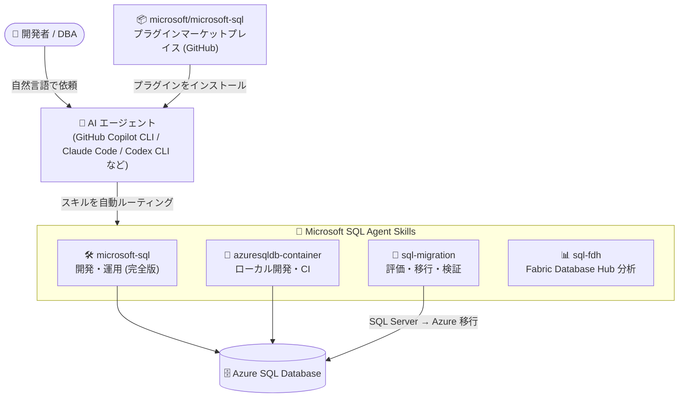

# Azure SQL Database: Microsoft SQL Agent Skills (Public Preview)

**リリース日**: 2026-09-29

**サービス**: Azure SQL Database

**機能**: Microsoft SQL Agent Skills

**ステータス**: In preview

[このアップデートのインフォグラフィックを見る](https://takech9203.github.io/azure-news-summary/20260929-microsoft-sql-agent-skills.html)

## 概要

Microsoft SQL Agent Skills がパブリックプレビューとして公開されました。これは、AI エージェントを使って SQL ワークロードの構築・運用・移行を行う際に、より正確で製品固有のガイダンスを得るためのスキル (エージェントプラグイン) 集です。Azure SQL Database、Azure SQL Database コンテナー、SQL Server から Azure への移行シナリオ、Fabric Database Hub で利用できます。

スキルは Microsoft SQL 製品チームが GitHub リポジトリ `microsoft/microsoft-sql` で公開しており、Agent Plugins 1.0 仕様に準拠したプラグインマーケットプレイスとして提供されます。GitHub Copilot CLI、Claude Code、OpenAI Codex CLI、VS Code の Copilot、Cursor、Grok Build など複数の AI エージェントにインストールでき、インストール後は特別な構文なしに通常の依頼からスキルが自動でルーティングされます。ライセンスは MIT で、一般提供 (GA) 日は未定です。

**アップデート前の課題**

- AI エージェントに SQL 関連のタスクを依頼しても、汎用的な知識に基づく回答となり、Azure SQL Database 固有の機能・制約 (Entra 認証、コンテナーの EngineEdition、移行手法の選択など) を踏まえた正確なガイダンスを得にくかった
- 開発・運用・移行といったシナリオごとに、ドキュメントを人手で参照してエージェントに文脈を与える必要があった

**アップデート後の改善**

- 製品チームが管理するスキルをエージェントにインストールすることで、開発・移行・管理の一般的なタスクを製品固有の正確なガイダンスに基づいて完了できるようになった
- 開発全般・コンテナー・VS Code・移行・Fabric Database Hub という用途別の 5 つのプラグインから、必要なものを選択して導入できるようになった

## アーキテクチャ図



開発者は GitHub のマーケットプレイスからスキルを AI エージェントにインストールし、通常の自然言語の依頼だけで用途別スキルが自動的に適用され、Azure SQL Database に対する製品固有の正確なガイダンスが得られます。

## サービスアップデートの詳細

### 主要機能

1. **用途別の 5 つのプラグイン**
   - `microsoft-sql`: Azure SQL Database の開発・運用全般をカバーする完全版 (コンテナー含む)
   - `microsoft-azuresqldb-container`: Azure SQL Database コンテナーでのローカル開発・CI 向け
   - `microsoft-sql-vscode`: VS Code + MSSQL 拡張向け
   - `microsoft-sql-migration`: SQL Server から Azure への評価・計画・移行・検証向け
   - `microsoft-sql-fdh`: Fabric Database Hub の読み取り専用分析向け

2. **広範なカバー範囲 (完全版)**
   - プロビジョニング、.NET/Python/TypeScript ドライバー、Entra 認証、EF Core/Prisma/SQLAlchemy、T-SQL の正確性、SQL インジェクション防止、行レベルセキュリティ、Azure Functions、Data API Builder、GitHub Actions、ベクトル検索/RAG (LangChain、LlamaIndex)、Query Store、実行プラン、ブロッキング/デッドロック診断、バルクロード、SqlPackage、復元など

3. **コンテナー版のローカル開発サポート**
   - ローカルエンジンの起動・トラブルシューティング、Docker/Podman/Compose/Dev Container、CI ワークフローに対応
   - コンテナーはローカル開発と CI 用であり本番ホスティング用ではないこと、`EngineEdition = 5` を返すことを明記

4. **移行版の SQL Server → Azure シナリオ**
   - ターゲット推奨、Azure Arc 評価、バックアップ/復元・BACPAC・Log Replay Service による移行、移行後のデータ検証に対応

5. **Fabric Database Hub 版の分析機能**
   - テナント全体のインベントリ、CPU/ストレージ/メモリ状態、Cosmos DB の可用性、セキュリティ/監査/CMK ポスチャの読み取り専用分析

6. **複数の AI エージェントに対応**
   - GitHub Copilot CLI、Claude Code、OpenAI Codex CLI、VS Code の Copilot、Cursor、Grok Build にインストール可能
   - 特別な構文は不要で、通常の依頼からスキルが自動でルーティングされる

## 技術仕様

| 項目 | 詳細 |
|------|------|
| 提供形態 | GitHub リポジトリ `microsoft/microsoft-sql` (Agent Plugins 1.0 仕様のマーケットプレイス) |
| プラグイン数 | 5 (完全版 / コンテナー / VS Code / 移行 / Fabric Database Hub) |
| 対応エージェント | GitHub Copilot CLI、Claude Code、OpenAI Codex CLI、VS Code の Copilot、Cursor、Grok Build |
| 対象シナリオ | Azure SQL Database、Azure SQL Database コンテナー、SQL Server → Azure 移行、Fabric Database Hub |
| スコープ | 主に Azure SQL Database (Managed Instance や SQL Server を同一製品として扱わず、境界を越える要求は所有スキルへルーティング) |
| テレメトリ | プラグイン自体は収集しない (ホストや外部サービス側は別) |
| ライセンス | MIT License |

## 設定方法

### 前提条件

1. 対応する AI エージェント (GitHub Copilot CLI、Claude Code など) が利用可能であること

### インストール例

```bash
# GitHub Copilot CLI
copilot plugin marketplace add microsoft/microsoft-sql
copilot plugin install

# Claude Code (対話セッション内)
/plugin marketplace add microsoft/microsoft-sql
/plugin install microsoft-sql@microsoft-sql

# OpenAI Codex CLI
codex plugin marketplace add microsoft/microsoft-sql --ref main
codex plugin add
```

VS Code の Copilot では、設定で `chat.plugins.enabled` と `chat.plugins.marketplaces` を追加し、Plugins からインストールします。

## メリット

### ビジネス面

- AI エージェントによる SQL ワークロードの開発・運用・移行の精度が向上し、手戻りや誤ったガイダンスによるリスクを低減できる
- スキルは MIT ライセンスのオープンソースとして提供され、追加コストなく導入できる

### 技術面

- 製品チームが管理するスキルにより、Entra 認証・行レベルセキュリティ・ベクトル検索など Azure SQL Database 固有の機能に沿ったガイダンスが得られる
- 特別な構文が不要で、通常の自然言語の依頼から適切なスキルが自動ルーティングされる
- 開発・CI・移行・分析など用途に応じてプラグインを選択でき、複数の主要 AI エージェントで同じスキルを利用できる

## デメリット・制約事項

- パブリックプレビュー段階であり、一般提供 (GA) 日は未定
- スコープは主に Azure SQL Database であり、Azure SQL Managed Instance や SQL Server は同一製品として扱われない (境界を越える要求は所有スキルへルーティングされる)
- `microsoft-sql` と `microsoft-sql-vscode` は内容が重複するため、通常はどちらか一方のみをインストールする
- Azure SQL Database コンテナーはローカル開発と CI 用であり、本番ホスティングには使用できない

## ユースケース

### ユースケース 1: パスワードレスでのアプリケーション接続

**シナリオ**: Node.js アプリケーションを Azure SQL Database にパスワードなし (Entra 認証) で接続したい。

**実装例**: AI エージェントに「Node アプリをパスワードなしで Azure SQL に接続して」と依頼すると、スキルが Entra 認証を含む製品固有の推奨構成に基づいてガイドする。

**効果**: シークレット管理を排したセキュアな接続構成を、正確な手順で迅速に実装できる。

### ユースケース 2: SQL Server から Azure への移行計画

**シナリオ**: オンプレミスの SQL Server を Azure に移行する際、適切なターゲットと移行手法を選定したい。

**実装例**: `microsoft-sql-migration` プラグインをインストールし、エージェントに移行ターゲット選定を依頼すると、Azure Arc 評価、バックアップ/復元・BACPAC・Log Replay Service などの手法を含む評価・計画・検証をガイドする。

**効果**: 移行の評価から移行後のデータ検証までを一貫した製品固有のガイダンスのもとで進められる。

### ユースケース 3: パフォーマンス診断

**シナリオ**: 遅くなったレポートクエリの原因を特定したい。

**実装例**: エージェントに診断を依頼すると、Query Store、実行プラン、ブロッキング/デッドロック診断などのスキルに基づいて調査をガイドする。

**効果**: DBA の知見に相当する診断手順を AI エージェント経由で再現できる。

## 料金

Microsoft SQL Agent Skills 自体は GitHub 上で MIT ライセンスのオープンソースとして提供されており、スキルに対する追加料金の記載はありません。利用する AI エージェント (GitHub Copilot など) および Azure SQL Database の料金は別途発生します。

- [Azure SQL Database 料金ページ](https://azure.microsoft.com/pricing/details/azure-sql-database/)

## 関連サービス・機能

- **Azure SQL Database**: スキルの主対象サービス。開発・運用・診断タスクをカバー
- **Azure SQL Database コンテナー**: ローカル開発・CI 向けのコンテナー実行環境。専用プラグインが提供される
- **Fabric Database Hub**: テナント全体のデータベースインベントリや状態の読み取り専用分析に専用プラグインが対応
- **SQL MCP Server**: AI エージェントからデータベースへのアクセスを、定義済みツール経由の安定した統制されたインターフェースとして提供する関連機能
- **Microsoft Copilot in Azure SQL Database (preview)**: Azure SQL Database の設計・運用・最適化を支援する AI アシスト機能

## 参考リンク

- [インフォグラフィック](https://takech9203.github.io/azure-news-summary/20260929-microsoft-sql-agent-skills.html)
- [公式アップデート情報](https://azure.microsoft.com/updates?id=573003)
- [Microsoft SQL Agent Skills (GitHub)](https://github.com/microsoft/microsoft-sql)
- [Microsoft Learn: Intelligent Applications and AI - Azure SQL Database](https://learn.microsoft.com/azure/azure-sql/database/ai-artificial-intelligence-intelligent-applications)
- [料金ページ (Azure SQL Database)](https://azure.microsoft.com/pricing/details/azure-sql-database/)

## まとめ

Microsoft SQL Agent Skills は、AI エージェントによる SQL ワークロードの開発・運用・移行に製品固有の正確なガイダンスをもたらすスキル集のパブリックプレビューです。GitHub Copilot CLI や Claude Code など主要な AI エージェントに数コマンドでインストールでき、MIT ライセンスで追加コストなく利用できます。AI エージェントを開発ワークフローに取り入れているチームや、SQL Server から Azure への移行を検討しているチームは、用途に合ったプラグイン (完全版・コンテナー・移行・Fabric Database Hub) を選んで試用することを推奨します。なおプレビュー段階であり、スコープは主に Azure SQL Database である点に留意してください。

---

**タグ**: Azure SQL Database, AI エージェント, Agent Skills, GitHub Copilot, Claude Code, SQL Server 移行, Fabric Database Hub, Public Preview
