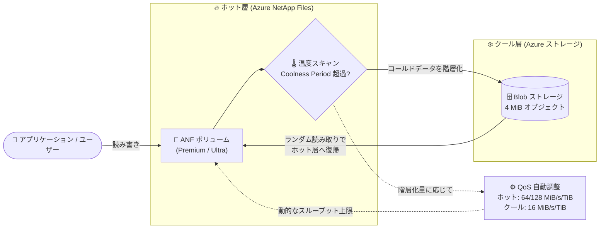

# Azure NetApp Files: Storage with cool access enhancement (Premium/Ultra サービスレベルの QoS 改善) の一般提供開始

**リリース日**: 2026-09-29

**サービス**: Azure NetApp Files

**機能**: Storage with cool access enhancement (Premium/Ultra サービスレベルにおけるクールアクセス有効時のスループット QoS 改善)

**ステータス**: Launched (GA)

[このアップデートのインフォグラフィックを見る](https://takech9203.github.io/azure-news-summary/20260929-netapp-files-cool-access-qos.html)

## 概要

Azure NetApp Files の「storage with cool access (クールアクセス付きストレージ)」機能において、Premium および Ultra サービスレベルでクールアクセスを有効化した際の QoS (スループット制御) の改善が一般提供 (GA) されました。2026 年 4 月にプレビューが開始され、2026 年 9 月に GA となったアップデートです。

クールアクセスは、非アクティブなデータブロックをボリューム (ホット層) から Azure ストレージアカウント (クール層) へ自動的に移動してストレージコストを削減する機能です。従来、Premium/Ultra サービスレベルでクールアクセスを有効にすると、クール層への階層化量に関係なく、ボリューム全体のスループット上限が一律に削減されていました。

今回の改善により、最大スループットは固定の削減率ではなく、クール層に階層化されたデータ量に基づいて動的に計算されるようになりました。ホット層のデータは構成済みのパフォーマンスをそのまま維持し、データがクール層に移動したときにのみスループットが調整されます。これにより、ホットデータとクールデータが混在するワークロードで、手動チューニングや再構成なしに、より予測可能な QoS 動作とパフォーマンス・コストの最適化が実現されます。

**アップデート前の課題**

- Premium/Ultra サービスレベルでクールアクセスを有効にすると、階層化されたデータ量に関係なく一律の削減率が適用されていた (Premium: 64 → 36 MiB/s/TiB、Ultra: 128 → 68 MiB/s/TiB)
- 例えば Premium の 10 TiB ボリュームでは、クール層へのデータ移動が少なくても、スループット上限が 640 MiB/s から 360 MiB/s に固定的に低下していた
- ホットデータ中心のワークロードでは、コスト削減のためにクールアクセスを有効化するとパフォーマンスが過剰に制限されるトレードオフがあった

**アップデート後の改善**

- スループット上限が「ホット層データ量 × サービスレベルのレート + クール層データ量 × 16 MiB/s/TiB」で動的に計算され、ホット層データは本来のパフォーマンス (Premium: 64 MiB/s/TiB、Ultra: 128 MiB/s/TiB) を維持
- クールアクセスのパターン変化に応じてスループットが自動調整されるため、手動チューニングや再構成が不要
- ホットとクールが混在するワークロードで、コスト削減とパフォーマンスの両立がしやすくなった

## アーキテクチャ図

非アクティブなデータブロックはホット層からクール層 (Azure ストレージ) へ透過的に移動され、今回の改善によりスループット上限がホット層・クール層それぞれのデータ量に基づいて動的に計算されるようになりました。

## サービスアップデートの詳細

### 主要機能

1. **階層化データ量に基づく動的スループット計算**
   - クールアクセス有効時、最大スループットは固定の削減率ではなく、クール層に階層化されたデータ量に基づいて動的に計算される
   - 対象は auto QoS が有効な Premium/Ultra サービスレベルの容量プール内で、クールアクセスデータが 100 GiB を超えるボリューム

2. **ホット層パフォーマンスの維持**
   - ホット層に残っているデータは、サービスレベル本来のスループットレート (Premium: 64 MiB/s/TiB、Ultra: 128 MiB/s/TiB) を維持
   - スループットが調整されるのは、データがクール層に階層化されたときのみ

3. **手動チューニング不要の継続的な最適化**
   - クールアクセスのパターン変化に応じてプールとボリュームのスループットが継続的に最適化される
   - 手動での再構成やチューニングは不要

### スループット計算式

| サービスレベル | クールアクセスなし | クールアクセスあり (新方式) |
|---------------|-------------------|---------------------------|
| Premium | クォータ (TiB) × 64 MiB/s | (ホット層データ TiB × 64 MiB/s) + (クール層データ TiB × 16 MiB/s) |
| Ultra | クォータ (TiB) × 128 MiB/s | (ホット層データ TiB × 128 MiB/s) + (クール層データ TiB × 16 MiB/s) |

**計算例 (Premium、10 TiB ボリューム)**:
- ホット層 10 TiB / クール層 0 TiB: 最大スループット 640 MiB/s
- ホット層 8 TiB / クール層 2 TiB: 最大スループット 544 MiB/s (8 × 64 + 2 × 16)
- 従来方式では階層化量に関係なく 360 MiB/s (10 × 36) に固定されていた

**既存ボリュームの扱い**: 本アップデート以前にクールアクセスを有効化した容量プール内の既存ボリュームには、引き続き従来の QoS 上限 (Premium: 36 MiB/s/TiB、Ultra: 68 MiB/s/TiB) が適用されます。新しい QoS 上限を利用するには、新しい容量プールを作成し、既存ボリュームをそこへ移動する必要があります。

## 技術仕様

| 項目 | 詳細 |
|------|------|
| 対象サービスレベル | Premium、Ultra (クールアクセス自体は Flexible、Standard でも利用可能) |
| 動的 QoS の適用条件 | auto QoS 有効の容量プール内で、クールアクセスデータが 100 GiB 超のボリューム |
| スループット計算単位 | ボリューム単位 (容量プール単位ではない) |
| クール層データのスループットレート | 16 MiB/s per TiB (Premium/Ultra 共通) |
| Coolness Period (クールと判定するまでの日数) | 2〜183 日 (既定値: 31 日) |
| 階層化の単位 | コールドブロックを 4 MiB オブジェクトにパッケージ化して Azure ストレージへ移動 |
| 取得ポリシー (Retrieval Policy) | Default (ランダム読み取りでホット層へ復帰) / On-Read (すべての読み取りで復帰) / Never (クール層から直接提供) |
| 階層化ポリシー (Tiering Policy) | Auto (アクティブファイルシステム + スナップショット) / SnapshotOnly (スナップショットのみ) |
| メタデータ | 常にホット層に保持 (階層化されない) |

## 設定方法

### 前提条件

1. Azure NetApp Files アカウントと容量プールが作成済みであること
2. 容量プールでクールアクセスが有効化されていること (一度有効にするとプールレベルでは無効化できない)
3. 既存のクールアクセス有効プールで新しい QoS 上限を利用する場合は、新しい容量プールを作成しボリュームを移動すること

### Azure Portal

**容量プールでのクールアクセス有効化:**

1. 新規作成時: 容量プールの作成画面で「Enable Cool Access」チェックボックスを選択
2. 既存プール: 対象の容量プールを右クリックし「Enable Cool Access」を選択

**ボリュームでのクールアクセス設定:**

1. ボリュームの新規作成画面 (Basics タブ) または既存ボリュームの「Edit」画面で「Enable Cool Access」を選択
2. Coolness Period (2〜183 日、既定値 31 日) を設定
3. Cool Access Retrieval Policy (Default / On-Read / Never) を選択
4. Cool Access Tiering Policy (Auto / SnapshotOnly) を選択

## メリット

### ビジネス面

- ホットデータのパフォーマンスを犠牲にせずクールアクセスによるコスト削減を導入できるため、TCO 最適化の適用範囲が広がる
- 手動チューニングや再構成が不要になり、運用負荷が軽減される
- クール層の料金はホット層より低く、全サービスレベルで同一レートのため、コスト予測がしやすい

### 技術面

- スループット上限が実際の階層化状況を反映するため、QoS 動作の予測可能性が向上
- アクセスパターンの変化 (データのクール化・ウォーム化) に応じてスループットが自動的に追従
- ボリューム単位で計算されるため、同一プール内でもボリュームごとに適切な上限が適用される

## デメリット・制約事項

- 本アップデート以前にクールアクセスを有効化した容量プール内の既存ボリュームには従来の固定削減方式が適用され続ける。新方式を利用するには新しい容量プールの作成とボリューム移動が必要
- 動的 QoS の適用にはクールアクセスデータが 100 GiB を超えている必要がある
- クール層のデータ読み取りは Azure ストレージアカウントからの取得となるため、アクセスレイテンシに差が生じる可能性がある (どのサービスレベルでも最大レイテンシの保証はない)
- 容量プールでクールアクセスを有効化すると、プールレベルでは無効化できない (ボリュームレベルでのオン/オフは可能)
- クールアクセス有効ボリュームは、クールアクセス有効な容量プールにのみ配置・移動できる
- ボリュームでクールアクセスを無効化しても、既にクール層へ移動したファイルはそのまま残る (各ファイルへの I/O 操作でのみホット層へ戻る)
- Flexible サービスレベルのプールはユーザー構成のスループット上限が維持されるため、本アップデートの対象外 (もともとクールアクセス有効化による性能削減がない)

## ユースケース

### ユースケース 1: ホット/クール混在のファイルサービス基盤のコスト最適化

**シナリオ**: Premium サービスレベルで運用するファイル共有に、アクティブなプロジェクトデータと完了済みプロジェクトの古いデータが混在している。従来はクールアクセスを有効化するとボリューム全体のスループットが約 44% 削減されるため、パフォーマンス要件との兼ね合いで導入を見送っていた。

**効果**: 新しい QoS 方式では、ホット層に残るアクティブデータは 64 MiB/s/TiB のフルパフォーマンスを維持したまま、古いデータのみがクール層へ移動してコストを削減できる。階層化の進行に応じてスループットが自動調整されるため、チューニング作業も不要。

### ユースケース 2: 既存クールアクセスボリュームの新 QoS への移行

**シナリオ**: 本アップデート以前からクールアクセスを利用しており、固定削減方式 (Premium: 36 MiB/s/TiB) の制限を受けているボリュームのパフォーマンスを改善したい。

**実装例**:

1. クールアクセスを有効化した新しい容量プールを作成
2. 既存ボリュームを新しい容量プールへ移動
3. 移動後、階層化データ量に基づく動的 QoS が適用される

**効果**: ホット層データが多いボリュームでは、スループット上限が大幅に向上する (例: ホット層 8 TiB / クール層 2 TiB の Premium 10 TiB ボリュームで 360 MiB/s → 544 MiB/s)。

## 料金

クールアクセスの課金は以下の要素に基づきます。

| 課金要素 | 内容 |
|------|------|
| ホット層容量 | クール層に階層化されていないデータと容量プール内の未割り当て容量は、サービスレベル (ホット層) のレートで課金 |
| クール層容量 | クール層のデータはクール層レートで課金 (ホット層より低額、全サービスレベルで同一レート) |
| ネットワーク転送 | ホット層とクール層の間の転送 (Blob ストレージへの GET/PUT リクエストおよびプライベートリンク転送) に課金 |

クールアクセス有効時はスループット削減を織り込んだクールアクセス価格が適用されます。具体的な料金は [Azure NetApp Files 料金ページ](https://azure.microsoft.com/pricing/details/netapp/) を参照してください。また、[Azure NetApp Files effective price estimator](https://aka.ms/anfcoolaccesscalc) でクールアクセスによる削減額を試算できます。

## 利用可能リージョン

クールアクセス機能自体は、Azure NetApp Files が利用可能なすべてのリージョンで提供されています。Premium/Ultra サービスレベル向けのクールアクセススループット機能 (本アップデート) も全 Azure NetApp Files 対応リージョンでサポートされており、ドキュメントには以下を含む約 48 リージョンが列挙されています。

Japan East、Japan West、East US、East US 2、West US、West US 2、West US 3、Central US、North Central US、South Central US、North Europe、West Europe、UK South、UK West、Southeast Asia、East Asia、Australia East、Korea Central、US Gov Arizona/Texas/Virginia ほか

最新のリージョン一覧は [Microsoft Learn のドキュメント](https://learn.microsoft.com/azure/azure-netapp-files/cool-access-introduction#supported-regions-for-cool-access-throughput-for-premium-and-ultra-service-levels-feature) を参照してください。

## 関連サービス・機能

- **Azure Blob Storage**: クール層の実体。コールドデータは 4 MiB オブジェクトとして Azure ストレージアカウントに格納される
- **Azure NetApp Files サービスレベル (Flexible/Standard/Premium/Ultra)**: クールアクセスは 4 つのサービスレベルすべてで利用可能。本アップデートの動的 QoS は Premium/Ultra が対象
- **Azure NetApp Files 大容量ボリューム (Large Volumes)**: クールアクセスと併用可能。クールアクセス有効時は 2,400 GiB〜7.2 PiB のボリュームを作成可能 (7.2 PiB までの大容量ボリュームでは 80% 超のデータがクール層にある必要あり)
- **クロスリージョン/クロスゾーンレプリケーション**: レプリケーション先ボリュームのみにクールアクセスを有効化し、ソースのレイテンシに影響を与えずコスト削減が可能
- **Azure Monitor メトリック**: ボリューム単位でクール層サイズ、クール層データ読み取り/書き込みサイズのメトリックを提供

## 参考リンク

- [インフォグラフィック](https://takech9203.github.io/azure-news-summary/20260929-netapp-files-cool-access-qos.html)
- [公式アップデート情報](https://azure.microsoft.com/updates?id=573032)
- [Azure NetApp Files storage with cool access (Microsoft Learn)](https://learn.microsoft.com/azure/azure-netapp-files/cool-access-introduction)
- [Manage Azure NetApp Files storage with cool access (Microsoft Learn)](https://learn.microsoft.com/azure/azure-netapp-files/manage-cool-access)
- [Service levels for Azure NetApp Files (Microsoft Learn)](https://learn.microsoft.com/azure/azure-netapp-files/azure-netapp-files-service-levels)
- [What's new in Azure NetApp Files (Microsoft Learn)](https://learn.microsoft.com/azure/azure-netapp-files/whats-new)
- [料金ページ](https://azure.microsoft.com/pricing/details/netapp/)

## まとめ

Azure NetApp Files の Premium/Ultra サービスレベルにおけるクールアクセスの QoS 改善が GA となり、クールアクセス有効時のスループット上限が「固定削減」から「階層化データ量に基づく動的計算」へと変わりました。ホット層データは本来のパフォーマンス (Premium: 64 MiB/s/TiB、Ultra: 128 MiB/s/TiB) を維持しつつ、クール層データ分のみが 16 MiB/s/TiB で計算されるため、パフォーマンス要件を理由にクールアクセスの導入を見送っていたワークロードでも、コスト削減とパフォーマンスの両立が現実的になります。

既存のクールアクセス有効プール内のボリュームには従来方式が適用され続けるため、新方式の恩恵を受けるには新しい容量プールの作成とボリューム移動が必要です。Premium/Ultra でクールアクセスを利用中、または導入を検討している場合は、スループット計算式の変更内容を確認し、容量プールの再編を検討することを推奨します。

---

**タグ**: Azure NetApp Files, Storage, Cool Access, QoS, Premium, Ultra, GA, コスト最適化
