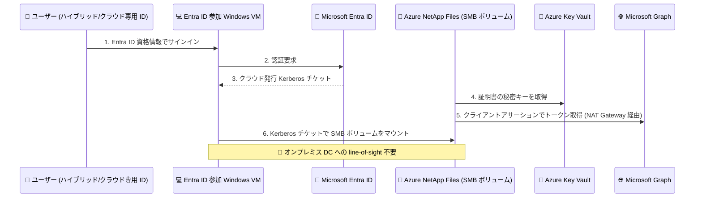

# Azure NetApp Files: Microsoft Entra Kerberos 認証 (Public Preview)

**リリース日**: 2026-09-29

**サービス**: Azure NetApp Files

**機能**: Microsoft Entra Kerberos authentication for SMB volumes

**ステータス**: In preview

[このアップデートのインフォグラフィックを見る](https://takech9203.github.io/azure-news-summary/20260929-netapp-files-entra-kerberos.html)

## 概要

Azure NetApp Files の SMB ボリュームで Microsoft Entra Kerberos 認証がパブリックプレビューとして利用可能になりました。ハイブリッド ID (オンプレミス AD DS から Microsoft Entra ID に同期されたユーザー) およびクラウド専用 ID (Microsoft Entra ID のみに存在するユーザー) が、Microsoft Entra ID が発行するクラウド発行の Kerberos チケットを使用して SMB ボリュームに認証できます。

この機能の最大のポイントは、認証時に SMB クライアントからオンプレミスの Active Directory Domain Services (AD DS) ドメインコントローラーへのネットワーク経路 (line-of-sight) が不要になることです。オンプレミス AD DS を Azure に拡張したり、ドメインコントローラーを Azure 上に展開・維持したりする必要がなくなり、ハイブリッド/クラウドファーストな環境における ID アーキテクチャの簡素化とインフラ依存の削減が実現します。

なお、Microsoft Entra ID サポートは SMB ボリュームのみが対象です。NFS、デュアルプロトコル、NFSv4.1 Kerberos ボリュームは引き続き AD DS に依存します。

**アップデート前の課題**

- Azure NetApp Files の SMB ボリュームは AD DS (または Microsoft Entra Domain Services) への接続が必須で、認証のためにドメインコントローラーへのネットワーク line-of-sight が必要だった
- オンプレミス AD DS を Azure へ拡張するか、Azure 上にドメインコントローラーを展開・維持する必要があり、インフラコストと運用負荷が発生していた
- クラウド専用 ID (Microsoft Entra ID のみのユーザー) では SMB ボリュームへの認証ができなかった

**アップデート後の改善**

- Microsoft Entra ID が発行するクラウド Kerberos チケットで SMB ボリュームに認証でき、ドメインコントローラーへの line-of-sight 接続が不要になった
- ドメインコントローラーの展開・維持や、オンプレミスと Azure 間の認証用接続の確立が不要になり、クラウド中心環境での展開・管理が簡素化された
- ハイブリッド ID とクラウド専用 ID の両方が SMB 経由でサポートされた

## アーキテクチャ図



ユーザーは Entra ID 参加済み Windows VM への対話型サインイン時にクラウド発行の Kerberos チケットを取得し、そのチケットで SMB ボリュームをマウントします。Azure NetApp Files 側は Key Vault の証明書を使って Microsoft Graph エンドポイントと通信するため、オンプレミスのドメインコントローラーは認証フローに一切関与しません。

## サービスアップデートの詳細

### 主要機能

1. **ハイブリッド ID による SMB 認証**
   - オンプレミス AD DS から Microsoft Entra Connect Sync で Microsoft Entra ID に同期されたユーザーが、クラウド発行の Kerberos チケットで SMB ボリュームに認証可能

2. **クラウド専用 ID による SMB 認証**
   - Microsoft Entra ID のみで作成・管理され、オンプレミスに足跡を持たないユーザーが、Entra ID 資格情報で SMB 共有にアクセス可能

3. **Entra ID 接続 (Entra ID connection) オブジェクト**
   - テナントに登録した 1 つのプライマリアプリケーションの構成 (アプリケーション ID、ドメイン名、Key Vault URI、証明書名、SMB サーバープレフィックス) を再利用可能な構成オブジェクトとして NetApp アカウントに保存し、複数の SMB ボリュームに関連付け可能
   - ライフサイクル状態 (Created / In use / Deleted / Error) で利用状況を管理

4. **証明書ベースの認証基盤**
   - プライマリアプリケーションには証明書を構成し、秘密キーは Azure Key Vault に格納。Azure NetApp Files が秘密キーでクライアントアサーション (署名付き JWT) を作成し、Microsoft Entra ID からアクセストークンを取得して Microsoft Graph エンドポイントに対して認証

## 技術仕様

| 項目 | 詳細 |
|------|------|
| 対象プロトコル | SMB ボリュームのみ (NFS、デュアルプロトコル、NFSv4.1 Kerberos は引き続き AD DS が必要) |
| サポートされる ID | ハイブリッド ID、クラウド専用 ID |
| 認証方式 | Microsoft Entra ID によるクラウド発行 Kerberos チケット |
| 必要なアウトバウンド接続 | Microsoft Graph エンドポイント (Azure パブリッククラウド: `graph.microsoft.com`、TCP 443/HTTPS) |
| 必要なネットワークコンポーネント | Standard SKU の NAT Gateway (Azure NetApp Files 委任サブネットに関連付け、アウトバウンド専用) |
| 必要な Microsoft Graph アプリケーション権限 | `Application.ReadWrite.OwnedBy`、`DelegatedPermissionGrant.ReadWrite.All`、`User.Read` (管理者の同意が必要) |
| マネージド ID | NetApp アカウントのシステム割り当てまたはユーザー割り当てマネージド ID を使用 (Key Vault へは Key Vault Secrets User ロールを付与) |
| 接続数の制約 | サブスクリプションあたり複数の Entra ID 接続が可能だが、NetApp アカウントあたり 1 接続のみ |
| 認証方式の排他性 | NetApp アカウントは Entra ID ベース認証と AD DS ベース認証のどちらか一方のみ (同時利用不可) |
| 機能登録 | `Microsoft.NetApp` の `ANFEntraID` フィーチャー登録が必要 (登録完了まで最大 60 分) |

## 設定方法

### 前提条件

1. ボリュームを展開するリージョンに NetApp アカウントを作成する
2. ハイブリッド ID を使用する場合、Microsoft Entra Connect Sync でオンプレミス AD ユーザーを Microsoft Entra ID に同期する
3. Microsoft Entra ID にアプリケーションを登録する (シングルテナント)。証明書 (.cer / .pem / .crt) をアップロードし、Microsoft Graph のアプリケーション権限 (`Application.ReadWrite.OwnedBy`、`DelegatedPermissionGrant.ReadWrite.All`、`User.Read`) に管理者の同意を付与する
4. Azure Key Vault を作成し、NetApp アカウントのマネージド ID に Key Vault Secrets User ロールを付与する
5. Standard SKU の NAT Gateway を作成し、Azure NetApp Files 委任サブネットに関連付けて `graph.microsoft.com` へのアウトバウンド接続を確保する (NSG / UDR / ファイアウォールで Microsoft Graph への接続をブロックしないこと)

### Azure PowerShell (機能登録)

```powershell
# プレビュー機能を登録
Register-AzProviderFeature -ProviderNamespace Microsoft.NetApp -FeatureName ANFEntraID

# 登録状態を確認 (Registered になるまで最大 60 分待機)
Get-AzProviderFeature -ProviderNamespace Microsoft.NetApp -FeatureName ANFEntraID
```

Azure CLI では `az feature register` および `az feature show` を使用します。

### Azure Portal

1. NetApp アカウントで **Azure NetApp Files** > **Entra ID connection** に移動し、**Create** を選択
2. 以下を入力して Entra ID 接続を作成:
   - **Application ID**: 事前に登録したアプリケーションの ID
   - **Domain Name**: ハイブリッド ID 用に Entra ID と同期された AD ドメイン、または任意のカスタムドメイン
   - **Azure Key Vault URI**: 証明書と秘密キーを取得する Key Vault の URI
   - **Certificate name**: アプリ登録に関連付けた Key Vault 内の証明書名
   - **SMB server prefix**: SMB ボリュームのマウントに使用する FQDN のプレフィックス
3. SMB ボリュームを作成し、クライアント側 (Entra ID 参加 Windows VM) でグループポリシーを構成:
   - **Allow retrieving the cloud kerberos ticket during the logon** を有効化
   - **Define host name-to-kerberos realm mappings** に Azure NetApp Files ボリュームの FQDN を設定
   - **Network security: Allow PKU2U authentication requests to this computer to use online identities** を有効化

### アクセス許可の構成 (icacls)

ACL の構成は icacls コマンドのみサポートされます (Windows エクスプローラーからの ACL 設定は非サポート)。

```
icacls \\<smbserver>.contoso.com\entravol /grant "AzureAD\user@<EntraIDdomain>":(R,W)
```

## メリット

### ビジネス面

- ドメインコントローラーの展開・維持コストと、オンプレミス〜Azure 間の認証用接続の構築・運用コストを削減できる
- オンプレミス AD DS を Azure へ拡張できない (セキュリティポリシー上許可されない) 組織でも SMB ボリュームを利用可能になる
- クラウドファースト戦略に沿った ID アーキテクチャのモダナイズを推進できる

### 技術面

- SMB クライアントからドメインコントローラーへの line-of-sight ネットワーク接続が不要になり、ネットワーク設計が簡素化される
- ハイブリッド ID とクラウド専用 ID の両方を単一の認証基盤 (Microsoft Entra ID) でサポートできる
- Entra ID 接続を再利用可能な構成オブジェクトとして複数の SMB ボリュームに関連付けられる

## デメリット・制約事項

- パブリックプレビュー段階であり、`ANFEntraID` フィーチャーの事前登録が必要
- SMB ボリュームのみ対象。NFS、デュアルプロトコル、NFSv4.1 Kerberos ボリュームは引き続き AD DS が必要
- NetApp アカウントあたり 1 つの Entra ID 接続のみ構成可能。また同一 NetApp アカウントで Entra ID ベース認証と AD DS ベース認証を併用できない
- 以下の機能は非サポート: ファイルアクセスログ、キャッシュボリューム、アプリケーションボリュームグループ
- ACL 構成は icacls のみサポート。Entra ID 専用 ID に対するグループへの icacls 適用、および Windows エクスプローラーによる ACL 構成は非サポート
- Microsoft Graph エンドポイント (パブリックエンドポイント) への安定したアウトバウンド接続 (Standard SKU NAT Gateway 経由) が必須。接続不良は認証失敗やボリューム作成失敗の原因となる
- クロスリージョンレプリケーションを使用する場合、ソース/宛先双方のリージョンに NetApp アカウント、宛先リージョンで利用可能な Entra ID 構成 (Key Vault への到達性を含む)、および宛先リージョンの NAT Gateway 構成が必要

## ユースケース

### ユースケース 1: オンプレミス AD を拡張せずにクラウド上のファイル共有を提供

**シナリオ**: セキュリティポリシー上、オンプレミス AD DS を Azure へ拡張できない企業が、Azure 上の VDI / アプリケーション用に SMB ファイル共有を提供したい。

**実装例**: Microsoft Entra Connect Sync でユーザーをハイブリッド ID として同期し、Entra ID 接続を構成した Azure NetApp Files SMB ボリュームを作成。Entra ID 参加済み Windows VM からクラウド発行 Kerberos チケットでマウントする。

**効果**: ドメインコントローラーの Azure 展開や ExpressRoute/VPN 経由の認証トラフィックが不要になり、セキュリティ境界を維持したままファイル共有を提供できる。

### ユースケース 2: クラウド専用 ID の組織でのエンタープライズファイルサービス

**シナリオ**: オンプレミス AD を持たず、すべてのユーザーを Microsoft Entra ID のクラウド専用 ID で管理している組織が、高性能な SMB ファイルサービスを必要としている。

**実装例**: クラウド専用 ID のまま Entra ID 接続を構成し、SMB ボリュームへのアクセス許可を icacls で個別ユーザーに付与する。

**効果**: 従来は AD DS または Microsoft Entra Domain Services の追加展開が必要だったが、既存の Entra ID テナントのみで Azure NetApp Files の SMB ボリュームを利用できる。

## 料金

このアップデート自体に関する追加料金の公式情報は確認できませんでした。Azure NetApp Files の料金は容量プールのサービスレベルとプロビジョニング容量に基づきます。詳細は料金ページを参照してください。

- [Azure NetApp Files の料金](https://azure.microsoft.com/pricing/details/netapp/)

なお、構成には Standard SKU の NAT Gateway と Azure Key Vault が必要であり、これらのリソースには別途料金が発生します。

## 関連サービス・機能

- **Microsoft Entra ID**: クラウド発行 Kerberos チケットの発行元。ハイブリッド/クラウド専用 ID の管理とアプリケーション登録を担う
- **Microsoft Entra Connect Sync**: ハイブリッド ID を使用する場合に、オンプレミス AD DS ユーザーを Microsoft Entra ID に同期するために使用
- **Azure Key Vault**: プライマリアプリケーションの証明書の秘密キーを格納。Azure NetApp Files がマネージド ID (Key Vault Secrets User ロール) でアクセス
- **Azure NAT Gateway**: Azure NetApp Files から Microsoft Graph エンドポイントへのアウトバウンド接続を提供 (Standard SKU のみサポート)
- **Azure Files の Entra Kerberos 認証**: 同様に Entra Kerberos によるファイル共有認証を提供する代替ストレージサービス。要件 (性能、プロトコル) に応じて使い分ける

## 参考リンク

- [インフォグラフィック](https://takech9203.github.io/azure-news-summary/20260929-netapp-files-entra-kerberos.html)
- [公式アップデート情報](https://azure.microsoft.com/updates?id=573041)
- [Understand Microsoft Entra Kerberos with Azure NetApp Files](https://learn.microsoft.com/en-us/azure/azure-netapp-files/understand-entra-id)
- [Configure Microsoft Entra Kerberos authentication with Azure NetApp Files](https://learn.microsoft.com/en-us/azure/azure-netapp-files/configure-entra-kerberos-authentication-for-hybrid-cloud-identities)
- [Troubleshoot Microsoft Entra Kerberos authentication](https://learn.microsoft.com/en-us/azure/azure-netapp-files/troubleshoot-entra-kerberos-authentication)
- [What's new in Azure NetApp Files](https://learn.microsoft.com/en-us/azure/azure-netapp-files/whats-new)
- [料金ページ](https://azure.microsoft.com/pricing/details/netapp/)

## まとめ

Azure NetApp Files の SMB ボリュームが Microsoft Entra Kerberos 認証に対応したことで、オンプレミスドメインコントローラーへの依存なしに、ハイブリッド ID / クラウド専用 ID の両方で SMB アクセスが可能になりました。AD DS の Azure 拡張が困難だった組織や、クラウド専用 ID で運用する組織にとって、ID アーキテクチャを大幅に簡素化できる重要なアップデートです。SMB ボリューム限定であること、NetApp アカウントあたり 1 接続かつ AD DS 認証と排他であること、NAT Gateway (Standard SKU) と Microsoft Graph への接続が必須であることに留意し、まずはプレビュー機能 (`ANFEntraID`) を登録して非本番環境での検証を推奨します。

---

**タグ**: Azure NetApp Files, Microsoft Entra ID, Kerberos, SMB, Storage, Identity, Public Preview
