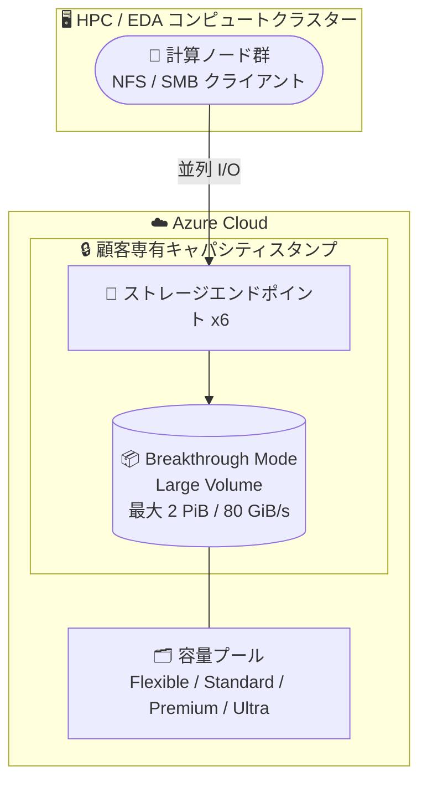

# Azure NetApp Files: Large Volume Breakthrough Mode の一般提供開始 (GA)

**リリース日**: 2026-09-29

**サービス**: Azure NetApp Files

**機能**: Support for large volume breakthrough mode

**ステータス**: Launched (GA)

[このアップデートのインフォグラフィックを見る](https://takech9203.github.io/azure-news-summary/20260929-netapp-files-large-volume-breakthrough.html)

## 概要

Azure NetApp Files の large volume (大容量ボリューム) に「breakthrough mode (ブレークスルーモード)」が一般提供 (GA) となりました。breakthrough mode は、HPC (High Performance Computing) や EDA (Electronic Design Automation) といった極めて高い性能要件を持つワークロード向けに、最大 2 PiB のボリュームサイズと、ワークロード特性に応じて最大 80 GiBps のスループットを提供する機能です。

breakthrough mode の large volume は、ボリュームごとに 6 つのストレージエンドポイントを使用して一貫した性能を確保します。また、breakthrough mode のボリュームをホストするストレージシステムは顧客ごとに専有 (dedicated) されるため、他のワークロードとリソースを競合することがなく、いわゆる「ノイジーネイバー」の影響を受けない予測可能な性能を実現します。

**アップデート前の課題**

- 通常の large volume はサイズが 50 TiB〜1,024 TiB (既定)、スループット上限が Standard / Premium / Ultra サービスレベルで 12,800 MiB/s に制限されており、それを超える性能を要する HPC / EDA ワークロードには単一ボリュームで対応できなかった
- 共有インフラストラクチャ上では、他のワークロードとのリソース競合 (ノイジーネイバー) による性能変動のリスクがあった

**アップデート後の改善**

- 2,400 GiB〜2,400 TiB (2 PiB) のサイズで breakthrough mode の large volume を作成でき、最大 80 GiB/s のスループットを達成可能になった (ワークロード特性とシステム配置に依存)
- ボリュームごとに 6 つのストレージエンドポイントを使用することで、ネットワーク管理を簡素化しつつ一貫した性能を確保
- 専有キャパシティスタンプ上でホストされるため、他ワークロードの干渉を排除し予測可能な性能を維持

## アーキテクチャ図



HPC / EDA の計算ノード群が 6 つのストレージエンドポイント経由で breakthrough mode の large volume に並列アクセスする構成です。ボリュームは顧客専有のキャパシティスタンプ上でホストされ、他ワークロードの干渉を受けません。

## サービスアップデートの詳細

### 主要機能

1. **最大 2 PiB のボリュームサイズ**
   - breakthrough mode の large volume は 2,400 GiB〜2,400 TiB (2 PiB) の範囲で作成可能
   - 通常の large volume (既定で最大 1,024 TiB) を超える大容量スケーリングを実現

2. **最大 80 GiB/s のスループット**
   - ワークロードの特性とシステム配置に応じて、最大 80 GiB/s のスループットを達成可能
   - 通常の large volume のスループット上限 12,800 MiB/s を大幅に上回る

3. **ボリュームごとに 6 つのストレージエンドポイント**
   - 複数のストレージエンドポイントにより一貫した性能を確保し、ネットワーク管理を簡素化

4. **顧客専有のストレージシステム**
   - breakthrough mode のボリュームをホストするストレージシステムは顧客ごとに専有され、他のワークロードとの競合 (ノイジーネイバー) を排除

## 技術仕様

| 項目 | 詳細 |
|------|------|
| ボリュームサイズ | 2,400 GiB〜2,400 TiB (2 PiB) |
| 最大スループット | 最大 80 GiB/s (ワークロード特性とシステム配置に依存) |
| ストレージエンドポイント | ボリュームあたり 6 つ |
| 対応サービスレベル | Flexible / Standard / Premium / Ultra |
| ホスティング | 顧客専有のキャパシティスタンプ (dedicated capacity) |
| ファイル ID | 64 ビットファイル ID (large volume 共通。通常ボリュームの 32 ビットより多くのファイルを格納可能) |
| Cool access | 対応 (ただしボリューム作成後にのみ有効化可能) |
| 利用開始 | 初回利用前に waitlist リクエストによる機能登録が必要 |

## 設定方法

### 前提条件

1. 初回利用時は large volume の機能登録が必要 (large volumes サインアップフォーム経由)
2. breakthrough mode の利用には waitlist リクエストの提出が必要 (フォーム: https://forms.cloud.microsoft/r/k0pvx1M1BJ)
3. large volume の利用前に、リージョン容量クォータの引き上げをリクエストする必要がある
4. 顧客向けに専有キャパシティが発注・プロビジョニングされていること

### Azure CLI / PowerShell

```powershell
# breakthrough mode の機能登録状態を確認 (PowerShell)
Get-AzProviderFeature -ProviderNamespace Microsoft.NetApp -FeatureName ANFBreakthroughMode
```

```bash
# large volume の機能登録状態を確認 (Azure CLI)
az account set --subscription <subscriptionId>
az feature show --namespace Microsoft.NetApp --name ANFLargeVolumes
```

登録状態 (`RegistrationState`) が `Registered` になってから利用を開始します。

### Azure Portal

ボリューム作成時にボリュームクォータを指定した後、**Large volume** フィールドで **Yes** を選択し、**Large volume type** を選択します。作成後は通常のボリュームと同様に管理できます。

## メリット

### ビジネス面

- 半導体設計 (EDA) や HPC など、これまで単一ボリュームでは対応できなかった超大規模・高性能ワークロードを Azure 上で実行可能になる
- 専有キャパシティにより予測可能な性能が得られ、性能変動によるジョブ遅延リスクを低減できる

### 技術面

- 最大 2 PiB / 80 GiB/s という大容量・高スループットにより、レイテンシに敏感な大規模ワークロードに対応
- ボリュームごとの複数ストレージエンドポイントによりネットワーク管理が簡素化される
- ノイジーネイバーの干渉を排除し、一貫した性能を維持

## デメリット・制約事項

- 初回利用前に waitlist リクエストによる機能登録が必要
- 通常ボリュームを large volume に変換することはできない (large volume 共通の制約)
- migration assistant は breakthrough mode の large volume をサポートしない
- cool access は breakthrough mode の large volume ではボリューム作成後にのみ有効化できる
- breakthrough mode の large volume のスナップショットを新しいボリュームに復元することはできない
- application volume group では large volume を作成できない
- large volume は現時点でデータベース (SAP HANA、Oracle、SQL Server など) のデータ / ログボリュームには適していない
- 専有キャパシティが発注・プロビジョニングされているリージョンでの提供となる

## ユースケース

### ユースケース 1: EDA (半導体設計) ワークロードの大規模シミュレーション

**シナリオ**: 半導体設計のシミュレーション / 検証ジョブでは、数千の計算ノードが共有ファイルシステム上の膨大な小ファイルとライブラリに並列アクセスします。breakthrough mode の large volume を使用することで、単一の名前空間で最大 2 PiB / 80 GiB/s のスループットを提供し、ジョブの実行時間を短縮できます。

**効果**: ボリューム分割によるデータ管理の複雑さを回避しつつ、専有キャパシティによる予測可能な性能でジョブ完了時間を安定させることができます。

### ユースケース 2: HPC ワークロードの高スループットストレージ

**シナリオ**: 流体解析やゲノム解析などの HPC ワークロードで、大容量データセットへの高スループットな読み書きが求められる場合に、breakthrough mode の large volume を共有ストレージとして利用します。

**効果**: 6 つのストレージエンドポイントによる並列アクセスで、大規模クラスターからの I/O 要求に一貫した性能で応答できます。

## 料金

Azure NetApp Files の料金は容量プールのサービスレベル (Flexible / Standard / Premium / Ultra) とプロビジョニング容量に基づきます。breakthrough mode 固有の料金情報は公式アップデートに記載されていないため、詳細は料金ページを参照してください。

- [Azure NetApp Files の料金](https://azure.microsoft.com/pricing/details/netapp/)

## 利用可能リージョン

breakthrough mode は、顧客向けに専有キャパシティが発注・プロビジョニングされているすべてのリージョンでサポートされます。なお、large volume 自体は East US、West Europe、Japan East、Japan West など多数のリージョンで利用可能です (最新のリージョン一覧は Microsoft Learn ドキュメントを参照)。

## 関連サービス・機能

- **Azure NetApp Files large volumes**: breakthrough mode の基盤となる機能。通常は 50 TiB〜1,024 TiB のボリュームをサポート
- **Cool access**: アクセス頻度の低いデータを低コスト層に透過的に階層化する機能。large volume と組み合わせて利用可能 (cool access 有効時、large volume は最大 7.2 PiB までスケール可能 — プレビュー)
- **Application volume group**: データベースワークロード向けの複数ボリューム最適化デプロイ機能。large volume では利用不可のため、データベース用途ではこちらを推奨

## 参考リンク

- [インフォグラフィック](https://takech9203.github.io/azure-news-summary/20260929-netapp-files-large-volume-breakthrough.html)
- [公式アップデート情報](https://azure.microsoft.com/updates?id=573027)
- [Microsoft Learn: Requirements and considerations for Azure NetApp Files large volumes](https://learn.microsoft.com/azure/azure-netapp-files/large-volumes-requirements-considerations)
- [Microsoft Learn: What's new in Azure NetApp Files](https://learn.microsoft.com/azure/azure-netapp-files/whats-new)
- [料金ページ](https://azure.microsoft.com/pricing/details/netapp/)

## まとめ

Azure NetApp Files の large volume breakthrough mode が GA となり、最大 2 PiB のボリュームサイズと最大 80 GiB/s のスループットを、顧客専有のキャパシティ上で利用できるようになりました。HPC や EDA といった超大規模・高性能ワークロードを Azure 上で運用する組織にとって、単一名前空間での大容量スケーリングと予測可能な性能を両立できる重要なアップデートです。利用には waitlist リクエストと専有キャパシティのプロビジョニングが必要なため、対象ワークロードを持つ場合は早めに機能登録と容量計画を進めることを推奨します。

---

**タグ**: Azure NetApp Files, Storage, HPC, EDA, Large Volumes, Breakthrough Mode, GA
