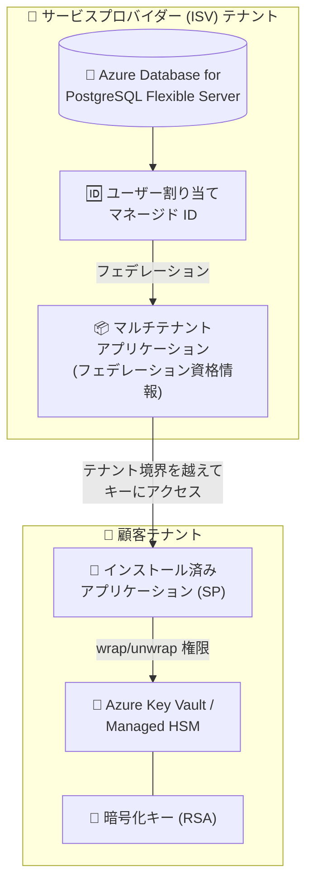

# Azure Database for PostgreSQL: Flexible Server のクロステナント カスタマー マネージド キー (CMK) が一般提供開始

**リリース日**: 2026-09-29

**サービス**: Azure Database for PostgreSQL Flexible Server

**機能**: クロステナント カスタマー マネージド キー (Cross-tenant CMK)

**ステータス**: Launched (GA)

[このアップデートのインフォグラフィックを見る](https://takech9203.github.io/azure-news-summary/20260929-postgresql-cross-tenant-cmk.html)

## 概要

Azure Database for PostgreSQL Flexible Server で、クロステナント カスタマー マネージド キー (CMK) のサポートが一般提供 (GA) となりました。PostgreSQL サーバーが存在する Microsoft Entra テナントとは **異なるテナント** にある Azure Key Vault または Azure Managed HSM に格納されたキーを使用して、データを暗号化できるようになります。

このアップデートは、データベースの運用とキーの所有権を別々のテナントに分離する必要がある SaaS プロバイダーや ISV (独立系ソフトウェアベンダー) に最適です。アプリケーションとデータベースはサービスプロバイダーのテナントで稼働させつつ、顧客は暗号化キーの完全な制御を維持できます。キー管理をサービス運用から独立させることで、セキュリティ・コンプライアンス要件を満たしながら、キーのローテーションや失効を顧客自身の裁量で管理できます。

**アップデート前の課題**

- 単一テナント構成の CMK では、Key Vault と PostgreSQL Flexible Server が同じ Microsoft Entra テナントに属している必要があった
- SaaS プロバイダーのテナントでデータベースを運用する場合、顧客が自社テナントでキーの所有権を保持したまま CMK 暗号化を利用できなかった

**アップデート後の改善**

- PostgreSQL サーバーとは別の Microsoft Entra テナントにある Azure Key Vault / Azure Managed HSM のキーで暗号化できるようになった
- 顧客はキーの管理 (ローテーション・失効) を自社テナントで独立して行い、サービスプロバイダーはデータベース運用に専念できる責務分離が実現した

## アーキテクチャ図



ISV テナント側の PostgreSQL サーバーは、マネージド ID をフェデレーション資格情報として構成したマルチテナントアプリケーションを介して、顧客テナントの Key Vault / Managed HSM にあるキーにアクセスし、データ暗号化キー (DEK) をラップ/アンラップします。

## サービスアップデートの詳細

### 主要機能

1. **テナントをまたいだ CMK 暗号化**
   - PostgreSQL Flexible Server とは異なる Microsoft Entra テナントにある Azure Key Vault または Azure Managed HSM のキーでデータ暗号化キーを保護できる

2. **マルチテナントアプリケーション + フェデレーション資格情報によるアクセス**
   - サービスプロバイダーのテナントでマルチテナントアプリケーションを作成し、ユーザー割り当てマネージド ID をフェデレーション資格情報として構成する
   - 顧客はそのアプリケーションを自社テナントにインストールし、Key Vault のキーへの権限を付与する

3. **キーの所有権と運用の分離**
   - 顧客はキーのローテーション・失効を自社テナントで独立して管理できる
   - キーへのアクセスを取り消すことで、データベースをアクセス不可 (Inaccessible) にする「キルスイッチ」として機能する

## 技術仕様

| 項目 | 詳細 |
|------|------|
| 対応キーストア | Azure Key Vault、Azure Key Vault Managed HSM |
| キーの種類 | 非対称キー (RSA / RSA-HSM) のみ |
| キーサイズ | 2,048 / 3,072 / 4,096 ビット (4,096 ビット推奨) |
| キーの状態 | Enabled であること。アクティブ化日時は過去、有効期限は未来であること |
| Key Vault 要件 | 論理的な削除 (soft-delete) 有効、消去保護 (purge protection) 有効、削除済みコンテナーの保持 90 日 |
| 権限モデル (推奨) | Azure RBAC: マネージド ID に「Key Vault Crypto Service Encryption User」ロールを割り当て |
| 権限モデル (レガシ) | アクセスポリシー: get / list / wrapKey / unwrapKey 権限 |
| CMK 構成のタイミング | サーバー作成時のみ (既存サーバーへの後付け不可) |
| ARM API バージョン | クロステナントのデータ暗号化プロパティは `2026-04-01-preview` 以降で利用可能 |
| キーバージョン更新 | 手動更新、またはバージョンなしキー URI による自動更新に対応 |

## 設定方法

### 前提条件

1. **サービスプロバイダー (ISV) テナント側**: マルチテナントアプリケーションを作成し、ユーザー割り当てマネージド ID をフェデレーション資格情報としてアプリケーションに構成する
2. **顧客テナント側**: マルチテナントアプリケーションをインストールし、Key Vault (または Managed HSM) とキーを作成して、アプリケーションにキーの権限を付与し、キー識別子 (Key Identifier) を控える

### Azure CLI

```bash
# サービスプロバイダーのテナントでマルチテナントアプリケーションを登録
federatedClientId=$(az ad app create --display-name myMultitenantApp --query appId -o tsv)

# 顧客テナントの Key Vault からキー識別子を取得
keyIdentifier=$(az keyvault key show --vault-name myVault --name myKey --query key.kid -o tsv)

# 顧客テナントのキーで暗号化されたサーバーを作成
az postgres flexible-server create \
  --resource-group myResourceGroup \
  --name myServer \
  --location eastus2 \
  --key $keyIdentifier \
  --identity myIdentity \
  --federated-client-id $federatedClientId

# 既存サーバーのキーをローテーション
az postgres flexible-server update \
  --resource-group myResourceGroup \
  --name myServer \
  --key $newKeyIdentifier \
  --identity myIdentity \
  --federated-client-id $federatedClientId
```

主なパラメーター:

| パラメーター | 説明 |
|------|------|
| `--key` | データ暗号化に使用する Key Vault キーのリソース識別子 |
| `--identity` | データ暗号化に使用するユーザー割り当てマネージド ID |
| `--federated-client-id` | マルチテナント Microsoft Entra アプリケーションのクライアント ID |
| `--backup-federated-client-id` | geo 冗長バックアップ有効時のみ使用する、geo バックアップ用フェデレーション ID のクライアント ID |

### Azure Portal

1. Azure Database for PostgreSQL の作成画面で「セキュリティ」タブを選択し、「カスタマー マネージド キー」を選択
2. 作成済みのユーザー割り当てマネージド ID を割り当てる
3. アプリケーション名を使用して「マルチテナント アプリケーション」を割り当てる
4. 顧客テナントで取得したキー識別子 (Key Identifier) を入力する

## メリット

### ビジネス面

- SaaS プロバイダー / ISV が、顧客のキー所有権を尊重した BYOK (Bring Your Own Key) モデルのサービスを提供できる
- キー管理をサービス運用から独立させることで、セキュリティ・コンプライアンス要件 (責務分離) を満たしやすくなる
- 顧客はキーの失効により、プロバイダー側のデータへのアクセスをいつでも遮断できる

### 技術面

- 顧客テナストでのキーのローテーション・失効を、顧客自身のポリシーとタイミングで実施できる
- バージョンなしキー URI による自動キーバージョン更新と組み合わせることで、キーライフサイクル管理を簡素化できる
- CMK によるデータ暗号化はワークロードのパフォーマンスに悪影響を与えない

## デメリット・制約事項

**クロステナント CMK 固有の制約:**

- 長期保持 (LTR) バックアップは、クロステナント CMK 構成のサーバーでは現在サポートされない
- Azure PowerShell は現在この機能をサポートしていない
- 両方のテナントでの追加構成と調整 (マルチテナントアプリケーションの作成・インストール、フェデレーション資格情報の構成) が必要

**CMK 全般の制約:**

- CMK 暗号化はサーバー作成時にのみ構成可能。既存サーバーへの後付けはできない (PITR で新サーバーへ復元する必要がある)
- CMK 構成後にサービスマネージドキー (SMK) へ戻すことはできない (戻す場合は新サーバーへの復元が必要)
- Key Vault / Managed HSM はサーバーと同じリージョンに存在する必要がある
- キーが無効化・削除・期限切れ・到達不能になると、サーバーは約 60 分以内に **Inaccessible** 状態となり、すべての接続が拒否される
- キーを新バージョンへローテーションする際は、再暗号化が完了するまで旧キーを利用可能にしておく必要がある (旧キーバージョンの無効化まで最低 2 時間待機を推奨)

## ユースケース

### ユースケース 1: SaaS プロバイダーによる顧客キー所有型のマネージドサービス

**シナリオ**: ISV が自社テナントで PostgreSQL ベースの SaaS を運用しつつ、金融・医療などの規制業界の顧客から「暗号化キーは自社テナントで所有・管理したい」という要件を受けている。

**実装例**:

```bash
# ISV テナント: マルチテナントアプリを作成し、マネージド ID をフェデレーション資格情報として構成
# 顧客テナント: アプリをインストールし、Key Vault のキーへ権限を付与
# ISV テナント: 顧客のキー識別子を指定してサーバーを作成
az postgres flexible-server create \
  --resource-group isv-rg \
  --name customer-a-db \
  --key "https://customer-vault.vault.azure.net/keys/customer-key" \
  --identity isv-umi \
  --federated-client-id $federatedClientId
```

**効果**: 顧客はキーの所有権・ローテーション・失効の権限を保持したまま SaaS を利用でき、ISV は顧客ごとのコンプライアンス要件を満たしたデータベース運用を実現できる。

## 料金

クロステナント CMK 機能自体の追加料金に関する公式情報は、アップデート発表およびドキュメントには記載されていません。Azure Key Vault / Azure Managed HSM の利用には各サービスの料金が適用されます。

- [Azure Database for PostgreSQL 料金ページ](https://azure.microsoft.com/pricing/details/postgresql/flexible-server/)
- [Azure Key Vault 料金ページ](https://azure.microsoft.com/pricing/details/key-vault/)

## 関連サービス・機能

- **Azure Key Vault**: 暗号化キーの格納先。RBAC 権限モデルと「Key Vault Crypto Service Encryption User」ロールでのアクセス許可が推奨される
- **Azure Key Vault Managed HSM**: FIPS 140-3 検証済み HSM によるシングルテナントのキー保管サービス。Key Vault の代替としてクロステナント CMK でも利用可能
- **Microsoft Entra ID**: マルチテナントアプリケーションとフェデレーション資格情報 (ワークロード ID フェデレーション) により、テナント境界を越えたキーアクセスを実現
- **ユーザー割り当てマネージド ID**: PostgreSQL サーバーがキーへアクセスする際の ID。フェデレーション資格情報としてマルチテナントアプリケーションに構成する
- **Azure Monitor / Resource Health / アクティビティログ**: キーへのアクセス喪失 (Inaccessible 状態) の監視・アラートに利用

## 参考リンク

- [インフォグラフィック](https://takech9203.github.io/azure-news-summary/20260929-postgresql-cross-tenant-cmk.html)
- [公式アップデート情報](https://azure.microsoft.com/updates?id=571783)
- [Microsoft Learn: Data Encryption at Rest in Azure Database for PostgreSQL Flexible Server](https://learn.microsoft.com/azure/postgresql/security/security-data-encryption)
- [Azure Database for PostgreSQL 料金ページ](https://azure.microsoft.com/pricing/details/postgresql/flexible-server/)

## まとめ

Azure Database for PostgreSQL Flexible Server のクロステナント CMK が GA となり、PostgreSQL サーバーと暗号化キーを別々の Microsoft Entra テナントに配置する構成が本番環境で利用可能になりました。SaaS プロバイダー / ISV のテナントでデータベースを運用しながら、顧客が自社テナントでキーの所有権と失効の権限を保持できるため、規制業界向けのマルチテナント SaaS アーキテクチャにおいて重要な選択肢となります。

導入時は、CMK はサーバー作成時にのみ構成可能である点、LTR バックアップ非対応や PowerShell 非対応などのクロステナント固有の制約、キーアクセス喪失時に約 60 分でサーバーが Inaccessible になる点を考慮し、マルチテナントアプリケーションとフェデレーション資格情報の設計、キーローテーション運用 (バージョンなしキー URI による自動更新推奨)、Resource Health / アクティビティログによる監視を含めた計画を立てることを推奨します。

---

**タグ**: Azure Database for PostgreSQL, Flexible Server, CMK, Customer-Managed Keys, Cross-tenant, Azure Key Vault, Managed HSM, セキュリティ, 暗号化, GA
