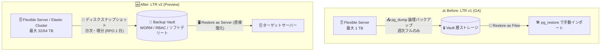

# Azure Database for PostgreSQL: 長期保持 (LTR) v2 (Public Preview)

**リリース日**: 2026-09-29

**サービス**: Azure Database for PostgreSQL

**機能**: Long-term retention (LTR) v2

**ステータス**: In preview

[このアップデートのインフォグラフィックを見る](https://takech9203.github.io/azure-news-summary/20260929-postgresql-ltr-v2.html)

## 概要

Azure Database for PostgreSQL の次世代長期バックアップソリューション「Long-term retention (LTR) v2」がパブリックプレビューとして発表された。LTR v1 で使用されていた論理バックアップ (pg_dump / pg_restore) から、Azure Backup Vault と統合された物理スナップショットベースのバックアップへ移行する。

v2 はマネージドディスクの増分スナップショットを利用して物理バックアップを取得するため、pg_dump ベースのエクスポートと比較して大規模データベースに対するスケーラビリティが大幅に向上する。Flexible Server に加えて Elastic Cluster もサポートし、日次バックアップ (RPO 1 日)、最大 64 TB のサーバー保護、ターゲットサーバーへの直接リストア (Restore as Server) が可能になる。

保持期間は v1 と同様に最大 10 年で、Backup Vault の WORM イミュータビリティ、ソフトデリート、マルチユーザー認可などのランサムウェア対策機能も利用できる。v1 (GA) は引き続き一般提供されており、既存の v1 保護アイテムは同じバックアップポリシーと Backup Vault のまま v2 へ移行できる (一方向のみ)。

**アップデート前の課題 (LTR v1)**

- pg_dump による論理バックアップのため、保護できるサーバーサイズが最大 1 TB に制限されていた
- バックアップ頻度が週 1 回のフルバックアップのみで、長期保持バックアップの RPO が大きかった
- リストアは「Restore as Files」でストレージコンテナーにファイルを復元した後、pg_restore などのネイティブツールで手動インポートする必要があった
- 保護対象は Flexible Server のみで、Elastic Cluster には対応していなかった

**アップデート後の改善 (LTR v2)**

- マネージドディスクスナップショットによる物理バックアップに移行し、Premium SSD v1 で最大 32 TB、Premium SSD v2 で最大 64 TB のサーバーを保護可能
- 日次・週次のバックアップスケジュールに対応し、RPO 1 日を実現 (オンデマンドバックアップも可能)
- 初回はフル、2 回目以降は増分バックアップとなり、マルチテラバイト級サーバーでも効率的にデータ転送
- 「Restore as Server」により、中間ストレージアカウントや手動の pg_restore を介さず、ターゲットの Flexible Server / Elastic Cluster に直接リストア
- Flexible Server と Elastic Cluster (最大 8 ノード) の両方を保護可能

## アーキテクチャ図

LTR v1 の週次 pg_dump + ファイル復元から、LTR v2 ではディスクスナップショットベースの日次増分バックアップと Backup Vault からのサーバー直接リストアに変わる。

## サービスアップデートの詳細

### 主要機能

1. **物理スナップショットベースのバックアップ**
   - マネージドディスクの増分スナップショットを取得し、Backup Vault にストリーミング。初回はフル、以降は変更ブロックのみを転送する。スナップショットチェーンが途切れた場合は、ユーザー操作なしで自動的に初期レプリケーションを再実行する

2. **Vault 分離による長期保護**
   - バックアップデータはソースのサブスクリプション・アカウントから分離され、Azure RBAC、ソフトデリート、マルチユーザー認可 (有効時) で保護される

3. **WORM イミュータブルバックアップ**
   - Backup Vault のイミュータビリティ (WORM) を有効化すると、Vault 管理者を含むいかなるユーザーも保持期間満了前に復旧ポイントを変更・上書き・削除できない

4. **柔軟なバックアップポリシー**
   - 日次または週次のスケジュールバックアップとオンデマンドバックアップに対応。日次・週次・月次・年次の復旧ポイントごとに 7 日〜10 年の独立した保持期間を設定可能

5. **Restore as Server**
   - 事前作成したターゲットの Flexible Server / Elastic Cluster に復旧ポイントを直接リストア。中間ストレージアカウントや手動の pg_restore が不要。クロスリージョンリストア、別サブスクリプション (同一テナント内) へのリストア、ソース削除後のリストアにも対応

6. **一元的なバックアップ管理**
   - Azure の Resiliency (Backup center) から、他の Azure Backup 保護ワークロードと合わせてバックアップ / リストアジョブ、保護アイテム、アラート、レポートを一元管理

### LTR v1 と v2 の比較

| 項目 | v1 (GA) | v2 (Preview) |
|------|---------|--------------|
| バックアップ技術 | 論理バックアップ (pg_dump) | マネージドディスクスナップショットによる物理バックアップ |
| 保護対象 | Flexible Server | Flexible Server + Elastic Cluster |
| 最大サイズ | 1 TB | Premium SSD v1: 32 TB / Premium SSD v2: 64 TB |
| バックアップ頻度 | 週 1 回 | 日次・週次 (RPO 1 日) |
| バックアップ種別 | フルバックアップのみ | 初回フル、以降は増分 |
| リストア | Restore as Files (ストレージコンテナーへ復元後、ネイティブツールでインポート) | Restore as Server (ターゲットサーバーへ直接復元) |
| 最大保持期間 | 最大 10 年 | 最大 10 年 |

## 技術仕様

| 項目 | 詳細 |
|------|------|
| PostgreSQL メジャーバージョン | PostgreSQL 15 以降 |
| コンピュートティア | General Purpose、Memory Optimized (Burstable は非対応) |
| ディスクタイプと最大サイズ | Premium SSD v1: 最大 32 TB / Premium SSD v2: 最大 64 TB |
| サーバーロール | プライマリサーバーのみ (リードレプリカ / geo レプリカは非対応) |
| Elastic Cluster | 最大 8 ノードまでサポート |
| バックアップ単位 | サーバー / クラスター全体 (個別データベース単位は不可) |
| RPO | 最小 1 日 (初回バックアップや高チャーン環境では 1 日を超える場合あり) |
| 保持期間 | 7 日〜10 年 (日次・週次・月次・年次で独立設定) |
| Backup Vault の場所 | データソースと同一リージョン (サブスクリプションは同一テナント内であれば別でも可) |
| CMK (カスタマーマネージドキー) | ソースサーバー、Backup Vault ともにサポート |
| ネットワーク | VNet / プライベートエンドポイント構成のサーバーは Trusted Access 経由でサポート |
| HA 有効サーバー | ソースとしてサポート (リストアターゲットは HA 構成不可) |
| 認証 | Backup Vault のマネージド ID (ユーザー割り当てマネージド ID も利用可) |

## 設定方法

### 前提条件

1. PostgreSQL 15 以降のメジャーバージョンを使用していること (14 以前はバックアップ構成が失敗するため、事前にメジャーバージョンアップグレードが必要)
2. コンピュートティアが General Purpose または Memory Optimized であること (Burstable はスケールアップが必要)
3. データソースと同一リージョンに Backup Vault があること
4. Backup Vault のマネージド ID に、ソースサーバー (バックアップ時) / ターゲットサーバー (リストア時) への必要な権限を付与すること (Azure Portal では構成時に不足ロールをインラインで割り当て可能。サーバーへの書き込み権限がない場合はロール割り当てテンプレートをダウンロードして DBA に実行を依頼できる)

### バックアップフロー

1. Backup Vault のマネージド ID にソースサーバーへの権限を付与
2. スケジュールと保持ルールを定義したバックアップポリシーを構成し、保護対象のデータソースを選択
3. スケジュール実行のたびに、Azure Backup が PostgreSQL リソースプロバイダー経由でサーバーディスクのスナップショットを作成
4. 前回スナップショットとの差分を計算し、差分のみを Backup Vault へ転送 (初回はフル転送)
5. Vault へのコピー完了でジョブが「Successful」となり、ポリシーの保持ルールに従って復旧ポイントを管理

### リストアフロー (Restore as Server)

1. リストア先となる Flexible Server / Elastic Cluster を事前に作成 (空であること、Burstable 以外、ソースと同じ PostgreSQL メジャーバージョン・同じディスクサイズ・同じディスクタイプ、HA / geo レプリカ構成なし、Backup Vault と同一リージョン)
2. Backup Vault で復旧ポイントとターゲットを選択 (Azure Backup がバージョン、ディスクサイズ / タイプ、SKU ティア、ネットワーク構成を事前検証)
3. Azure Backup が復旧ポイントの内容をターゲットサーバーのディスクに書き込み
4. PostgreSQL リソースプロバイダーがサーバーを起動し、トランザクション整合性のある状態でオンライン化

### v1 からの移行

- 既存の v1 保護アイテムは、同じバックアップポリシーと Backup Vault を維持したまま v2 へ移行可能
- 移行後も既存の v1 復旧ポイントは利用可能 (v1 復旧ポイントは Restore as Files、v2 復旧ポイントは Restore as Server でリストア)
- **移行は一方向のみ**。v1 に戻すには保護を停止しバックアップインスタンスを削除した上で v1 で再構成が必要

## メリット

### ビジネス面

- 最大 64 TB までの大規模データベースで最大 10 年の長期保持が可能になり、コンプライアンス要件 (WORM 対応を含む) に対応しやすくなる
- バックアップデータがソースサブスクリプションから分離された Backup Vault に保存され、ランサムウェアや誤削除・悪意ある削除への耐性が向上する
- Restore as Server により復旧手順が簡素化され、運用負荷と復旧時のオペレーションミスのリスクを低減できる

### 技術面

- 週次から日次バックアップになり、長期保持バックアップの RPO が 1 日に短縮される
- 増分データ転送により、マルチテラバイト級サーバーでも効率的にバックアップできる
- サービス管理のクローンやエクスポート処理に依存する論理バックアップと異なり、スナップショットベースで本番ワークロードへの影響を抑えられる
- Elastic Cluster (最大 8 ノード) を含む幅広いデータソースを単一のソリューションで保護できる

## デメリット・制約事項

- 個別データベース・テーブル・オブジェクト単位のバックアップ / リストア (アイテムレベル) は非対応 (サーバー / クラスター全体のみ)
- Burstable コンピュートティア、PostgreSQL 14 以前は非対応
- リードレプリカ / geo レプリカのバックアップは不可 (プライマリサーバーのみ)
- リストアはフルディスクイメージの書き込みとなるため、復旧時間は復旧ポイントのサイズに比例する。マルチテラバイト級サーバーでは RTO を分単位ではなく数時間〜数日で見積もる必要がある
- RPO 1 日はすべてのシナリオで保証されない (初回バックアップ / 初期再レプリケーション、日次チャーンが大きいサーバー、Premium SSD v2 使用時は 1 日を超える場合あり)
- 同一サーバーの多重保護は不可 (v1 と v2 のどちらか一方のみ)
- ターゲットサーバーの要件が厳格 (空であること、同一メジャーバージョン、同一ディスクサイズ・タイプなど)。ターゲットのディスクサイズがソースより小さいとリストアが失敗する
- 計画的な geo フェールオーバー後、バックアップ構成は新プライマリに自動では引き継がれない (旧プライマリに関連付いたままバックアップが失敗するため、新プライマリで再構成が必要)
- v1 から v2 への移行は一方向

## ユースケース

### ユースケース 1: 大規模データベースの長期保持コンプライアンス対応

**シナリオ**: 金融・医療などの規制業種で、数 TB 規模の PostgreSQL データベースに対し数年〜10 年のバックアップ保持が求められるが、LTR v1 の 1 TB 制限と週次バックアップでは要件を満たせない。

**実装**: LTR v2 で日次バックアップポリシーを構成し、日次復旧ポイントを数か月、月次・年次復旧ポイントを最長 10 年保持するよう設定。Backup Vault のイミュータビリティ (WORM) を有効化して改ざん・削除を防止する。

**効果**: 最大 64 TB のサーバーを RPO 1 日で保護しつつ、WORM 準拠の長期保持要件を満たせる。

### ユースケース 2: ランサムウェア対策としての分離バックアップ

**シナリオ**: 本番サブスクリプションが侵害された場合でも復旧可能なバックアップ体制を構築したい。

**実装**: 本番と分離された Backup Vault (別サブスクリプション、同一テナント) に v2 バックアップを構成し、ソフトデリート、マルチユーザー認可、WORM を組み合わせる。

**効果**: バックアップデータがソース環境から分離され、ソースサーバーが削除された後でもリストア可能。クロスリージョンリストアにも対応する。

### ユースケース 3: LTR v1 からの移行

**シナリオ**: 既に LTR v1 (pg_dump ベース) で保護しているサーバーのデータ増加に伴い、1 TB 制限や週次バックアップが課題になっている。

**実装**: PostgreSQL 15 以降へのアップグレードと General Purpose / Memory Optimized へのスケールを確認した上で、既存の保護アイテムを v2 へ移行。既存ポリシーと Backup Vault はそのまま利用し、v1 の既存復旧ポイントも保持される。

**効果**: バックアップ基盤を再構築することなく、日次バックアップと Restore as Server の恩恵を受けられる。

## 料金

LTR v2 では以下の課金が発生する。プレビュー時点の具体的な単価は料金ページを参照。

| 項目 | 内容 |
|------|------|
| 保護インスタンス料金 | データソースのサイズに基づき、保護インスタンスごとにユニット単位で課金 |
| バックアップストレージ料金 | Vault に保存された総データ量と Backup Vault の冗長性構成に基づき課金 |

v2 は大規模サーバーの日次バックアップに対応するため、ストレージコストは主に保持設定で決まる。日次復旧ポイントは数か月程度の保持にとどめ、長期保持には週次・月次・年次の復旧ポイントを使う構成が推奨されている。

詳細: [Azure Backup 料金ページ](https://azure.microsoft.com/pricing/details/backup/)

## 利用可能リージョン

以下を除くすべてのパブリックリージョンで利用可能: Austria East、Belgium Central、Chile Central、Indonesia Central、Israel Northwest、Malaysia South、Malaysia West、Mexico Central、Qatar Central、South Central US 2、Southeast US、Southeast US 3、Southeast US 5、Southwest US、West India

## 関連サービス・機能

- **Azure Backup (Backup Vault)**: v2 の基盤となるサービス。スナップショットの取得・増分転送・復旧ポイント管理を担い、RBAC / ソフトデリート / マルチユーザー認可 / WORM で保護する
- **Azure Managed Disks (増分スナップショット)**: v2 の物理バックアップの取得元。Premium SSD v1 / v2 に対応
- **Azure Database for PostgreSQL の運用バックアップ (PITR)**: サービス組み込みの自動バックアップは最大 35 日保持。35 日を超える長期保持要件を LTR v2 が補完する
- **Elastic Cluster**: v2 で新たに保護対象となった PostgreSQL の分散構成 (最大 8 ノード)
- **Azure Business Continuity Center (Resiliency)**: バックアップ / リストアジョブ、保護アイテム、アラート、レポートの一元管理

## 参考リンク

- [インフォグラフィック](https://takech9203.github.io/azure-news-summary/20260929-postgresql-ltr-v2.html)
- [公式アップデート情報](https://azure.microsoft.com/updates?id=571914)
- [About Azure Backup for PostgreSQL flexible server and elastic cluster (v2) - Microsoft Learn](https://learn.microsoft.com/azure/backup/backup-azure-postgresql-flex-server-elastic-cluster-v2-overview)
- [Support matrix for Azure Backup for PostgreSQL flexible server and elastic cluster (v2) - Microsoft Learn](https://learn.microsoft.com/azure/backup/backup-azure-postgresql-flex-server-elastic-cluster-v2-support-matrix)
- [About Azure Database for PostgreSQL Flexible server backup (v1) - Microsoft Learn](https://learn.microsoft.com/azure/backup/backup-azure-database-postgresql-flex-overview)
- [料金ページ (Azure Backup)](https://azure.microsoft.com/pricing/details/backup/)

## まとめ

LTR v2 は、Azure Database for PostgreSQL の長期保持バックアップを pg_dump ベースの論理バックアップからディスクスナップショットベースの物理バックアップへ刷新するアップデートである。1 TB / 週次という v1 の大きな制約が解消され、最大 64 TB・日次 RPO・Restore as Server による直接復旧が可能になるため、大規模 PostgreSQL ワークロードの長期保持・ランサムウェア対策の設計が大きく改善する。現在 v1 を利用中の場合は、PostgreSQL 15 以降へのアップグレードと Burstable 以外のティアへのスケールを前提に、一方向移行である点とアイテムレベルリストア非対応・リストアターゲット要件などの制約を評価した上で、プレビュー段階での検証を推奨する。

---

**タグ**: Azure Database for PostgreSQL, Azure Backup, Long-term Retention, Backup Vault, Databases, Public Preview
