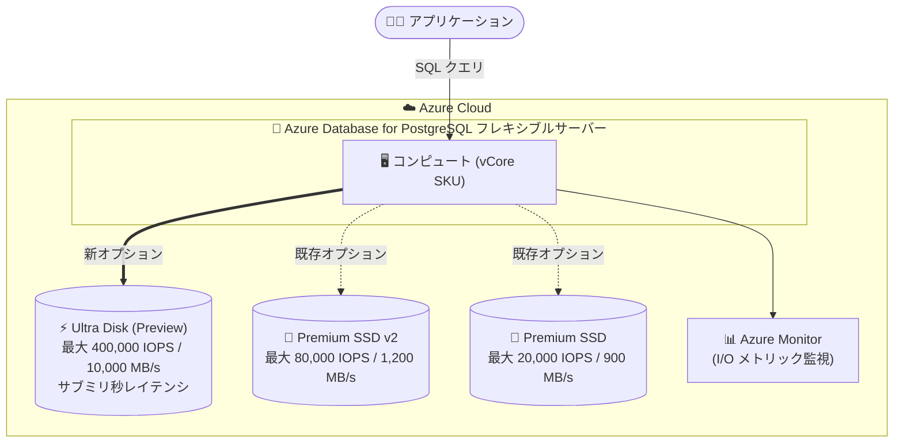

# Azure Database for PostgreSQL: Ultra Disk サポート (Public Preview)

**リリース日**: 2026-09-29

**サービス**: Azure Database for PostgreSQL

**機能**: Ultra Disk サポート (フレキシブルサーバー)

**ステータス**: In preview

[このアップデートのインフォグラフィックを見る](https://takech9203.github.io/azure-news-summary/20260929-postgresql-ultra-disk.html)

## 概要

Azure Database for PostgreSQL フレキシブルサーバーで、Azure の最高性能マネージドディスクである Ultra Disk のサポートがパブリックプレビューとして利用可能になりました。Ultra Disk は、一貫したサブミリ秒レイテンシ、高い IOPS、高いスループットを必要とする I/O 集約型・トランザクション量の多い PostgreSQL ワークロード向けに設計されています。

Ultra Disk では、ストレージ容量・IOPS・スループットを個別に構成できます。IOPS やスループットを増やす目的だけで余分な容量をプロビジョニングする必要がなく、ワークロード要件に合わせてストレージ性能を最適化できます。1 ディスクあたり最大 64 TB の容量、最大 400,000 IOPS、最大 10,000 MB/s のスループットをサポートします。

**アップデート前の課題**

- フレキシブルサーバーのストレージは Premium SSD (最大 20,000 IOPS / 900 MB/s) と Premium SSD v2 (最大 80,000 IOPS / 1,200 MB/s) に限られており、それを超える I/O 性能が必要なワークロードに対応できなかった
- ストレージレイテンシや I/O 容量がボトルネックとなる大規模 OLTP ワークロードでは、性能上限がスケーリングの制約になっていた

**アップデート後の改善**

- 最大 400,000 IOPS / 10,000 MB/s / 64 TB という Azure マネージドディスク最高クラスの性能を PostgreSQL フレキシブルサーバーで利用可能になった
- サブミリ秒レイテンシを設計目標とするストレージにより、一貫した低レイテンシが求められるトランザクション処理に対応できるようになった
- 容量・IOPS・スループットを独立して設定できるため、性能とコストのバランスを細かく調整できるようになった

## アーキテクチャ図

フレキシブルサーバーのストレージオプションに Ultra Disk が加わり、従来の Premium SSD / Premium SSD v2 を大きく上回る I/O 性能を選択できるようになります。実効性能はコンピュート SKU の上限にも依存するため、コンピュートとストレージを併せて設計します。

## サービスアップデートの詳細

### 主要機能

1. **Azure 最高性能のマネージドディスクを PostgreSQL で利用可能**
   - 最大 64 TB のストレージ容量、1 ディスクあたり最大 400,000 IOPS、最大 10,000 MB/s のスループットをサポート
   - サブミリ秒レイテンシを設計目標としており、大規模 OLTP やトランザクション量の多いシステムなど、ストレージレイテンシや I/O 容量が主要な性能制約となるワークロードに適する

2. **容量・IOPS・スループットの独立構成**
   - ストレージ容量、IOPS、スループットをそれぞれ個別に設定可能
   - IOPS やスループットを得るために余分な容量を確保する必要がなく、ワークロードに合わせた性能設計ができる

3. **ストレージ性能の監視**
   - Azure portal または Azure CLI (`az monitor metrics`) で I/O 消費を監視可能
   - 関連メトリック: storage limit、storage percentage、storage used、I/O percentage

## 技術仕様

| 項目 | Ultra Disk (Preview) | Premium SSD v2 | Premium SSD |
|------|---------------------|----------------|-------------|
| 最大容量 | 64 TB | 65,536 GiB | 32,767 GiB |
| 最大 IOPS | 400,000 | 80,000 | 20,000 |
| 最大スループット | 10,000 MB/s | 1,200 MB/s | 900 MB/s |
| レイテンシ | サブミリ秒 (設計目標) | 低レイテンシ | 低レイテンシ |
| 容量・IOPS・スループットの独立設定 | 可能 | 可能 | 不可 (ディスクサイズに連動) |

(Premium SSD / Premium SSD v2 の値は Azure Database for PostgreSQL フレキシブルサーバーのストレージドキュメントに基づく)

## メリット

### ビジネス面

- ストレージ性能がボトルネックだったミッションクリティカルな PostgreSQL ワークロードを、他プラットフォームへの移行やアーキテクチャ変更なしにスケールできる
- 容量と性能を独立して購入できるため、過剰プロビジョニングを避けてコストを最適化できる

### 技術面

- 従来の Premium SSD v2 比で最大 5 倍の IOPS (80,000 → 400,000)、約 8 倍のスループット (1,200 MB/s → 10,000 MB/s) を利用可能
- サブミリ秒レイテンシの設計目標により、一貫した低レイテンシが求められるトランザクション処理に対応
- 高ボリューム OLTP、トランザクションヘビーなシステムなど I/O 集約型ワークロードに適合

## デメリット・制約事項

- **プレビュー段階**: 利用可否は選択するリージョン、コンピュート SKU、プレビューリリースに依存する。デプロイのサポート状況は Microsoft の担当者への確認が案内されている
- **ストレージの自動拡張 (storage autogrow) は非サポート**
- **プレビュー期間中はリージョンおよびコンピュート SKU の対応が限定的**
- プロビジョニング済みストレージはスケールアップのみ可能で、スケールダウンはできない
- 実効性能は構成内の最も低い上限に制限される。ディスクで 400,000 IOPS を構成しても、コンピュート SKU の I/O 上限やワークロードの I/O パターンによっては到達しない。コンピュートとストレージを併せた設計が必要

## ユースケース

### ユースケース 1: 大規模 OLTP システムのストレージボトルネック解消

**シナリオ**: 決済処理や EC サイトのような高ボリュームのトランザクション処理で、Premium SSD v2 の上限 (80,000 IOPS) では I/O が飽和し、レイテンシが悪化している。

**効果**: Ultra Disk により最大 400,000 IOPS・サブミリ秒レイテンシのストレージを利用でき、ストレージ起因の性能制約を解消できる。コンピュート SKU の I/O 上限と合わせたサイジングを行うことで、プロビジョニングした性能を有効活用できる。

### ユースケース 2: 性能要件と容量要件が乖離したワークロードの最適化

**シナリオ**: データ量は小さいが IOPS 要件が非常に高いワークロードで、従来は性能を得るために必要以上の容量をプロビジョニングしていた。

**効果**: 容量・IOPS・スループットを独立して構成できるため、必要な容量のみを確保しつつ高い I/O 性能を設定でき、コスト効率が向上する。

## 料金

Ultra Disk (プレビュー) の Azure Database for PostgreSQL フレキシブルサーバーにおける具体的な料金は、今回の調査では確認できませんでした。最新の料金は以下の公式料金ページを参照してください。

- [Azure Database for PostgreSQL フレキシブルサーバー料金ページ](https://azure.microsoft.com/pricing/details/postgresql/flexible-server/)
- [Azure 料金計算ツール](https://azure.microsoft.com/pricing/calculator/)

## 利用可能リージョン

プレビュー期間中、利用可否は選択するリージョン、コンピュート SKU、プレビューリリースに依存します。公式ドキュメントでは、デプロイのサポート状況について Microsoft の担当者に確認するよう案内されています。

## 関連サービス・機能

- **Azure Managed Disks (Ultra Disk)**: 本機能の基盤となる Azure 最高性能のマネージドディスク。Azure VM 向けには SAP HANA やトップティアデータベースなどの I/O 集約型ワークロードで利用されている
- **Premium SSD v2**: 汎用ワークロード向けに価格性能比に優れた既存のストレージオプション。Ultra Disk と同様に容量・IOPS・スループットを独立して構成可能 (最大 80,000 IOPS / 1,200 MB/s)
- **Azure Monitor**: storage limit、storage percentage、storage used、I/O percentage などのメトリックでストレージ性能を監視

## 参考リンク

- [インフォグラフィック](https://takech9203.github.io/azure-news-summary/20260929-postgresql-ultra-disk.html)
- [公式アップデート情報](https://azure.microsoft.com/updates?id=571909)
- [Microsoft Learn: Ultra Disk - Azure Database for PostgreSQL](https://learn.microsoft.com/azure/postgresql/compute-storage/concepts-storage-ultra-disk)
- [Microsoft Learn: Storage options - Azure Database for PostgreSQL](https://learn.microsoft.com/azure/postgresql/compute-storage/concepts-storage)
- [Microsoft Learn: Azure マネージドディスクの種類](https://learn.microsoft.com/azure/virtual-machines/disks-types)
- [料金ページ](https://azure.microsoft.com/pricing/details/postgresql/flexible-server/)

## まとめ

Azure Database for PostgreSQL フレキシブルサーバーで Ultra Disk がパブリックプレビューとなり、最大 400,000 IOPS / 10,000 MB/s / 64 TB というマネージドディスク最高クラスのストレージ性能を PaaS の PostgreSQL で利用できるようになりました。Premium SSD v2 の上限 (80,000 IOPS) を超える I/O 性能が必要な大規模 OLTP ワークロードにとって重要な選択肢です。一方で、プレビュー期間中はリージョン・コンピュート SKU の対応が限定的で、ストレージ自動拡張が非サポートである点に注意が必要です。導入を検討する場合は、コンピュート SKU の I/O 上限を含めた全体設計を行い、対象リージョン・SKU のサポート状況を確認したうえで検証を開始することを推奨します。

---

**タグ**: Azure Database for PostgreSQL, Ultra Disk, Databases, Storage, Public Preview
