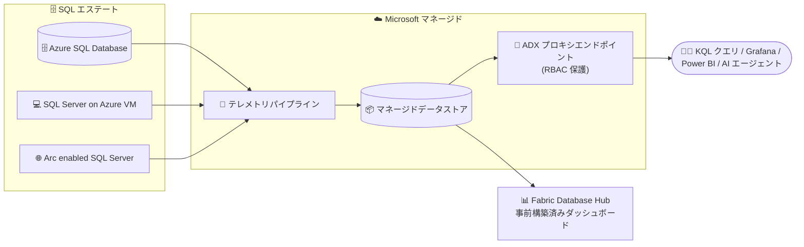

# Azure SQL Database: SQL Performance Monitoring (パブリックプレビュー)

**リリース日**: 2026-09-29

**サービス**: Azure SQL Database

**機能**: SQL Performance Monitoring (Microsoft マネージドのパフォーマンス監視)

**ステータス**: In preview

[このアップデートのインフォグラフィックを見る](https://takech9203.github.io/azure-news-summary/20260929-sql-database-performance-monitoring.html)

## 概要

Azure SQL Database 向けの Microsoft マネージドなパフォーマンス監視機能「SQL Performance Monitoring」がパブリックプレビューとして提供開始されました。カスタムの収集スクリプトを構築したり、分散した複数ツール間でテレメトリを相関付けしたりすることなく、Azure SQL Database のパフォーマンスを監視できるようになります。

本機能では、テレメトリの収集はデータベースエンジンの近くで行われ、Microsoft が管理するテレメトリパイプラインとデータストアに送信されます。ユーザー側でウォッチャー、パイプライン、データストアをデプロイ・運用する必要は一切ありません。収集されたデータは Azure ロールベースのアクセス制御 (RBAC) で保護され、既にアクセス権を持つリソースのテレメトリのみ参照できます。

発表ブログによると、この監視機能は Azure SQL Database に加え、SQL Server on Azure Virtual Machines、Azure Arc enabled SQL Server にも対応しており、Azure SQL Managed Instance への対応も近日提供予定 (coming soon) です。また、Fabric Database Hub と統合されており、事前構築済みダッシュボードによってデータベースエステート全体を一元的に把握できます。

**アップデート前の課題**

- SQL パフォーマンスを大規模に監視するには、ウォッチャーやエージェントなどの収集リソースのデプロイ・構成、テレメトリパイプラインの構築、データストアのプロビジョニング (および課金・セキュリティ確保・運用)、ダッシュボードの構築が必要で、サーバー・データベース・リージョンが増えるたびに同じ作業を繰り返す必要があった
- 監視スタックの各ステップが故障・構成ドリフト・収集停止のリスク要因となっていた
- 監視対象数のスケール制限や、データストア運用に伴う運用負荷とコストのオーバーヘッドが課題だった
- AI エージェントにパフォーマンス分析をさせるには、ツールとデータストアが分断されておらず、全データベースにわたる一貫したパフォーマンスデータソースが必要だった

**アップデート後の改善**

- 組み込みのデータ収集が Microsoft 管理のテレメトリパイプラインとデータストアに送信されるため、デプロイ・運用するインフラがゼロになった
- リソース単位およびエステート全体の事前構築済みダッシュボード (Fabric Database Hub) で、パフォーマンスの傾向、異常、リソースボトルネックを特定できるようになった
- RBAC で保護された Microsoft マネージドの Azure Data Explorer プロキシエンドポイント経由で、KQL によるテレメトリへの直接クエリが可能になった (自前の Azure Data Explorer クラスターの作成・支払いは不要)
- 監視対象数のスケール制限を気にする必要がなくなった

## アーキテクチャ図



各 SQL リソースのエンジン近くで収集されたテレメトリは Microsoft マネージドのパイプラインとデータストアに送られ、Fabric Database Hub のダッシュボードと RBAC 保護された Azure Data Explorer エンドポイント経由の KQL クエリの両方から利用できます。

## サービスアップデートの詳細

### 主要機能

1. **インフラ管理不要の組み込み監視**
   - ウォッチャーリソースや収集エージェントの作成・管理、テレメトリパイプラインの構築・運用、データストアのプロビジョニング・サイジング・支払いが不要
   - テレメトリの収集・パイプライン運用・データ保存はすべて Microsoft が実施

2. **SQL エステート全体で一貫したテレメトリ**
   - Azure、オンプレミス、他クラウドのいずれで稼働していても、サポート対象のすべての SQL デプロイで同一のコアパフォーマンスデータセットを収集
   - プレビューで収集されるテレメトリ: CPU・メモリ使用率、待機統計 (wait statistics)、アクティブセッション、ストレージ I/O とデータベースストレージ使用率、パフォーマンスカウンター、クライアント接続、データベースプロパティ、可用性グループ・レプリカ・データベースレプリカの正常性

3. **Fabric Database Hub の事前構築済みダッシュボード**
   - 「データベースは正常か」「どのデータベースに注意が必要か」に素早く答えられるよう設計されたダッシュボードを追加構築なしで利用可能
   - リソース使用量、待機、セッションアクティビティへのドリルダウンでパフォーマンス変化の要因を調査可能
   - パフォーマンス監視データは自動的に Fabric Database Hub に連携され、別途のオンボーディング手順は不要

4. **テレメトリへの直接クエリアクセス**
   - Microsoft マネージドかつ RBAC で保護された Azure Data Explorer エンドポイントを通じて、Azure Data Explorer Web UI から KQL でクエリ可能
   - 独自レポート・ダッシュボードの構築、Grafana や Power BI など既存ツールとの接続、AI エージェントへのアクセス付与が可能

### KQL クエリ例 (発表ブログより)

直近 1 時間の 95 パーセンタイル CPU 使用率でリソースを上位 10 件ランク付けする例:

```kusto
SqlServerCPUUtilization
| where SampleTimeUTC > ago(1h)
| summarize
  AvgCPU = round(avg(AvgCPUPercent), 1)
  , P95CPU = round(percentile(AvgCPUPercent, 95), 1)
  by ResourceID, ResourceType
| top 10 by P95CPU desc
```

## 技術仕様

| 項目 | 詳細 |
|------|------|
| 対象リソース | Azure SQL Database、SQL Server on Azure VMs、SQL Server enabled by Azure Arc (Azure SQL Managed Instance は近日対応予定) |
| 収集データ | CPU・メモリ使用率、待機統計、アクティブセッション、ストレージ I/O、パフォーマンスカウンター、クライアント接続、データベースプロパティ、可用性グループ関連の正常性 |
| データ保存先 | Microsoft マネージドのテレメトリパイプラインおよびデータストア |
| クエリアクセス | RBAC 保護された Microsoft マネージド Azure Data Explorer エンドポイント経由の KQL |
| ダッシュボード | Fabric Database Hub の事前構築済みダッシュボード (自動連携) |
| アクセス制御 | Azure RBAC (アクセス権を持つリソースのテレメトリのみ参照可能) |
| 有効化方法 (Azure SQL Database) | 監視対象の各データベースに拡張プロパティ (extended property) を追加 |

## 設定方法

### 前提条件 (テレメトリの参照)

1. クエリ対象のリソースを含む各サブスクリプションに対する Reader ロール (またはそれ以上の権限を持つロール)
2. サブスクリプションで `Microsoft.AzureArcData` リソースプロバイダーが登録済みであること

### 有効化 (プレビュー時点)

リソースタイプごとに有効化方法が異なります。

| リソースタイプ | 有効化方法 |
|----------------|-----------|
| Azure SQL Database | 監視対象の各データベースに拡張プロパティを追加 |
| Azure SQL Managed Instance | 近日対応予定 |
| SQL Server on Azure VMs | SQL IaaS Agent 拡張機能の機能フラグを有効化 |
| SQL Server enabled by Azure Arc | Azure Arc への接続後、既定で有効 |

具体的な手順は公式ドキュメント ([aka.ms/PerformanceMonitoring_SQLDB](https://aka.ms/PerformanceMonitoring_SQLDB)) を参照してください。

## メリット

### ビジネス面

- 監視インフラの構築・運用に費やしていた時間を、データベース自体の管理・改善に振り向けられる
- 自前のデータストアのプロビジョニングや支払いが不要になり、監視に伴う運用負荷とコストのオーバーヘッドを削減できる
- エステート全体の可視性により「どのデータベースに今注意が必要か」を迅速に判断できる

### 技術面

- Azure・オンプレミス・他クラウドを問わず、同一のテレメトリセットと単一のダッシュボード体系で監視できる (SQL の形態ごとにツールを使い分ける必要がない)
- RBAC 保護された ADX エンドポイント経由で KQL による柔軟な分析、Grafana / Power BI 連携、AI エージェントによる調査が可能
- 監視対象数のスケール制限を気にせず利用できる
- 収集スタックの故障・ドリフト・収集停止といった運用リスクを排除できる

## デメリット・制約事項

- パブリックプレビュー段階であり、本番環境での利用には Microsoft Azure プレビューの追加利用規約が適用される
- Azure SQL Managed Instance は現時点で未対応 (近日対応予定)
- Azure SQL Database では監視対象のデータベースごとに拡張プロパティを追加する必要がある (プレビュー時点)
- テレメトリの参照には `Microsoft.AzureArcData` リソースプロバイダーの登録が必要
- 利用可能リージョンが限定されている (下記参照)

## 利用可能リージョン

パブリックプレビューは以下の Azure リージョンで利用可能です。

- **南北アメリカ**: Brazil South、Canada Central、Canada East、Central US、East US、East US 2、North Central US、South Central US、West Central US、West US、West US 2、West US 3
- **ヨーロッパ・中東・アフリカ**: France Central、North Europe、Norway East、South Africa North、Sweden Central、Switzerland North、UAE North、UK South、UK West、West Europe
- **アジア太平洋**: Australia East、Central India、Japan East、Korea Central、Southeast Asia

## 料金

本アップデートの発表時点で、この機能自体の料金に関する公式情報は確認できませんでした。なお、発表ブログでは「自前のデータストアをプロビジョニングして支払う必要はない」「自前の Azure Data Explorer クラスターを作成・支払いする必要はない」と明記されています。

- [Azure SQL Database 料金ページ](https://azure.microsoft.com/pricing/details/azure-sql-database/single/)

## 関連サービス・機能

- **Fabric Database Hub**: 本機能のダッシュボード表示先。Azure SQL、Azure Database for PostgreSQL、Azure Cosmos DB を含むデータベースエステート全体を一元表示し、AI 支援分析や Real-Time Dashboard の構築が可能
- **Azure Data Explorer**: Microsoft マネージドのプロキシエンドポイント経由で収集テレメトリに KQL でクエリするためのインターフェイス (Web UI)
- **Database watcher (プレビュー)**: 従来提供されてきた Azure SQL 向け詳細監視ソリューション。ユーザーのサブスクリプション内の中央データストアにデータを収集する方式で、本機能は同様の監視をインフラ管理なしで実現する
- **Azure Monitor**: Azure SQL Database の従来からの監視基盤。プラットフォームメトリック、診断設定によるリソースログの Log Analytics へのルーティング、メトリック/ログアラートを提供
- **Query Performance Insight / Query Store**: 単一データベースのクエリレベルの分析を提供する既存機能

## 参考リンク

- [インフォグラフィック](https://takech9203.github.io/azure-news-summary/20260929-sql-database-performance-monitoring.html)
- [公式アップデート情報](https://azure.microsoft.com/updates?id=571867)
- [発表ブログ: Public Preview: Performance monitoring for Azure SQL (Tech Community)](https://techcommunity.microsoft.com/blog/AzureSQLBlog/public-preview-performance-monitoring-for-azure-sql/4560498)
- [公式ドキュメント: Performance monitoring for Azure SQL Database](https://aka.ms/PerformanceMonitoring_SQLDB)
- [Microsoft Learn: Monitor Azure SQL Database](https://learn.microsoft.com/azure/azure-sql/database/monitoring-sql-database-azure-monitor)
- [Microsoft Learn: Fabric Database Hub](https://learn.microsoft.com/fabric/database/hub/overview)
- [料金ページ](https://azure.microsoft.com/pricing/details/azure-sql-database/single/)

## まとめ

Azure SQL Database の SQL Performance Monitoring パブリックプレビューは、これまで監視スタックの構築・運用 (収集リソース、パイプライン、データストア、ダッシュボード) に費やされていた作業を Microsoft マネージドに置き換える大きなアップデートです。Fabric Database Hub の事前構築済みダッシュボードによるエステート全体の可視化と、RBAC 保護された ADX エンドポイント経由の KQL クエリアクセスにより、大規模な SQL 環境の運用チームや AI エージェントによる分析に適した一貫したテレメトリ基盤が提供されます。Japan East を含むプレビュー対象リージョンで Azure SQL Database を運用している場合は、非本番環境で拡張プロパティによる有効化を試し、既存の監視ソリューション (database watcher、カスタム収集スクリプト、サードパーティツール) との比較評価を始めることを推奨します。

---

**タグ**: Azure SQL Database, Databases, Monitoring, Public Preview, Fabric Database Hub, KQL, Azure Data Explorer
