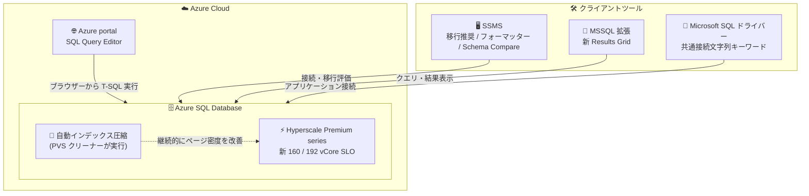

# Azure SQL Database: 2026 年 9 月下旬の GA アップデートまとめ

**リリース日**: 2026-09-29

**サービス**: Azure SQL Database

**機能**: 2026 年 9 月下旬の Azure SQL アップデート (Hyperscale Premium series 160/192 vCore、自動インデックス圧縮ほか)

**ステータス**: Launched (GA)

[このアップデートのインフォグラフィックを見る](https://takech9203.github.io/azure-news-summary/20260929-sql-late-september-ga-updates.html)

## 概要

2026 年 9 月下旬に、Azure SQL に関する複数のアップデートが一般提供 (GA) となりました。データベースエンジン側では、Azure SQL Database Hyperscale Premium series に新しい 160 vCore / 192 vCore オプションが追加され、従来の最大値であった 128 vCore と比較して最大 50% 高いコンピュート容量が利用可能になりました。また、インデックスメンテナンスジョブなしでストレージ消費を削減できる「自動インデックス圧縮 (Automatic Index Compaction)」が利用可能になりました。

ツール側では、Azure portal のモダンなブラウザーベース SQL Query Editor、SQL Server Management Studio (SSMS) のインテリジェントな移行ターゲット推奨、MSSQL 拡張の新しい Results Grid エクスペリエンス、SSMS の組み込み SQL フォーマッター、SSMS の Schema Compare、そして Microsoft SQL ドライバー間で共通利用できる接続文字列キーワードが発表されました。

本アップデートに含まれる項目は以下の 8 件です。

1. Hyperscale Premium series の 160 vCore / 192 vCore オプション
2. 自動インデックス圧縮 (Automatic Index Compaction)
3. Azure portal の SQL Query Editor (モダンなブラウザーベースエクスペリエンス)
4. SSMS でのインテリジェントな Azure SQL 移行ターゲット推奨
5. 新しい Results Grid エクスペリエンス (列カスタマイズオプションの拡張)
6. SSMS の組み込み SQL フォーマッター
7. SSMS の Schema Compare (データベース定義の比較)
8. Microsoft SQL ドライバー共通の接続文字列キーワード

**アップデート前の課題**

- Hyperscale Premium series の最大コンピュートサイズは 128 vCore に制限されており、それ以上のスケールアップができなかった
- インデックスの断片化・ページ密度低下への対処には、インデックス再構築 (rebuild) や再編成 (reorganize) のメンテナンスジョブを自前でセットアップ・監視・維持する必要があり、実行時には高いリソース消費が発生していた
- Azure SQL Database への移行時のターゲット SKU 選定や、データベース定義の比較 (Schema Compare)、SQL の整形などに外部ツールや手作業が必要だった
- 言語やフレームワークごとに SQL ドライバーの接続文字列キーワードが異なり、都度調べる必要があった

**アップデート後の改善**

- Hyperscale Premium series で 160 vCore / 192 vCore を選択でき、従来比最大 50% 大きいコンピュート容量で大規模ワークロードをスケール可能になった
- `ALTER DATABASE ... SET AUTOMATIC_INDEX_COMPACTION = ON` の 1 文で、データ変更に追従して継続的・低オーバーヘッドにインデックスを圧縮し、ストレージ・ディスク I/O・CPU・メモリ消費を削減できるようになった
- Azure portal から外部ツールなしで T-SQL クエリの実行とオブジェクト探索が可能になり、SSMS では移行ターゲット推奨・SQL フォーマッター・Schema Compare が組み込みで利用できるようになった
- 1 つの接続文字列キーワードセットを Microsoft SQL ドライバー間で共通利用できるようになった

## アーキテクチャ図



今回の GA アップデートは、データベースエンジン側の強化 (Hyperscale の新 vCore オプション、自動インデックス圧縮) と、Azure portal・SSMS・MSSQL 拡張・ドライバーといったツールチェーン全体の改善で構成されます。

## サービスアップデートの詳細

### 主要機能

1. **Hyperscale Premium series の 160 vCore / 192 vCore オプション**
   - サービスレベル目標 (SLO) として `HS_PRMS_160` と `HS_PRMS_192` が追加され、従来の最大 128 vCore から最大 50% 高いコンピュート容量を利用可能
   - 160 vCore ではメモリ 830.4 GB / 最大ローカル SSD IOPS 680,000、192 vCore ではメモリ 843.7 GB / 最大ローカル SSD IOPS 816,000 (詳細は技術仕様を参照)
   - Premium series は新しい CPU を搭載したハードウェアでの実行が保証される (Standard series と料金差はないが、一部リージョンでは利用できない場合がある)

2. **自動インデックス圧縮 (Automatic Index Compaction)**
   - インデックスメンテナンスジョブを構築・運用することなく、ストレージ消費・ディスク I/O・CPU・メモリ消費を削減し、ワークロードのパフォーマンスを改善
   - 永続バージョンストア (PVS) クリーナープロセスの一部として動作し、最近変更されたページのみを対象に低オーバーヘッドで継続的に実行される
   - ページの空き領域に次ページの行を移動し、空になったページを割り当て解除することでページ密度を向上
   - 既定では無効。データベース単位で `ALTER DATABASE` により有効化する (再起動や排他アクセスは不要で、数分以内に開始される)
   - Azure SQL Database、Azure SQL Managed Instance (Always-up-to-date 更新ポリシー)、SQL database in Microsoft Fabric に適用

3. **Azure portal の SQL Query Editor**
   - 外部ツール不要で、ブラウザーから Azure SQL Database に対する T-SQL クエリ実行 (DML/DDL) とオブジェクト探索が可能
   - SQL 認証および Microsoft Entra 認証をサポート
   - 結果セットを .csv / .json / .xlsx としてダウンロード可能。新規 T-SQL オブジェクトのテンプレートも提供
   - 「Open in」ドロップダウンから SSMS や Visual Studio Code (MSSQL 拡張) への接続を起動可能。従来の Query Editor は「Classic experience」として引き続き選択可能

4. **SSMS でのインテリジェントな Azure SQL 移行ターゲット推奨**
   - SQL Server Management Studio (SSMS) 内で、ワークロードに合わせた Azure SQL 移行ターゲットの推奨を直接確認でき、移行の意思決定を支援

5. **新しい Results Grid エクスペリエンス**
   - 強化された状態管理によりパフォーマンスと応答性が向上
   - 列のカスタマイズオプションが拡張

6. **SSMS の組み込み SQL フォーマッター**
   - オンデマンドでの実行に加え、保存時の自動フォーマットを構成可能
   - SSMS の設定または `.editorconfig` ファイルによるカスタマイズに対応

7. **SSMS の Schema Compare**
   - 2 つのデータベース定義を比較可能
   - 比較のソース・ターゲットには、接続済みデータベース、SQL データベースプロジェクト、.dacpac ファイルの任意の組み合わせを指定可能

8. **Microsoft SQL ドライバー共通の接続文字列キーワード**
   - 1 つの接続文字列キーワードセットを記述すれば、Microsoft SQL ドライバー間で共通して利用可能
   - 言語・フレームワークごとに接続文字列キーワードを調べ直す必要がなくなる

## 技術仕様

### Hyperscale Premium series: 128 vCore と新オプションの比較 (`HS_PRMS_128` / `HS_PRMS_160` / `HS_PRMS_192`)

| 項目 | 128 vCore (従来最大) | 160 vCore (新規) | 192 vCore (新規) |
|------|---------------------|------------------|------------------|
| ハードウェア | Premium-series | Premium-series | Premium-series |
| メモリ (GB) | 625 | 830.4 | 843.7 |
| 最大データサイズ (TB) | 128 | 128 | 128 |
| 最大ログサイズ | 無制限 | 無制限 | 無制限 |
| tempdb 最大データサイズ (GB) | 4,096 | 4,096 | 4,096 |
| 最大ローカル SSD IOPS | 544,000 | 680,000 | 816,000 |
| 最大ログレート (MiB/s) | 150 | 150 | 150 |
| 最大同時ワーカー数 | 12,800 | 16,000 | 16,800 |
| 最大同時ログイン数 | 12,800 | 16,000 | 19,200 |
| 最大同時セッション数 | 30,000 | 30,000 | 30,000 |
| セカンダリレプリカ | 0-4 | 0-4 | 0-4 |
| 読み取りスケールアウト | 対応 | 対応 | 対応 |

### 自動インデックス圧縮の仕様

| 項目 | 詳細 |
|------|------|
| 既定の状態 | 無効 (データベース単位で有効化) |
| 有効化方法 | `ALTER DATABASE ... SET AUTOMATIC_INDEX_COMPACTION = ON` |
| 実行主体 | 永続バージョンストア (PVS) クリーナーのバックグラウンドプロセス |
| 対象 | B-tree インデックスのリーフレベルのうち `IN_ROW_DATA` 割り当て単位のページ (クラスター化/非クラスター化インデックス・制約、XML/フルテキスト/空間/columnstore の内部テーブル上の B-tree インデックス) |
| 対象外 | ヒープテーブル、`ROW_OVERFLOW_DATA` / `LOB_DATA` 割り当て単位、columnstore の圧縮行グループ、メモリ最適化テーブル、システムテーブル、`msdb` 以外のシステムデータベース、ページロックが無効化されたインデックス |
| 状態確認 | `sys.databases` の `is_automatic_index_compaction_on` 列、`DATABASEPROPERTYEX` の `IsAutomaticIndexCompactionOn` |
| 監視 | `sys.dm_db_index_operational_stats` (圧縮試行/完了/スキップ、移動行数、割り当て解除ページ数)、拡張イベント `auto_index_compaction_stats` (10 分間隔) |
| 一時停止条件 | PVS サイズが 150 GB 以上、または中止済みトランザクションが 1,000 件以上の場合、PVS クリーンアップが優先され圧縮は一時停止 |

### Azure portal SQL Query Editor の仕様

| 項目 | 詳細 |
|------|------|
| 認証方式 | SQL 認証、Microsoft Entra 認証 |
| クエリタイムアウト | 5 分 |
| 結果のエクスポート | .csv / .json / .xlsx |
| 通信ポート | TCP 443 のみ (2026 年 3 月以降) |
| ネットワーク要件 | パブリック接続の場合は送信元 IP をサーバーのファイアウォール規則に追加 (Private Link 経由で仮想ネットワーク内から接続する場合は不要) |

## 設定方法

### 前提条件

1. Azure SQL Database (Hyperscale の新 vCore オプションを利用する場合は Premium series ハードウェア。一部リージョンでは Premium series が利用できない場合がある)
2. 自動インデックス圧縮の有効化には `ALTER DATABASE` を実行できる権限
3. Query Editor の利用には、サーバーのファイアウォール規則への送信元 IP の追加 (または Private Link 接続) と、データベースへのログイン/ユーザー

### Azure CLI

```bash
# Hyperscale Premium series の 160 vCore にスケールアップ
az sql db update \
  --resource-group <resource-group-name> \
  --server <server-name> \
  --name <database-name> \
  --service-objective HS_PRMS_160
```

### T-SQL (自動インデックス圧縮)

```sql
-- 自動インデックス圧縮を有効化
ALTER DATABASE [<database-name>]
SET AUTOMATIC_INDEX_COMPACTION = ON;

-- 有効化状態の確認
SELECT database_id, name, is_automatic_index_compaction_on
FROM sys.databases;
```

### Azure Portal

1. Azure portal で対象の SQL データベースを開く
2. 左側メニューの「Query editor」を選択し、SQL 認証または Microsoft Entra 認証でサインイン
3. Explorer でデータベースオブジェクトを参照し、クエリウィンドウで T-SQL を実行
4. 従来のエクスペリエンスに戻す場合は「Classic experience」を選択

## メリット

### ビジネス面

- Hyperscale の最大コンピュート容量が最大 50% 拡大し、これまで 128 vCore で頭打ちだった大規模ワークロードをスケールアップで対応可能 (シャーディング等の再設計を回避できる可能性)
- インデックスメンテナンスジョブの構築・監視・維持が不要になり、運用コストとメンテナンスウィンドウの負担を削減
- ストレージ使用量の増加が抑制され、ストレージコストの節約につながる
- ブラウザーだけで軽量なクエリ実行・調査が完結し、外部ツールのセットアップが不要

### 技術面

- 自動インデックス圧縮は最近変更されたページのみを対象とするため、全ページを処理するインデックス再構築・再編成と比較してオーバーヘッドが最小限
- ページ密度の向上により、クエリが読み取るページ数が減り、ディスク I/O・CPU・メモリ消費が削減される
- インデックス再構築と異なり、データファイル内に大きな空き領域を確保する必要がない
- SSMS の移行ターゲット推奨・フォーマッター・Schema Compare、共通接続文字列キーワードにより、開発・移行ワークフローが標準ツール内で完結

## デメリット・制約事項

- **自動インデックス圧縮**:
  - 有効化後に変更されたページのみが対象。既にページ密度が低いインデックスには、一度だけインデックス再構築/再編成を実行することが推奨される
  - インデックスの断片化 (fragmentation) は解消しない (再構築/再編成とは異なる)。また、インデックスの統計は更新されない
  - 書き込みが多いワークロードでは、トランザクションログの書き込み I/O とログバックアップサイズが増加する可能性がある
  - 圧縮処理は短時間の排他 (X) ページロックを取得するため、まれにミリ秒単位の短時間ブロッキングが発生する可能性がある
  - ヒープテーブル、LOB/行オーバーフローデータ、columnstore 圧縮行グループ、メモリ最適化テーブルは対象外
- **Hyperscale Premium series**: 一部リージョンでは利用できない場合がある。160/192 vCore でも最大ログレートは 150 MiB/s、tempdb 最大サイズは 4,096 GB で 128 vCore と同一
- **SQL Query Editor**:
  - クエリ実行タイムアウトは 5 分 (長時間クエリは SSMS や MSSQL 拡張を使用)
  - 複数ステートメントのクエリでは最後のステートメントの結果のみ表示される
  - 論理サーバーの `master` データベースへの接続、および `ApplicationIntent=ReadOnly` によるレプリカ接続は非対応
  - 列に対する IntelliSense は非対応 (テーブル・ビューは対応)。ページ更新やブラウザーを閉じるとクエリは失われる

## ユースケース

### ユースケース 1: 128 vCore で頭打ちの大規模 OLTP ワークロードのスケールアップ

**シナリオ**: Hyperscale Premium series の 128 vCore で CPU 使用率が常時高く、ピーク時に性能が不足している基幹系データベース。

**実装例**:

```bash
az sql db update \
  --resource-group rg-prod \
  --server sql-prod-server \
  --name db-core \
  --service-objective HS_PRMS_192
```

**効果**: 従来比最大 50% のコンピュート容量増 (最大同時ワーカー数 16,800、最大ローカル SSD IOPS 816,000) により、アプリケーションの再設計なしでスケールアップで対応できる。

### ユースケース 2: インデックスメンテナンスジョブの廃止

**シナリオ**: 夜間にインデックス再構築ジョブを実行しているが、実行時のリソース消費が大きく、メンテナンスウィンドウの確保が困難。

**実装例**:

```sql
-- (推奨) ページ密度が低い場合は一度だけ再構築/再編成を実行してから有効化
ALTER DATABASE [db-core]
SET AUTOMATIC_INDEX_COMPACTION = ON;
```

**効果**: データ変更に追従して継続的・低オーバーヘッドでページ密度が維持され、定期メンテナンスジョブとその運用が不要になる。効果は `sys.dm_db_index_operational_stats` で監視できる。

## 料金

今回の発表では新オプション固有の料金は明示されていません。Hyperscale の料金は vCore 数に基づくため、160/192 vCore へのスケールアップに応じてコンピュート料金が増加します。なお、Premium series と Standard series の間に価格差はありません (ドキュメント記載)。詳細は料金ページを参照してください。

- [Azure SQL Database の料金](https://azure.microsoft.com/pricing/details/azure-sql-database/single/)

自動インデックス圧縮、SQL Query Editor、SSMS の各機能、共通接続文字列キーワードに追加料金はアナウンスされていません (自動インデックス圧縮はストレージ消費の削減に寄与)。

## 利用可能リージョン

今回の発表ではリージョン情報は明示されていません。なお、Hyperscale の Premium series ハードウェアは一部リージョンでは利用できない場合があります。最新の利用可能状況は公式ドキュメント・Azure portal で確認してください。

## 関連サービス・機能

- **Azure SQL Managed Instance**: 自動インデックス圧縮は Always-up-to-date 更新ポリシーの Managed Instance でも利用可能
- **SQL database in Microsoft Fabric**: 自動インデックス圧縮の適用対象
- **SQL Server Management Studio (SSMS)**: 移行ターゲット推奨、SQL フォーマッター、Schema Compare が組み込みで提供されるクライアントツール
- **Visual Studio Code (MSSQL 拡張)**: 新しい Results Grid エクスペリエンスの提供先。Query Editor の「Open in」からの接続にも対応
- **高速データベース復旧 (ADR) / 永続バージョンストア (PVS)**: 自動インデックス圧縮は PVS クリーナープロセスの一部として動作

## 参考リンク

- [インフォグラフィック](https://takech9203.github.io/azure-news-summary/20260929-sql-late-september-ga-updates.html)
- [公式アップデート情報](https://azure.microsoft.com/updates?id=571643)
- [Hyperscale premium-series リソース制限 (160/192 vCore)](https://learn.microsoft.com/azure/azure-sql/database/resource-limits-vcore-single-databases?view=azuresql#hyperscale---provisioned-compute---premium-series)
- [自動インデックス圧縮 (Automatic Index Compaction)](https://learn.microsoft.com/sql/relational-databases/indexes/automatic-index-compaction)
- [Azure portal SQL Query Editor](https://learn.microsoft.com/azure/azure-sql/database/query-editor?view=azuresql)
- [SSMS の移行ターゲット推奨](https://aka.ms/ssms/migration/skutool)
- [MSSQL 拡張の Results Grid (September 2026)](https://aka.ms/vscode-mssql-september2026)
- [SSMS の T-SQL フォーマッター](https://learn.microsoft.com/ssms/scripting/format-t-sql)
- [SSMS の Schema Compare](https://learn.microsoft.com/ssms/schema-compare)
- [Hyperscale サービスレベル](https://learn.microsoft.com/azure/azure-sql/database/service-tier-hyperscale)
- [料金ページ](https://azure.microsoft.com/pricing/details/azure-sql-database/single/)

## まとめ

2026 年 9 月下旬の Azure SQL GA アップデートは、Hyperscale Premium series の 160/192 vCore オプションによるスケール上限の引き上げと、自動インデックス圧縮による運用レスなストレージ・パフォーマンス最適化という、エンジン側の 2 つの大きな強化が中心です。加えて、Azure portal の SQL Query Editor、SSMS の移行推奨・フォーマッター・Schema Compare、共通接続文字列キーワードなど、開発・運用ツールチェーン全体が底上げされています。

Solutions Architect としては、(1) 128 vCore で頭打ちだった Hyperscale ワークロードのスケールアップ余地の再評価、(2) 既存のインデックスメンテナンスジョブの自動インデックス圧縮への置き換え検討 (初回のみ再構築/再編成を実施した上での有効化が推奨) の 2 点を優先的に検討することを推奨します。

---

**タグ**: Azure SQL Database, Hyperscale, Premium series, vCore, 自動インデックス圧縮, SQL Query Editor, SSMS, Schema Compare, GA
