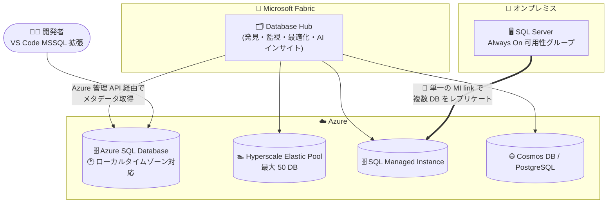

# Azure SQL: 2026 年 9 月下旬のアップデートまとめ (Public Preview)

**リリース日**: 2026-09-29

**サービス**: Azure SQL Database / Azure SQL Managed Instance

**機能**: 2026 年 9 月下旬の複数プレビューアップデート (Database Hub in Microsoft Fabric、Hyperscale Elastic Pool のデータベース数拡大、ローカルタイムゾーンサポート、MSSQL 拡張機能の新ランディングページ、Managed Instance link の複数データベースレプリケーション)

**ステータス**: In preview

[このアップデートのインフォグラフィックを見る](https://takech9203.github.io/azure-news-summary/20260929-sql-late-september-preview-updates.html)

## 概要

2026 年 9 月下旬に、Azure SQL に対して以下 5 件のアップデート・機能強化 (いずれも Public Preview) が発表されました。

1. **Database Hub in Microsoft Fabric**: SQL Server、Azure SQL、PostgreSQL、Azure Cosmos DB、Fabric SQL にまたがるデータベースを横断的に発見・管理・監視・最適化する統合エクスペリエンス。AI を活用したインサイトとエージェントを単一のコントロールプレーンに集約し、データベース運用を簡素化する
2. **Hyperscale Elastic Pool のデータベース数上限拡大**: 1 つの Hyperscale Elastic Pool に配置できるデータベース数を 50 に増加可能に
3. **Azure SQL Database のローカルタイムゾーンサポート**: カスタムロジックや回避策なしに、構成したタイムゾーンでアプリケーションを動作させることが可能に
4. **MSSQL 拡張機能 (VS Code) のモダナイズされたランディングページ**: 機能の発見と迅速な利用開始が容易に
5. **Managed Instance link の複数データベースレプリケーション**: 単一の link で SQL Server Always On 可用性グループの複数データベースを Azure SQL Managed Instance にレプリケート可能に

**アップデート前の課題**

- データベース資産が Azure、Fabric、オンプレミスなど複数のポータル・管理画面に分散し、Issues や Suggestions を確認するために複数のポータルを行き来する必要があった
- Azure SQL Database は歴史的に UTC 固定であり、データベースやセッションのタイムゾーンを構成する手段がなく、すべてのクエリへの `AT TIME ZONE` の埋め込みやアプリケーション層でのタイムゾーン処理といった回避策が必要だった (エラーが起きやすく、大規模環境ではパフォーマンス上のオーバーヘッドも発生)
- Managed Instance link は単一データベースモードのみで、1 link = 1 データベースの制約があり、複数データベースをレプリケートするにはデータベースごとに個別の link を作成する必要があった (可用性グループを単一データベースの AG に分割する必要があった)

**アップデート後の改善**

- Database Hub により、既存の Azure RBAC 権限を利用して、データベース資産全体のインベントリ、Issues/Suggestions、パフォーマンスを単一のコントロールプレーンで横断的に把握できるようになった
- `ALTER DATABASE SCOPED CONFIGURATION SET TIME_ZONE` (データベースレベル) と `SET TIME ZONE` (セッションレベル) により、クライアントドライバーの変更や接続文字列の変更なしにローカルタイムゾーンで日時関数が動作するようになった
- 複数データベース link モード (プレビュー) により、既存の Always On 可用性グループを分割せずに、グループ内の全データベースを 1 つの link で Azure SQL Managed Instance に拡張できるようになった
- Hyperscale Elastic Pool あたりのデータベース数を 50 に増やせるようになり、SaaS などマルチテナント構成での集約密度が向上した

## アーキテクチャ図



Database Hub が Azure・Fabric・オンプレミスのデータベース資産を単一のコントロールプレーンとして横断的に管理し、Managed Instance link は単一の link で可用性グループ内の複数データベースを Azure SQL Managed Instance へレプリケートします。

## サービスアップデートの詳細

### 1. Database Hub in Microsoft Fabric

Azure、Microsoft Fabric、オンプレミス、サポートされるマルチクラウド環境にまたがるデータベース資産を統合的に運用するエクスペリエンス。

- **Overview ページ**: 注意が必要な項目をハイライト表示
- **Estate ページ**: エンジン横断のリソースビュー。データベースインベントリを一元的に閲覧し、Issues (早急な対応・修復が必要な問題) と Suggestions (セキュリティ・パフォーマンス・使用率・コスト効率・運用態勢の改善機会) を複数ポータルを移動せずに確認可能。カスタムビューの保存・共有にも対応
- **Performance ページ**: アクセス権のある全データベースエンジンを横断して、リアルタイムおよび履歴メトリックを資産レベルで統合表示
- **リソース作成**: Estate ページの「+ Create resource」から、サポートされる任意のプラットフォームのリソースを作成可能

**サポートされるデータベースサービス (プレビュー時点)**: Azure SQL Database (全サービスティア)、Azure SQL Elastic Pools、Azure SQL Managed Instance、SQL database in Fabric、Azure Arc 対応 SQL Server、Azure VM 上の SQL Server、Azure Database for PostgreSQL フレキシブルサーバー、Azure Cosmos DB

**アクセス制御**: 既存の Microsoft Entra ID と Azure RBAC の権限をそのまま使用する。Database Hub が追加のアクセス権を付与することはなく、パフォーマンス監視データの表示には対象サブスクリプションでの Reader ロール以上が必要。Database Hub はデータベースリソースを変更しない。

### 2. Hyperscale Elastic Pool のデータベース数上限を 50 に拡大

1 つの Hyperscale Elastic Pool に配置できるデータベース数を 50 に増やせるようになりました (プレビュー)。Hyperscale Elastic Pool は、プール内のデータベース間でコンピュートとログリソースを共有する Hyperscale データベース向けの共有リソースモデルで、利用パターンの異なる複数データベースのコスト最適化に有効です。

### 3. Azure SQL Database のローカルタイムゾーンサポート

- **データベースレベル**: `ALTER DATABASE SCOPED CONFIGURATION SET TIME_ZONE = '<Windows タイムゾーン ID>'` で全接続に適用される永続的な設定。セカンダリレプリカはプライマリの設定を継承
- **セッションレベル**: ANSI SQL 標準構文 `SET TIME ZONE '<タイムゾーン>'` で単一接続のみに適用。切断時に自動でリセットされ、ストアドプロシージャや動的 SQL 内でもスコープが正しく管理される
- **優先順位**: セッション設定 → データベース設定 → プラットフォーム既定 (UTC)
- **影響を受ける関数**: `GETDATE()`、`SYSDATETIME()`、`CURRENT_TIMESTAMP`、`CURRENT_DATE`、`SYSDATETIMEOFFSET()`、`CURRENT_TIMEZONE()`、`CURRENT_TIMEZONE_ID()`
- クライアントドライバーの変更や接続文字列属性の追加は不要

### 4. MSSQL 拡張機能 (VS Code) のモダナイズされたランディングページ

VS Code 向け MSSQL 拡張機能のランディングページが刷新され、機能の発見と利用開始が容易になりました。

### 5. Managed Instance link: 単一 link での複数データベースレプリケーション

Managed Instance link に **複数データベース link モード (プレビュー)** が追加されました。

- 既存の SQL Server Always On 可用性グループ内の **全データベース** を 1 つの link で Azure SQL Managed Instance にレプリケート可能。既存グループを単一データベースの可用性グループに分割する必要がない
- 各データベースは、顧客に見える link 内の内部レプリケーショングループを持つ
- レプリケートされた各データベースはインスタンス全体のデータベース数上限にカウントされる (General Purpose / Business Critical は最大 100、Next-gen General Purpose は最大 500)
- 単一データベースモードと複数データベースモードの link は同一 SQL Server インスタンス上で共存不可。モードのインプレース変更も不可 (全 link を削除し、全レプリカでモードを変更してから再作成が必要)
- 特定の SQL Server 累積更新プログラム、サポートされるエディション、および全 SQL Server レプリカでのオプトインが必要。SQL Managed Instance が初期プライマリの場合やロールを SQL Server に戻す場合は、対応する更新ポリシー (SQL Server 2022 / 2025) の一致が必要

## 技術仕様

| 項目 | 詳細 |
|------|------|
| Database Hub の対象サービス | Azure SQL Database (全ティア)、Azure SQL Elastic Pools、SQL Managed Instance、SQL database in Fabric、Azure Arc 対応 SQL Server、Azure VM 上の SQL Server、Azure Database for PostgreSQL フレキシブルサーバー、Azure Cosmos DB |
| Database Hub の権限モデル | 既存の Microsoft Entra ID / Azure RBAC を使用 (パフォーマンス監視には Reader ロール以上) |
| Hyperscale Elastic Pool のデータベース数 | 最大 50 (プレビュー) |
| タイムゾーン設定 (データベースレベル) | `ALTER DATABASE SCOPED CONFIGURATION SET TIME_ZONE` / 確認は `sys.database_scoped_configurations` |
| タイムゾーン設定 (セッションレベル) | `SET TIME ZONE` / 確認は `sys.dm_exec_sessions` の `time_zone` 列 |
| 利用可能なタイムゾーン | `sys.time_zone_info` ビューで確認 (Windows タイムゾーン識別子) |
| タイムゾーンの対象サービス | Azure SQL Database (SQL Managed Instance / SQL Server は未サポート) |
| MI link 複数データベースモード | 既存 AG 内の全データベースを 1 link でレプリケート。単一/複数モードは同一インスタンスで共存不可 |
| MI link のデータベース数上限 | インスタンス全体で GP/BC: 100、Next-gen GP: 500 (link 数を増やしても上限は増えない) |

## 設定方法

### ローカルタイムゾーン (T-SQL)

```sql
-- 利用可能なタイムゾーンを確認
SELECT * FROM sys.time_zone_info;

-- データベースレベルで設定 (全接続に適用、永続)
ALTER DATABASE SCOPED CONFIGURATION SET TIME_ZONE = 'Tokyo Standard Time';

-- リセット (プラットフォーム既定の UTC に戻す)
ALTER DATABASE SCOPED CONFIGURATION SET TIME_ZONE = LOCAL;

-- セッションレベルで設定 (当該接続のみ、切断で自動リセット)
SET TIME ZONE 'India Standard Time';
SET TIME ZONE LOCAL;
```

### Hyperscale Elastic Pool への変換 (T-SQL)

```sql
-- General Purpose データベースを既存の Hyperscale Elastic Pool (hsep1) に変換・追加
ALTER DATABASE gpepdb1 MODIFY (SERVICE_OBJECTIVE = ELASTIC_POOL(NAME = [hsep1]));
-- 進捗は sys.dm_operation_status で確認
```

### Managed Instance link (複数データベースモード)

前提条件:

1. SQL Server と SQL Managed Instance 間のネットワーク接続 (オンプレミスは VPN / ExpressRoute、Azure VM は同一 VNet または VNet ピアリング)
2. 特定の SQL Server 累積更新プログラムの適用と、全 SQL Server レプリカでの複数データベースモードのオプトイン
3. 証明書ベースの認証 (Windows 認証は使用不可)。link のデータレプリケーションは VNet ローカルエンドポイントのみ使用可能

設定手順は Microsoft Learn の「Extend an Always On availability group to Azure SQL Managed Instance」を参照。

### Database Hub の有効化

- Microsoft SQL データベースサービスを Database Hub の Overview / Estate ページに表示するには、各サブスクリプションで Azure リソースプロバイダーの登録が必要 (既に登録済みの場合あり)
- Azure SQL Database のパフォーマンス監視データを収集するには、Estate ページの「Enable Performance Monitoring」オプションを選択するか、ドキュメント記載の T-SQL スクリプトで拡張プロパティをデータベースに追加する

## メリット

### ビジネス面

- データベース資産全体の可視性が向上し、複数ポータルの行き来が不要になることで運用コストを削減できる
- タイムゾーン対応がプラットフォームレベルで提供されることで、マルチリージョン SaaS やオンプレミスからの移行時のアプリケーション改修コストを削減できる
- Hyperscale Elastic Pool の集約密度向上 (最大 50 DB) により、SaaS マルチテナント構成の価格性能比を最適化できる
- 既存の可用性グループ構成を変更せずに Azure への拡張・移行ができ、移行プロジェクトのリスクと工数を削減できる

### 技術面

- Database Hub は既存の Azure 管理 API と RBAC を利用するため、追加のアクセス権付与やリソース変更なしに導入できる
- ローカルタイムゾーンはクライアントドライバーや接続文字列の変更が不要で、セッションレベル設定はストアドプロシージャ・動的 SQL 内でもスコープが正しく管理される
- MI link 複数データベースモードでは、可用性グループを分割せずに全データベースを一括レプリケートできる

## デメリット・制約事項

- 各機能はいずれも Public Preview であり、サポートされるシグナル・アクション・エージェント・エンジン・リージョンはプレビュー期間中に変更される可能性がある
- **Database Hub**: Cosmos DB in Fabric、Fabric のミラーデータベース、Fabric Data Warehouse は未対応。Azure SQL Elastic Pools、SQL Managed Instance、SQL database in Fabric、Azure VM 上の SQL Server は Estate ページにインベントリ表示されるが Performance ページには未対応。生成される推奨事項はオペレーターによるレビューが必要
- **ローカルタイムゾーン**: 保存済みの日時値は変換されない (`datetime`/`datetime2` はオフセットを保存しないため、必要に応じて `datetimeoffset` を使用)。カタログビュー・DMV・拡張イベントの日時値は UTC のまま。`AT TIME ZONE` 句は本設定と無関係に動作。既知の問題として、`TIME_ZONE` 設定のスクリプト生成時に引用符が正しく付与されず構文エラーとなり、BACPAC インポート / DACPAC デプロイにも影響する。SQL Managed Instance / SQL Server では未サポート
- **MI link 複数データベースモード**: 単一データベースモードと同一 SQL Server インスタンス上で共存不可。モードのインプレース変更不可。全 SQL Server レプリカで累積更新プログラムの適用とオプトインが必須。更新ポリシーが一致しない場合、カットオーバー後のレプリケーションや SQL Server へのフェールバックは不可。システムデータベース、サーバーレベルオブジェクト、エージェントジョブ、ログインはレプリケートされない。フェールオーバーグループとの併用不可
- **Hyperscale Elastic Pool**: 非 Hyperscale プールの Hyperscale への変更 (およびその逆) は不可。named replica のプールへの追加は不可。ゾーン冗長設定は作成時のみ指定可能

## ユースケース

### ユースケース 1: 分散したデータベース資産の統合ガバナンス

**シナリオ**: Azure SQL Database、SQL Managed Instance、オンプレミスの Arc 対応 SQL Server、Cosmos DB が混在する企業で、セキュリティ・パフォーマンス・コストの問題を横断的に把握したい。

**実装**: Microsoft Fabric の Database Hub を開き、各サブスクリプションでリソースプロバイダーを登録。Estate ページで Issues の多いリソースから優先的に調査し、カスタムビューをチームで共有する。

**効果**: 複数ポータルの行き来が不要になり、問題の発見から対応までのリードタイムを短縮できる。

### ユースケース 2: オンプレミス SQL Server からのタイムゾーン互換を保った移行

**シナリオ**: 日本時間 (JST) 前提で `GETDATE()` を多用するオンプレミスアプリケーションを Azure SQL Database に移行したいが、UTC 固定のためアプリ改修が必要だった。

**実装例**:

```sql
ALTER DATABASE SCOPED CONFIGURATION SET TIME_ZONE = 'Tokyo Standard Time';
```

**効果**: アプリケーションコードの改修なしに、従来どおり JST で日時関数が動作する。

### ユースケース 3: 可用性グループ全体の Azure への DR 拡張・移行

**シナリオ**: 複数データベースを含む Always On 可用性グループを運用しており、グループ構成を維持したまま Azure に DR サイトを構築、将来的には最小ダウンタイムで移行したい。

**実装**: 複数データベース link モード (プレビュー) を使用して、可用性グループ全体を 1 つの link で SQL Managed Instance に拡張する。SQL Server 2022/2025 と対応する更新ポリシーの組み合わせでは双方向のフェールオーバー・フェールバックが可能。

**効果**: グループ分割や link の多重管理が不要になり、DR 構成の運用がシンプルになる。パッシブ DR レプリカにはライセンス費用の免除 (hybrid failover benefit) も適用可能。

## 料金

本アップデート (プレビュー機能) 自体の追加料金に関する公式情報は確認できませんでした。Azure SQL Database / SQL Managed Instance の料金は以下を参照してください。

- [Azure SQL Database 料金](https://azure.microsoft.com/pricing/details/azure-sql-database/)
- [Azure SQL Managed Instance 料金](https://azure.microsoft.com/pricing/details/azure-sql-managed-instance/)

なお、Managed Instance link では、DR 専用のパッシブセカンダリインスタンスに hybrid failover benefit を適用すると SQL Server ライセンス費用が免除されます。

## 関連サービス・機能

- **Microsoft Fabric**: Database Hub のホスト環境。既存の Azure 権限を利用して Azure リソースを表示する
- **Microsoft Entra ID / Azure RBAC**: Database Hub のアクセス制御基盤。追加の権限付与は行われない
- **Azure Arc 対応 SQL Server**: オンプレミス SQL Server を Database Hub のインベントリに含めるための接続手段
- **分散可用性グループ (Distributed Availability Groups)**: Managed Instance link の基盤技術 (SQL Server 2016 で導入)
- **Azure Key Vault**: TDE 暗号化されたデータベースを link でレプリケートする際の BYOK キー管理に使用

## 参考リンク

- [インフォグラフィック](https://takech9203.github.io/azure-news-summary/20260929-sql-late-september-preview-updates.html)
- [公式アップデート情報](https://azure.microsoft.com/updates?id=571846)
- [Database Hub in Microsoft Fabric (Microsoft Learn)](https://learn.microsoft.com/fabric/database/hub/overview)
- [Hyperscale Elastic Pool 概要 (Microsoft Learn)](https://learn.microsoft.com/azure/azure-sql/database/hyperscale-elastic-pool-overview?view=azuresql)
- [ローカルタイムゾーンサポート発表ブログ (Azure SQL Devblog)](https://devblogs.microsoft.com/azure-sql/announcing-the-public-preview-of-local-time-zone-support-in-azure-sql-database/)
- [MSSQL 拡張機能 September 2026 (Azure SQL Devblog)](https://devblogs.microsoft.com/azure-sql/vscode-mssql-september2026/)
- [Managed Instance link 概要 (Microsoft Learn)](https://learn.microsoft.com/azure/azure-sql/managed-instance/managed-instance-link-feature-overview?view=azuresql)
- [Azure SQL Database 料金ページ](https://azure.microsoft.com/pricing/details/azure-sql-database/)

## まとめ

2026 年 9 月下旬の Azure SQL アップデートは、「データベース資産の統合管理 (Database Hub)」「マルチテナント集約密度の向上 (Hyperscale Elastic Pool 50 DB)」「タイムゾーンのプラットフォーム対応」「ハイブリッド構成の簡素化 (MI link 複数データベースモード)」と、運用性と移行性を大きく改善する内容です。特に、UTC 固定が長年の課題だった Azure SQL Database のローカルタイムゾーンサポートは、オンプレミスからの移行やマルチリージョン SaaS の設計に直接影響します。いずれも Public Preview のため、本番適用前に制約事項 (スクリプト生成の既知の問題、link モードの共存不可など) を確認したうえで、検証環境での評価を推奨します。

---

**タグ**: Azure SQL Database, Azure SQL Managed Instance, Microsoft Fabric, Database Hub, Hyperscale, Elastic Pool, Time Zone, Managed Instance link, Always On, Public Preview
