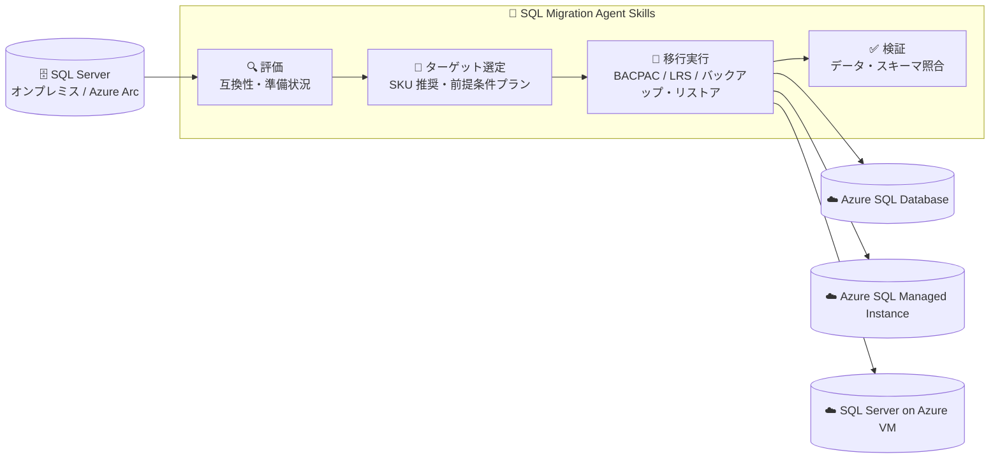

# Azure SQL: SQL Migration Agent Skills (評価・移行・検証) の一般提供開始

**リリース日**: 2026-09-29

**サービス**: Azure SQL (SQL Server から Azure への移行)

**機能**: SQL Migration Agent Skills for assessment, migration, and validation

**ステータス**: Launched (GA)

[このアップデートのインフォグラフィックを見る](https://takech9203.github.io/azure-news-summary/20260929-sql-migration-agent-skills.html)

## 概要

SQL Server から Azure への移行ジャーニー全体 (評価、ターゲット選定、移行実行、移行後検証) を自動化・効率化する「SQL Migration Agent Skills」が一般提供 (GA) となりました。これらは再利用可能な AI 駆動のスキル群で、コーディングエージェント (GitHub Copilot、Claude Code、Codex、Cursor、Grok Build) にプラグインとしてインストールして利用します。複数の Microsoft ユーザーインターフェイスをまたいで移行コンテキストを保持しながら動作し、重要な意思決定はユーザーのコントロール下に置かれる設計です。

スキルは Microsoft SQL 製品チームが公開する GitHub リポジトリ (`microsoft/microsoft-sql`) の `microsoft-sql-migration` プラグイン (Agent Plugins 1.0 形式、MIT ライセンス) として配布されます。評価・計画・移行実行・検証をカバーする 12 個のスキルが含まれ、移行先として Azure SQL Database、Azure SQL Managed Instance、SQL Server on Azure Virtual Machines の 3 つをサポートします。

**アップデート前の課題**

- SQL Server から Azure への移行では、互換性評価、ターゲット選定、SKU サイジング、移行実行、移行後検証といった各フェーズを個別のツール (Azure DMS、`az datamigration`、AzCopy など) で手動に組み合わせて進める必要があった
- フェーズやツールをまたぐ際に移行のコンテキスト (評価結果や選定内容) が引き継がれず、手作業での確認・転記が発生していた

**アップデート後の改善**

- 評価から検証までのエンドツーエンドの移行ワークフローを、AI エージェント上の自然言語による依頼で自動化・ガイドできるようになった
- 複数の Microsoft ユーザーインターフェイスをまたいで移行コンテキストが保持され、手作業を削減しつつ、重要な判断はユーザーが制御できる
- 実測パフォーマンスに基づく Azure SQL ターゲットの SKU サイジングや、シナリオ別の前提条件プラン生成が自動化された

## アーキテクチャ図



SQL Server ワークロードを評価し、最適な Azure ターゲットの選定と方式別の移行実行、移行後のデータ検証までを AI スキルがエンドツーエンドでガイドします。

## サービスアップデートの詳細

### 主要機能

1. **準備状況の評価とブロッカーの特定**
   - SQL Server ワークロードを分析し、互換性の問題、リスク、移行上の課題を特定する

2. **最適な Azure 移行先の推奨**
   - Azure SQL Database、Azure SQL Managed Instance、SQL Server on Azure Virtual Machines のガイダンスを提供し、サイジングと適合性の考慮事項を提示する

3. **移行ワークフローの自動化**
   - Azure SQL Database および Azure SQL Managed Instance シナリオ向けの明確なガイダンスにより移行ワークフローを自動化する

4. **移行成功の検証**
   - カットオーバー後のワークロードの準備状況を確認するため、移行後の検証と修復ガイダンスを提供する

### 含まれるスキル (12 個)

**評価・アセスメント系**

| スキル | 概要 |
|--------|------|
| `analyze-readiness-at-scale` | Azure Arc 対応 SQL Server インスタンスのエステート (資産) 全体での移行評価ダッシュボード表示 |
| `evaluate-azure-migration-assessment` | 移行評価の実行・更新と、準備状況・SKU 結果の取得 |
| `evaluate-offline-migration-readiness` | Windows 上の `az datamigration` を使ったローカル/オンプレミス SQL Server の準備状況評価 |
| `get-migration-assessment` | Azure Resource Graph からの既存の移行評価データ取得 |
| `run-migration-assessment` | 評価・互換性・コスト・SKU 推奨リクエストの汎用ルーティング |

**計画・推奨系**

| スキル | 概要 |
|--------|------|
| `recommend-migration-path` | 移行先の暫定判断と推奨評価パスの提示 |
| `recommend-sku-sizing` | パフォーマンスデータ収集と Azure SQL SKU 推奨の計算 |
| `generate-migration-prerequisite-plan` | シナリオ別の移行前提条件プランの生成 |

**移行実行系**

| スキル | 移行方式 |
|--------|---------|
| `sql-backup-restore-to-azure-sql-vm-migration` | バックアップ/リストア方式。AzCopy と Microsoft Entra ID でバックアップを Blob Storage にアップロード |
| `sql-bacpac-to-azure-sql-db-migration` | オフライン BACPAC 方式で Azure SQL Database へ移行 |
| `sql-server-to-sql-mi-lrs-migration` | Log Replay Service (LRS) 方式で Azure SQL Managed Instance へ移行。Blob アクセスにマネージド ID を使用 |

**検証系**

| スキル | 概要 |
|--------|------|
| `validate-post-migration-data` | 移行後のデータとスキーマの検証 (SQL Database / SQL MI / Azure VM 上の SQL Server に対応) |

## 技術仕様

| 項目 | 詳細 |
|------|------|
| 配布形態 | GitHub リポジトリ `microsoft/microsoft-sql` の `microsoft-sql-migration` プラグイン (Agent Plugins 1.0 形式) |
| ライセンス | MIT |
| 対応エージェント | GitHub Copilot、Claude Code、Codex、Cursor、Grok Build |
| 移行元 | SQL Server (バックアップ/リストア方式は SQL Server 2008〜2025) |
| 移行先 | Azure SQL Database、Azure SQL Managed Instance、SQL Server on Azure Virtual Machines |
| 移行方式 | BACPAC (SQL Database、オフライン)、Log Replay Service (SQL MI)、バックアップ/リストア (Azure VM) |
| 利用ツール | Azure CLI (`az datamigration` 拡張)、AzCopy、Azure Resource Graph、Azure Arc |
| 認証 | Microsoft Entra ID / マネージド ID (バックアップのアップロード、LRS の Blob アクセス) |

## 設定方法

### 前提条件

1. 対応するコーディングエージェント (GitHub Copilot、Claude Code、Codex、Cursor、Grok Build のいずれか)
2. オフライン準備状況評価 (`evaluate-offline-migration-readiness`) には Windows 上の Azure CLI `az datamigration` 拡張が必要
3. バックアップのアップロードには AzCopy と Microsoft Entra ID 認証、LRS の Blob アクセスにはマネージド ID が必要
4. 大規模評価 (`analyze-readiness-at-scale`) は Azure Arc 対応 SQL Server インスタンスが対象

### インストール (Claude Code の場合)

```
/plugin marketplace add microsoft/microsoft-sql
/plugin install microsoft-sql-migration@microsoft-sql
```

マーケットプレイス非対応のクライアントでは、リポジトリの `skills/<skill>/` ディレクトリを直接コピーする方法が案内されています。

### 使い方

インストール後は特別なプロンプト構文は不要で、自然言語で依頼するとスキルが自動的にルーティングされます。

```
Interview me to choose a SQL Server to Azure migration target and method.
```

## メリット

### ビジネス面

- 評価から検証までの移行ジャーニー全体がガイドされるため、手作業と移行プロジェクトの負担を削減し、より確信を持って移行を進められる
- 実測パフォーマンスに基づく SKU サイジングにより、移行先リソースの過剰・過小プロビジョニングを回避できる
- Azure Arc を活用したエステート全体の準備状況分析により、大規模な移行計画の立案が容易になる

### 技術面

- 評価、ターゲット選定、移行実行、検証の各フェーズが再利用可能なスキルとして分割されており、必要なフェーズだけ利用することも可能
- 複数のユーザーインターフェイスをまたいで移行コンテキストが保持される
- 移行先・方式ごと (BACPAC / LRS / バックアップ・リストア) に専用スキルが用意され、シナリオ別の前提条件プランを自動生成できる
- 独立したワークフロープラグインとして、他の Azure SQL 系プラグイン (`microsoft-sql` など) と併用できる

## デメリット・制約事項

- BACPAC 方式による Azure SQL Database への移行は**オフライン**ワークフローであり、ダウンタイムが発生する
- バックアップ/リストア方式は、ソースが SQL Server 2008〜2025、ターゲットが SQL Server 2025 に限定される
- `evaluate-offline-migration-readiness` (オフライン準備状況評価) は Windows 上での実行が前提
- `recommend-sku-sizing` は、ソースが明示的にローカル/オンプレミスと確認された場合のみ実行される
- 対応するコーディングエージェント環境が必要であり、従来の Azure Portal のみで完結するワークフローではない

## ユースケース

### ユースケース 1: オンプレミス SQL Server の移行先選定と評価

**シナリオ**: オンプレミスの SQL Server 群を Azure に移行したいが、Azure SQL Database、SQL Managed Instance、SQL Server on Azure VM のどれが適切か判断できていない。

**実装例**:

```
# Claude Code にプラグインをインストール
/plugin marketplace add microsoft/microsoft-sql
/plugin install microsoft-sql-migration@microsoft-sql

# 自然言語で依頼 (スキルが自動ルーティングされる)
Interview me to choose a SQL Server to Azure migration target and method.
```

**効果**: 対話形式で要件をヒアリングした上で、互換性評価と SKU 推奨に基づく最適な移行先と移行方式の提案を受けられる。

### ユースケース 2: Azure SQL Managed Instance への移行と移行後検証

**シナリオ**: 評価が完了した SQL Server データベースを Log Replay Service で Azure SQL Managed Instance に移行し、カットオーバー後にデータの整合性を確認したい。

**実装例**: `sql-server-to-sql-mi-lrs-migration` スキルで LRS ベースの移行を実行し (Blob アクセスにはマネージド ID を使用)、移行完了後に `validate-post-migration-data` スキルでソースとターゲットのデータ・スキーマを照合する。

**効果**: 移行実行から移行後検証までを一貫したコンテキストで実施でき、カットオーバー後のワークロードの準備状況を確認できる。

## 料金

SQL Migration Agent Skills 自体は MIT ライセンスのオープンソースプラグインとして GitHub で公開されています。移行先の Azure リソース (Azure SQL Database、Azure SQL Managed Instance、Azure VM、Blob Storage など) には通常の Azure 料金が適用されます。

- [Azure SQL Database の料金](https://azure.microsoft.com/pricing/details/azure-sql-database/)
- [Azure SQL Managed Instance の料金](https://azure.microsoft.com/pricing/details/azure-sql-managed-instance/)

## 関連サービス・機能

- **Azure Database Migration Service (DMS)**: SQL Server から Azure への移行を支援するフルマネージドサービス。Azure SQL Database (オフライン)、SQL MI (オンライン/オフライン)、SQL Server on Azure VM (オンライン/オフライン) への移行をサポートする
- **Azure Arc 対応 SQL Server**: エステート全体の移行準備状況評価 (`analyze-readiness-at-scale` スキル) の基盤。DMS の推奨機能と同じ移行評価テクノロジーを利用する
- **Azure Resource Graph**: 既存の移行評価データの取得 (`get-migration-assessment` スキル) に使用
- **Azure Blob Storage / AzCopy**: バックアップファイルのアップロードと LRS 方式でのリストアに使用
- **GitHub Copilot / Claude Code などのコーディングエージェント**: スキルの実行環境

## 参考リンク

- [インフォグラフィック](https://takech9203.github.io/azure-news-summary/20260929-sql-migration-agent-skills.html)
- [公式アップデート情報](https://azure.microsoft.com/updates?id=571899)
- [SQL Migration Agent Skills (GitHub: microsoft/microsoft-sql)](https://aka.ms/sqlmigrationskills)
- [Azure Database Migration Service の概要 (Microsoft Learn)](https://learn.microsoft.com/azure/dms/dms-overview)
- [Azure Arc の移行評価 (Microsoft Learn)](https://learn.microsoft.com/sql/sql-server/azure-arc/migration-assessment)

## まとめ

SQL Migration Agent Skills の GA により、SQL Server から Azure への移行が「AI エージェント上の自然言語ワークフロー」として実行できるようになりました。評価・ターゲット選定・移行実行・検証の 12 スキルが GitHub Copilot や Claude Code などのエージェントにプラグインとしてインストールでき、移行コンテキストを保持したままエンドツーエンドの移行をガイドします。SQL Server の Azure 移行を計画している Solutions Architect は、まず `recommend-migration-path` や評価系スキルで対象ワークロードの準備状況と最適な移行先を確認することを推奨します。BACPAC 方式のオフライン制約や、バックアップ/リストア方式の対象バージョン (ソース SQL Server 2008〜2025、ターゲット SQL Server 2025) には注意が必要です。

---

**タグ**: Azure SQL, SQL Server, Migration, Azure Database Migration Service, AI Agent, GA, Databases
