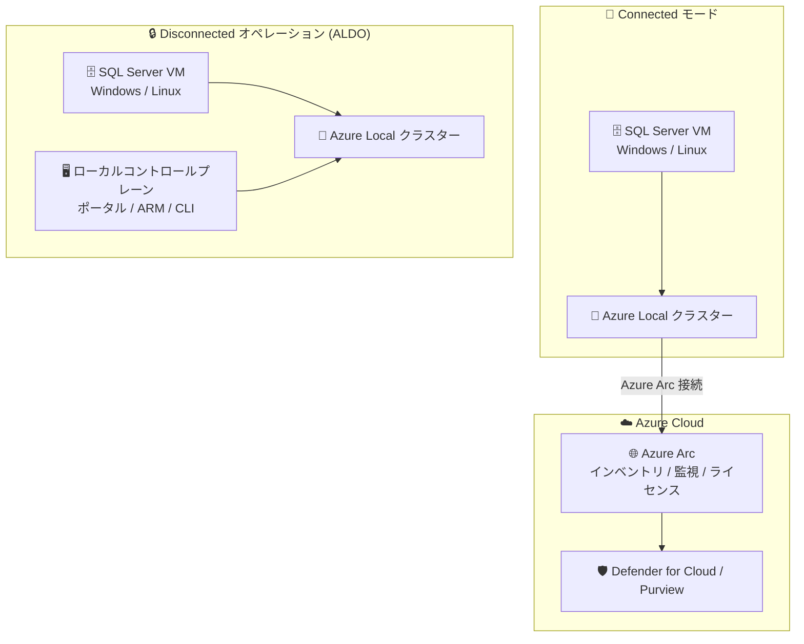

# SQL Server on Azure Local: Connected モードおよび Disconnected (ALDO) の一般提供開始

**リリース日**: 2026-09-29

**サービス**: SQL Server on Azure Local

**機能**: Connected モードと Disconnected オペレーション (ALDO) の GA

**ステータス**: Launched (GA)

[このアップデートのインフォグラフィックを見る](https://takech9203.github.io/azure-news-summary/20260929-sql-server-azure-local.html)

## 概要

SQL Server on Azure Local の 2 つの提供形態が同時に一般提供 (GA) となりました。本レポートでは、同一サービスの関連アップデートである以下の 2 件をまとめて解説します。

1. **Connected モード (接続モード)**: Azure Local インフラストラクチャ上で SQL Server ワークロードを実行しながら、Azure Arc 経由で Azure に接続し、集中管理・ガバナンス・監視・セキュリティ・ライセンス管理といった Azure サービスの機能を活用できます。オンプレミス、エッジ、クラウドをまたぐ一貫したハイブリッド運用モデルを維持できます。
2. **Disconnected オペレーション (ALDO: Azure Local Disconnected Operations)**: Azure への継続的な接続を維持できない環境にも SQL Server サポートを拡張します。高度に規制された環境、セキュアな環境、遠隔地、エアギャップ環境向けに設計されており、SQL Server ワークロードはクラウド接続から運用上独立した形で、完全に Azure Local インフラストラクチャ上で実行され続けます。

いずれのモードでも、従来型のデータベースワークロードに加えて、AI を活用したアプリケーションやインテリジェントなデータソリューションの基盤として利用できます。機密データをローカルに保持したまま、運用データへの低遅延アクセスを必要とする AI・分析シナリオを実現でき、データ移動を削減しながらガバナンス・コンプライアンス要件に対応できます。ALDO では、データ・AI モデル・SQL Server ワークロードを同一のセキュアなインフラストラクチャ境界内に保持することで、クラウド接続なしで AI ソリューションを構築・実行できます。これは防衛、政府、製造、エネルギー、リモートエッジといった、データ主権・セキュリティ・運用継続性が重要な分野で特に価値があります。

**アップデート前の課題**

- 規制やネットワーク制約により Azure への継続接続を維持できない環境 (エアギャップ環境など) では、Azure Local 上での SQL Server 実行が正式サポートされていなかった
- データ所在地 (データレジデンシー) 要件により機密データをオンプレミスに保持する必要がある場合、Azure の集中管理機能と SQL Server のローカル実行を両立させる正式な選択肢が限られていた

**アップデート後の改善**

- Connected モードが GA となり、SQL Server を Azure Arc に接続してインベントリ、ガバナンス、監視、セキュリティ、ライセンス管理を Azure から一元的に行える構成が本番利用可能になった
- ALDO が GA となり、パブリッククラウドのコントロールプレーンに依存せず、ローカルコントロールプレーンから Azure ポータル/Azure CLI と同様の操作性で SQL Server ワークロードを運用できるようになった
- 両モードとも SQL Server 2025 の `sp_invoke_external_rest_endpoint` を使ったローカル AI モデル推論との連携 (Foundry Local on Azure Local はプレビュー) が可能になった

## アーキテクチャ図



Connected モードでは Azure Arc 経由で Azure の管理サービスを利用し、Disconnected モード (ALDO) では環境内のローカルコントロールプレーンだけで運用が完結します。どちらも SQL Server ワークロードとデータは Azure Local 上に留まります。

## サービスアップデートの詳細

### 主要機能

1. **Connected モード: Azure Arc による集中管理**
   - SQL Server インスタンスを Azure Arc に接続することで、インベントリとレポート (インスタンス・データベース・バージョン・エディションの把握、Azure Resource Graph でのクエリ)、ベストプラクティス評価、Microsoft Entra 認証、Microsoft Defender for Cloud / Microsoft Purview によるセキュリティとガバナンス、構成管理が利用可能

2. **Connected モード: Azure Arc 経由のライセンス管理**
   - 従量課金 (pay-as-you-go)、Software Assurance / SQL Server サブスクリプションによる既存ライセンスの申告、仮想コア/物理コアのライセンススコープ選択を Azure ポータル・PowerShell・CLI から設定可能

3. **Disconnected オペレーション (ALDO): クラウド非依存の運用**
   - SQL Server ワークロード、ローカルコントロールプレーン、管理データ、ID 統合、ガバナンスがすべてオンプレミスに留まり、Azure やインターネットへの継続接続が不要。更新プログラムやサポートバンドルは承認済みのオフライン転送ワークフローで受け渡す

4. **ALDO のローカルコントロールプレーン**
   - Azure ポータルと同様の操作性、Azure Resource Manager (サブスクリプション・リソースグループ・ARM テンプレート・CLI)、RBAC、マネージド ID、Azure Local VM 管理、Azure Key Vault、Azure Container Registry、Azure Policy などのサービスをローカルで提供

5. **ローカル AI アプリケーションの基盤**
   - SQL Server 2025 の `sp_invoke_external_rest_endpoint` から互換性のある HTTPS チャット補完エンドポイントを呼び出し、SQL データとローカルホストされたモデルを組み合わせ可能。Foundry Local on Azure Local (プレビュー) と連携し、推論を環境内に留められる

6. **高可用性オプション**
   - Always On 可用性グループ (データベースレベル保護)、Windows の Always On フェールオーバークラスターインスタンス (インスタンスレベル保護)、クラスターアフィニティルールによるレプリカ配置に対応。Linux では Pacemaker などのサポートされたクラスターマネージャーが必要

## 技術仕様

| 項目 | Connected モード | Disconnected (ALDO) |
|------|------|------|
| 実行形態 | Azure Local 上の Windows Server / Linux VM 内で SQL Server を実行 | 同左 |
| Azure 接続 | Azure への接続を維持し Azure Arc に接続 | Azure / インターネットへの継続接続が不要 |
| 管理プレーン | Azure ポータル / Azure Arc | ローカルコントロールプレーン (ポータル / ARM / CLI 相当) |
| SQL Server extension for Azure Arc | サポート (インベントリ、ベストプラクティス評価など) | **非サポート** (Azure ベースの SQL Server 管理機能は利用不可) |
| 監視 | ローカルツールに加え、Arc 接続後はベストプラクティス評価などが利用可能 | DMV、拡張イベント、エラーログ、承認済みオンプレミス監視基盤 (専用の SQL Server 監視サービスは提供されない) |
| バックアップ | ワークロード保護はインフラ回復性と別途計画 (Azure Backup / Azure Site Recovery のオプションあり) | プラットフォームのバックアップはコントロールプレーン VM のみ対象。SQL Server バックアップは別途ローカルで構成 |
| クォーラム (WSFC) | Cloud Witness を利用可能 | Azure Cloud Witness に依存しないローカル監視 / クォーラム構成が必要 |
| 更新適用 | 標準の SQL Server 更新チャネル | WSUS / Configuration Manager やローカルリポジトリ経由のオフラインサービシング |
| AI 連携 | SQL Server 2025 + `sp_invoke_external_rest_endpoint` (Foundry Local はプレビュー) | 同左 (クラウド接続不要でローカル推論) |

## 設定方法

### 前提条件

**Connected モード:**

1. Azure Local のサポート対象ハードウェア (Azure Local environment checker で検証)
2. 管理・ハイブリッドサービス用の Azure サブスクリプション
3. Azure Local のファイアウォール要件を満たす Azure との接続
4. VM 作成用のサポートされた Windows Server / Linux イメージ
5. 適切な SQL Server ライセンス (Azure Arc 経由のライセンス・課金を確認)
6. SQL Server を Azure Arc に接続するための権限と接続性

**Disconnected (ALDO):**

1. 組織の承認とプラットフォームの取得 (Microsoft との適格な契約、Standard 以上のサポートプラン、切断運用の正当なビジネスニーズが必要。MOSA は対象外)
2. サポート対象ハードウェア上に展開された承認済みの Azure Local disconnected operations 環境 (専用の管理クラスターが必要で、ローカルコントロールプレーン用の追加キャパシティを計画)
3. プラットフォームのネットワーク・ID 要件を満たすローカルネットワーク、ID、証明書、時刻同期
4. SQL Server ライセンスと、別途 Azure Local disconnected operations プラットフォームライセンス
5. 承認済みの SQL Server インストールメディア・累積更新プログラム等と、それらを転送・検証する管理されたオフラインプロセス
6. コントロールプレーンバックアップとは別の、SQL Server ワークロード用ローカル監視・バックアップ先

### デプロイの流れ

**Connected モード:**

1. Azure Local をデプロイ
2. Windows Server / Linux VM を作成し SQL Server をインストール
3. 監視とチューニングのベースラインを確立
4. 高可用性 (可用性グループ / FCI) を構成
5. Azure Arc のオンボーディングスクリプトを生成・実行して SQL Server を接続し、Azure ポータルでリソースを確認
6. ライセンスモデル (pay-as-you-go または既存ライセンス) を Azure ポータル / PowerShell / CLI で設定

**Disconnected (ALDO):**

1. Azure Local with disconnected operations をデプロイ (管理クラスター展開・登録を含む)
2. 切断環境内に Windows Server / Linux VM を作成し、オフラインプロセスで転送したメディアから SQL Server をインストール
3. サポートされているローカルツールで SQL Server を管理・監視
4. ワークロード要件に基づき可用性・バックアップ・障害復旧を構成 (バックアップは承認済みの別の障害ドメイン / サイトへ複製し、リストアテストを実施)

## メリット

### ビジネス面

- データ所在地・コンプライアンス要件を満たしながら、機密データをオンプレミスに保持できる
- ALDO により、政府・防衛・医療・金融・製造・エネルギーなど、パブリッククラウド接続が禁止または不安定な業界・拠点 (石油掘削施設、製造現場など) でも SQL Server を正式サポートの下で運用できる
- Connected モードの pay-as-you-go ライセンスにより、変動的・一時的・増分的なワークロードに柔軟に対応できる
- パブリッククラウドへのデータベース移行なしで既存の SQL Server 環境をモダナイズできる

### 技術面

- ユーザー・デバイス・工場拠点・アプリケーションサーバーの近くにデータベースを配置し、低遅延アプリケーションを支援できる
- Connected モードでは Azure Arc を通じてインベントリ、ベストプラクティス評価、Microsoft Entra 認証、Defender for Cloud、Purview などの一貫した管理・セキュリティ体験を得られる
- ALDO でも Azure ポータル / CLI に近い操作性のローカルコントロールプレーン (ARM、RBAC、Key Vault、Policy など) を利用できる
- AI をデータに近づけることで、データ移動と推論遅延を削減しつつガバナンス要件を満たせる

## デメリット・制約事項

- **ALDO では SQL Server extension for Azure Arc が非サポート**。SQL Server インベントリ、ベストプラクティス評価、Azure ベースの SQL Server 管理機能は利用できず、各 VM 内でローカルツールによる管理・監視が必要
- ALDO の調達には適格な契約 (MOSA 不可)、Standard 以上のサポートプラン、切断運用の正当なビジネスニーズ、事前資格審査 (承認まで最大 10 営業日) が必要
- ALDO ではローカルコントロールプレーン (仮想アプライアンス) をホストするための追加ハードウェアキャパシティと専用管理クラスターが必要で、最小ハードウェア要件が高くなる
- ALDO のプラットフォームバックアップ機能はコントロールプレーン VM データのみを保護するため、SQL Server ワークロードのバックアップは別途設計が必要
- Linux の pay-as-you-go 課金では、可用性グループのパッシブレプリカや FCI が自動検出されず、すべての SQL Server インスタンスがアクティブとして課金される
- Linux ではクラスターマネージャーなしの可用性グループは読み取りスケール用であり高可用性にはならない。本番環境では Pacemaker などのクラスターマネージャーとフェンシングが必要
- Foundry Local on Azure Local (ローカル AI モデル推論) は現時点でプレビュー

## ユースケース

### ユースケース 1: エアギャップ環境での基幹データベース運用 (ALDO)

**シナリオ**: 防衛・政府機関や重要インフラ事業者が、インターネット接続が禁止された閉域環境で、トランザクション処理・分析・BI・データウェアハウスなどの SQL Server ワークロードを運用する。

**実装例**: Azure Local disconnected operations 環境を専用管理クラスターとともに展開し、承認済みオフラインプロセスで SQL Server 2025 のメディアと累積更新プログラムを転送してインストール。Always On 可用性グループをローカル監視/クォーラム構成で組み、バックアップは別の障害ドメインへ複製する。

**効果**: データ・運用・制御が組織の境界内に留まり、外部ネットワークへの露出を排して攻撃面を縮小しながら、Azure と一貫した運用体験 (ローカルポータル / ARM / CLI) を維持できる。

### ユースケース 2: ハイブリッド環境での SQL Server 集中管理 (Connected モード)

**シナリオ**: 複数拠点のオンプレミス SQL Server 環境を運用する企業が、データはローカルに保持しつつ、インベントリ・セキュリティ・ライセンスを Azure から一元管理したい。

**実装例**: Azure Local 上の VM に SQL Server をデプロイし、Azure Arc オンボーディングスクリプトで接続。Azure Resource Graph で全社の SQL Server 資産をクエリし、ベストプラクティス評価と Defender for Cloud を有効化。ライセンスは pay-as-you-go に設定する。

**効果**: オンプレミス・エッジ・クラウドをまたぐ一貫したハイブリッド運用モデルを確立し、ガバナンス・セキュリティ・ライセンス管理を集中化できる。

### ユースケース 3: ローカル AI アプリケーション基盤

**シナリオ**: 製造業の工場で、機密性の高い運用データを外部に出さずに、SQL Server 内のデータと AI モデルを組み合わせたインテリジェントアプリケーションを構築する。

**実装例**:

```sql
-- SQL Server 2025 で外部 REST エンドポイント呼び出しを有効化
EXEC sp_configure 'external rest endpoint enabled', 1;
RECONFIGURE;
-- 呼び出し元プリンシパルに権限を付与したうえで
-- sp_invoke_external_rest_endpoint からローカルの
-- チャット補完エンドポイント (Foundry Local など) を呼び出す
```

**効果**: データ・AI モデル・SQL Server ワークロードを同一のセキュアな境界内に保持し、データ移動と推論遅延を削減しながら AI ソリューションを実現できる。

## 料金

具体的な料金は公式ページで確認が必要ですが、確認できたライセンス体系は以下のとおりです。

| 項目 | 内容 |
|------|------|
| Connected モード: pay-as-you-go | Azure 経由でサブスクライブし、Azure Arc がレポートするライセンスコア数に基づいて支払い。変動的・一時的なワークロードに適する |
| Connected モード: 既存ライセンス | Software Assurance 付きライセンスまたは SQL Server サブスクリプションを Azure Arc に申告して利用 |
| ライセンススコープ | VM 単位の仮想コアライセンスと、対象となる Enterprise 物理コアライセンス (無制限仮想化) を選択可能 |
| Disconnected (ALDO) | SQL Server ライセンスに加え、Azure Local disconnected operations プラットフォームのキャパシティは別途ライセンスが必要。Software Assurance / サブスクリプション要件と Azure Hybrid Benefit の適格性を確認 |

詳細は [SQL Server licensing and billing through Azure Arc](https://learn.microsoft.com/sql/sql-server/azure-arc/manage-license-billing) および [Disconnected operations billing](https://learn.microsoft.com/azure/azure-local/manage/disconnected-operations-billing) を参照してください。

## 関連サービス・機能

- **Azure Local**: SQL Server の実行基盤。Azure Arc によって実現される分散インフラストラクチャソリューションで、VM・コンテナー・一部の Azure サービスを自社環境で実行できる
- **Azure Arc / SQL Server enabled by Azure Arc**: Connected モードの中核。インベントリ、ベストプラクティス評価、ライセンス管理、構成管理を提供 (ALDO では SQL Server 拡張は非サポート)
- **Microsoft Defender for Cloud / Microsoft Purview**: Connected モードで SQL Server の高度なセキュリティとデータガバナンスを提供
- **Foundry Local on Azure Local (プレビュー)**: ローカルでの AI モデル推論を提供し、SQL Server 2025 の `sp_invoke_external_rest_endpoint` と組み合わせてローカル AI アプリケーションを構築可能
- **Azure Key Vault / Azure Container Registry / Azure Policy**: ALDO のローカルコントロールプレーンで利用できる代表的なサービス
- **Azure Backup / Azure Site Recovery**: Connected モードでのワークロード保護・障害復旧のオプション

## 参考リンク

- [インフォグラフィック](https://takech9203.github.io/azure-news-summary/20260929-sql-server-azure-local.html)
- [公式アップデート情報 (ALDO)](https://azure.microsoft.com/updates?id=571836)
- [公式アップデート情報 (Connected モード)](https://azure.microsoft.com/updates?id=571841)
- [SQL Server on Azure Local overview (Microsoft Learn)](https://learn.microsoft.com/sql/sql-server/azure-local/overview)
- [Deploy SQL Server on Azure Local (Microsoft Learn)](https://learn.microsoft.com/sql/sql-server/azure-local/deploy)
- [Deploy SQL Server on Azure Local with disconnected operations (Microsoft Learn)](https://learn.microsoft.com/sql/sql-server/azure-local/deploy-disconnected)
- [Disconnected operations for Azure Local overview (Microsoft Learn)](https://learn.microsoft.com/azure/azure-local/manage/disconnected-operations-overview)
- [SQL Server licensing and billing through Azure Arc (Microsoft Learn)](https://learn.microsoft.com/sql/sql-server/azure-arc/manage-license-billing)

## まとめ

SQL Server on Azure Local の Connected モードと Disconnected オペレーション (ALDO) が同時に GA となり、接続要件の異なる環境それぞれで SQL Server を正式サポートの下で運用できるようになりました。Azure に接続できる環境では Azure Arc による集中管理・セキュリティ・柔軟なライセンスを活かし、規制やネットワーク制約のある環境では ALDO によりクラウド非依存で運用を完結できます。ハイブリッド/エッジで SQL Server を運用する Solutions Architect は、まず両モードの管理機能の差分 (特に ALDO での SQL Server extension for Azure Arc 非対応と、バックアップ・監視をローカルで設計する必要性) を確認し、要件に応じたモード選定とライセンスモデルの評価から着手することを推奨します。ALDO の導入には事前資格審査と専用管理クラスターが必要なため、調達リードタイムも考慮してください。

---

**タグ**: SQL Server, Azure Local, Azure Arc, ハイブリッドクラウド, エアギャップ, データ主権, GA
