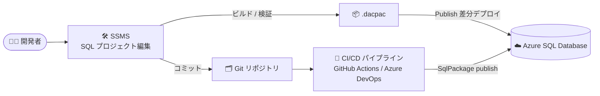

# SQL Server Management Studio (SSMS): Database DevOps (SQL projects) の一般提供開始

**リリース日**: 2026-09-29

**サービス**: SQL Server Management Studio (SSMS) / Azure SQL Database

**機能**: Database DevOps in SSMS powered by SQL projects

**ステータス**: Launched (GA)

[このアップデートのインフォグラフィックを見る](https://takech9203.github.io/azure-news-summary/20260929-ssms-database-devops-sql-projects.html)

## 概要

SQL Server Management Studio (SSMS) で、`Microsoft.Build.Sql` (SDK スタイル) の SQL プロジェクトを使用した Database DevOps 機能が一般提供 (GA) となりました。SQL データベースプロジェクトは、テーブル、ストアドプロシージャ、関数など、単一データベースのスキーマを構成する SQL オブジェクトをローカルファイルとして表現するもので、データベースオブジェクトのローカル定義を通じて、データベース変更の実装・管理・共同作業を可能にします。

SSMS 上でプロジェクトの作成・オープン、T-SQL の編集、ビルド (検証と `.dacpac` 生成)、Publish (ターゲットデータベースへのデプロイ) までを一貫して行えるようになり、開発のベストプラクティスとして定着している CI/CD (継続的インテグレーション/継続的デプロイ) ワークフローにデータベース開発を統合できます。SQL projects は SQL Server 2022 以降、Azure SQL Database、Azure SQL Managed Instance、Microsoft Fabric の SQL database をサポートします。

**アップデート前の課題**

- SQL projects (Microsoft.Build.Sql) のグラフィカルな開発環境は Visual Studio Code の SQL Database Projects 拡張機能や Visual Studio (SSDT) に限られており、DBA や開発者が日常的に使用する SSMS 単体では SQL プロジェクトベースの開発ができなかった
- データベーススキーマの変更を SQL スクリプトのフォルダーとして管理する場合、オブジェクトの依存関係の順序どおりに手動で実行する必要があった

**アップデート後の改善**

- SSMS 内で SQL プロジェクトの新規作成、既存 `Microsoft.Build.Sql` プロジェクトのオープン、ビルド、Publish が完結し、慣れたツールのままデータベース開発を CI/CD ワークフローへ統合できる
- ビルド時にオブジェクト間の参照関係とターゲットプラットフォームに対する T-SQL 構文が自動検証され、成果物として `.dacpac` が生成される
- Publish は `.dacpac` とターゲットデータベースの差分を計算し、必要な `CREATE` / `ALTER` / `DROP` ステートメントを自動生成する (冪等であり、同一の `.dacpac` を開発・ステージング・本番の複数環境に繰り返しデプロイ可能)

## アーキテクチャ図



SSMS で SQL プロジェクトを編集・ビルドして `.dacpac` を生成し、SSMS から直接 Publish するか、Git リポジトリ経由の CI/CD パイプライン (SqlPackage) で Azure SQL Database へ差分デプロイするフローです。

## サービスアップデートの詳細

### 主要機能

1. **SQL プロジェクトの作成・オープン**
   - SSMS で新規の空プロジェクト作成、既存データベースからのプロジェクト作成が可能
   - `File > Open > Project/Solution` から既存の `.sqlproj` を開ける (SDK スタイルの `Microsoft.Build.Sql` プロジェクトのみ対応、最小サポート SDK バージョンは 2.1.0)
   - ソリューションの管理・操作 (Solution Explorer) に対応
   - データベースに接続せずオフラインでプロジェクト開発が可能

2. **宣言的なスキーマ定義**
   - 各データベースオブジェクトを 1 つの `.sql` ファイルに単一の `CREATE` ステートメントとして記述
   - `dbo/Tables` や `Sales/StoredProcedures` のようにスキーマ・オブジェクトタイプ別のサブフォルダーで整理可能
   - プロジェクトフォルダー配下の `.sql` ファイルは既定のグロブパターンで自動的にビルド対象に含まれる
   - Solution Explorer の `Add > New Item` から SQL オブジェクトテンプレートを利用可能

3. **ビルドによる検証と `.dacpac` 生成**
   - オブジェクト間の参照関係 (例: 存在しないテーブルを参照するビュー) とターゲットプラットフォームに対する T-SQL 構文を検証
   - 成功すると `bin\Debug` フォルダーに `.dacpac` (スキーマのコンパイル済みモデル) を生成
   - コード分析 (code analysis) の実行とルールの有効化/無効化 GUI に対応

4. **Publish によるデプロイ**
   - Publish ダイアログでターゲット接続を構成し、`.dacpac` とターゲットデータベースの差分から必要な変更ステートメントを生成して適用
   - **Generate Script** で実行前にデプロイスクリプトをレビュー可能
   - デプロイは冪等で、同一成果物を複数環境 (開発/ステージング/本番) へ展開可能

5. **その他の対応機能**
   - SQLCMD 変数、プロジェクト参照、DACPAC 参照、NuGet パッケージ参照
   - 事前デプロイ/事後デプロイスクリプト (pre/post-deployment scripts)
   - スキーマ比較 (プロジェクト → データベース、データベース → プロジェクト)
   - ターゲットプラットフォームの変更

## 技術仕様

| 項目 | 詳細 |
|------|------|
| プロジェクト形式 | SDK スタイル `Microsoft.Build.Sql` のみ (最小 SDK バージョン 2.1.0)。旧形式 (SSDT オリジナル形式) は変換が必要 |
| ビルド成果物 | `.dacpac` ファイル (`bin\Debug` フォルダーに出力) |
| 基盤ライブラリ | Microsoft.SqlServer.DacFx (.NET ライブラリ) |
| 対象データベース | SQL Server 2022 以降、Azure SQL Database、Azure SQL Managed Instance、Microsoft Fabric の SQL database |
| デプロイ方法 | SSMS の Publish ダイアログ、または SqlPackage / CI/CD タスク (GitHub sql-action、Azure DevOps SqlAzureDacpacDeployment) |
| ローカル開発インスタンス | 事前インストール済みの任意の Microsoft SQL データベースを利用可能 |

**SSMS と他ツールの機能差分 (主なもの)**

| 機能 | SSMS | VS Code 拡張 | SSDT (Visual Studio) |
|------|------|--------------|----------------------|
| Microsoft.Build.Sql プロジェクトのオープン | 対応 | 対応 | 非対応 (SDK-style SSDT は Preview) |
| 旧形式 (オリジナル SSDT) プロジェクトのオープン | 非対応 | 対応 | 対応 |
| ソリューション管理 | 対応 | 非対応 | 対応 |
| Publish プロファイル作成 | 非対応 | 対応 | 対応 |
| オブジェクトのリネーム/リファクタリング | 非対応 | 対応 | 対応 |
| プロジェクトモデルからの IntelliSense | 非対応 | 対応 | 対応 |
| グラフィカルテーブルデザイナー | 非対応 | 非対応 | 対応 |

## 設定方法

### 前提条件

1. .NET SDK
2. SQL Server Management Studio (SSMS)
3. SSMS に Database DevOps ワークロードをインストール (SSMS インストーラーの変更から追加)

### 既存データベースからプロジェクトを開始する (SqlPackage)

```bash
# 既存データベースのスキーマをオブジェクトタイプ別の .sql ファイルに抽出
sqlpackage /Action:Extract \
  /SourceConnectionString:"<connection-string>" \
  /TargetFile:"<temp-folder>" \
  /p:ExtractTarget=SchemaObjectType
```

`/p:ExtractTarget=SchemaObjectType` により、抽出ファイルがスキーマとオブジェクトタイプ別のサブフォルダー (例: `dbo/Tables`、`dbo/StoredProcedures`) に整理されます。一時フォルダーに抽出したうえで、必要な内容をプロジェクトフォルダーにコピーします。

### SSMS での操作

1. **プロジェクト作成/オープン**: 新規プロジェクトを作成するか、`File > Open > Project/Solution` で既存の `.sqlproj` を開く
2. **オブジェクト追加**: プロジェクトフォルダーに `.sql` ファイル (1 ファイル 1 オブジェクトの `CREATE` ステートメント) を作成、または Solution Explorer で `Add > New Item` からテンプレートを選択
3. **ビルド**: Solution Explorer でプロジェクトを右クリックし **Build** を選択 (エラー/警告を確認)
4. **デプロイ**: プロジェクトを右クリックし **Publish** を選択。ターゲット接続を構成して **Publish** で適用、または **Generate Script** でスクリプトをレビュー

## メリット

### ビジネス面

- データベーススキーマを Git などでソース管理し「単一の信頼できる情報源 (single source of truth)」とすることで、チームでの共同作業と変更履歴の追跡が容易になる
- ビルドと Publish による再現性の高いデプロイプロセスで、環境間 (開発/ステージング/本番) のスキーマ差異や手作業によるデプロイミスを削減できる
- 1 つの `.dacpac` を多数のデータベースに繰り返し適用できるため、大規模なデータベースフリートのスキーマ更新にも活用できる

### 技術面

- ビルド時にオブジェクト参照とターゲットプラットフォーム固有の T-SQL 構文が検証され、デプロイ前に問題を検出できる
- 差分計算に基づく `ALTER` ベースのデプロイにより、既存データベースへの安全な変更適用が可能
- SqlPackage、GitHub sql-action、Azure DevOps の SqlAzureDacpacDeployment タスクと組み合わせて CI/CD パイプラインを構築できる
- EF Core などの ORM で作成されたデータベースからでも、スキーマを SQL プロジェクトに抽出して管理できる

## デメリット・制約事項

- SSMS は SDK スタイルの `Microsoft.Build.Sql` プロジェクトのみをサポート。Visual Studio で作成された旧形式 (オリジナル) の SQL プロジェクトは、事前に SDK スタイルへの変換が必要
- 最小サポート SDK バージョンは 2.1.0
- SSMS では Publish プロファイルの作成、オブジェクトのリネーム/リファクタリング、プロジェクトモデルからの IntelliSense、グラフィカルテーブルデザイナーは利用できない (VS Code 拡張や SSDT との機能差あり)
- Database DevOps ワークロードを SSMS に追加インストールする必要がある

## ユースケース

### ユースケース 1: Azure SQL Database のスキーマ変更を CI/CD で自動デプロイ

**シナリオ**: 既存の Azure SQL Database のスキーマを SQL プロジェクト化して Git で管理し、プルリクエストのマージを契機にパイプラインで本番データベースへデプロイする。

**実装例**:

```bash
# 1. 既存データベースからスキーマを抽出してプロジェクト化 (初回のみ)
sqlpackage /Action:Extract /SourceConnectionString:"<connection-string>" \
  /TargetFile:"./extracted" /p:ExtractTarget=SchemaObjectType

# 2. SSMS でプロジェクトを編集・ビルドし、Git にコミット

# 3. CI/CD パイプラインで dacpac をデプロイ
sqlpackage /Action:Publish /SourceFile:bin/Debug/MyDatabase.dacpac \
  /TargetConnectionString:"<connection-string>"
```

**効果**: スキーマ変更がコードレビューを経て自動デプロイされ、手作業のスクリプト実行に起因する環境差異や適用漏れを防止できる。

### ユースケース 2: DBA による SSMS 完結のスキーマ管理

**シナリオ**: 普段 SSMS を使用する DBA が、Visual Studio や VS Code を導入せずに、SSMS のみでデータベーススキーマのソース管理・検証・デプロイを行う。

**効果**: 使い慣れたツールのままで宣言的なスキーマ管理と冪等なデプロイを実現でき、ビルド時の検証によりデプロイ前に構文エラーや参照エラーを検出できる。

## 料金

SSMS の Database DevOps 機能自体に関する料金情報はアップデートおよびドキュメントに記載されていません。デプロイ先の Azure SQL Database の料金は以下を参照してください。

- [Azure SQL Database の料金](https://azure.microsoft.com/pricing/details/azure-sql-database/)

## 関連サービス・機能

- **Azure SQL Database / Azure SQL Managed Instance**: SQL projects のデプロイ対象。`.dacpac` の Publish によりスキーマを同期できる
- **Microsoft Fabric (SQL database)**: SQL projects をサポート。Fabric の SQL database の統合ソース管理でも `Microsoft.Build.Sql` 形式が使用される
- **SqlPackage**: DacFx の主要 CLI。スキーマの抽出 (Extract) や `.dacpac` のデプロイ (Publish) を自動化
- **GitHub Actions (sql-action) / Azure DevOps (SqlAzureDacpacDeployment)**: SqlPackage を利用した CI/CD パイプラインタスク
- **VS Code SQL Database Projects 拡張機能 / SQL Server Data Tools (SSDT)**: SQL projects を扱う他のグラフィカルツール。SSMS と併用・使い分けが可能

## 参考リンク

- [インフォグラフィック](https://takech9203.github.io/azure-news-summary/20260929-ssms-database-devops-sql-projects.html)
- [公式アップデート情報](https://azure.microsoft.com/updates?id=571852)
- [Database DevOps in SQL Server Management Studio (Microsoft Learn)](https://learn.microsoft.com/ssms/database-devops)
- [SQL database projects の概要 (Microsoft Learn)](https://learn.microsoft.com/sql/tools/sql-database-projects/sql-database-projects)
- [SQL projects のツール比較 (Microsoft Learn)](https://learn.microsoft.com/sql/tools/sql-database-projects/sql-projects-tools)
- [旧形式 SQL プロジェクトの SDK スタイルへの変換 (Microsoft Learn)](https://learn.microsoft.com/sql/tools/sql-database-projects/howto/convert-original-sql-project)
- [Azure SQL Database の料金](https://azure.microsoft.com/pricing/details/azure-sql-database/)

## まとめ

SSMS での Database DevOps (SQL projects) の GA により、DBA や開発者は使い慣れた SSMS のみで、宣言的なスキーマ定義、ビルドによる検証、`.dacpac` の差分デプロイまでを完結できるようになりました。データベーススキーマのソース管理と CI/CD 統合は、環境間の差異や手作業のデプロイミスを減らすうえで有効なプラクティスです。Azure SQL Database を運用しているチームは、SSMS の Database DevOps ワークロードを導入し、既存データベースを SqlPackage で SQL プロジェクトに抽出してソース管理を開始することを推奨します。旧形式 (SSDT オリジナル) の SQL プロジェクトを利用している場合は、SDK スタイル (`Microsoft.Build.Sql`) への変換を計画してください。

---

**タグ**: Azure SQL Database, SSMS, SQL projects, Database DevOps, CI/CD, dacpac, SqlPackage, GA
