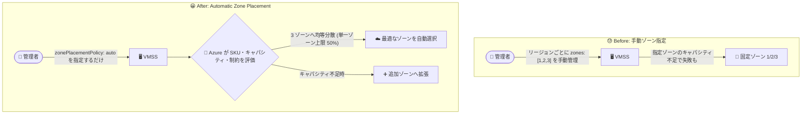

# Virtual Machine Scale Sets: Automatic Zone Placement (自動ゾーン配置)

**リリース日**: 2026-09-29

**サービス**: Azure Virtual Machine Scale Sets (VMSS)

**機能**: Automatic Zone Placement for Virtual Machine Scale Sets

**ステータス**: In preview (Public Preview)

[このアップデートのインフォグラフィックを見る](https://takech9203.github.io/azure-news-summary/20260929-vmss-automatic-zone-placement.html)

## 概要

Virtual Machine Scale Sets (VMSS) の Automatic Zone Placement (自動ゾーン配置) がパブリックプレビューとして発表されました。この機能を有効にすると、SKU の提供状況、キャパシティ、および構成した配置要件に基づいて、Azure がスケールセットに最適な可用性ゾーンを自動的に選択します。従来のようにリージョンごとにゾーンのリストを手動で維持する必要がなくなり、複数リージョンにまたがるデプロイでも一貫した構成を利用できます。

デフォルトでは、インスタンスを 3 つの可用性ゾーンに均等に分散し、最低 2 ゾーンへの分散を必須とし、単一ゾーンへの配置を全インスタンスの 50% までに制限します。また、スケールアウト時にキャパシティが不足した場合は、リージョン内の追加の対象ゾーン (例: 4 番目のゾーン) へ拡張できます。対象ゾーン (includeZones / excludeZones)、最大ゾーン数、バランシング動作、ゾーンあたりのキャパシティ上限はカスタマイズ可能です。

本機能は新規インスタンスの配置のみに作用し、既存 VM の再配置 (リバランス) は行いません。既存デプロイのゾーン不均衡の是正には、別機能である Automatic Zone Balance を利用できます。Uniform / Flexible 両方のオーケストレーションモードに対応し、新規・既存いずれのスケールセットでも利用可能です。Azure Portal、CLI、PowerShell、REST API から構成できます。

**アップデート前の課題**

- リージョンごとにゾーン内の SKU 提供状況が異なるため、`zones` プロパティでリージョン固有のゾーンリストを手動で維持する必要があった
- ゾーン選択時に現在のキャパシティ状況が考慮されず、特定ゾーンのキャパシティ不足によりデプロイやスケールアウトが失敗することがあった
- 指定したゾーンのキャパシティが枯渇しても、リージョン内の他の利用可能なゾーンへ自動的に拡張できなかった

**アップデート後の改善**

- ゾーン選択を Azure に委譲でき、リージョン固有のゾーン管理が不要になり、マルチリージョンデプロイの構成を統一できる
- キャパシティを考慮したゾーン選択により、デプロイおよびスケールアウトの成功率が向上する
- ゾーン分散数やゾーンあたりのキャパシティ上限など、柔軟なレジリエンシー制御を定義できる
- 必要に応じて追加の対象ゾーンを利用できるため、割り当ての柔軟性が向上する

## アーキテクチャ図



従来はリージョンごとにゾーンリストを手動指定していましたが、Automatic Zone Placement では `auto` ポリシーを指定するだけで、Azure が SKU 提供状況とキャパシティに基づいて最適なゾーンを選択・拡張します。

## サービスアップデートの詳細

### 主要機能

1. **キャパシティを考慮した自動ゾーン選択**
   - SKU の提供状況、キャパシティ、構成した配置制約を評価して可用性ゾーンを選択し、VM インスタンスを配置する
   - デフォルトで 3 ゾーンへの均等分散を目標とし、最低 2 ゾーンへの分散を必須、単一ゾーンは全体の 50% までに制限

2. **追加ゾーンへの自動拡張**
   - `maxZoneCount` 未指定でリージョンに 4 つ以上のゾーンがある場合、既存ゾーンでスケールアウト要求を満たせないときに 4 番目のゾーンなどへ拡張可能

3. **柔軟な配置制御**
   - `includeZones` / `excludeZones` で対象ゾーンを制限・除外 (両方の併用は不可)
   - `maxZoneCount` で使用ゾーン数の上限を指定 (1 にすると単一ゾーン構成)
   - `maxInstancePercentPerZonePolicy` で単一ゾーンに配置できるインスタンスの最大割合を指定 (`zoneBalance: false` の場合のみ)
   - `zoneBalance: true` で厳密なゾーンバランス (各ゾーンのインスタンス数の差を 1 以内に維持) を要求可能。この場合 `maxZoneCount` の指定が必須

4. **新規・既存スケールセットの両方に対応**
   - Uniform / Flexible の両オーケストレーションモードをサポート
   - 顧客選択ゾーンまたはリージョナル (非ゾーン) の既存スケールセットにも有効化可能。既存インスタンスは移動・再作成されず、新規インスタンスから自動ゾーン配置が適用される
   - 注意: リージョナルスケールセットで有効化すると、リージョナル配置には戻せない (自動ゾーン配置から顧客選択ゾーンへの切り替えは可能)

## 技術仕様

| 項目 | 詳細 |
|------|------|
| 有効化方法 | `placement.zonePlacementPolicy` を `"auto"` に設定 (必須プロパティはこれのみ) |
| 必要な機能登録 (AFEC) | `Microsoft.Compute/VmssAutomaticZonePlacement` |
| 必要な API バージョン | Compute API `2026-03-01` 以降 |
| オーケストレーションモード | Uniform / Flexible の両方をサポート |
| デフォルト動作 | 3 ゾーンへ均等分散、最低 2 ゾーン、単一ゾーン上限 50%、キャパシティ不足時は追加ゾーンへ拡張 |
| `includeZones` / `excludeZones` | 配置対象ゾーンの限定 / 除外 (併用不可) |
| `maxZoneCount` | 使用ゾーン数の上限。`zoneBalance: true` の場合は必須 |
| `maxInstancePercentPerZonePolicy` | 単一ゾーンの最大インスタンス割合。最小値は `ceil(100 / 対象ゾーン数)` |
| ゾーンあたり最大インスタンス数 | `ceil(最大割合 × ターゲットキャパシティ / 100)` (切り上げ) |
| 部分割り当て | 全配置要件を満たすキャパシティがない場合、ポリシーの範囲内で可能な数だけ割り当て、残りはプロビジョニング失敗となる (要求全体の失敗ではない) |
| 構成手段 | Azure Portal、Azure CLI、PowerShell、REST API |

## 設定方法

### 前提条件

1. サブスクリプションを AFEC フラグ `Microsoft.Compute/VmssAutomaticZonePlacement` に登録する
2. Compute API バージョン `2026-03-01` 以降を使用する
3. 可用性ゾーンをサポートするパブリック Azure リージョンにデプロイする
4. `overprovision` を `false` に設定する (オーバープロビジョニングは非サポートのため、有効のままだとデプロイが失敗する)

### Azure CLI

```bash
# 機能登録 (AFEC)
az feature register \
  --namespace Microsoft.Compute \
  --name VmssAutomaticZonePlacement

# 登録状態の確認
az feature show \
  --namespace Microsoft.Compute \
  --name VmssAutomaticZonePlacement

# 自動ゾーン配置を有効にしてスケールセットを新規作成
az vmss create \
  --resource-group myResourceGroup \
  --name myScaleSet \
  --image Ubuntu2204 \
  --admin-username azureuser \
  --generate-ssh-keys \
  --instance-count 3 \
  --zone-placement-policy Auto

# 対象ゾーンを 1 と 2 に限定する例
az vmss create \
  --resource-group myResourceGroup \
  --name myScaleSet \
  --image Ubuntu2204 \
  --admin-username azureuser \
  --generate-ssh-keys \
  --instance-count 3 \
  --zone-placement-policy Auto \
  --include-zones 1 2

# 既存の顧客選択ゾーンのスケールセットを自動ゾーン配置へ切り替え
az vmss update \
  --resource-group myResourceGroup \
  --name myScaleSet \
  --zone-placement-policy Auto \
  --set zones=[]
```

### Azure Portal

機能登録は Azure Portal から行えます。

1. Azure Portal にサインインし、検索ボックスで「subscriptions」を検索して **サブスクリプション** を選択
2. 対象サブスクリプションを選択し、**設定** > **プレビュー機能** を開く
3. **VmssAutomaticZonePlacement** を検索して選択し、**登録** を選択

スケールセット作成時に Auto ゾーン配置ポリシーを構成できます (パブリックプレビューでは Portal、CLI、PowerShell、REST API から利用可能)。

## メリット

### ビジネス面

- リージョン固有のゾーン管理が不要になり、マルチリージョン展開の構成・運用コストを削減できる
- キャパシティを考慮したゾーン選択により、デプロイ・スケールアウトの失敗が減り、サービス提供の安定性が向上する

### 技術面

- 全リージョンで同一の IaC テンプレート (ゾーンリストなし) を再利用でき、環境差分を減らせる
- ゾーン分散数 (`maxZoneCount`)、単一ゾーン上限 (`maxInstancePercentPerZonePolicy`)、厳密バランス (`zoneBalance`) など、レジリエンシー要件をポリシーとして宣言的に定義できる
- キャパシティ不足時に追加の対象ゾーンへ自動拡張でき、割り当ての柔軟性が高まる

## デメリット・制約事項

- パブリックプレビューであり、プレビューの追加利用条件が適用される。GA までに仕様が変更される可能性がある
- `zones` プロパティ (顧客選択ゾーン) と `placement.zonePlacementPolicy` (自動ゾーン配置) は同一スケールセットで併用できない
- 以下は非サポート: 近接配置グループ、キャパシティ予約グループ、Instance Mix (GA までにサポート予定)、スタンバイプール、専用ホストグループ、Edge Zone、オーバープロビジョニング、Service Fabric スケールセット
- 新規 VM を作成してアタッチする操作は非サポート (既存のゾーン VM は、配置構成に適合するゾーンであればアタッチ可能)
- 既存インスタンスの再配置は行わない (新規インスタンスの配置のみ)。既存の不均衡是正には Automatic Zone Balance を使用する
- リージョナル (非ゾーン) スケールセットで有効化した後は、リージョナル配置には戻せない
- 配置要件を満たすキャパシティがない場合、一部インスタンスがプロビジョニング失敗となる (部分割り当て)。厳密ゾーンバランス (`zoneBalance: true`) はベストエフォートに比べ割り当て成功率が低下し得る
- `includeZones` と `excludeZones` は併用不可

## ユースケース

### ユースケース 1: マルチリージョン展開の IaC テンプレート統一

**シナリオ**: 複数リージョンに同一構成の VMSS を展開しているが、リージョンごとに SKU が利用可能なゾーンが異なるため、リージョン別のゾーンリストをテンプレートに埋め込んで維持している。

**実装例**:

```bash
# ゾーンリストを指定せず、全リージョンで共通のコマンド/テンプレートを使用
az vmss create \
  --resource-group myResourceGroup \
  --name myScaleSet \
  --image Ubuntu2204 \
  --admin-username azureuser \
  --generate-ssh-keys \
  --instance-count 3 \
  --zone-placement-policy Auto
```

**効果**: リージョン固有のゾーンリスト管理が不要になり、テンプレートの重複と保守負担を削減できる。

### ユースケース 2: 割り当て成功率を優先した大規模スケールアウト

**シナリオ**: 需要ピーク時に大量のインスタンスをスケールアウトするワークロードで、特定ゾーンのキャパシティ不足による割り当て失敗を減らしたい。デフォルトの単一ゾーン 50% 制限では、ゾーン間のキャパシティ偏りがあるときに一部インスタンスが失敗する。

**実装例**:

```bash
# 単一ゾーンへの最大割合を 85% に引き上げ、割り当ての柔軟性を優先
az vmss create \
  --resource-group myResourceGroup \
  --name myScaleSet \
  --image Ubuntu2204 \
  --admin-username azureuser \
  --generate-ssh-keys \
  --instance-count 3 \
  --zone-placement-policy Auto \
  --instance-percent-policy true \
  --max-instance-percent 85
```

**効果**: ゾーン間のキャパシティ偏在時にも割り当て成功率が向上する (ただし単一ゾーンへの集中度は高まるため、レジリエンシー要件とのトレードオフを考慮する)。

### ユースケース 3: 厳密なゾーンバランスが必要なワークロード

**シナリオ**: 高可用性要件により、各ゾーンのインスタンス数を常にほぼ均等 (差 1 以内) に維持する必要がある。

**実装例**:

```bash
# 厳密なゾーンバランスを 3 ゾーンで有効化 (maxZoneCount の指定が必須)
az vmss create \
  --resource-group myResourceGroup \
  --name myScaleSet \
  --image Ubuntu2204 \
  --admin-username azureuser \
  --generate-ssh-keys \
  --instance-count 3 \
  --zone-placement-policy Auto \
  --zone-balance true \
  --max-zone-count 3
```

**効果**: ゾーン障害時の影響を全体の約 1/3 に抑えられる均等分散を Azure が維持する (キャパシティ不足時はポリシーに適合しないインスタンスのプロビジョニングが失敗する点に注意)。

## 利用可能リージョン

可用性ゾーンをサポートするパブリック Azure リージョンで利用できます (Edge Zone は非サポート)。対応リージョンの一覧は [Azure regions with availability zone support](https://learn.microsoft.com/azure/reliability/availability-zones-region-support) を参照してください。

## 関連サービス・機能

- **Automatic Zone Balance**: 既存のゾーン不均衡を能動的に検出し、不足ゾーンに代替 VM を作成して過剰ゾーンの VM を削除することで是正する機能。Automatic Zone Placement は新規インスタンスの配置のみを制御するため、既存デプロイの是正には本機能を組み合わせる
- **Zone balancing (ゾーンバランシング)**: スケーリング操作時のゾーン間分散を制御する仕組み (ベストエフォート / 厳密)。ゾーン選択方法 (顧客選択 / 自動) に関わらず適用される
- **Customer-selected zones (顧客選択ゾーン)**: すべての配置操作で特定ゾーンの使用が必須なワークロード向けの従来方式。`zones` プロパティで指定し、自動ゾーン配置とは排他
- **Azure Availability Zones**: リージョン内の障害分離された拠点。ゾーン間はラウンドトリップ遅延 2 ミリ秒未満の高性能ネットワークで接続され、複数ゾーンへの分散で 99.99% の SLA を満たす
- **VMSS Autoscale**: CPU / メモリ使用率ベースの自動スケールルール。ゾーン障害時に残存ゾーンでのスケールアウトを自動化するベストプラクティスとして推奨

## 参考リンク

- [インフォグラフィック](https://takech9203.github.io/azure-news-summary/20260929-vmss-automatic-zone-placement.html)
- [公式アップデート情報](https://azure.microsoft.com/updates?id=571075)
- [Automatic zone placement for Virtual Machine Scale Sets (Preview) - Microsoft Learn](https://learn.microsoft.com/azure/virtual-machine-scale-sets/virtual-machine-scale-sets-automatic-zone-placement)
- [Availability zone options for Azure Virtual Machine Scale Sets - Microsoft Learn](https://learn.microsoft.com/azure/virtual-machine-scale-sets/virtual-machine-scale-sets-use-availability-zones)
- [Virtual Machine Scale Sets 料金ページ](https://azure.microsoft.com/pricing/details/virtual-machine-scale-sets/)

## まとめ

Automatic Zone Placement は、VMSS のゾーン選択を Azure に委譲することで、リージョン固有のゾーンリスト管理を不要にし、キャパシティを考慮した配置によりデプロイ・スケールアウトの成功率を高めるパブリックプレビュー機能です。マルチリージョン展開の IaC テンプレート統一や、大規模スケールアウト時の割り当て失敗の軽減に効果が期待できます。一方で、近接配置グループやキャパシティ予約グループなど多くの機能との併用が現時点で非サポートであり、既存インスタンスの再配置は行わない点に注意が必要です。検証環境で AFEC 登録 (`Microsoft.Compute/VmssAutomaticZonePlacement`) と Compute API `2026-03-01` 以降を用いて動作を確認し、デフォルトの分散ポリシー (3 ゾーン均等、最低 2 ゾーン、単一ゾーン 50% 上限) が自社のレジリエンシー要件に適合するか評価することを推奨します。

---

**タグ**: #Azure #VMSS #VirtualMachineScaleSets #AvailabilityZones #Compute #HighAvailability #PublicPreview
