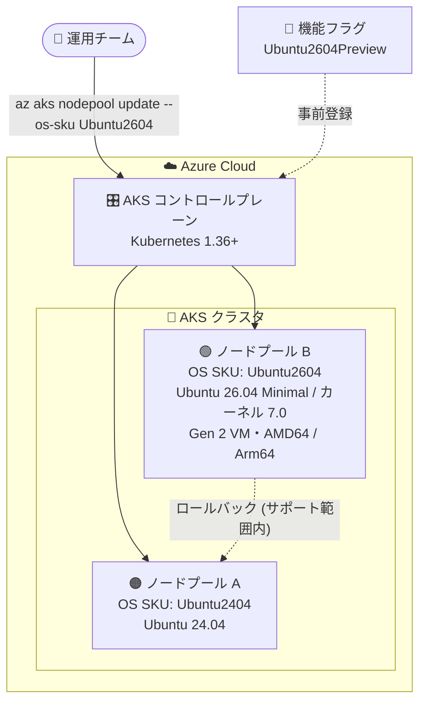

# Azure Kubernetes Service (AKS): Ubuntu 26.04 サポート (Public Preview)

**リリース日**: 2026-09-30

**サービス**: Azure Kubernetes Service (AKS)

**機能**: Ubuntu 26.04 サポート (Ubuntu2604 OS SKU)

**ステータス**: In preview

[このアップデートのインフォグラフィックを見る](https://takech9203.github.io/azure-news-summary/20260930-aks-ubuntu-2604-support.html)

## 概要

Azure Kubernetes Service (AKS) のノードプールで Ubuntu 26.04 がパブリックプレビューとして利用可能になりました。新しい `Ubuntu2604` OS SKU が導入され、Ubuntu Minimal をベースラインイメージとして採用しています。これにより、既存の AKS のクラスタ作成・更新・ノードプール操作のワークフローを維持したまま、より小さなデフォルトホストフットプリント、Linux LTS カーネル 7.0、および Ubuntu 24.04 への (サポートされる範囲での) ロールバックの柔軟性を備えた、制御された移行パスが提供されます。

AKS で Ubuntu ノードプールを運用するチームは Ubuntu LTS リリースへの追随が必要ですが、OS の移行のたびにパッケージフットプリント、セキュリティ、互換性の懸念が生じます。今回のアップデートは、Kubernetes バージョンをアップグレードせずに新しい OS バージョンへ移行できるバージョン指定型 OS SKU として Ubuntu 26.04 を提供するものです。

なお、AKS では Ubuntu 22.04 が 2027 年 6 月 30 日にサポート終了予定であり、Ubuntu 24.04 以降への移行が推奨されています。Ubuntu 26.04 のプレビューは、次期 LTS への移行を早期に検証するための選択肢となります。

**アップデート前の課題**

- Ubuntu LTS の OS 移行のたびに、パッケージフットポイント (搭載パッケージ量)、セキュリティ、互換性の懸念に個別に対処する必要があった
- 新しい Ubuntu バージョンを利用するには、Kubernetes バージョンのアップグレードに伴うデフォルト OS の切り替えを待つ必要があった (例: `Ubuntu` SKU では Kubernetes 1.35+ で Ubuntu 24.04 がデフォルト)

**アップデート後の改善**

- `Ubuntu2604` OS SKU を指定することで、Kubernetes バージョンを変更せずに (1.36 以降で) Ubuntu 26.04 へ移行可能
- Ubuntu Minimal ベースのノードイメージにより、デフォルトのホストフットプリントが縮小
- Linux LTS カーネル 7.0 を利用可能
- `az aks nodepool update` によるインプレース移行と、サポートされる範囲での Ubuntu 24.04 へのロールバックが可能

## アーキテクチャ図



`Ubuntu2604Preview` 機能フラグを登録したうえで、ノードプール単位に OS SKU `Ubuntu2604` を指定して Ubuntu 26.04 (Ubuntu Minimal ベース) へ移行できる構成を示しています。問題が発生した場合はサポートされる範囲で Ubuntu 24.04 へロールバック可能です。

## サービスアップデートの詳細

### 主要機能

1. **Ubuntu2604 OS SKU の導入**
   - ノードプールの作成・更新時に `--os-sku Ubuntu2604` を指定することで Ubuntu 26.04 を利用可能
   - 既存の AKS のクラスタ作成、更新、ノードプールのワークフローはそのまま維持

2. **Ubuntu Minimal ベースのノードイメージ**
   - Ubuntu Minimal をベースラインイメージとして採用し、デフォルトのホストフットプリントを縮小
   - AMD64 および Arm64 の両アーキテクチャで Minimal ノードイメージを使用

3. **Linux LTS カーネル 7.0**
   - Ubuntu 26.04 ノードでは Linux LTS カーネル 7.0 を利用可能

4. **制御された移行パスとロールバック**
   - `az aks nodepool update` で既存ノードプールの OS SKU をインプレースで変更可能
   - サポートされる範囲で Ubuntu 24.04 へのロールバックが可能

## 技術仕様

| 項目 | 詳細 |
|------|------|
| OS SKU | `Ubuntu2604` |
| ベースイメージ | Ubuntu Minimal (AMD64 / Arm64) |
| カーネル | Linux LTS カーネル 7.0 |
| 対応 Kubernetes バージョン | 1.36 以降 (プレビュー) |
| 必要な機能フラグ | `Ubuntu2604Preview` (Microsoft.ContainerService) |
| 必要な CLI | `aks-preview` 拡張機能、プレビュー版 Azure CLI 21.0.0b14 以降 |
| VM 要件 | Generation 2 VM をサポートする VM サイズが必要 |
| 非サポート機能 | FIPS、Confidential VM、Trusted Launch |
| ロールバック | サポートされる範囲で Ubuntu 24.04 (`Ubuntu2404` は Kubernetes 1.32〜1.38 でサポート) |

## 設定方法

### 前提条件

1. Kubernetes バージョン 1.36 以降のクラスタ / ノードプール
2. `aks-preview` Azure CLI 拡張機能のインストール (プレビュー版 Azure CLI 21.0.0b14 以降)
3. サブスクリプションでの `Ubuntu2604Preview` 機能フラグの登録
4. Generation 2 VM をサポートする VM サイズ

### Azure CLI

```bash
# aks-preview 拡張機能のインストール・更新
az extension add --name aks-preview
az extension update --name aks-preview

# Ubuntu2604Preview 機能フラグの登録
az feature register \
    --namespace Microsoft.ContainerService \
    --name Ubuntu2604Preview

# 登録状態の確認 (Registered になるまで待機)
az feature show \
    --namespace Microsoft.ContainerService \
    --name Ubuntu2604Preview \
    --query properties.state

# リソースプロバイダーの再登録
az provider register --namespace Microsoft.ContainerService

# 既存ノードプールを Ubuntu 26.04 に更新
az aks nodepool update \
    --resource-group $RESOURCE_GROUP \
    --cluster-name $CLUSTER_NAME \
    --os-sku Ubuntu2604 \
    --name $NODE_POOL_NAME
```

問題が発生した場合は、同じ `az aks nodepool update` コマンドで `--os-sku Ubuntu2404` などサポートされる Linux OS SKU 間を移行 (ロールバック) できます。ターゲット OS に対して Kubernetes バージョン・VM サイズ・FIPS 設定に対応するノードイメージがない場合、コマンドは失敗することがあります。

## メリット

### ビジネス面

- Ubuntu 22.04 のサポート終了 (2027 年 6 月 30 日) を見据えた、次期 LTS への移行検証を早期に開始できる
- Kubernetes バージョンアップグレードと OS 移行を分離でき、変更リスクを段階的に管理できる

### 技術面

- Ubuntu Minimal ベースによりホストのデフォルトフットプリントが縮小 (パッケージ削減)
- Linux LTS カーネル 7.0 を利用可能
- 既存の作成・更新・ノードプールワークフローを変更せずに導入可能
- ノードプール単位のインプレース移行とロールバックにより、安全に検証できる

## デメリット・制約事項

- パブリックプレビューのため SLA・保証の対象外であり、本番環境での使用は想定されていない (サポートはベストエフォート)
- Kubernetes 1.36 以降でのみ利用可能
- `Ubuntu2604Preview` 機能フラグの事前登録が必要
- Generation 2 VM をサポートする VM サイズが必要
- FIPS、Confidential VM、Trusted Launch は非サポート
- バージョン指定型 OS SKU のため、将来の Kubernetes アップグレードがブロックされないよう手動での OS バージョン移行管理が必要

## ユースケース

### ユースケース 1: 非本番環境での Ubuntu 26.04 早期検証

**シナリオ**: Ubuntu ノードプールを運用しているチームが、Ubuntu 22.04 の 2027 年 6 月サポート終了に備え、次期 LTS でのワークロード互換性 (パッケージ、エージェント、DaemonSet など) を非本番クラスタで事前検証する。

**実装例**:

```bash
# 検証用ノードプールを Ubuntu 26.04 で追加検証 (Kubernetes 1.36+ クラスタ)
az aks nodepool update \
    --resource-group rg-aks-staging \
    --cluster-name aks-staging \
    --os-sku Ubuntu2604 \
    --name npubuntu

# 問題があれば Ubuntu 24.04 にロールバック
az aks nodepool update \
    --resource-group rg-aks-staging \
    --cluster-name aks-staging \
    --os-sku Ubuntu2404 \
    --name npubuntu
```

**効果**: Kubernetes バージョンを変更せずに OS のみを切り替えて検証でき、問題発生時はロールバックできるため、OS 移行のリスクを最小化できる。

## 料金

このアップデート自体に固有の料金情報は公表されていません。ノードプールの VM サイズなどに応じた通常の AKS 料金が適用されます。詳細は料金ページを参照してください。

- [AKS 料金ページ](https://azure.microsoft.com/pricing/details/kubernetes-service/)

## 関連サービス・機能

- **Azure Virtual Machines (Generation 2 VM)**: Ubuntu 26.04 ノードは Generation 2 VM をサポートする VM サイズが必要
- **Ubuntu2404 / Ubuntu OS SKU**: ロールバック先およびデフォルト OS SKU。`Ubuntu` SKU は Kubernetes 1.35+ で Ubuntu 24.04 がデフォルト
- **Azure Linux / Azure Container Linux (ACL)**: AKS で選択可能な代替の Linux ノード OS
- **aks-preview Azure CLI 拡張機能**: プレビュー機能の利用に必要

## 参考リンク

- [インフォグラフィック](https://takech9203.github.io/azure-news-summary/20260930-aks-ubuntu-2604-support.html)
- [公式アップデート情報](https://azure.microsoft.com/updates?id=573214)
- [Microsoft Learn: Upgrade OS Version in AKS Clusters](https://learn.microsoft.com/azure/aks/upgrade-os-version)
- [AKS 料金ページ](https://azure.microsoft.com/pricing/details/kubernetes-service/)

## まとめ

AKS の Ubuntu 26.04 サポート (パブリックプレビュー) は、`Ubuntu2604` OS SKU により Ubuntu Minimal ベースの軽量なノードイメージと Linux LTS カーネル 7.0 を提供し、Kubernetes バージョンと切り離した OS 移行・ロールバックを可能にします。Ubuntu 22.04 の 2027 年 6 月サポート終了に向けた移行計画を進めているチームは、Kubernetes 1.36 以降の非本番クラスタで `Ubuntu2604Preview` 機能フラグを登録し、ワークロード互換性の検証を開始することを推奨します。FIPS、Confidential VM、Trusted Launch が非サポートである点と Generation 2 VM 要件には注意が必要です。

---

**タグ**: Azure Kubernetes Service, AKS, Ubuntu 26.04, Ubuntu Minimal, OS SKU, In preview, Compute, Containers
