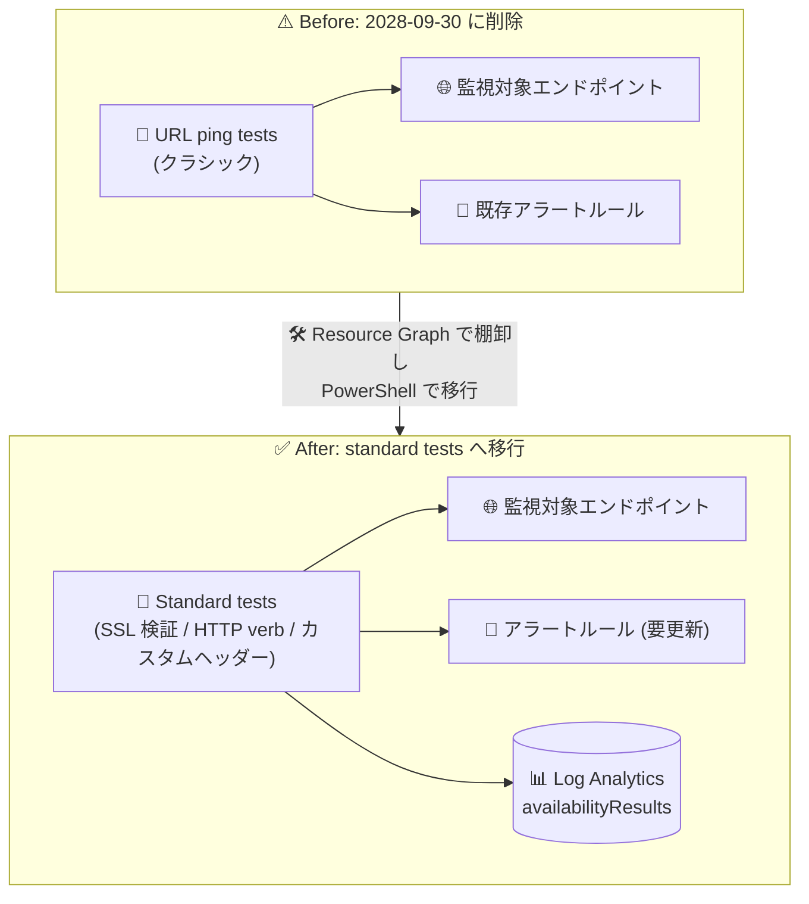

# Azure Monitor Application Insights: URL ping tests のリタイアメント期限を 2028 年 9 月 30 日に延長 (standard tests への移行が必要)

**リリース日**: 2026-09-30

**サービス**: Azure Monitor (Application Insights)

**機能**: 可用性テスト (URL ping tests → standard tests への移行)

**ステータス**: Retirement (リタイアメント期限: 2028-09-30)

[このアップデートのインフォグラフィックを見る](https://takech9203.github.io/azure-news-summary/20260930-application-insights-url-ping-tests-retirement.html)

## 概要

Azure Monitor Application Insights の単一ステップ可用性テストである **URL ping tests (クラシックテスト)** のリタイアメント期限が、当初予定されていた **2026 年 9 月 30 日から 24 か月延長され、2028 年 9 月 30 日** になりました。この延長は、移行完了までにより多くの時間を求める顧客からのフィードバックに応えたものです。

2028 年 9 月 30 日をもって、既存の URL ping tests はリソースから **削除** されます。単一ステップの可用性テストを継続して実行するには、期限までに後継機能である **standard tests** へ移行する必要があります。standard tests は URL ping tests と同様に単一リクエストによる可用性チェックを行うことに加え、TLS/SSL 証明書の検証、HTTP リクエスト verb の指定、カスタムヘッダーなどの高度な機能を備えています。

期限が延長されたとはいえ、standard tests は有効化すると課金が発生するため、料金の確認・アラートルールの切り替え・テストの検証を含めた計画的な移行を早めに進めることが推奨されます。

**影響**

- 2028 年 9 月 30 日に、既存の URL ping tests は Application Insights リソースから削除される
- 移行しない場合、それまで URL ping tests で行っていた単一ステップの可用性監視 (および紐づくアラート) が機能しなくなる
- standard tests は有効化すると課金が発生する (URL ping tests とは料金体系が異なるため事前確認が必要)

**必要な対応**

- Azure Resource Graph クエリで既存の URL ping tests (`Kind = "ping"` の `microsoft.insights/webtests`) を棚卸しする
- 各 URL ping test と同等の設定で standard test を作成し、動作を検証する
- アラートルールは自動移行されないため、検証完了後に standard test を参照するよう更新する
- 切り替え完了後、URL ping tests を無効化または削除する

## アーキテクチャ図



URL ping tests は 2028 年 9 月 30 日に削除されるため、同等の単一ステップテストである standard tests へ移行します。アラートルールは自動移行されないため、standard test の検証後に手動で切り替えが必要です。

## サービスアップデートの詳細

### 主要なポイント

1. **リタイアメント期限の 24 か月延長**
   - 当初期限: 2026 年 9 月 30 日 → 新期限: **2028 年 9 月 30 日**
   - 顧客からの「移行完了までにより多くの時間が必要」というフィードバックへの対応

2. **期限後の挙動**
   - 2028 年 9 月 30 日に、既存の URL ping tests はリソースから削除される
   - 単一ステップ可用性テストを継続するには standard tests への移行が必須

3. **standard tests の追加機能 (URL ping tests との違い)**
   - エンドポイントの応答確認・パフォーマンス測定 (URL ping tests と同等) に加えて以下をサポート:
   - TLS/SSL 証明書の有効性検証と有効期限の事前チェック (proactive lifetime check)
   - HTTP リクエスト verb の指定 (`GET`、`HEAD`、`POST` など)
   - カスタムヘッダーの追加 ("Host" と "User-Agent" は予約済みで変更不可)
   - リクエストボディ (カスタムデータ) の送信

## 技術仕様

| 項目 | 詳細 |
|------|------|
| 対象機能 | Application Insights の URL ping tests (クラシックテスト、`WebTestKind = "ping"`) |
| 移行先 | Standard tests (`Kind = "standard"`) |
| 当初のリタイアメント期限 | 2026 年 9 月 30 日 |
| 新しいリタイアメント期限 | 2028 年 9 月 30 日 (24 か月延長) |
| 期限後の挙動 | 既存の URL ping tests がリソースから削除される |
| テスト上限 | Application Insights リソースあたり最大 100 個の可用性テスト |
| テスト頻度 / ロケーション | 既定 5 分間隔、最大 16 ロケーション (推奨は最低 5 ロケーション) |
| 前提条件 | ワークスペースベースの Application Insights リソース、`Microsoft.Insights/webTests` の読み取り・作成権限 |

## 移行手順

### 1. 既存の URL ping tests の棚卸し (Azure Resource Graph)

Azure Resource Graph Explorer で以下のクエリを実行し、対象サブスクリプション内の URL ping tests を特定します。

```kusto
resources
| where ['type'] =~ "microsoft.insights/webtests"
| where tostring(properties.Kind) =~ "ping"
| extend
    webTestResourceGroup = resourceGroup,
    webTestName = name,
    enabled = tobool(properties.Enabled),
    locations = properties.Locations
| mv-expand bagexpansion=array tags
| extend tagName = tostring(tags[0])
| where tagName startswith "hidden-link:"
| extend appInsightsResourceId = substring(tagName, strlen("hidden-link:"))
| where appInsightsResourceId contains "/providers/microsoft.insights/components/"
| project subscriptionId, webTestResourceGroup, webTestName, enabled, locations, appInsightsResourceId
| order by subscriptionId, webTestResourceGroup, webTestName
```

### 2. Azure PowerShell による standard test の作成

サブスクリプション内の URL ping tests を一覧し、同等ロジックの standard test を作成します。

```azurepowershell
# URL ping tests の一覧
Get-AzApplicationInsightsWebTest | `
  Where-Object { $_.WebTestKind -eq "ping" } | `
  Format-Table -Property ResourceGroupName,Name,WebTestKind,Enabled;

# 同等の standard test を作成 (New-AzApplicationInsightsWebTest -Kind 'standard' を使用)
# 既存の URL ping test の URL、ロケーション、頻度、タイムアウト、リトライ設定を引き継ぐ
# 詳細なスクリプトは Microsoft Learn の移行ガイドを参照
```

### 3. 検証とアラートの切り替え

1. 新しい standard test の動作を検証する (standard test の作成は既存の URL ping test を変更・削除しない)
2. URL ping test を参照しているアラートルールを standard test を参照するよう更新する (アラートルールは自動移行されない)
3. 切り替え完了後、URL ping test を無効化または削除する

```azurepowershell
# 移行完了後に URL ping test を削除
Remove-AzApplicationInsightsWebTest -ResourceGroupName $resourceGroup -Name $pingTestName;
```

## 移行時の注意点

- **standard tests は有効化すると課金が発生する**。移行したテストを有効化する前に Azure Monitor の料金を確認すること
- standard test を作成しても既存の URL ping test は変更・削除されないため、検証期間中は並行稼働が可能
- standard test の検証とアラートの切り替えが完了するまで、URL ping test とそのアラートルールは有効なまま維持することが推奨される
- URL ping test の一部の検証ルールは手動での変換が必要な場合がある
- 移行後に SSL 証明書検証や proactive lifetime check を有効化する場合は、テスト対象エンドポイントの証明書構成を事前に確認すること
- Content match (文字列一致) は英語文字のみサポート

## 料金

standard tests は有効化するとテスト実行に対して課金が発生します。移行前に Azure Monitor の料金ページで standard tests の料金を確認してください。

- [Azure Monitor 料金ページ](https://azure.microsoft.com/pricing/details/monitor/#pricing)

## 関連サービス・機能

- **Azure Monitor アラート**: 可用性テストの失敗時に通知する。アラートルールは自動移行されないため、standard test への切り替え時に手動更新が必要
- **Log Analytics**: 可用性テスト結果 (`availabilityResults`) をクエリし、カスタムレポートやダッシュボードを作成できる
- **Azure Resource Graph**: サブスクリプション横断で既存の URL ping tests を棚卸しできる
- **Downtime & Outages ワークブック**: 可用性テスト結果に基づく SLA レポートを Application Insights リソース・サブスクリプション横断で可視化できる
- **ネットワークセキュリティグループ / Azure Firewall**: サービスタグ `ApplicationInsightsAvailability` を使用して、可用性テストのトラフィックをファイアウォール背後のエンドポイントに許可できる

## 参考リンク

- [インフォグラフィック](https://takech9203.github.io/azure-news-summary/20260930-application-insights-url-ping-tests-retirement.html)
- [公式アップデート情報](https://azure.microsoft.com/updates?id=transition-to-using-standard-tests-for-singlestep-availability-testing-in-azure-monitor-application-insights-by-30-september)
- [Microsoft Learn: Application Insights availability tests](https://learn.microsoft.com/azure/azure-monitor/app/availability)
- [Microsoft Learn: URL ping tests (旧ドキュメント)](https://learn.microsoft.com/previous-versions/azure/azure-monitor/app/monitor-web-app-availability)
- [料金ページ (Azure Monitor)](https://azure.microsoft.com/pricing/details/monitor/#pricing)

## まとめ

Application Insights の URL ping tests のリタイアメント期限が、顧客フィードバックを受けて当初の 2026 年 9 月 30 日から 24 か月延長され、**2028 年 9 月 30 日** になりました。期限を過ぎると既存の URL ping tests はリソースから削除されるため、単一ステップの可用性監視を継続するには standard tests への移行が必須です。standard tests は SSL 証明書検証、HTTP verb 指定、カスタムヘッダーなどの機能強化を含む後継機能ですが、有効化すると課金が発生します。猶予期間が延びた今のうちに、Azure Resource Graph での棚卸し → standard test の作成・検証 → アラートルールの切り替え → URL ping test の削除、という手順で計画的に移行を進めることを推奨します。

---

**タグ**: Azure Monitor, Application Insights, 可用性テスト, Standard Tests, URL Ping Tests, Retirement, DevOps, Management and Governance
