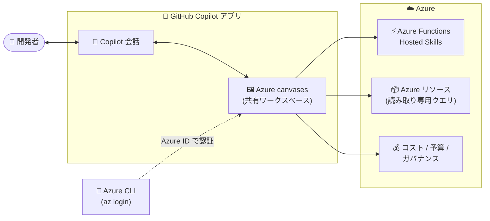

# Azure Copilot: Azure canvases for GitHub Copilot の発表

**リリース日**: 2026-09-30

**サービス**: Azure Copilot / GitHub Copilot

**機能**: Azure canvases for GitHub Copilot

**ステータス**: Announcement

[このアップデートのインフォグラフィックを見る](https://takech9203.github.io/azure-news-summary/20260930-azure-canvases-github-copilot.html)

## 概要

Microsoft は、GitHub Copilot 向けの「Azure canvases」を発表しました。Azure canvases は、GitHub Copilot との会話のすぐ横に Azure のツール、ダッシュボード、ガイド付きワークフローを表示する、ユーザーとエージェントが共有するインタラクティブなワークスペースです。Azure リソースの探索、コスト分析、ホスト型スキルの構築などを、進捗・操作・次のステップが常に可視化された 1 つのワークスペース内で実行できます。

canvases は GitHub Copilot アプリに組み込まれるキャンバス拡張機能として提供され、Awesome Copilot マーケットプレイス経由でプラグインとしてインストールします。初期リリースでは、Azure Functions Hosted Skills、Azure Resources Query、Azure Cost Health Check の 3 つのキャンバスが提供されます。

**アップデート前の課題**

- 従来はチャット (会話) 内で結果全体を管理する必要があり、進捗や結果の確認にはチャット履歴を掘り返す必要があった
- テーブルのフィルタリングやオプション選択といった単純な操作にもモデル呼び出しが発生し、待ち時間と AI クレジットの消費につながっていた

**アップデート後の改善**

- ユーザーとエージェントが共有するワークスペース上で、進捗の確認・変更・次のステップの承認を、チャット履歴をさかのぼらずに実行できるようになった
- テーブルのフィルタリングやオプション選択などの日常的な操作は、モデル呼び出しなしにキャンバス上のコードで直接実行され、待ち時間と AI クレジット消費が削減された

## アーキテクチャ図



GitHub Copilot の会話の横に開くキャンバスが Azure の各サービスと連携し、Azure CLI のサインイン情報 (Azure ID) を利用して、リソース探索・コスト分析・スキル構築を会話と並行して実行します。

## サービスアップデートの詳細

### 主要機能

初期リリースで提供される 3 つのキャンバス:

1. **Azure Functions Hosted Skills**
   - Azure Functions でホストされるスキルの構築・実行・デプロイをキャンバス上で実行できる

2. **Azure Resources Query**
   - 選択したサブスクリプション全体のリソースを読み取り専用ビューで閲覧できる

3. **Azure Cost Health Check**
   - コスト、予測、予算、ガバナンス、AI 請求を共有ダッシュボードで分析できる

### GitHub Copilot との統合方法

- Awesome Copilot マーケットプレイス (GitHub Copilot アプリにデフォルトでインストール済み) 経由でプラグインとして提供される
- キャンバスは GitHub Copilot アプリ内で会話と並行して動作し、Copilot は必要なときにいつでもサポートできる状態を維持する
- Copilot がワークフローを開始すると、チャットの横にキャンバスが開く

## 技術仕様

| 項目 | 詳細 |
|------|------|
| 提供形態 | GitHub Copilot アプリのキャンバス拡張機能 (プラグイン) |
| 配布チャネル | Awesome Copilot マーケットプレイス |
| 認証 | Azure CLI (`az login`) による Azure ID を利用 |
| 初期提供キャンバス | Azure Functions Hosted Skills / Azure Resources Query / Azure Cost Health Check |
| Azure Resources Query のアクセス権限 | 読み取り専用 |

## 設定方法

### 前提条件

1. Azure CLI をインストールしていること
2. `az login` で Azure にサインインしていること (キャンバスが Azure ID を利用するため)

### 利用開始手順

1. GitHub Copilot アプリのサイドバーで **Customize** → **Plugins** を選択する
2. Awesome Copilot マーケットプレイスで Azure canvas を検索し、**Install** を選択する
3. 新しいセッションを開始してプラグインのキャンバスとスキルを有効化する
4. キャンバスに合ったタスクを Copilot に依頼する

または、**Customize** → **Canvas** で注目キャンバスを探し、**Install plugin** → **New session** を選択する方法もあります。

**プロンプト例:**

```text
# Azure Functions Hosted Skills
Create a daily GitHub digest with Azure Functions Hosted Skills.

# Azure Resources Query
Show my Function Apps in Development.

# Azure Cost Health Check
Analyze Azure costs for subscription <subscription name or ID>.
```

## メリット

### ビジネス面

- 単純な操作 (テーブルのフィルタリング、オプション選択など) がモデル呼び出しなしで完結するため、AI クレジットの消費を削減できる
- コスト、予測、予算、ガバナンスを共有ダッシュボードで可視化でき、支出の把握が容易になる

### 技術面

- チャット履歴をさかのぼらずに、進捗の確認・変更・次のステップの承認が可能になり、エージェント型ワークフローが可視化・制御しやすくなる
- モデル呼び出しを介さない直接操作により待ち時間が削減される
- 会話とワークスペースが並行して動作するため、Copilot によるサポートを受けながら作業を継続できる

## デメリット・制約事項

- Azure Resources Query は読み取り専用ビューであり、リソースの変更操作はできない
- 利用には Azure CLI のインストールと `az login` によるサインインが必須

## ユースケース

### ユースケース 1: サブスクリプション横断のリソース探索

**シナリオ**: 複数のサブスクリプションにまたがる Function App などのリソースを、ポータルを行き来せずに確認したい。

**実装例**:

```text
Show my Function Apps in Development.
```

**効果**: 選択したサブスクリプション全体のリソースを読み取り専用ビューで一覧でき、環境横断のリソース検索が会話の横で完結する。

### ユースケース 2: Azure コストのヘルスチェック

**シナリオ**: サブスクリプションのコスト、予測、予算、AI 請求の状況を定期的に把握したい。

**実装例**:

```text
Analyze Azure costs for subscription <subscription name or ID>.
```

**効果**: 共有ダッシュボード上でコスト・予測・予算・ガバナンス・AI 請求を分析でき、支出状況の把握と次のアクションの判断が容易になる。

### ユースケース 3: Azure Functions ホスト型スキルの構築

**シナリオ**: 定型的な自動化ワークフロー (例: 日次の GitHub ダイジェスト作成) をホスト型スキルとして構築・デプロイしたい。

**実装例**:

```text
Create a daily GitHub digest with Azure Functions Hosted Skills.
```

**効果**: スキルの構築・実行・デプロイまでをキャンバス上のガイド付きワークフローで進められる。

## 関連サービス・機能

- **GitHub Copilot**: canvases のホスト環境。会話の横にキャンバスが開き、エージェントと共有するワークスペースとして動作する
- **Azure Functions**: Hosted Skills キャンバスでスキルのホスティング基盤として利用される
- **Microsoft Cost Management**: Cost Health Check キャンバスで分析対象となるコスト・予算・予測情報を提供する
- **Azure CLI**: キャンバスが利用する Azure ID の認証手段 (`az login`)

## 参考リンク

- [インフォグラフィック](https://takech9203.github.io/azure-news-summary/20260930-azure-canvases-github-copilot.html)
- [公式アップデート情報](https://azure.microsoft.com/updates?id=573385)
- [発表ブログ: Azure Canvases for GitHub Copilot (Microsoft for Developers)](https://developer.microsoft.com/blog/azure-canvases/)
- [Awesome Copilot マーケットプレイス](https://github.com/github/awesome-copilot)
- [Azure Copilot ドキュメント (Microsoft Learn)](https://learn.microsoft.com/azure/copilot/)
- [Azure CLI のインストール](https://learn.microsoft.com/cli/azure/install-azure-cli)

## まとめ

Azure canvases for GitHub Copilot は、Copilot との会話の横に Azure のダッシュボードやガイド付きワークフローを表示する共有ワークスペースであり、エージェント型ワークフローの「可視化・制御・コスト効率」を高める取り組みです。初期リリースの 3 キャンバス (Functions Hosted Skills / Resources Query / Cost Health Check) は、リソース探索・コスト分析・スキル構築という日常的なタスクをカバーしています。GitHub Copilot を利用中のチームは、Azure CLI でサインインのうえ Awesome Copilot マーケットプレイスからプラグインをインストールし、リソース確認やコスト分析のワークフローで試用してみることを推奨します。

---

**タグ**: Azure Copilot, GitHub Copilot, Management and governance, SDK and Tools, Announcement
