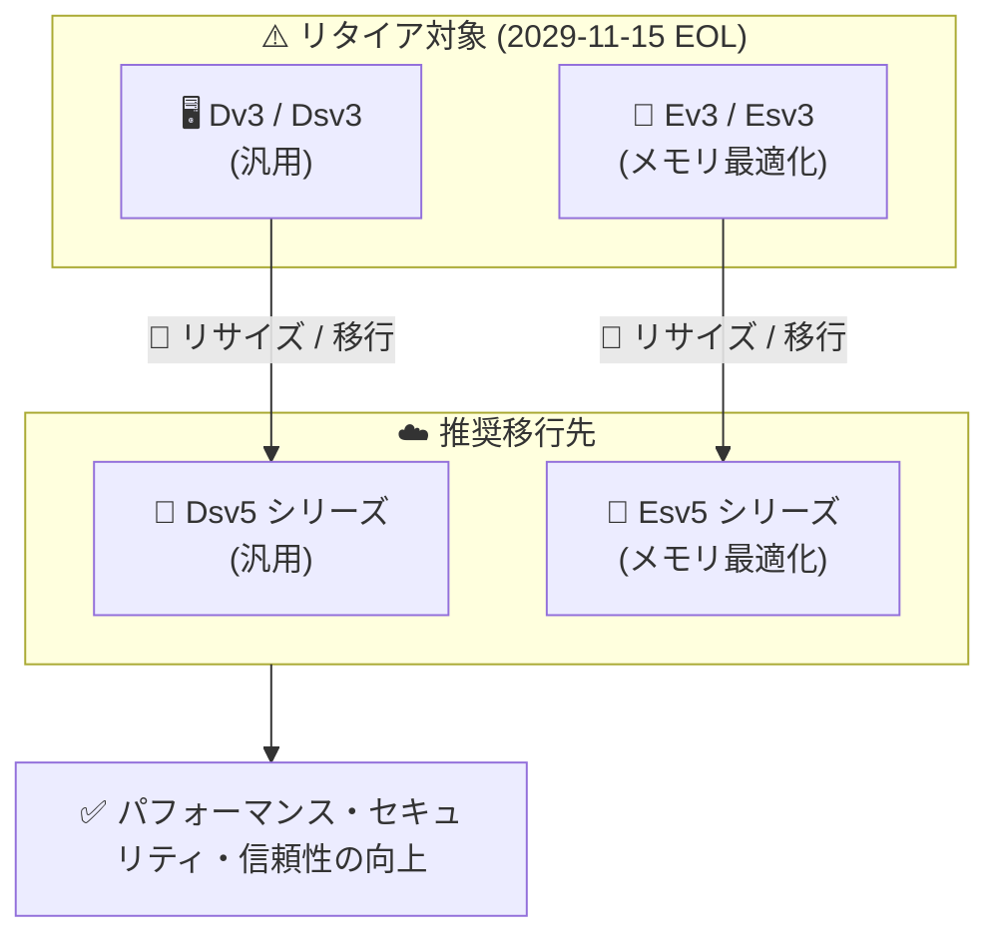

# Azure Virtual Machines: Dv3, Dsv3, Ev3, Esv3 シリーズのリタイアメント

**リリース日**: 2026-09-30

**サービス**: Azure Virtual Machines

**機能**: Dv3, Dsv3, Ev3, Esv3 VM シリーズのリタイアメント (リタイア日: 2029-11-15)

**ステータス**: Retirement

[このアップデートのインフォグラフィックを見る](https://takech9203.github.io/azure-news-summary/20260930-dv3-ev3-vm-retirement.html)

## 概要

Microsoft は、Azure VM ライフサイクルポリシーに基づき、汎用 VM シリーズの Dv3/Dsv3 とメモリ最適化 VM シリーズの Ev3/Esv3 をパブリッククラウドの Azure リージョンでリタイアすることを発表しました。これらの VM シリーズは End-of-Life (EOL) ライフサイクルステージに入り、**2029 年 11 月 15 日** にリタイアします。

推奨される移行先は **Dsv5 シリーズ** (Dv3/Dsv3 の後継) および **Esv5 シリーズ** (Ev3/Esv3 の後継) で、移行によりパフォーマンス、セキュリティ、信頼性の向上が得られるとされています。

なお、Reserved Instance (RI) については **2026 年 7 月 1 日をもって** 対象シリーズの 1 年・3 年 RI の新規購入・更新が既に停止されています。

**影響**

- 2029 年 11 月 15 日以降、Dv3/Dsv3/Ev3/Esv3 の VM はサポート対象外となる
- 移行されていない VM は割り当て解除 (deallocate) され、基盤ハードウェアの廃止に伴い最終的に削除される可能性がある
- 対象シリーズの 1 年・3 年 Reserved Instance の新規購入・更新は 2026 年 7 月 1 日から不可 (既に発効)

**必要な対応**

- 2029 年 11 月 15 日までに、すべての対象 VM を新しい VM シリーズ (推奨: Dsv5/Esv5) へ移行する
- 現在の Reserved Instance の注文状況を確認し、対象 VM の RI がまだ有効な場合は、アクティブな予約の **Azure savings plan for compute** へのトレードイン (trade-in) を検討する
- 移行計画・実行に技術支援が必要な場合、アクティブなサポートプランがあればサポートリクエストを提出できる

## アーキテクチャ図



リタイア対象の Dv3/Dsv3 (汎用) と Ev3/Esv3 (メモリ最適化) から、それぞれ後継の Dsv5 / Esv5 シリーズへの移行パスを示しています。2029 年 11 月 15 日の期限までにリサイズによる移行が必要です。

## サービスアップデートの詳細

### リタイアメントのタイムライン

| 期限 | 内容 |
|------|------|
| 2026 年 7 月 1 日 (既に発効) | Dv3, Dsv3, Ev3, Esv3 の 1 年・3 年 Reserved Instance の新規購入・更新が不可に |
| 2026 年 9 月 30 日 | リタイアメントの公式アナウンス |
| 2029 年 11 月 15 日 | End-of-Life。対象 VM はサポート対象外となり、未移行の VM は割り当て解除・最終的に削除される可能性 |

### 対象シリーズと推奨移行先

| リタイア対象 | タイプ | 推奨移行先 |
|-------------|--------|-----------|
| Dv3 / Dsv3 | 汎用 (バランス型 vCPU/メモリ比) | Dsv5 シリーズ |
| Ev3 / Esv3 | メモリ最適化 (高メモリ/vCPU 比) | Esv5 シリーズ |

Microsoft Learn の VM サイズ一覧によると、D ファミリはエンタープライズアプリケーション、リレーショナルデータベース、インメモリキャッシュ、データ分析向けの汎用シリーズ、E ファミリはリレーショナルデータベース、中〜大規模キャッシュ、インメモリ分析向けのメモリ最適化シリーズと位置付けられています。v5 世代 (Dv5/Dsv5、Ev5/Esv5 など) は現行世代として提供されています。

## 技術仕様

| 項目 | 詳細 |
|------|------|
| 対象シリーズ | Dv3, Dsv3, Ev3, Esv3 |
| 対象範囲 | パブリッククラウドの Azure リージョン |
| リタイア日 | 2029 年 11 月 15 日 |
| リタイア後の動作 | サポート対象外。未移行 VM は割り当て解除、最終的に削除の可能性 |
| RI 新規購入・更新停止 | 2026 年 7 月 1 日 (既に発効) |
| 推奨移行先 | Dsv5 シリーズ、Esv5 シリーズ |

## 移行手順

### 前提条件

1. 移行先のサイズが VM をホストしているハードウェアクラスタで利用可能か確認する (利用できない場合は割り当て解除が必要)
2. Premium Storage を使用している VM は、移行先も Premium Storage 対応の「s」付きサイズ (例: Standard_E4s_v3 → Esv5 系) を選択する
3. リサイズは VM の再起動を伴う破壊的操作であるため、ステートフルなワークロードではメンテナンスウィンドウを計画する

### Azure CLI

```bash
# 変数の設定
resourceGroup=myResourceGroup
vm=myVM
size=Standard_D4s_v5

# 移行先サイズが利用可能か確認
az vm list-vm-resize-options --resource-group $resourceGroup --name $vm --query "[].name"

# VM の割り当て解除
az vm deallocate --resource-group $resourceGroup --name $vm

# VM のリサイズ
az vm resize --resource-group $resourceGroup --name $vm --size $size

# VM の起動
az vm start --resource-group $resourceGroup --name $vm
```

### Azure Portal

1. [Azure Portal](https://portal.azure.com) を開く
2. 検索で「Virtual machines」を検索し、**Virtual machines** を選択する
3. リサイズする仮想マシンを選択する
4. 左側メニューの **可用性とスケール** セクションで **サイズ** を選択する
5. 一覧から互換性のある新しいサイズ (Dsv5/Esv5 系) を選択し、**サイズ変更** を選択する

VM が実行中で目的のサイズが一覧に表示されない場合、VM を停止するとより多くのサイズが表示されることがあります。

## メリット

### ビジネス面

- 2029 年 11 月の期限より前に計画的に移行することで、サポート切れや VM の割り当て解除・削除のリスクを回避できる
- アクティブな RI を Azure savings plan for compute にトレードインすることで、コミットメントを維持しつつ移行できる

### 技術面

- Dsv5/Esv5 シリーズへの移行により、パフォーマンス、セキュリティ、信頼性が向上する (公式アナウンスに明記)
- 既存 VM のリサイズ操作で移行でき、OS ディスクとデータディスクは影響を受けない

## デメリット・制約事項

- 実行中の VM のサイズ変更は再起動を伴う。ステートフルなワークロードにとっては破壊的操作となる
- 移行先サイズが現在のハードウェアクラスタで利用できない場合、VM の割り当て解除が必要。割り当て解除により動的 IP アドレスは解放される
- Windows VM では、ローカル一時ディスクあり ⇔ なしのサイズ間のリサイズは直接サポートされない (スナップショット経由のワークアラウンドが必要)。Linux VM ではサポートされる
- SCSI ベースの VM からリモート NVMe 対応の VM サイズへの直接リサイズはできない (ワークアラウンドあり)
- 可用性セット内の VM で移行先サイズが現在のクラスタで利用できない場合、可用性セット内のすべての VM の割り当て解除が必要になることがある
- 対象シリーズの RI は既に新規購入・更新ができないため、長期の割引前提のコスト計画は見直しが必要

## 料金

移行先の Dsv5/Esv5 シリーズの料金はリージョン・サイズにより異なります。公式の料金ページおよび VM Selector で確認してください。

- [Linux VM の料金](https://azure.microsoft.com/pricing/details/virtual-machines/linux/)
- [Windows VM の料金](https://azure.microsoft.com/pricing/details/virtual-machines/windows/)
- [Azure VM Selector](https://azure.microsoft.com/pricing/vm-selector/)

## 利用可能リージョン

このリタイアメントはパブリッククラウドのすべての Azure リージョンが対象です。

## 関連サービス・機能

- **Azure Reservations (Reserved Instances)**: 対象シリーズの 1 年・3 年 RI は 2026 年 7 月 1 日から新規購入・更新不可。既存の予約の確認が必要
- **Azure savings plan for compute**: 対象 VM のアクティブな RI のトレードイン先として推奨されている
- **Azure サポート / Microsoft Q&A**: アクティブなサポートプラン保有者は移行の技術支援のサポートリクエストを提出可能。一般的な質問は Microsoft Q&A で相談可能

## 参考リンク

- [インフォグラフィック](https://takech9203.github.io/azure-news-summary/20260930-dv3-ev3-vm-retirement.html)
- [公式アップデート情報](https://azure.microsoft.com/updates?id=572346)
- [Azure Blog: Enhancing Microsoft Azure Virtual Machine lifecycle](https://azure.microsoft.com/en-us/blog/enhancing-microsoft-azure-virtual-machine-lifecycle/)
- [Azure VM サイズの概要 (Microsoft Learn)](https://learn.microsoft.com/azure/virtual-machines/sizes/overview)
- [VM のサイズ変更手順 (Microsoft Learn)](https://learn.microsoft.com/azure/virtual-machines/sizes/resize-vm)
- [Linux VM の料金ページ](https://azure.microsoft.com/pricing/details/virtual-machines/linux/)

## まとめ

Dv3/Dsv3 (汎用) および Ev3/Esv3 (メモリ最適化) は、エンタープライズアプリケーションやデータベースなど幅広いワークロードで広く使われてきた定番の VM シリーズであり、このリタイアメントは多くの Azure 環境に影響する重要なアナウンスです。リタイア日は 2029 年 11 月 15 日と約 3 年の猶予がありますが、対象シリーズの RI 新規購入・更新は既に停止されており、コスト計画の観点では今すぐ影響が出始めています。

Solutions Architect としては、(1) 対象シリーズを使用している VM のインベントリ調査、(2) Dsv5/Esv5 への移行計画の策定 (再起動・一時ディスク互換性・可用性セットの制約を考慮)、(3) 既存 RI の確認と Azure savings plan for compute へのトレードイン検討、の 3 点を早期に着手することを推奨します。

---

**タグ**: Azure Virtual Machines, Compute, Retirement, Dv3, Dsv3, Ev3, Esv3, Dsv5, Esv5, Migration
