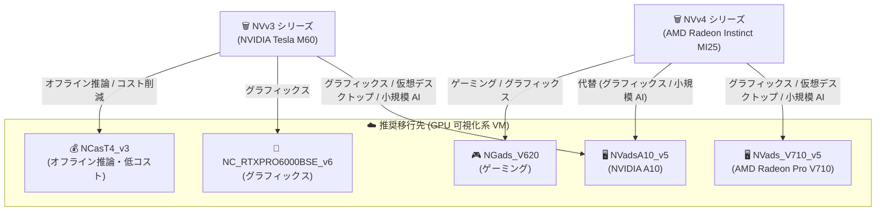

# Azure Virtual Machines: NVv3 / NVv4 シリーズ VM のリタイアメント

**リリース日**: 2026-09-30

**サービス**: Azure Virtual Machines

**機能**: NVv3-series および NVv4-series Virtual Machines のリタイアメント

**ステータス**: Retirement

[このアップデートのインフォグラフィックを見る](https://takech9203.github.io/azure-news-summary/20260930-nvv3-nvv4-vm-retirement.html)

## 概要

2026 年 9 月 30 日、Microsoft Azure は GPU 可視化向け VM である NVv3 シリーズ (NVIDIA Tesla M60 GPU 搭載) と NVv4 シリーズ (AMD Radeon Instinct MI25 GPU 搭載) をリタイアしました。対象となるのは以下の VM サイズです。

- **NVv3 シリーズ**: Standard_NV12s_v3、Standard_NV12hs_v3、Standard_NV24s_v3、Standard_NV24ms_v3、Standard_NV32ms_v3、Standard_NV48s_v3
- **NVv4 シリーズ**: Standard_NV4as_v4、Standard_NV4ahs_v4、Standard_NV8as_v4、Standard_NV8ahs_v4、Standard_NV16as_v4、Standard_NV16ahs_v4、Standard_NV32as_v4、Standard_NV32ahs_v4

リタイア日以降、残存する対象 VM は割り当て解除 (deallocated) 状態に設定され、動作を停止し、課金も発生しなくなります。また、NVv3 / NVv4 は SLA およびサポートの対象外となります。なお、この告知は NVadsA10_v5、NVads_V710_v5、NGads_V620 シリーズには適用されません。

**リタイアメントによる影響**

- 残存する NVv3 / NVv4 シリーズ VM は割り当て解除状態となり、動作を停止する (課金は発生しない)
- NVv3 / NVv4 は SLA の対象外となり、サポートも含まれなくなる
- NVv3 / NVv4 の 1 年および 3 年の Reserved Instance (RI) 購入は 2025 年 11 月 2 日に終了済み
- NVv4 の Compute Pre-Purchase (CPP) 販売は 2026 年 6 月 2 日に終了済み
- 例外として、UAE North リージョンの NVv3 シリーズ VM は延長期限の 2027 年 1 月 31 日まで利用可能 (それまでに移行が必須)

**必要な対応**

- NVv3 / NVv4 シリーズ VM を後継の GPU VM シリーズ (NVadsA10_v5、NVads_V710_v5 など) にリサイズする、または割り当て解除する
- 移行先 VM のクォータをリクエストし、VM のリサイズを実施する
- NVv4 から NVads_V710_v5 への移行時は、既知のリサイズエラーを回避するためにサブスクリプションを AFEC「VMTempDiskResizePreview」に登録する

## アーキテクチャ図

リタイアされた NVv3 / NVv4 シリーズからの移行パスを示しています。ワークロードの種類 (グラフィックス、仮想デスクトップ、小規模 AI 推論、ゲーミング) に応じて推奨移行先が異なります。

## サービスアップデートの詳細

### リタイアメントの内容

1. **NVv3 シリーズのリタイア (2026 年 9 月 30 日)**
   - NVIDIA Tesla M60 GPU を搭載した 6 サイズが対象
   - 残存 VM は割り当て解除状態となり、動作を停止。SLA・サポート対象外
   - UAE North リージョンのみ 2027 年 1 月 31 日まで延長

2. **NVv4 シリーズのリタイア (2026 年 9 月 30 日)**
   - AMD Radeon Instinct MI25 GPU を搭載した 8 サイズが対象
   - 残存 VM は割り当て解除状態となり、動作を停止。SLA・サポート対象外

### 推奨移行先 (ワークロード別)

**NVv3 シリーズからの移行:**

| ワークロード | 推奨移行先 SKU |
|------|------|
| GPU アクセラレーテッドなグラフィックスアプリケーション、仮想デスクトップ、可視化、小規模 AI ワークロード | NVadsA10_v5、NC_RTXPRO6000BSE_v6 |
| レイテンシが重要でないオフライン推論、より小さい VM SKU の購入やコスト削減を重視する場合 | NCasT4_v3 |

**NVv4 シリーズからの移行:**

| ワークロード | 推奨移行先 SKU |
|------|------|
| SLM 推論やセマンティック検索などの小規模 AI ワークロード (最適性能が優先事項でない場合やコスト削減重視) | NVads_V710_v5、NVadsA10_v5 |
| GPU アクセラレーテッドなグラフィックスアプリケーション、仮想デスクトップ、可視化 | NVads_V710_v5、NVadsA10_v5、NGads_V620 |
| ゲーミングワークロード | NGads_V620 |

## 技術仕様

主な推奨移行先シリーズの仕様は以下のとおりです。

| 項目 | NVadsA10_v5 (NVv3 の主な移行先) | NVads_V710_v5 (NVv4 の主な移行先) |
|------|------|------|
| GPU | NVIDIA A10 (最大 2 基、各 24 GB メモリ) | AMD Radeon Pro V710 (最大 1 基、24 GB メモリ) |
| CPU | AMD EPYC 74F3V (Milan)、最大 72 コア (非マルチスレッド) | AMD EPYC 9V64 F (Genoa)、最大 28 コア (マルチスレッド) |
| システムメモリ | 最大 880 GiB | 最大 160 GiB |
| 特徴 | パーシャル GPU の VM を提供。各インスタンスに GRID ライセンス付属 (単一ユーザーの仮想ワークステーション、または仮想アプリケーションとして 25 同時ユーザー接続に対応) | GPU あたりのメモリ帯域幅が向上。AMD Simultaneous Multithreading により専用 vCPU スレッドを割り当て。エフェメラルローカルストレージ向け NVMe をサポート |
| 主な用途 | GPU アクセラレーテッドグラフィックス、仮想デスクトップ、可視化、小規模 AI | グラフィックス、クラウド仮想デスクトップ、クラウドゲーミング (レンダリング / ストリーミング最適化)、SLM 推論・レコメンデーション・セマンティックインデックスなどの小規模 AI 推論 |

## 設定方法

### 移行手順 (VM サイズの変更)

1. 移行先のシリーズとサイズを選択する (上記のワークロード別推奨表を参照。追加の支援が必要な場合はサポートリクエストを起票可能)
2. [移行先 VM のクォータをリクエスト](https://learn.microsoft.com/azure/azure-portal/supportability/per-vm-quota-requests)する
3. [VM をリサイズ](https://learn.microsoft.com/azure/virtual-machines/resize-vm)する

### 注意点 (NVv4 → NVads_V710_v5 の移行)

NVv4 シリーズから NVads_V710_v5 シリーズへの移行時に、既知のリサイズ操作エラーが発生します。これを回避するには、サブスクリプション ID を Azure Feature Exposure Control (AFEC) の「VMTempDiskResizePreview」に登録し、登録ステータスを確認してから VM をリサイズします (AFEC は Azure Portal からも確認可能)。

### サポートリクエストの手順

技術的な支援が必要な場合、Azure Portal からサポートリクエストを作成できます。

1. *Issue type* で **Technical** を選択
2. 対象のサブスクリプションを選択
3. *Service* で **My services** を選択し、*Service type* で **Virtual Machine running Windows/Linux** を選択
4. リクエストの概要を入力
5. *Problem type* で **Assistance with resizing my VM** を選択し、該当する *Problem subtype* を選択

## デメリット・制約事項

- 移行しなかった VM は割り当て解除され動作を停止するため、ワークロードが計画外に停止するリスクがある
- NVv3 / NVv4 は SLA・サポートの対象外となる
- NVv3 / NVv4 の RI 購入 (1 年・3 年) はすでに終了済み (2025 年 11 月 2 日)
- NVv4 の CPP 販売もすでに終了済み (2026 年 6 月 2 日)
- 移行先 VM のクォータは事前にリクエストが必要
- NVv4 → NVads_V710_v5 の移行では AFEC 登録なしにリサイズエラーが発生する既知の問題がある
- 移行先シリーズのリージョン提供状況は個別に確認が必要

## 料金

移行先 VM の料金は [Azure Virtual Machines 料金ページ](https://azure.microsoft.com/pricing/details/virtual-machines/) を参照してください。なお、割り当て解除された NVv3 / NVv4 VM には課金は発生しません。

## 利用可能リージョン

移行先シリーズ (NVadsA10_v5、NVads_V710_v5 など) のリージョン提供状況は [Azure Products by Region ページ](https://azure.microsoft.com/explore/global-infrastructure/products-by-region/) で確認してください。

NVv3 シリーズについては、UAE North リージョンのみ一般リタイア日 (2026 年 9 月 30 日) を超えて 2027 年 1 月 31 日まで利用を継続できます。同リージョンの顧客は 2027 年 1 月 31 日までに移行を完了する必要があります。

## 関連サービス・機能

- **NVadsA10_v5 シリーズ**: NVv3 の主な移行先。NVIDIA A10 GPU 搭載、GRID ライセンス付属の GPU 可視化系 VM
- **NVads_V710_v5 シリーズ**: NVv4 の主な移行先。AMD Radeon Pro V710 GPU 搭載の GPU 可視化系 VM
- **NCasT4_v3 シリーズ**: NVv3 からの代替移行先。オフライン推論やコスト削減向け
- **NC_RTXPRO6000BSE_v6 シリーズ**: NVv3 からの代替移行先。グラフィックスアプリケーション向け
- **NGads_V620 シリーズ**: NVv4 からの代替移行先。クラウドゲーミングワークロード向け

## 参考リンク

- [インフォグラフィック](https://takech9203.github.io/azure-news-summary/20260930-nvv3-nvv4-vm-retirement.html)
- [公式アップデート情報 (NVv3 リタイアメント)](https://azure.microsoft.com/updates?id=573414)
- [公式アップデート情報 (NVv4 リタイアメント)](https://azure.microsoft.com/updates?id=573415)
- [Azure Blog: Enhancing Microsoft Azure Virtual Machine lifecycle](https://azure.microsoft.com/en-us/blog/enhancing-microsoft-azure-virtual-machine-lifecycle/)
- [Microsoft Learn: NVv3 シリーズリタイアメントガイド](https://learn.microsoft.com/azure/virtual-machines/sizes/lifecycle/retirement/nvv3-series-retirement)
- [Microsoft Learn: NVv4 シリーズリタイアメントガイド](https://learn.microsoft.com/azure/virtual-machines/sizes/lifecycle/retirement/nvv4-retirement)
- [Microsoft Learn: NVadsA10_v5 シリーズ](https://learn.microsoft.com/azure/virtual-machines/sizes/gpu-accelerated/nvadsa10v5-series)
- [Microsoft Learn: NVads_V710_v5 シリーズ](https://learn.microsoft.com/azure/virtual-machines/sizes/gpu-accelerated/nvadsv710-v5-series)
- [料金ページ](https://azure.microsoft.com/pricing/details/virtual-machines/)

## まとめ

2026 年 9 月 30 日をもって、GPU 可視化向けの NVv3 シリーズ (NVIDIA Tesla M60) と NVv4 シリーズ (AMD Radeon Instinct MI25) がリタイアされ、残存 VM は割り当て解除状態となり動作を停止します。まだ対象 VM を利用している場合は、ワークロードに応じて NVadsA10_v5 (NVv3 から) や NVads_V710_v5 (NVv4 から) などの後継 GPU VM シリーズへのリサイズを速やかに実施してください。移行にあたっては、移行先のクォータリクエスト、リージョン提供状況の確認、および NVv4 → NVads_V710_v5 移行時の AFEC「VMTempDiskResizePreview」登録に注意が必要です。UAE North リージョンの NVv3 利用者も、延長期限の 2027 年 1 月 31 日までに移行を完了する必要があります。

---

**タグ**: Azure Virtual Machines, Compute, GPU, NVv3, NVv4, Retirement, NVadsA10_v5, NVads_V710_v5
