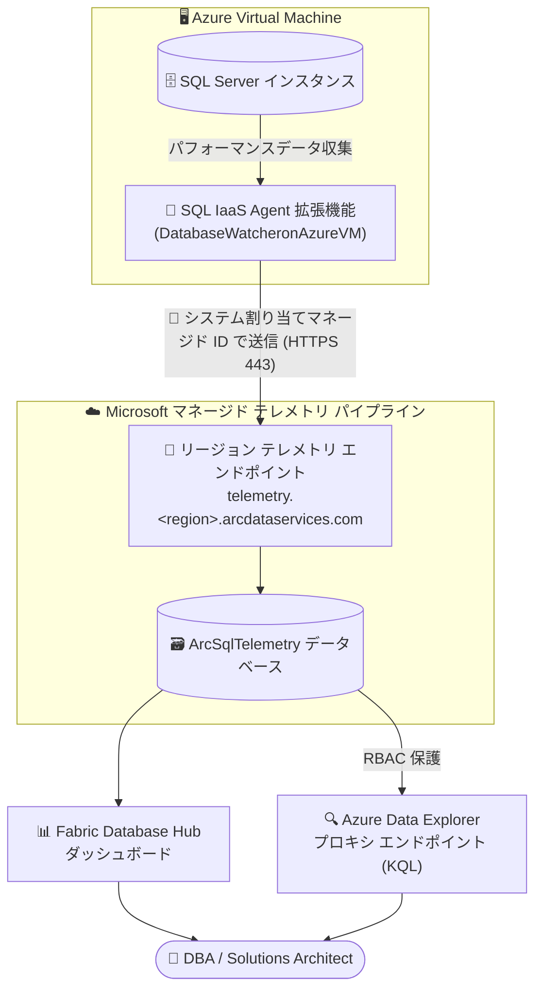

# SQL Server on Azure Virtual Machines: SQL パフォーマンス監視 (Public Preview)

**リリース日**: 2026-09-30

**サービス**: SQL Server on Azure Virtual Machines

**機能**: Microsoft マネージドの SQL パフォーマンス監視

**ステータス**: In preview

[このアップデートのインフォグラフィックを見る](https://takech9203.github.io/azure-news-summary/20260930-sql-server-azure-vm-performance-monitoring.html)

## 概要

SQL Server on Azure Virtual Machines 向けの Microsoft マネージド パフォーマンス監視機能がパブリックプレビューとして発表されました。カスタムの収集スクリプトを作成したり、バラバラなツール間でテレメトリを突き合わせたりすることなく、Azure VM 上の SQL Server を監視できるようになります。

SQL IaaS Agent 拡張機能が SQL Server インスタンスからパフォーマンスデータを収集し、Microsoft マネージドのテレメトリ パイプラインに送信して処理・保存します。監視エージェントやデータストアなどの監視インフラを自前でデプロイ・保守する必要はありません。リソース単位およびエステート全体 (組織内の SQL Server 資産全体) のダッシュボードにより、パフォーマンスのトレンド、異常、リソースのボトルネックを特定できます。Fabric Database Hub との統合により、このテレメトリを統一された監視エクスペリエンスで参照できるほか、RBAC で保護された Azure Data Explorer プロキシ エンドポイント経由で Kusto Query Language (KQL) を使ってデータを安全にクエリし、より深い分析やカスタム可視化を行うこともできます。

**アップデート前の課題**

- Azure VM 上の SQL Server を監視するには、カスタムの収集スクリプトを構築する必要があった
- 分断された複数のツール間でテレメトリを相関付ける (突き合わせる) 作業が必要だった
- 監視エージェント、データストアなどの監視インフラを自前でデプロイ・保守する必要があった

**アップデート後の改善**

- SQL IaaS Agent 拡張機能に機能フラグを追加するだけで、Microsoft マネージドの監視が有効化される
- 収集からストレージまで Microsoft マネージドのテレメトリ パイプラインが担い、監視インフラの構築・保守が不要になった
- リソース単位/エステート全体のダッシュボード (Fabric Database Hub) と KQL クエリ (Azure Data Explorer) という統一されたデータ参照手段が提供される

## アーキテクチャ図



SQL IaaS Agent 拡張機能が VM 上の SQL Server からパフォーマンスデータを収集し、マネージド ID を使って Microsoft マネージドのテレメトリ エンドポイントへアップロードします。保存されたデータは Fabric Database Hub のダッシュボード、または RBAC で保護された Azure Data Explorer エンドポイント経由の KQL クエリで参照できます。

## サービスアップデートの詳細

### 主要機能

1. **Microsoft マネージドのデータ収集パイプライン**
   - SQL IaaS Agent 拡張機能のパブリック設定に `DatabaseWatcheronAzureVM` 機能フラグを追加するだけで有効化できる
   - 拡張機能が設定を検出して収集を開始し、VM のシステム割り当てマネージド ID でリージョンのテレメトリ エンドポイントにデータをアップロードする
   - 監視は VM 単位で構成する (1 台で有効化しても他の VM には影響しない)
   - 設定反映後、多くのパフォーマンスデータは 3〜5 分以内、インベントリベースのデータは最大 15 分でクエリ可能になる

2. **13 種類のデータセット収集**
   - リソース使用率 (CPU、メモリ、ストレージ)、データベース アクティビティ、ストレージ I/O、アクティブ セッション、待機統計 (Wait Statistics)、クライアント接続、可用性グループ/レプリカの状態などを収集
   - パフォーマンスのベースライン確立、ボトルネックの特定、パフォーマンス問題の原因調査、チューニング箇所の発見に活用できる

3. **Fabric Database Hub のビルトイン ダッシュボード**
   - SQL Server エステート全体のリソース使用率、データベース アクティビティ、ストレージ パフォーマンス、アクティブ セッション、待機統計を一元的に確認できる
   - 個別インスタンスにドリルダウンしてパフォーマンス問題を調査できる
   - Microsoft Fabric の Real-Time Dashboard でテレメトリ エンドポイントをデータソースとして利用することも可能

4. **KQL による直接クエリ**
   - Azure Data Explorer Web UI から接続 URI `https://adx.centralus.arcdataservices.com/kusto/` (全リージョン共通) 経由で `ArcSqlTelemetry` データベースに接続し、KQL でアドホック分析やカスタム可視化が可能
   - エンドポイントは Azure RBAC でアクセス制御される (対象サブスクリプションの Reader ロール以上、または `Microsoft.AzureArcData/sqlServerInstances/read` と `Microsoft.Sql/servers/read` を含むカスタムロールが必要)
   - Kusto.Explorer デスクトップ クライアントは現時点では未サポート

### 収集されるデータセット

| テーブル | 収集データ |
|------|------|
| `SqlServerActiveSessions` | アクティブ セッション |
| `SqlServerAvailabilityGroupStates` | 可用性グループの状態 |
| `SqlServerAvailabilityReplicaStates` | 可用性レプリカの状態 |
| `SqlServerClientConnections` | クライアント接続 |
| `SqlServerCPUUtilization` | CPU 使用率 |
| `SqlServerDatabaseProperties` | データベース プロパティ |
| `SqlServerDatabaseReplicaStates` | データベース レプリカの状態 |
| `SqlServerDatabaseStorageUtilization` | データベース ストレージ使用率 |
| `SqlServerMemoryUtilization` | メモリ使用率 |
| `SqlServerPerformanceCountersCommon` | 一般的な SQL Server パフォーマンス カウンター |
| `SqlServerPerformanceCountersDetailed` | 詳細な SQL Server パフォーマンス カウンター |
| `SqlServerStorageIO` | データ/ログ ストレージ I/O |
| `SqlServerWaitStats` | 待機統計 |

## 技術仕様

| 項目 | 詳細 |
|------|------|
| 有効化方法 | SQL IaaS Agent 拡張機能のパブリック設定に `DatabaseWatcheronAzureVM` 機能フラグを追加 |
| 対応 SQL Server バージョン | SQL Server 2016 以降 (2016 より前のバージョンは非対応) |
| 対応エディション | Enterprise / Standard は全データセット対応。Developer / Express / Evaluation はクライアント接続データ (`SqlServerClientConnections`) のみ |
| 必要な拡張機能バージョン | SQL IaaS Agent 拡張機能 `2.0.229.0` 以降 (フル管理モード) |
| 認証 | VM のシステム割り当てマネージド ID |
| データ送信先 | `telemetry.<region>.arcdataservices.com` (HTTPS ポート 443) |
| データ保存先 | テレメトリ エンドポイント上の `ArcSqlTelemetry` データベース |
| データ参照手段 | Fabric Database Hub ダッシュボード / Azure Data Explorer Web UI (KQL) |
| アクセス制御 | Azure RBAC (サブスクリプションの Reader ロール以上、またはカスタムロール) |
| 監視の単位 | VM 単位 (VM ごとに有効化が必要) |

## 設定方法

### 前提条件

1. サポートされる構成の SQL Server on Azure VM (SQL Server 2016 以降)
2. SQL IaaS Agent 拡張機能バージョン `2.0.229.0` 以降がフル管理モードでインストール済みで、プロビジョニング状態が **Succeeded** であること
3. VM でシステム割り当てマネージド ID が有効であること
4. 統合インベントリ (unified inventory) で SQL Server インスタンス リソースが利用可能であること
5. サブスクリプションで `Microsoft.AzureArcData` リソース プロバイダーが登録済みであること
6. `telemetry.<region>.arcdataservices.com` へのアウトバウンド HTTPS (ポート 443) 接続が許可されていること
7. 最新版の Azure CLI と、VM の拡張機能を表示・更新できる権限 (Virtual Machine Contributor ロールなど)

### Azure CLI

**重要**: SQL IaaS Agent 拡張機能の設定は累積されません。更新時は既存のパブリック設定をすべて含めてマージしないと、他の機能が意図せず無効化される可能性があります。

```bash
# リソース プロバイダーの登録
az provider register --namespace Microsoft.AzureArcData

# 登録状態の確認 (Registered になれば完了)
az provider show --namespace Microsoft.AzureArcData --query "registrationState" --output tsv

# 現在の SQL IaaS Agent 拡張機能の設定を取得
az vm extension show \
  --resource-group <resource-group> \
  --vm-name <vm-name> \
  --name SqlIaasExtension \
  --query "{settings:settings,typeHandlerVersion:typeHandlerVersion}" \
  --output json

# 既存設定に DatabaseWatcheronAzureVM 機能フラグ ({"Name": "DatabaseWatcheronAzureVM", "Enable": true})
# をマージした settings.json を作成した上で、拡張機能に適用
az vm extension set \
  --resource-group <resource-group> \
  --vm-name <vm-name> \
  --publisher Microsoft.SqlServer.Management \
  --name SqlIaaSAgent \
  --extension-instance-name SqlIaasExtension \
  --settings "@settings.json"

# 拡張機能バージョンの確認 (2.0.229.0 以降であること)
az vm extension show \
  --resource-group <resource-group> \
  --vm-name <vm-name> \
  --name SqlIaasExtension \
  --instance-view \
  --query "instanceView.typeHandlerVersion" \
  --output tsv

# 監視ステータスの確認
# DatabaseMonitorArcPlugin: {"State":"Running","MetricsUploadStatus":"OK"} が含まれれば正常
az vm extension show \
  --resource-group <resource-group> \
  --vm-name <vm-name> \
  --name SqlIaasExtension \
  --instance-view \
  --query "instanceView.statuses[0].message" \
  --output tsv
```

拡張機能はパブリック設定を自動的に再読み込みするため、SQL Server IaaS Agent サービスや VM の再起動は不要です。無効化する場合は、`DatabaseWatcheronAzureVM` フラグを `false` に設定して同様にマージ適用します。

## メリット

### ビジネス面

- 監視インフラの構築・保守が不要になり、運用コストと工数を削減できる
- エステート全体のダッシュボードにより、組織内の SQL Server 資産のパフォーマンスを一元的に把握できる
- パフォーマンス問題の原因調査やチューニング箇所の特定が迅速化される

### 技術面

- カスタム収集スクリプトの開発・保守が不要
- マネージド ID による認証と RBAC 保護されたクエリ エンドポイントで、セキュアなデータアクセスを実現
- KQL による柔軟なアドホック分析・カスタム可視化が可能
- 有効化は機能フラグの追加のみで、VM やサービスの再起動が不要

## デメリット・制約事項

- パブリックプレビューのため、提供状況・前提条件・サポート構成は GA までに変更される可能性がある (Azure プレビューの補足利用規約が適用される)
- SQL Server 2016 より前のバージョンは非対応
- Developer / Express / Evaluation エディションはクライアント接続データのみ収集され、その他のデータセットは利用できない
- 監視は VM 単位の構成であり、監視対象の VM ごとに有効化作業が必要
- 拡張機能の設定は累積されないため、設定更新時に既存設定をマージしないと他の機能が無効化されるリスクがある
- KQL クエリには Azure Data Explorer Web UI を使用する必要があり、Kusto.Explorer デスクトップ クライアントは現時点で未サポート
- この機能フラグでは、Azure VM 以外の SQL Server、Azure SQL Database、Azure SQL Managed Instance、SQL database in Fabric、Fabric Data Warehouse の監視は有効化されない

## ユースケース

### ユースケース 1: SQL Server エステート全体のパフォーマンス ベースライン確立

**シナリオ**: 複数の Azure VM 上で稼働する SQL Server 群のパフォーマンスを一元的に把握し、ベースラインを確立して異常やボトルネックを早期に検出したい。

**実装例**:

```bash
# 各 SQL Server VM で DatabaseWatcheronAzureVM 機能フラグを有効化した後、
# Fabric Database Hub のダッシュボードでエステート全体のトレンドを確認
# より深い分析は Azure Data Explorer Web UI から KQL で実行
# 接続 URI: https://adx.centralus.arcdataservices.com/kusto/
# データベース: ArcSqlTelemetry
```

**効果**: カスタムスクリプトなしで CPU/メモリ/ストレージ使用率、待機統計などを収集し、リソース単位・エステート全体の両方の視点でパフォーマンス傾向を可視化できる。

### ユースケース 2: 待機統計とストレージ I/O によるパフォーマンス問題の原因調査

**シナリオ**: 特定の SQL Server インスタンスでクエリ遅延が発生しており、待機統計とストレージ I/O のデータから原因を切り分けたい。

**実装例**:

```bash
# Azure Data Explorer Web UI で ArcSqlTelemetry データベースに接続し、
# SqlServerWaitStats テーブルや SqlServerStorageIO テーブルを KQL でクエリして
# 待機タイプの内訳やデータ/ログ I/O の傾向を分析
```

**効果**: ダッシュボードでの異常検知から KQL での詳細分析までを同一のテレメトリ エンドポイント上でシームレスに行い、チューニングすべき箇所を特定できる。

## 料金

本アップデートおよび Microsoft Learn ドキュメントでは、この機能の料金に関する情報は確認できませんでした。最新の料金情報は公式ページを参照してください。

- [SQL Server on Azure Virtual Machines の料金](https://azure.microsoft.com/pricing/details/virtual-machines/sql-server-enterprise/)

## 利用可能リージョン

利用可能なリージョンの一覧は公式情報で確認できませんでした。テレメトリ エンドポイントは VM をホストするリージョンごと (`telemetry.<region>.arcdataservices.com`) に提供されます。最新情報は以下を参照してください。

- [Enable Performance Monitoring for SQL Server on Azure VMs (Preview)](https://learn.microsoft.com/en-us/azure/azure-sql/virtual-machines/windows/enable-performance-monitoring-sql-vm)

## 関連サービス・機能

- **SQL IaaS Agent 拡張機能**: 本機能のデータ収集を担うコンポーネント。フル管理モードでのインストールが前提となる
- **Fabric Database Hub (Microsoft Fabric)**: 収集したテレメトリをビルトイン ダッシュボードで可視化する統合監視エクスペリエンス。Real-Time Dashboard のデータソースとしても利用可能
- **Azure Data Explorer**: RBAC 保護されたプロキシ エンドポイント経由で KQL クエリを実行するための Web UI
- **Microsoft Entra マネージド ID**: VM のシステム割り当てマネージド ID がテレメトリ アップロードの認証に使用される
- **Azure Arc (Microsoft.AzureArcData)**: テレメトリ基盤として `Microsoft.AzureArcData` リソース プロバイダーの登録が必要

## 参考リンク

- [インフォグラフィック](https://takech9203.github.io/azure-news-summary/20260930-sql-server-azure-vm-performance-monitoring.html)
- [公式アップデート情報](https://azure.microsoft.com/updates?id=571894)
- [発表ブログ (Tech Community)](https://techcommunity.microsoft.com/blog/AzureSQLBlog/public-preview-performance-monitoring-for-azure-sql/4560498)
- [Microsoft Learn: Enable Performance Monitoring for SQL Server on Azure VMs (Preview)](https://learn.microsoft.com/en-us/azure/azure-sql/virtual-machines/windows/enable-performance-monitoring-sql-vm)
- [料金ページ](https://azure.microsoft.com/pricing/details/virtual-machines/sql-server-enterprise/)

## まとめ

SQL Server on Azure Virtual Machines の Microsoft マネージド パフォーマンス監視のパブリックプレビューにより、これまでカスタムスクリプトや複数ツールの組み合わせで実現していた SQL Server の監視が、SQL IaaS Agent 拡張機能の機能フラグ 1 つで有効化できるようになりました。CPU/メモリ/ストレージ使用率、待機統計、可用性グループの状態など 13 種類のデータセットが自動収集され、Fabric Database Hub のダッシュボードと KQL クエリの両方で活用できます。Azure VM 上で SQL Server 2016 以降 (Standard / Enterprise エディション) を運用しているチームは、前提条件 (拡張機能バージョン `2.0.229.0` 以降、システム割り当てマネージド ID、アウトバウンド 443 接続) を確認の上、非本番環境での評価を開始することを推奨します。プレビュー期間中は前提条件やサポート構成が変更される可能性がある点に留意してください。

---

**タグ**: SQL Server on Azure Virtual Machines, SQL IaaS Agent Extension, Performance Monitoring, Fabric Database Hub, Azure Data Explorer, KQL, In preview, Compute, Databases
