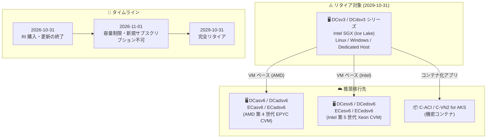

# Azure Virtual Machines: DCsv3 / DCdsv3 シリーズ VM のリタイア (2029 年 10 月 31 日)

**リリース日**: 2026-10-01

**サービス**: Azure Virtual Machines (Confidential Computing)

**機能**: DCsv3 / DCdsv3 シリーズ VM のリタイア発表

**ステータス**: Retirement announcement

[このアップデートのインフォグラフィックを見る](https://takech9203.github.io/azure-news-summary/20261001-dcsv3-dcdsv3-vm-retirement.html)

## 概要

Intel SGX (Software Guard Extensions) ベースの機密コンピューティング VM である DCsv3 および DCdsv3 シリーズ (Linux / Windows / Dedicated Host) が、**2029 年 10 月 31 日にリタイア**することが発表された。リタイア日以降、これらの VM は利用・購入ともに不可となる。

リタイアに先立ち、段階的な制限が適用される。**2026 年 10 月 31 日**には 3 年および 1 年の Reserved VM Instances (RI) の購入・更新が終了し、**2026 年 11 月 1 日**からは DCsv3 / DCdsv3 シリーズに容量制限が適用され、新規サブスクリプションでの利用ができなくなる。

移行先としては、VM ベースのプログラミングモデルを継続する場合は第 6 世代の機密 VM (CVM) である DCasv6 / DCadsv6 / DCesv6 / DCedsv6 シリーズ (メモリ最適化は ECasv6 / ECadsv6 / ECesv6 / ECedsv6)、コンテナ化アプリケーションの場合は Azure Confidential Container Instances (C-ACI) または AKS 向け Virtual nodes on Azure Container Instances (C-VN2) が推奨されている。

**リタイアによる影響**

- DCsv3 / DCdsv3 上の Linux / Windows / Dedicated Host VM、Virtual Machine Scale Sets、および AKS 上のエンクレーブ対応コンテナ (app-enclave aware containers) がすべて影響を受ける
- 2029 年 10 月のリタイア時には、AKS や VMSS 上での利用を含むすべての DCsv3 / DCdsv3 SKU の用途が同時に終了する
- リタイア期間中の新機能追加や新リージョンへの展開は行われない (SLA、インフラ更新、メンテナンスはリタイア日まで継続)

**移行による改善**

- 新世代の機密コンピューティング製品は、価格性能比の向上、vCPU あたりのメモリ増加、高速な SSD ストレージ、より広いリージョン展開を提供する
- コンテナ化・サーバーレス (C-ACI / C-VN2) によるクラウドネイティブな機密コンピューティングへの移行パスも用意されている

## アーキテクチャ図

DCsv3 / DCdsv3 シリーズから第 6 世代機密 VM (CVM) または機密コンテナへの移行パスと、リタイアまでのタイムラインを示す。ワークロードの形態 (VM ベースかコンテナ化か) に応じて移行先を選択する。

## サービスアップデートの詳細

### リタイアスケジュール

| 日付 | イベント |
|------|---------|
| 2026-10-31 | 3 年 / 1 年 Reserved VM Instances (RI) の購入・更新が終了 |
| 2026-11-01 | DCsv3 / DCdsv3 シリーズに容量制限を適用、新規サブスクリプションでの利用不可 |
| 2029-10-31 | 完全リタイア。以降は利用・購入ともに不可、残存 VM は動作停止 (課金も停止) |

### 推奨される移行先

1. **VM ベースのプログラミングモデル (AMD)**
   - AMD 第 4 世代 EPYC プロセッサ搭載の DCasv6 / DCadsv6 シリーズ、またはメモリ最適化の ECasv6 / ECadsv6 シリーズ

2. **VM ベースのプログラミングモデル (Intel)**
   - Intel 第 5 世代 Xeon Scalable プロセッサ搭載の DCesv6 / DCedsv6 シリーズ、またはメモリ最適化の ECesv6 / ECedsv6 シリーズの機密 VM (CVM)

3. **コンテナ化アプリケーション**
   - Azure Confidential Container Instances (C-ACI) によるサーバーレス実行
   - コンテナのオーケストレーションが必要な場合は AKS 向け Virtual nodes on Azure Container Instances (C-VN2)

## 技術仕様 (リタイア対象の DCsv3 シリーズ)

| 項目 | 詳細 |
|------|------|
| プロセッサ | 第 3 世代 Intel Xeon Scalable (Ice Lake)、Intel Turbo Boost Max 3.0 で最大 3.5 GHz |
| 機密コンピューティング技術 | Intel SGX、Intel Total Memory Encryption - Multi Key |
| vCPU | 1〜48 (Standard_DC1s_v3 〜 Standard_DC48s_v3) |
| メモリ | 8〜384 GiB |
| EPC (暗号化) メモリ | 4〜256 GiB |
| ローカルストレージ | なし (DCdsv3 はローカルディスク付きバリアント) |
| Premium Storage | サポート (キャッシュは非サポート) |
| Accelerated Networking | 非サポート |

## 移行手順

### 1. 移行先の特定

- 現在の VM のワークロードと性能要件を評価し、推奨オプション (CVM / C-ACI / C-VN2) から移行先を特定する

### 2. クォータの確認とリクエスト

- 移行前に、対象サブスクリプションに移行先 VM シリーズの十分な vCPU クォータがあることを確認する
- 不足する場合は Azure Portal からクォータ引き上げをリクエストする

### 3. 移行の実施

- ビジネスへの影響を防ぐため、できるだけ早期に移行を完了する
- 選択した移行先オプションのドキュメントに従って移行する
- 現在のリージョンで CVM が利用できない場合は、近隣リージョンでの利用可否を確認するか、Azure サポートに相談する

### Reserved Instances (RI) を利用している場合

1. Azure Portal でアクティブな RI を確認し、リタイアの影響を受ける RI を特定する
2. 以下のいずれかで対応する:
   - **交換**: 既存 RI をペナルティなしで新しい VM シリーズの RI に交換する
   - **Savings Plan へのトレードイン**: 既存 RI を Azure Savings Plan for compute に変換する (VM ファミリ・リージョンをまたぐ柔軟性を確保)
   - **新規購入**: 新しい VM シリーズに合わせた RI を購入する (柔軟性を重視する場合は 1 年の短期を検討)

## デメリット・制約事項

- 2026 年 11 月 1 日以降、DCsv3 / DCdsv3 に容量制限が適用され、新規サブスクリプションでの利用ができなくなる
- リタイア期間中、DCsv3 / DCdsv3 への新機能追加・機能リクエスト受付は行われない
- DCsv3 / DCdsv3 の新規リージョン展開は行われない
- AKS 上のエンクレーブ対応コンテナや VMSS を含む、DCsv3 / DCdsv3 SKU 上に構築されたすべてのサービスが 2029 年 10 月に同時に終了する
- 移行により課金が変わる可能性がある (詳細は料金ページを参照)

## 料金

移行に伴い Azure Virtual Machines の課金が変わる可能性がある。詳細は以下の料金ページを参照。

- [Azure Virtual Machines 料金ページ (Linux)](https://azure.microsoft.com/pricing/details/virtual-machines/linux-previous/)
- [料金計算ツール](https://azure.microsoft.com/pricing/calculator/)

## 利用可能リージョン

DCsv3 / DCdsv3 シリーズの新規リージョン展開は行われない。移行先 CVM のリージョン可用性は各シリーズのドキュメントおよび[リージョン別製品一覧](https://azure.microsoft.com/global-infrastructure/services/)で確認する。

## 関連サービス・機能

- **Azure Confidential Computing (CVM)**: DCasv6 / DCesv6 系は VM 全体を保護する機密 VM であり、SGX のアプリケーションエンクレーブとはプログラミングモデルが異なる。移行先の中心的な選択肢
- **Azure Confidential Container Instances (C-ACI)**: コンテナ化された機密ワークロード向けのサーバーレス実行環境
- **Azure Kubernetes Service (AKS)**: DCsv3 / DCdsv3 ノード上のエンクレーブ対応コンテナも本リタイアの対象。C-VN2 (Virtual nodes on ACI) への移行が推奨される
- **Azure Reservations / Savings Plan**: 既存 RI の交換・トレードインによりコスト最適化を維持しながら移行できる
- **Azure Retirement Workbook**: リタイア対象リソースの把握に利用できる (発表内容の反映には最大 2 週間かかる場合あり)

## 参考リンク

- [インフォグラフィック](https://takech9203.github.io/azure-news-summary/20261001-dcsv3-dcdsv3-vm-retirement.html)
- [公式アップデート情報](https://azure.microsoft.com/updates?id=569592)
- [DCsv3 / DCdsv3 シリーズ リタイアメントガイド (Microsoft Learn)](https://learn.microsoft.com/azure/virtual-machines/sizes/retirement/dcsv3-series-retirement)
- [DCsv3 シリーズの仕様 (Microsoft Learn)](https://learn.microsoft.com/azure/virtual-machines/sizes/general-purpose/dcsv3-series)
- [DCesv6 シリーズ (Microsoft Learn)](https://learn.microsoft.com/azure/virtual-machines/sizes/general-purpose/dcesv6-series)
- [DCasv6 シリーズ (Microsoft Learn)](https://learn.microsoft.com/azure/virtual-machines/sizes/general-purpose/dcasv6-series)
- [Confidential Container Instances の概要 (Microsoft Learn)](https://learn.microsoft.com/azure/container-instances/container-instances-confidential-overview)
- [RI の交換と返金 (Microsoft Learn)](https://learn.microsoft.com/azure/cost-management-billing/reservations/exchange-and-refund-azure-reservations)
- [料金ページ](https://azure.microsoft.com/pricing/details/virtual-machines/linux-previous/)

## まとめ

Intel SGX ベースの機密コンピューティング VM である DCsv3 / DCdsv3 シリーズが 2029 年 10 月 31 日にリタイアする。最終リタイアまでは 3 年あるが、**2026 年 10 月 31 日に RI の購入・更新が終了し、2026 年 11 月 1 日から容量制限と新規サブスクリプション制限が始まる**ため、実質的な対応期限は近い。DCsv3 / DCdsv3 を利用中の場合は、まず Azure Retirement Workbook や Portal で対象リソースと RI を棚卸しし、ワークロードの形態に応じて第 6 世代 CVM (DCasv6 / DCesv6 系) または機密コンテナ (C-ACI / C-VN2) への移行計画を早期に策定することを推奨する。SGX のアプリケーションエンクレーブを前提としたアプリケーションは移行先でプログラミングモデルが変わる点に注意が必要である。

---

**タグ**: Azure Virtual Machines, Confidential Computing, DCsv3, DCdsv3, Retirement, Intel SGX, Confidential VM, Compute
